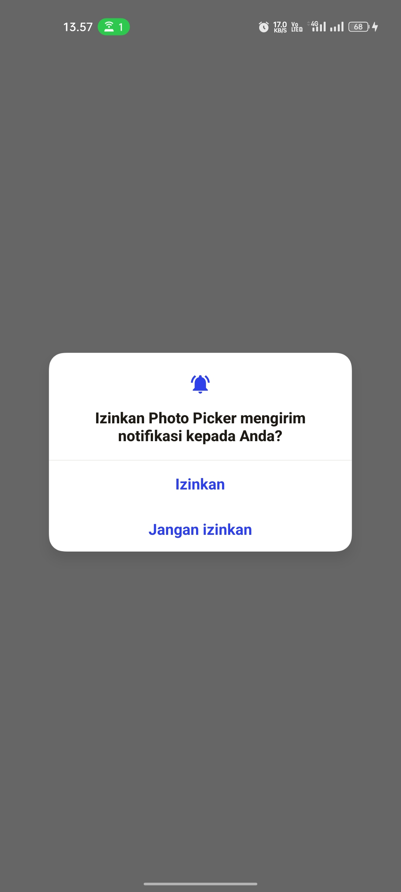
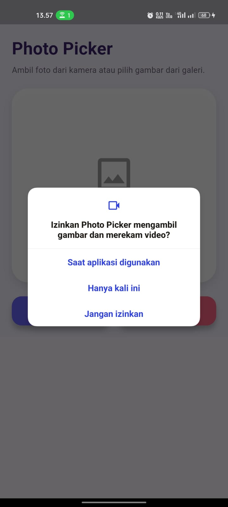
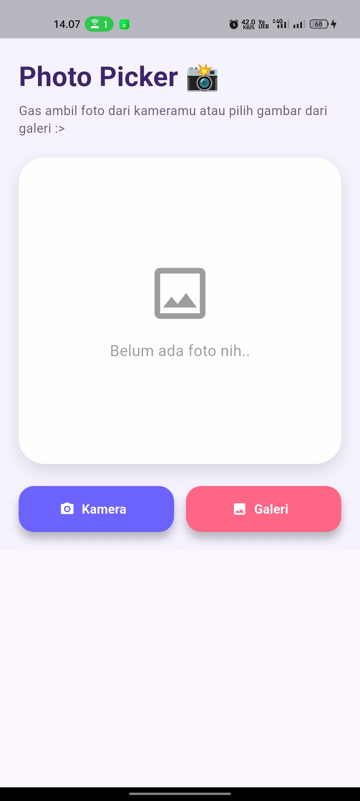
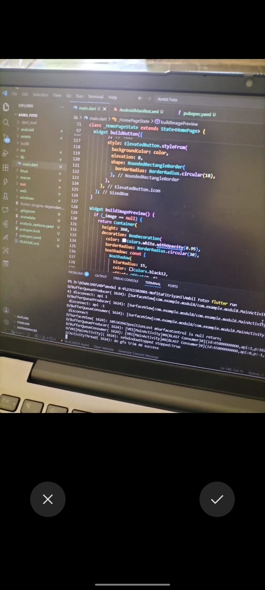
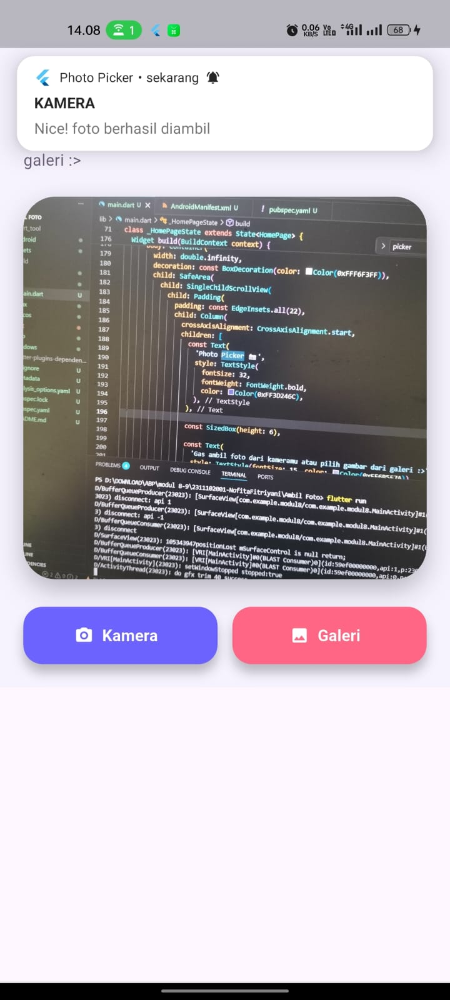
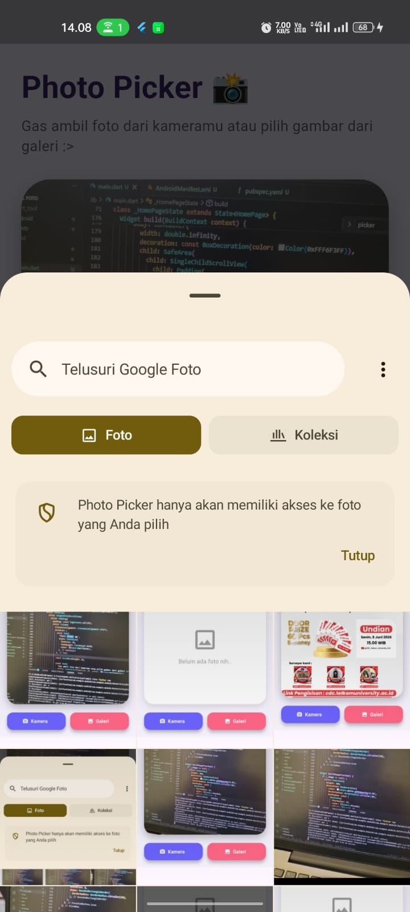
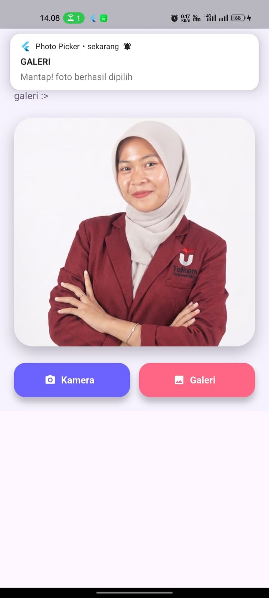

<div align="center">
  <br />
  <h1>LAPORAN PRAKTIKUM <br>APLIKASI BERBASIS PLATFORM</h1>
  <br />
  <h3>MODUL 8 & 9<br> KAMERA DAN NOTIFIKASI</h3>
  <br />
   
  <br />
  <br />
  <br />
  <h3>Disusun Oleh :</h3>
  <p>
    <strong>NOFITA FITRIYANI</strong><br>
    <strong>2311102001</strong><br>
    <strong>S1 IF-11-REG01</strong>
  </p>
  <br />
  <br />
  <h3>Dosen Pengampu :</h3>
  <p>
    <strong>Dimas Fanny Hebrasianto Permadi, S.ST., M.Kom</strong>
  </p>
  <br />
  <br />
    <h4>Asisten Praktikum :</h4>
    <strong> Apri Pandu Wicaksono </strong> <br>
    <strong>Rangga Pradarrell Fathi</strong>
  <br />
  <h3>LABORATORIUM HIGH PERFORMANCE
 <br>FAKULTAS INFORMATIKA <br>UNIVERSITAS TELKOM PURWOKERTO <br>2026</h3>
</div>

---

# 1. Dasar Teori

## Dependency dan Permission

Dependency merupakan pustaka (library) tambahan yang digunakan untuk menambahkan fitur tertentu pada aplikasi Flutter tanpa harus membuat seluruh fungsionalitas dari awal. Dependency dikelola melalui file `pubspec.yaml` dan dapat diunduh menggunakan perintah `flutter pub get`. Pada praktikum ini digunakan beberapa dependency, yaitu `image_picker` untuk mengakses kamera dan galeri, `flutter_local_notifications` untuk menampilkan notifikasi lokal, serta `permission_handler` untuk mengelola izin akses perangkat.

Selain dependency, aplikasi juga memerlukan permission (izin akses) agar dapat menggunakan fitur perangkat keras tertentu. Sistem operasi Android menerapkan mekanisme keamanan yang mengharuskan aplikasi meminta izin kepada pengguna sebelum mengakses kamera, galeri, maupun notifikasi. Permission tersebut dikonfigurasi melalui file `AndroidManifest.xml` dan diminta saat aplikasi dijalankan.

## Implementasi Kamera dan Galeri

Kamera dan galeri merupakan fitur perangkat yang sering digunakan dalam aplikasi mobile untuk mengambil maupun memilih gambar. Pada Flutter, implementasi fitur tersebut dapat dilakukan menggunakan package `image_picker`. Package ini menyediakan antarmuka untuk membuka kamera perangkat secara langsung maupun mengakses galeri foto yang tersimpan pada perangkat.

Dalam implementasinya, pengguna dapat memilih sumber gambar melalui dua opsi, yaitu kamera dan galeri. Jika pengguna memilih kamera, aplikasi akan membuka kamera perangkat untuk mengambil foto baru. Sebaliknya, jika pengguna memilih galeri, aplikasi akan menampilkan kumpulan foto yang tersimpan sehingga pengguna dapat memilih gambar yang diinginkan. Gambar yang berhasil dipilih kemudian ditampilkan pada halaman aplikasi menggunakan widget `Image.file`.

## Notifikasi Lokal

Notifikasi lokal merupakan pesan yang ditampilkan oleh aplikasi secara langsung pada perangkat tanpa memerlukan server eksternal atau koneksi internet. Notifikasi ini berfungsi sebagai umpan balik kepada pengguna setelah suatu proses berhasil dilakukan.

Pada Flutter, notifikasi lokal dapat diimplementasikan menggunakan package `flutter_local_notifications`. Package ini memungkinkan aplikasi membuat dan menampilkan notifikasi dengan judul, isi pesan, ikon, serta tingkat prioritas tertentu. Pada praktikum ini, notifikasi lokal digunakan untuk memberikan informasi bahwa proses pengambilan foto dari kamera atau pemilihan gambar dari galeri telah berhasil dilakukan. Dengan adanya notifikasi tersebut, pengguna memperoleh konfirmasi secara langsung terhadap tindakan yang telah dilakukan.

---

# 2. _Source Code_

## Dependency pada `pubspec.yaml`

```
dependencies:
  flutter:
    sdk: flutter
  image_picker: ^1.1.2
  flutter_local_notifications: ^17.2.2
  permission_handler: ^11.3.1

  # The following adds the Cupertino Icons font to your application.
  # Use with the CupertinoIcons class for iOS style icons.
  cupertino_icons: ^1.0.8
```

Penjelasan:

Bagian dependency pada file `pubspec.yaml` digunakan untuk menambahkan package yang dibutuhkan dalam pengembangan aplikasi. Package `image_picker` digunakan untuk mengambil gambar melalui kamera maupun memilih gambar dari galeri. Package `flutter_local_notifications` digunakan untuk menampilkan notifikasi lokal setelah foto berhasil diambil atau dipilih. Sementara itu, `permission_handler` digunakan untuk meminta izin akses perangkat, khususnya izin notifikasi agar aplikasi dapat menampilkan pemberitahuan kepada pengguna.

## Permission pada `AndroidManifest.xml`

```
<!-- Permission -->
    <uses-permission android:name="android.permission.CAMERA"/>
    <uses-permission android:name="android.permission.POST_NOTIFICATIONS"/>
```

Penjelasan:

Kode permission pada AndroidManifest.xml digunakan agar aplikasi memiliki izin untuk mengakses fitur tertentu pada perangkat Android. Permission CAMERA digunakan untuk membuka kamera perangkat. Permission POST_NOTIFICATIONS digunakan agar aplikasi dapat menampilkan notifikasi lokal.

## Import Library pada `main.dart`

```
import 'dart:io';
import 'package:flutter/material.dart';
import 'package:image_picker/image_picker.dart';
import 'package:flutter_local_notifications/flutter_local_notifications.dart';
import 'package:permission_handler/permission_handler.dart';
```

Penjelasan:

Bagian import digunakan untuk memanggil library yang dibutuhkan dalam aplikasi. `dart:io` digunakan untuk mengelola file gambar yang dipilih. `material.dart` digunakan untuk membuat tampilan antarmuka berbasis Material Design. `image_picker.dart` digunakan untuk mengambil foto dari kamera atau galeri. `flutter_local_notifications.dart` digunakan untuk membuat notifikasi lokal, sedangkan `permission_handler.dart` digunakan untuk meminta izin akses kepada pengguna.

## Fungsi `main()`

```
void main() async { WidgetsFlutterBinding.ensureInitialized(); await Permission.notification.request(); await NotificationService.init(); runApp(const MyApp()); }
```

Penjelasan:

Fungsi main() merupakan fungsi utama yang pertama kali dijalankan saat aplikasi dibuka. Pada kode ini, WidgetsFlutterBinding.ensureInitialized() digunakan agar proses inisialisasi dapat berjalan sebelum aplikasi ditampilkan. Selanjutnya, aplikasi meminta izin notifikasi menggunakan Permission.notification.request(). Setelah itu, layanan notifikasi diinisialisasi melalui NotificationService.init(), kemudian aplikasi dijalankan menggunakan runApp().

## Implementasi Notifikasi Lokal

```
class NotificationService {
  static final FlutterLocalNotificationsPlugin notifications =
      FlutterLocalNotificationsPlugin();

  static Future<void> init() async {
    const AndroidInitializationSettings androidSettings =
        AndroidInitializationSettings('@mipmap/ic_launcher');

    const InitializationSettings settings = InitializationSettings(
      android: androidSettings,
    );

    await notifications.initialize(settings);
  }

  static Future<void> showNotification(String title, String body) async {
    const AndroidNotificationDetails androidDetails =
        AndroidNotificationDetails(
          'photo_channel',
          'Photo Notifications',
          channelDescription: 'Notifikasi setelah foto berhasil',
          importance: Importance.max,
          priority: Priority.high,
          playSound: true,
        );

    const NotificationDetails details = NotificationDetails(
      android: androidDetails,
    );

    await notifications.show(0, title, body, details);
  }
}
```
Penjelasan :
Class `NotificationService` digunakan untuk mengatur notifikasi lokal pada aplikasi. Method `init()` berfungsi untuk melakukan inisialisasi notifikasi pada perangkat Android dengan menggunakan ikon aplikasi sebagai ikon notifikasi. Method `showNotification()` digunakan untuk menampilkan notifikasi dengan parameter `title `sebagai judul dan `body` sebagai isi pesan. Pada bagian `AndroidNotificationDetails`, notifikasi dibuat dengan prioritas tinggi agar dapat langsung muncul pada perangkat pengguna.

## Implementasi Kamera dan Galeri
```
class _HomePageState extends State<HomePage> {
  File? _image;
  final ImagePicker _picker = ImagePicker();

  Future<void> _pickImage(ImageSource source) async {
    final XFile? pickedFile = await _picker.pickImage(source: source);

    if (pickedFile != null) {
      setState(() {
        _image = File(pickedFile.path);
      });

      if (source == ImageSource.camera) {
        await NotificationService.showNotification(
          'KAMERA',
          'Nice! foto berhasil diambil',
        );
      } else {
        await NotificationService.showNotification(
          'GALERI',
          'Mantap! foto berhasil dipilih',
        );
      }
    }
  }
```
Penjelasan:

Pada kode tersebut, `variabel _image` digunakan untuk menyimpan file gambar yang berhasil diambil atau dipilih. Objek `_picker` dibuat dari class ImagePicker untuk mengakses fitur kamera dan galeri. Method `_pickImage()` menerima parameter `ImageSource`, sehingga sumber gambar dapat berasal dari kamera maupun galeri. Jika gambar berhasil dipilih, maka path gambar disimpan ke dalam variabel `_image` menggunakan `setState()` agar tampilan aplikasi diperbarui. Setelah itu, aplikasi menampilkan notifikasi sesuai sumber gambar yang digunakan, baik dari kamera maupun galeri.

## Tombol Kamera dan Galeri
```
Widget buildButton({
    required String text,
    required IconData icon,
    required Color color,
    required VoidCallback onPressed,
  }) {
    return SizedBox(
      width: double.infinity,
      height: 54,
      child: ElevatedButton.icon(
        onPressed: onPressed,
        icon: Icon(icon, color: Colors.white),
        label: Text(
          text,
          style: const TextStyle(
            fontSize: 15,
            fontWeight: FontWeight.bold,
            color: Colors.white,
          ),
        ),
        style: ElevatedButton.styleFrom(
          backgroundColor: color,
          elevation: 8,
          shape: RoundedRectangleBorder(
            borderRadius: BorderRadius.circular(18),
          ),
        ),
      ),
    );
  }
```
Penjelasan:

Method `buildButton()` digunakan untuk membuat tombol secara dinamis sehingga dapat digunakan kembali pada tombol kamera maupun galeri. Method ini menerima beberapa parameter, yaitu text sebagai teks yang ditampilkan pada tombol, icon sebagai ikon tombol, color sebagai warna latar tombol, dan onPressed sebagai aksi yang dijalankan saat tombol ditekan.

Widget `SizedBox` digunakan untuk mengatur ukuran tombol agar memiliki lebar penuh (`double.infinity`) dan tinggi 54 piksel. Selanjutnya, `ElevatedButton.icon` digunakan untuk menampilkan tombol yang terdiri dari ikon dan teks secara bersamaan. Tampilan tombol dikustomisasi menggunakan `ElevatedButton.styleFrom()`, dengan warna latar sesuai parameter yang diberikan, efek bayangan (`elevation`) sebesar 8, serta sudut tombol yang dibuat melengkung menggunakan `BorderRadius.circular(18)`.

## Tampilan Preview Foto
```
Widget buildImagePreview() {
    if (_image == null) {
      return Container(
        height: 360,
        decoration: BoxDecoration(
          color: Colors.white.withOpacity(0.95),
          borderRadius: BorderRadius.circular(30),
          boxShadow: const [
            BoxShadow(
              blurRadius: 15,
              color: Colors.black12,
              offset: Offset(0, 8),
            ),
          ],
        ),
        child: const Center(
          child: Column(
            mainAxisAlignment: MainAxisAlignment.center,
            children: [
              Icon(Icons.image_outlined, size: 80, color: Colors.grey),
              SizedBox(height: 15),
              Text(
                'Belum ada foto nih..',
                style: TextStyle(fontSize: 18, color: Colors.grey),
              ),
            ],
          ),
        ),
      );
    }

    return Container(
      height: 360,
      decoration: BoxDecoration(
        borderRadius: BorderRadius.circular(30),
        boxShadow: const [
          BoxShadow(
            blurRadius: 20,
            color: Colors.black26,
            offset: Offset(0, 10),
          ),
        ],
        image: DecorationImage(image: FileImage(_image!), fit: BoxFit.cover),
      ),
    );
  }
```
Penjelasan:

Method `buildImagePreview()` digunakan untuk menampilkan area preview foto pada halaman utama aplikasi. Jika belum ada gambar yang dipilih, aplikasi akan menampilkan teks “Belum ada foto”. Namun, jika pengguna sudah mengambil foto atau memilih gambar dari galeri, maka gambar tersebut akan ditampilkan menggunakan FileImage. Properti `fit: BoxFit.cover` digunakan agar gambar memenuhi area preview dengan tampilan yang rapi.

## Tampilan Utama Aplikasi
```
@override
  Widget build(BuildContext context) {
    return Scaffold(
      body: Container(
        width: double.infinity,
        decoration: const BoxDecoration(color: Color(0xFFF6F3FF)),
        child: SafeArea(
          child: SingleChildScrollView(
            child: Padding(
              padding: const EdgeInsets.all(22),
              child: Column(
                crossAxisAlignment: CrossAxisAlignment.start,
                children: [
                  const Text(
                    'Photo Picker 📸',
                    style: TextStyle(
                      fontSize: 32,
                      fontWeight: FontWeight.bold,
                      color: Color(0xFF3D246C),
                    ),
                  ),

                  const SizedBox(height: 6),

                  const Text(
                    'Gas ambil foto dari kameramu atau pilih gambar dari galeri :>',
                    style: TextStyle(fontSize: 15, color: Color(0xFF6B5E7A)),
                  ),

                  const SizedBox(height: 24),

                  buildImagePreview(),

                  const SizedBox(height: 26),

                  Row(
                    children: [
                      Expanded(
                        child: buildButton(
                          text: 'Kamera',
                          icon: Icons.camera_alt_rounded,
                          color: const Color(0xFF6C63FF),
                          onPressed: () => _pickImage(ImageSource.camera),
                        ),
                      ),
                      const SizedBox(width: 14),
                      Expanded(
                        child: buildButton(
                          text: 'Galeri',
                          icon: Icons.photo_rounded,
                          color: const Color(0xFFFF6584),
                          onPressed: () => _pickImage(ImageSource.gallery),
                        ),
                      ),
                    ],
                  ),
                ],
              ),
            ),
          ),
        ),
      ),
    );
  }
}
```
Penjelasan:

Bagian `build()` digunakan untuk menyusun tampilan utama aplikasi. Widget `Scaffold` menjadi struktur dasar halaman, sedangkan `Container` digunakan sebagai latar belakang tampilan. Di dalamnya terdapat Column yang menyusun elemen secara vertikal, mulai dari judul aplikasi, preview foto, tombol kamera, dan tombol galeri. Dengan susunan ini, pengguna dapat mengambil foto atau memilih gambar dari galeri, lalu melihat hasilnya langsung pada halaman yang sama.

---

# 3. _Output_

<table>
<tr>
<td align="center">
<br>
<b>Gambar 1.</b> Izin Notifikasi
</td>

<td align="center">
<br>
<b>Gambar 2.</b> Izin Akses Kamera
</td>

<td align="center">
<br>
<b>Gambar 3.</b> Halaman Awal
</td>
</tr>

<tr>
<td align="center">
<br>
<b>Gambar 4.</b> Gambar saat klik button 'Kamera'
</td>

<td align="center">
<br>
<b>Gambar 5.</b> Tampilan saat berhasil ambil foto langsung lewat kamera, dan notifikasi muncul
</td>

<td align="center">
<br>
<b>Gambar 6.</b> Gambar saat klik button 'Galeri'
</td>
</tr>

<tr>
<td align="center">
<br>
<b>Gambar 7.</b> Tampilan saat berhasil ambil foto dari galeri, dan muncul notifikasi
</td>

<td></td>
<td></td>
</tr>
</table>
