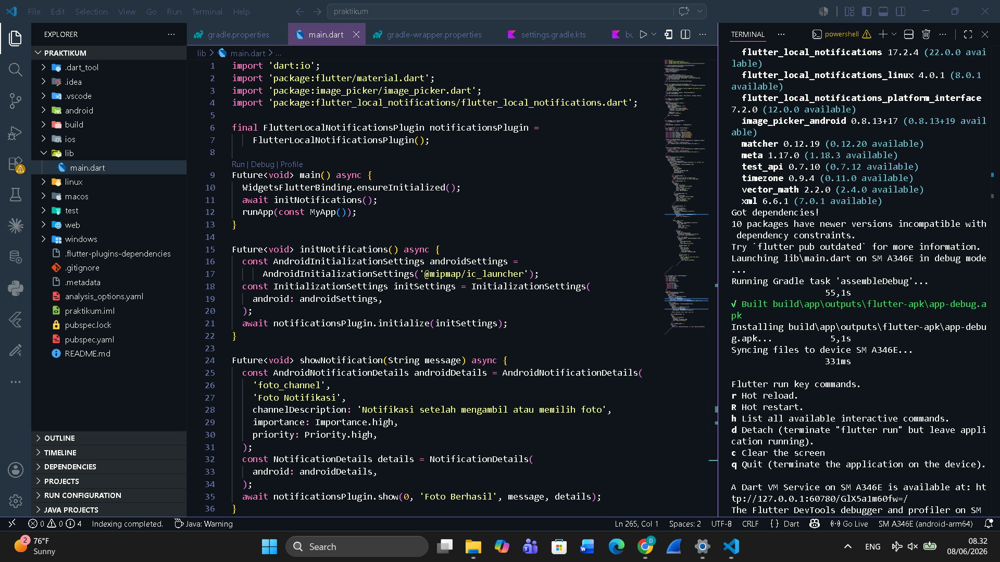
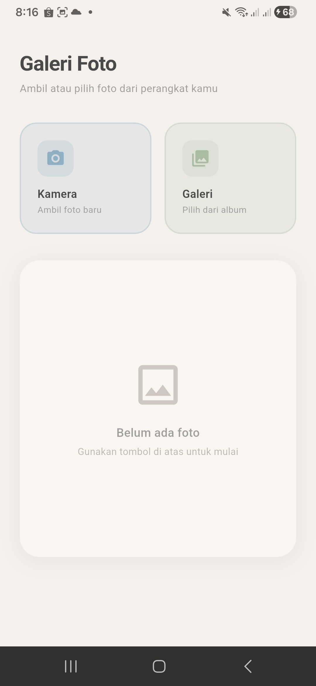
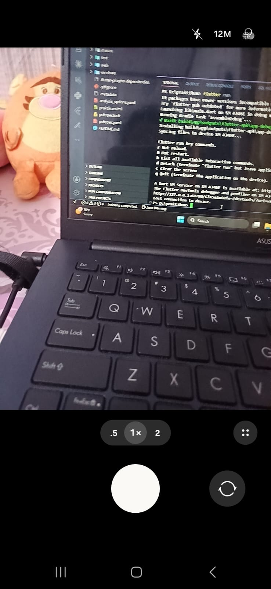
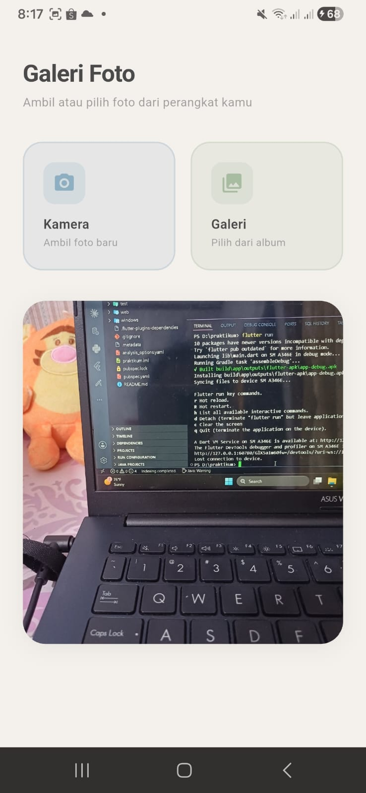
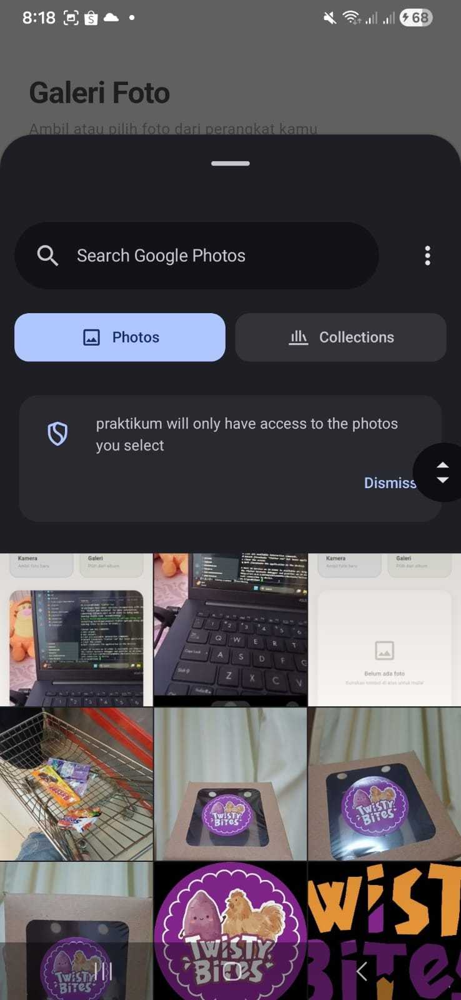
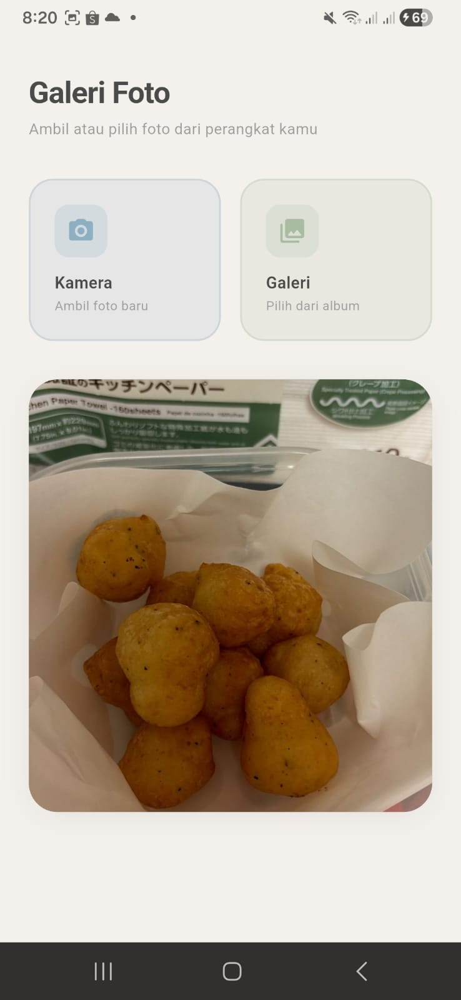

<div align="center">

## LAPORAN PRAKTIKUM <br> APLIKASI BERBASIS PLATFORM

<br>

### MODUL 8 & 9
### MOBILE

<br>
<br>


<br>
<br>
<br>

**Disusun oleh:**

**Diva Octaviani**  
**2311102006**

<br>

**KELAS PS1IF-11-REG01**

**Dosen: Dimas Fanny Hebrasianto Permadi, S.ST., M.Kom**

<br><br>

## PROGRAM STUDI S1 TEKNIK INFORMATIKA <br> FAKULTAS INFORMATIKA <br> UNIVERSITAS TELKOM PURWOKERTO <br> 2026 <br><br>

</div>

---

## 1. Dasar Teori

Flutter adalah framework open-source dari Google untuk membangun aplikasi mobile, web, dan desktop dari satu codebase menggunakan bahasa Dart. Pada praktikum ini, beberapa konsep utama yang digunakan adalah sebagai berikut.

**StatefulWidget** adalah widget yang memiliki state yang dapat berubah selama lifecycle aplikasi berjalan. Setiap kali state berubah melalui pemanggilan `setState()`, Flutter akan merender ulang tampilan widget tersebut. StatefulWidget terdiri dari dua kelas, yaitu kelas widget itu sendiri dan kelas State yang menyimpan data yang dapat berubah.

**StatelessWidget** adalah widget yang tidak memiliki state internal yang dapat berubah. Widget ini hanya merender tampilan berdasarkan properti yang diterima saat pembuatannya dan tidak akan berubah selama lifecycle berlangsung. StatelessWidget cocok digunakan untuk bagian UI yang bersifat statis, seperti widget komponen tombol aksi pada praktikum ini.

**image_picker** adalah package Flutter yang memungkinkan aplikasi mengakses kamera perangkat secara langsung maupun memilih gambar dari galeri. Package ini menggunakan `ImageSource.camera` untuk membuka kamera dan `ImageSource.gallery` untuk membuka galeri, lalu mengembalikan file gambar bertipe `XFile` yang dapat dikonversi menjadi `File` untuk ditampilkan di layar.

**flutter_local_notifications** adalah package Flutter yang digunakan untuk menampilkan notifikasi lokal pada perangkat tanpa membutuhkan koneksi internet atau server. Notifikasi dikonfigurasi menggunakan `AndroidNotificationDetails` untuk platform Android, mencakup channel ID, nama channel, tingkat kepentingan (importance), dan prioritas. Notifikasi ditampilkan menggunakan metode `show()` dari instance `FlutterLocalNotificationsPlugin`.

**Permission** pada Android adalah izin yang harus dideklarasikan di file `AndroidManifest.xml` agar aplikasi dapat mengakses fitur perangkat keras tertentu. Pada praktikum ini, tiga permission yang digunakan adalah `CAMERA` untuk mengakses kamera, `READ_MEDIA_IMAGES` untuk membaca gambar dari galeri, dan `POST_NOTIFICATIONS` untuk menampilkan notifikasi lokal, yang bersifat wajib sejak Android 13 (API 33) ke atas.

**Core Library Desugaring** adalah fitur pada Android Gradle Plugin yang memungkinkan penggunaan API Java 8+ pada perangkat dengan versi Android yang lebih lama. Fitur ini diaktifkan dengan menambahkan `isCoreLibraryDesugaringEnabled = true` pada blok `compileOptions` di `build.gradle.kts` serta menambahkan dependency `desugar_jdk_libs`.

---

## 2. Hasil Praktikum

### Langkah-Langkah:

**1.** Buka Visual Studio Code dan buat project Flutter baru dengan nama `praktikum` menggunakan perintah berikut di terminal:

```
flutter create praktikum
```

**2.** Tambahkan dependency `image_picker` dan `flutter_local_notifications` pada file `pubspec.yaml` di bagian `dependencies`:

```yaml
dependencies:
  flutter:
    sdk: flutter
  cupertino_icons: ^1.0.8
  image_picker: ^1.1.2
  flutter_local_notifications: ^17.2.2
```

**3.** Jalankan `flutter pub get` di terminal untuk mengunduh package.

**4.** Tambahkan permission yang diperlukan pada file `android/app/src/main/AndroidManifest.xml`, letakkan sebelum tag `<application`:

```xml
<uses-permission android:name="android.permission.CAMERA"/>
<uses-permission android:name="android.permission.READ_MEDIA_IMAGES"/>
<uses-permission android:name="android.permission.POST_NOTIFICATIONS"/>
```

**5.** Aktifkan core library desugaring pada file `android/app/build.gradle.kts`. Tambahkan `isCoreLibraryDesugaringEnabled = true` di dalam blok `compileOptions`, dan tambahkan blok `dependencies` setelah blok `flutter`:

```kotlin
compileOptions {
    isCoreLibraryDesugaringEnabled = true
    sourceCompatibility = JavaVersion.VERSION_17
    targetCompatibility = JavaVersion.VERSION_17
}

// ...

flutter {
    source = "../.."
}

dependencies {
    coreLibraryDesugaring("com.android.tools:desugar_jdk_libs:2.0.4")
}
```

**6.** Buka `lib/main.dart`, hapus semua kode bawaan, lalu tambahkan kode berikut sebagai entry point aplikasi sekaligus seluruh implementasi fitur:

```dart
import 'dart:io';
import 'package:flutter/material.dart';
import 'package:image_picker/image_picker.dart';
import 'package:flutter_local_notifications/flutter_local_notifications.dart';

final FlutterLocalNotificationsPlugin notificationsPlugin =
    FlutterLocalNotificationsPlugin();

Future<void> main() async {
  WidgetsFlutterBinding.ensureInitialized();
  await initNotifications();
  runApp(const MyApp());
}

Future<void> initNotifications() async {
  const AndroidInitializationSettings androidSettings =
      AndroidInitializationSettings('@mipmap/ic_launcher');
  const InitializationSettings initSettings =
      InitializationSettings(android: androidSettings);
  await notificationsPlugin.initialize(initSettings);
}

Future<void> showNotification(String message) async {
  const AndroidNotificationDetails androidDetails = AndroidNotificationDetails(
    'foto_channel',
    'Foto Notifikasi',
    channelDescription: 'Notifikasi setelah mengambil atau memilih foto',
    importance: Importance.high,
    priority: Priority.high,
  );
  const NotificationDetails details = NotificationDetails(android: androidDetails);
  await notificationsPlugin.show(0, 'Foto Berhasil', message, details);
}

class MyApp extends StatelessWidget {
  const MyApp({super.key});

  @override
  Widget build(BuildContext context) {
    return MaterialApp(
      title: 'Galeri Foto',
      debugShowCheckedModeBanner: false,
      theme: ThemeData(
        colorScheme: ColorScheme.fromSeed(
          seedColor: const Color(0xFF8EAFC2),
          brightness: Brightness.light,
        ),
        useMaterial3: true,
      ),
      home: const FotoPage(),
    );
  }
}

class FotoPage extends StatefulWidget {
  const FotoPage({super.key});

  @override
  State<FotoPage> createState() => _FotoPageState();
}

class _FotoPageState extends State<FotoPage> {
  File? _foto;
  final ImagePicker _picker = ImagePicker();

  static const Color bgColor = Color(0xFFF4F0EB);
  static const Color cardColor = Color(0xFFFFFFFF);
  static const Color accentBlue = Color(0xFF8EAFC2);
  static const Color accentSage = Color(0xFFA8BCA1);
  static const Color textDark = Color(0xFF4A4A4A);
  static const Color textLight = Color(0xFF9E9E9E);

  Future<void> ambilDariKamera() async {
    final XFile? hasil = await _picker.pickImage(source: ImageSource.camera);
    if (hasil != null) {
      setState(() => _foto = File(hasil.path));
      await showNotification('Foto berhasil diambil dari kamera.');
    }
  }

  Future<void> pilihDariGaleri() async {
    final XFile? hasil = await _picker.pickImage(source: ImageSource.gallery);
    if (hasil != null) {
      setState(() => _foto = File(hasil.path));
      await showNotification('Foto berhasil dipilih dari galeri.');
    }
  }

  @override
  Widget build(BuildContext context) {
    return Scaffold(
      backgroundColor: bgColor,
      body: SafeArea(
        child: SingleChildScrollView(
          padding: const EdgeInsets.symmetric(horizontal: 24, vertical: 32),
          child: Column(
            crossAxisAlignment: CrossAxisAlignment.start,
            children: [
              const Text(
                'Galeri Foto',
                style: TextStyle(
                  fontSize: 28,
                  fontWeight: FontWeight.w700,
                  color: textDark,
                  letterSpacing: -0.5,
                ),
              ),
              const SizedBox(height: 4),
              const Text(
                'Ambil atau pilih foto dari perangkat kamu',
                style: TextStyle(fontSize: 14, color: textLight),
              ),
              const SizedBox(height: 32),
              Row(
                children: [
                  Expanded(
                    child: _ActionCard(
                      icon: Icons.camera_alt_rounded,
                      label: 'Kamera',
                      subtitle: 'Ambil foto baru',
                      color: accentBlue,
                      onTap: ambilDariKamera,
                    ),
                  ),
                  const SizedBox(width: 16),
                  Expanded(
                    child: _ActionCard(
                      icon: Icons.photo_library_rounded,
                      label: 'Galeri',
                      subtitle: 'Pilih dari album',
                      color: accentSage,
                      onTap: pilihDariGaleri,
                    ),
                  ),
                ],
              ),
              const SizedBox(height: 32),
              Container(
                width: double.infinity,
                decoration: BoxDecoration(
                  color: cardColor,
                  borderRadius: BorderRadius.circular(24),
                  boxShadow: [
                    BoxShadow(
                      color: Colors.black.withOpacity(0.06),
                      blurRadius: 20,
                      offset: const Offset(0, 4),
                    ),
                  ],
                ),
                child: _foto != null
                    ? ClipRRect(
                        borderRadius: BorderRadius.circular(24),
                        child: Image.file(
                          _foto!,
                          width: double.infinity,
                          height: 360,
                          fit: BoxFit.cover,
                        ),
                      )
                    : Container(
                        height: 360,
                        decoration: BoxDecoration(
                          borderRadius: BorderRadius.circular(24),
                          color: const Color(0xFFF9F6F2),
                        ),
                        child: const Column(
                          mainAxisAlignment: MainAxisAlignment.center,
                          children: [
                            Icon(
                              Icons.image_outlined,
                              size: 64,
                              color: Color(0xFFCEC8C0),
                            ),
                            SizedBox(height: 16),
                            Text(
                              'Belum ada foto',
                              style: TextStyle(
                                fontSize: 16,
                                color: textLight,
                                fontWeight: FontWeight.w500,
                              ),
                            ),
                            SizedBox(height: 4),
                            Text(
                              'Gunakan tombol di atas untuk mulai',
                              style: TextStyle(
                                fontSize: 13,
                                color: Color(0xFFBEB8B0),
                              ),
                            ),
                          ],
                        ),
                      ),
              ),
            ],
          ),
        ),
      ),
    );
  }
}

class _ActionCard extends StatelessWidget {
  final IconData icon;
  final String label;
  final String subtitle;
  final Color color;
  final VoidCallback onTap;

  const _ActionCard({
    required this.icon,
    required this.label,
    required this.subtitle,
    required this.color,
    required this.onTap,
  });

  @override
  Widget build(BuildContext context) {
    return GestureDetector(
      onTap: onTap,
      child: Container(
        padding: const EdgeInsets.all(20),
        decoration: BoxDecoration(
          color: color.withOpacity(0.15),
          borderRadius: BorderRadius.circular(20),
          border: Border.all(
            color: color.withOpacity(0.3),
            width: 1.5,
          ),
        ),
        child: Column(
          crossAxisAlignment: CrossAxisAlignment.start,
          children: [
            Container(
              padding: const EdgeInsets.all(10),
              decoration: BoxDecoration(
                color: color.withOpacity(0.2),
                borderRadius: BorderRadius.circular(12),
              ),
              child: Icon(icon, color: color, size: 24),
            ),
            const SizedBox(height: 12),
            Text(
              label,
              style: const TextStyle(
                fontSize: 15,
                fontWeight: FontWeight.w600,
                color: Color(0xFF4A4A4A),
              ),
            ),
            const SizedBox(height: 2),
            Text(
              subtitle,
              style: const TextStyle(
                fontSize: 12,
                color: Color(0xFF9E9E9E),
              ),
            ),
          ],
        ),
      ),
    );
  }
}
```

**7.** Hubungkan perangkat Android ke PC menggunakan kabel USB, aktifkan USB Debugging pada Developer Options di HP, lalu jalankan aplikasi dengan perintah:

```
flutter run
```

**8.** Saat pertama kali dijalankan, aplikasi akan meminta izin akses kamera dan galeri. Pilih **Allow** untuk mengizinkan akses tersebut.

### Output:

### 1. Source Code


### 2. Tampilan Utama
<table>
  <tr>
    <td align="center"><b>Halaman Utama Aplikasi</b></td>
  </tr>
  <tr>
    <td></td>
  </tr>
</table>
<br>

### 3. Ambil Foto dari Kamera
<table>
  <tr>
    <td align="center"><b>Kamera Terbuka</b></td>
    <td align="center"><b>Hasil Foto dari Kamera</b></td>
  </tr>
  <tr>
    <td></td>
    <td></td>
  </tr>
</table>
<br>

### 3. Pilih Foto dari Galeri
<table>
  <tr>
    <td align="center"><b>Galeri Terbuka</b></td>
    <td align="center"><b>Hasil Foto dari Galeri</b></td>
  </tr>
  <tr>
    <td></td>
    <td></td>
  </tr>
</table>
<br>