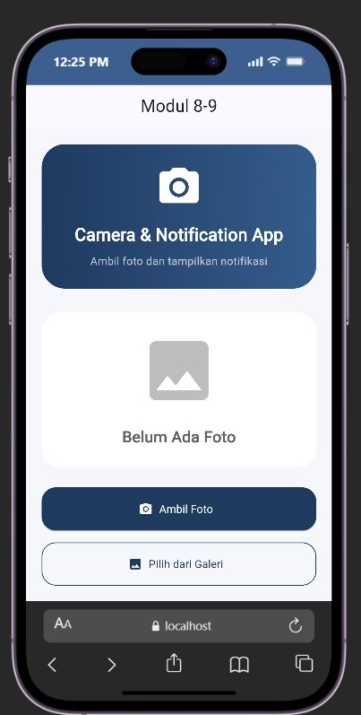
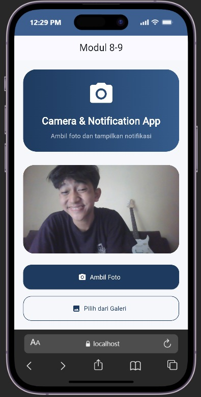
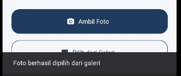

<div align="center">
  <br />

  <h1>
    LAPORAN PRAKTIKUM <br>
    APLIKASI BERBASIS PLATFORM
  </h1>

  <br />

  <h3>Modul 8-9 Mobile</h3>
  <h3>CAMERA & NOTIFICATION APP</h3>

  <br />

  <p align="center">
    
  </p>

  <br />
  <br />
  <br />

  <h3>Disusun Oleh :</h3>

  <p>
    <strong>Nadhif Atha Zaki</strong><br>
    <strong>2311102007</strong><br>
    <strong>S1 IF-11-01</strong>
  </p>

  <br />

  <h3>Dosen Pengampu :</h3>

  <p>
    <strong>Dimas Fanny Hebrasianto Permadi, S.ST., M.Kom</strong>
  </p>

  <br />
  <br />

  <h4>Asisten Praktikum :</h4>

  <strong>Apri Pandu Wicaksono</strong><br>
  <strong>Rangga Pradarrell Fathi</strong>

  <br />
  <br />

  <h3>
    LABORATORIUM HIGH PERFORMANCE
    <br>FAKULTAS INFORMATIKA
    <br>UNIVERSITAS TELKOM PURWOKERTO
    <br>2026
  </h3>
</div>

<hr>

## Dasar Teori

Flutter merupakan framework multiplatform yang memungkinkan pengembang membangun aplikasi Android, iOS, web, dan desktop hanya dengan satu basis kode. Pada praktikum Modul 8-9 ini, aplikasi yang dibuat adalah **Camera & Notification App**, yaitu aplikasi yang menggabungkan dua fitur utama: pengambilan foto menggunakan kamera atau galeri, serta menampilkan notifikasi lokal setelah foto berhasil dipilih.

### Camera & Image Picker

Flutter tidak memiliki akses kamera secara bawaan, sehingga diperlukan package tambahan yaitu `image_picker`. Package ini memungkinkan aplikasi untuk mengambil foto langsung dari kamera perangkat maupun memilih foto dari galeri. Pengambilan foto dilakukan menggunakan `ImagePicker` dengan memanggil method `pickImage()` yang menerima parameter `source`. Nilai `ImageSource.camera` digunakan untuk membuka kamera, sedangkan `ImageSource.gallery` digunakan untuk membuka galeri. Hasil dari `pickImage()` berupa objek `XFile?` yang kemudian dikonversi menjadi `File` dari package `dart:io` agar dapat ditampilkan menggunakan widget `Image.file`.

### Local Notification

Notifikasi lokal pada Flutter diimplementasikan menggunakan package `flutter_local_notifications`. Package ini memungkinkan aplikasi menampilkan notifikasi sistem di perangkat Android maupun iOS tanpa memerlukan koneksi internet atau server. Sebelum notifikasi dapat digunakan, plugin harus diinisialisasi terlebih dahulu menggunakan `FlutterLocalNotificationsPlugin` dengan pengaturan `AndroidInitializationSettings`. Inisialisasi dilakukan di dalam fungsi `main()` sebelum `runApp()` dipanggil agar plugin siap digunakan sebelum aplikasi berjalan. Notifikasi ditampilkan menggunakan method `show()` yang menerima parameter ID notifikasi, judul, isi pesan, dan detail notifikasi berupa `NotificationDetails`.

### StatefulWidget dan setState

Karena tampilan aplikasi perlu diperbarui ketika foto dipilih (menampilkan foto yang baru diambil), halaman utama menggunakan `StatefulWidget`. Setiap kali foto berhasil dipilih, variabel `imageFile` diperbarui menggunakan `setState()` sehingga widget `Image.file` otomatis merender ulang tampilan dengan foto terbaru.

## Code Program

```dart
import 'dart:io';

import 'package:flutter/material.dart';
import 'package:image_picker/image_picker.dart';
import 'package:flutter_local_notifications/flutter_local_notifications.dart';

void main() async {
  WidgetsFlutterBinding.ensureInitialized();

  await NotificationService.init();

  runApp(const MyApp());
}

final FlutterLocalNotificationsPlugin flutterLocalNotificationsPlugin =
    FlutterLocalNotificationsPlugin();

class NotificationService {
  static Future<void> init() async {
    const AndroidInitializationSettings initializationSettingsAndroid =
        AndroidInitializationSettings('@mipmap/ic_launcher');

    const InitializationSettings initializationSettings =
        InitializationSettings(android: initializationSettingsAndroid);

    await flutterLocalNotificationsPlugin.initialize(initializationSettings);
  }

  static Future<void> showNotification(String title, String body) async {
    const AndroidNotificationDetails androidPlatformChannelSpecifics =
        AndroidNotificationDetails(
          'channel_id',
          'channel_name',
          importance: Importance.max,
          priority: Priority.high,
        );

    const NotificationDetails platformChannelSpecifics = NotificationDetails(
      android: androidPlatformChannelSpecifics,
    );

    await flutterLocalNotificationsPlugin.show(
      0,
      title,
      body,
      platformChannelSpecifics,
    );
  }
}

class MyApp extends StatelessWidget {
  const MyApp({super.key});

  @override
  Widget build(BuildContext context) {
    return MaterialApp(
      debugShowCheckedModeBanner: false,
      title: 'Camera & Notification',
      theme: ThemeData(
        useMaterial3: true,
        scaffoldBackgroundColor: const Color(0xFFF5F7FB),
        colorScheme: ColorScheme.fromSeed(seedColor: const Color(0xFF1E3A5F)),
      ),
      home: const HomePage(),
    );
  }
}

class HomePage extends StatefulWidget {
  const HomePage({super.key});

  @override
  State<HomePage> createState() => _HomePageState();
}

class _HomePageState extends State<HomePage> {
  File? imageFile;

  final ImagePicker picker = ImagePicker();

  Future<void> ambilDariKamera() async {
    final XFile? photo = await picker.pickImage(source: ImageSource.gallery);
    if (photo != null) {
      setState(() {
        imageFile = File(photo.path);
      });
      NotificationService.showNotification(
        "Foto Berhasil",
        "Foto berhasil dipilih",
      );
    }
  }

  Future<void> ambilDariGaleri() async {
    final XFile? photo = await picker.pickImage(source: ImageSource.gallery);

    if (photo != null) {
      setState(() {
        imageFile = File(photo.path);
      });

      NotificationService.showNotification(
        "Galeri",
        "Foto berhasil dipilih dari galeri",
      );
    }
  }

  @override
  Widget build(BuildContext context) {
    const Color primaryBlue = Color(0xFF1E3A5F);

    return Scaffold(
      appBar: AppBar(title: const Text("Modul 8-9"), centerTitle: true),

      body: Padding(
        padding: const EdgeInsets.all(20),
        child: Column(
          children: [
            Container(
              width: double.infinity,
              padding: const EdgeInsets.all(25),
              decoration: BoxDecoration(
                gradient: const LinearGradient(
                  colors: [Color(0xFF1E3A5F), Color(0xFF355C8C)],
                ),
                borderRadius: BorderRadius.circular(30),
              ),
              child: Column(
                children: [
                  const Icon(Icons.camera_alt, color: Colors.white, size: 60),

                  const SizedBox(height: 15),

                  const Text(
                    "Camera & Notification App",
                    style: TextStyle(
                      color: Colors.white,
                      fontSize: 22,
                      fontWeight: FontWeight.bold,
                    ),
                  ),

                  const SizedBox(height: 8),

                  const Text(
                    "Ambil foto dan tampilkan notifikasi",
                    style: TextStyle(color: Colors.white70),
                    textAlign: TextAlign.center,
                  ),
                ],
              ),
            ),

            const SizedBox(height: 30),

            Expanded(
              child: Container(
                width: double.infinity,
                decoration: BoxDecoration(
                  color: Colors.white,
                  borderRadius: BorderRadius.circular(25),
                ),
                child: imageFile == null
                    ? Column(
                        mainAxisAlignment: MainAxisAlignment.center,
                        children: [
                          Icon(
                            Icons.image,
                            size: 100,
                            color: Colors.grey.shade400,
                          ),

                          const SizedBox(height: 20),

                          Text(
                            "Belum Ada Foto",
                            style: TextStyle(
                              fontSize: 20,
                              fontWeight: FontWeight.bold,
                              color: Colors.grey.shade700,
                            ),
                          ),
                        ],
                      )
                    : ClipRRect(
                        borderRadius: BorderRadius.circular(25),
                        child: Image.file(
                          imageFile!,
                          fit: BoxFit.cover,
                          width: double.infinity,
                        ),
                      ),
              ),
            ),

            const SizedBox(height: 25),

            SizedBox(
              width: double.infinity,
              height: 55,
              child: ElevatedButton.icon(
                style: ElevatedButton.styleFrom(
                  backgroundColor: primaryBlue,
                  foregroundColor: Colors.white,
                  shape: RoundedRectangleBorder(
                    borderRadius: BorderRadius.circular(18),
                  ),
                ),
                onPressed: ambilDariKamera,
                icon: const Icon(Icons.camera_alt),
                label: const Text("Ambil Foto"),
              ),
            ),

            const SizedBox(height: 15),

            SizedBox(
              width: double.infinity,
              height: 55,
              child: OutlinedButton.icon(
                style: OutlinedButton.styleFrom(
                  foregroundColor: primaryBlue,
                  side: const BorderSide(color: primaryBlue),
                  shape: RoundedRectangleBorder(
                    borderRadius: BorderRadius.circular(18),
                  ),
                ),
                onPressed: ambilDariGaleri,
                icon: const Icon(Icons.photo),
                label: const Text("Pilih dari Galeri"),
              ),
            ),
          ],
        ),
      ),
    );
  }
}
```

## Penjelasan Singkat Tiap Widget

### `WidgetsFlutterBinding.ensureInitialized()`
Dipanggil di awal fungsi `main()` sebelum operasi asynchronous apapun. Widget ini memastikan binding Flutter sudah siap sebelum plugin seperti `flutter_local_notifications` diinisialisasi. Wajib ada ketika `main()` bersifat `async`.

### `FlutterLocalNotificationsPlugin`
Objek global dari package `flutter_local_notifications` yang digunakan untuk mengelola seluruh operasi notifikasi, mulai dari inisialisasi hingga menampilkan notifikasi ke sistem.

### `NotificationService` (class)
Class helper yang berisi dua method static. Method `init()` digunakan untuk menginisialisasi plugin notifikasi dengan pengaturan ikon launcher Android. Method `showNotification()` digunakan untuk menampilkan notifikasi dengan judul dan isi pesan yang diterima sebagai parameter.

### `AndroidInitializationSettings`
Widget konfigurasi untuk inisialisasi notifikasi di platform Android. Menerima nama ikon yang digunakan sebagai ikon notifikasi, dalam hal ini `'@mipmap/ic_launcher'` yaitu ikon bawaan aplikasi.

### `AndroidNotificationDetails`
Widget konfigurasi yang menentukan detail notifikasi Android seperti channel ID, nama channel, tingkat kepentingan (`Importance.max`), dan prioritas (`Priority.high`). Channel ID dan nama channel wajib diisi agar notifikasi dapat ditampilkan pada Android 8.0 ke atas.

### `MaterialApp`
Widget root aplikasi yang mengatur konfigurasi global seperti judul aplikasi, tema, dan halaman awal. Properti `debugShowCheckedModeBanner: false` digunakan untuk menghilangkan banner debug di pojok kanan atas. Tema menggunakan `useMaterial3: true` dengan warna utama biru navy.

### `Scaffold`
Kerangka dasar halaman yang menyediakan struktur layout Material Design. Pada aplikasi ini, `Scaffold` memiliki `AppBar` sebagai header dan `body` sebagai konten utama halaman.

### `AppBar`
Header halaman yang menampilkan judul "Modul 8-9" di tengah menggunakan properti `centerTitle: true`.

### `Padding`
Widget pembungkus yang memberikan jarak (padding) sebesar 20 piksel di seluruh sisi konten utama halaman agar tampilan tidak terlalu rapat ke tepi layar.

### `Column`
Widget layout yang menyusun widget-widget anaknya secara vertikal dari atas ke bawah. Digunakan sebagai layout utama body halaman untuk menyusun banner, area foto, dan tombol-tombol secara berurutan.

### `Container` (Banner Header)
Widget serbaguna yang digunakan sebagai banner header aplikasi. Memiliki dekorasi berupa gradasi warna biru navy (`LinearGradient`) dari `Color(0xFF1E3A5F)` ke `Color(0xFF355C8C)` dan sudut melengkung (`BorderRadius.circular(30)`). Di dalamnya terdapat icon kamera, judul, dan deskripsi singkat aplikasi.

### `LinearGradient`
Digunakan di dalam `BoxDecoration` pada banner header untuk menghasilkan warna latar belakang bergradasi dari biru gelap ke biru lebih terang.

### `Icon`
Widget untuk menampilkan ikon Material Design. Digunakan untuk menampilkan ikon kamera (`Icons.camera_alt`) di banner header dengan warna putih dan ukuran 60.

### `SizedBox`
Widget yang digunakan untuk memberi jarak vertikal antar widget di dalam `Column`. Juga digunakan sebagai pembungkus tombol agar tombol memiliki lebar penuh (`width: double.infinity`) dan tinggi tetap 55 piksel.

### `Expanded`
Widget yang membuat widget anaknya mengisi sisa ruang yang tersedia di dalam `Column`. Digunakan untuk membuat `Container` area foto mengisi seluruh ruang di antara banner dan tombol secara fleksibel.

### `Container` (Area Foto)
Widget yang berfungsi sebagai area tampilan foto. Saat `imageFile` bernilai `null`, widget ini menampilkan icon gambar dan teks "Belum Ada Foto". Saat foto sudah dipilih, `Container` ini menampilkan foto menggunakan `Image.file` yang dibungkus `ClipRRect`.

### `ClipRRect`
Widget yang memotong (clip) tampilan widget anaknya mengikuti bentuk persegi panjang dengan sudut melengkung. Digunakan agar foto yang ditampilkan memiliki sudut membulat sesuai bentuk `Container` pembungkusnya.

### `Image.file`
Widget untuk menampilkan gambar dari file lokal perangkat. Menerima objek `File` yang berasal dari hasil konversi `XFile` dari `image_picker`. Properti `fit: BoxFit.cover` digunakan agar foto mengisi seluruh area tampilan tanpa distorsi.

### `ElevatedButton.icon`
Tombol pertama berlabel "Ambil Foto" dengan ikon kamera. Memiliki latar belakang biru navy dan sudut melengkung. Ketika ditekan, memanggil method `ambilDariKamera()` yang membuka galeri menggunakan `ImageSource.gallery` dan menampilkan notifikasi dengan judul "Foto Berhasil".

### `OutlinedButton.icon`
Tombol kedua berlabel "Pilih dari Galeri" dengan ikon foto. Menggunakan gaya tombol outline dengan warna biru navy dan tidak memiliki latar belakang solid. Ketika ditekan, memanggil method `ambilDariGaleri()` yang membuka galeri dan menampilkan notifikasi dengan judul "Galeri".

### `ImagePicker`
Objek dari package `image_picker` yang digunakan untuk mengakses kamera dan galeri perangkat. Method `pickImage()` mengembalikan `XFile?` (nullable) sehingga perlu dicek apakah hasilnya tidak null sebelum diproses lebih lanjut.

### `setState()`
Method yang digunakan untuk memperbarui state pada `StatefulWidget`. Dipanggil setelah foto berhasil dipilih untuk memperbarui variabel `imageFile`, sehingga tampilan halaman dirender ulang dan foto baru langsung ditampilkan.

## Tampilan

### 1. Tampilan Awal (Belum Ada Foto)



### 2. Tampilan Setelah Foto Dipilih dari Galeri



### 3. Notifikasi Setelah Foto Berhasil Dipilih



## Kesimpulan

Berdasarkan praktikum yang telah dilakukan, dapat disimpulkan bahwa Flutter mampu mengintegrasikan fitur kamera dan notifikasi lokal menggunakan package eksternal dengan cara yang cukup mudah dan terstruktur. Package `image_picker` memungkinkan aplikasi untuk mengakses kamera dan galeri perangkat, sedangkan package `flutter_local_notifications` digunakan untuk menampilkan notifikasi sistem ketika foto berhasil dipilih.

Pada aplikasi ini, inisialisasi plugin notifikasi dilakukan di dalam fungsi `main()` menggunakan `WidgetsFlutterBinding.ensureInitialized()` sebelum `runApp()` dipanggil agar plugin siap digunakan saat aplikasi berjalan. Logika notifikasi dipisahkan ke dalam class `NotificationService` agar kode lebih rapi dan mudah dipelihara.

Halaman utama menggunakan `StatefulWidget` karena tampilan perlu diperbarui setiap kali foto baru dipilih. Variabel `imageFile` diperbarui menggunakan `setState()` sehingga widget `Image.file` secara otomatis merender ulang foto terbaru. Saat belum ada foto, halaman menampilkan tampilan kosong dengan icon dan teks "Belum Ada Foto" sebagai placeholder.

Dari praktikum ini, dapat dipahami bahwa penggunaan package eksternal seperti `image_picker` dan `flutter_local_notifications` sangat memperluas kemampuan aplikasi Flutter dalam mengakses fitur perangkat keras dan sistem operasi, yang tidak tersedia secara bawaan dalam framework Flutter itu sendiri.
