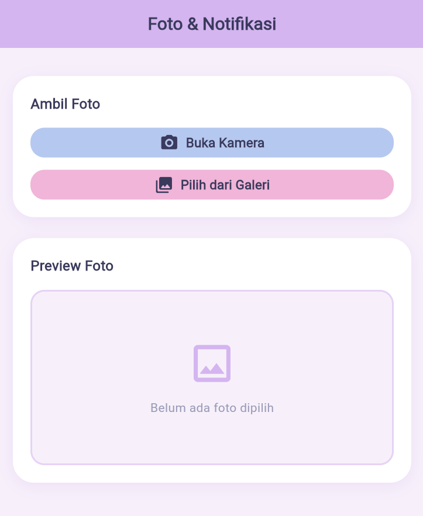
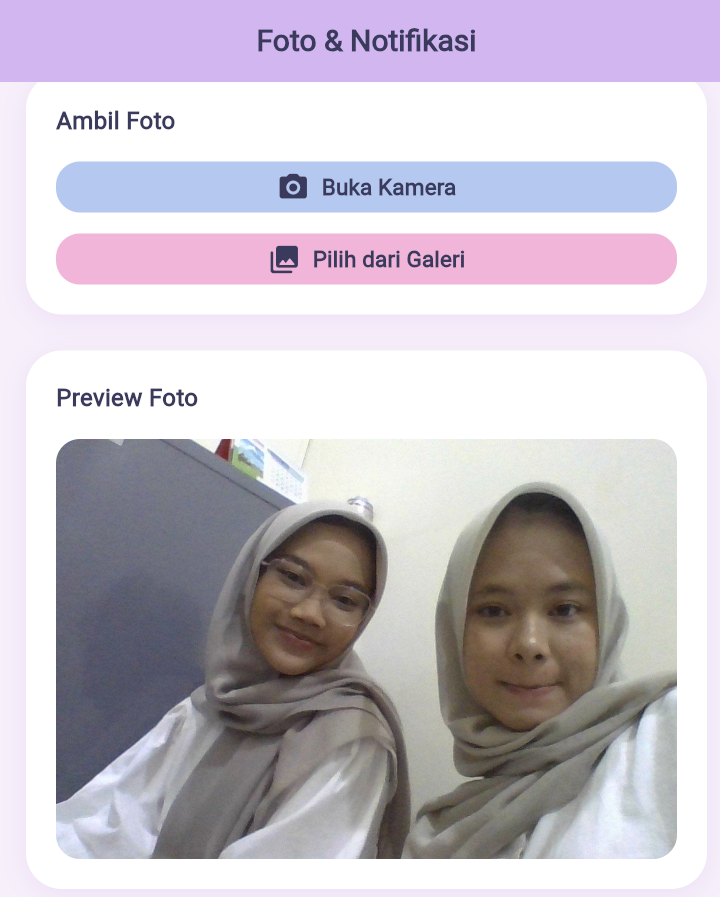

<div align="center">
  <br />

  <h1>LAPORAN PRAKTIKUM <br> APLIKASI BERBASIS PLATFORM</h1>

  <br />

  <h3>MODUL 8 & 9<br> NOTIFIKASI & API PERANGKAT KERAS</h3>

  <br />
  <br />

  <h3>Disusun Oleh :</h3>

  <p>
    <strong>Annisa Al Jauhar</strong><br>
    <strong>2311102014</strong><br>
    <strong>S1 IF-11-01</strong>
  </p>

  <br />

  <h3>Dosen Pengampu :</h3>
  <p><strong>Dimas Fanny Hebrasianto Permadi, S.ST., M.Kom</strong></p>

  <br />

  <h4>Asisten Praktikum :</h4>
  <p>
    <strong>Apri Pandu Wicaksono</strong><br>
    <strong>Rangga Pradarrell Fathi</strong>
  </p>

  <br />

  <h3>LABORATORIUM HIGH PERFORMANCE<br>FAKULTAS INFORMATIKA<br>UNIVERSITAS TELKOM PURWOKERTO<br>2026</h3>
</div>

<hr>

## Dasar Teori

### 1. Camera API & image_picker

**image_picker** adalah plugin Flutter resmi yang menyediakan akses ke kamera dan galeri perangkat. Plugin ini mendukung dua sumber gambar:

- **`ImageSource.camera`** — Membuka antarmuka kamera perangkat langsung untuk mengambil foto baru
- **`ImageSource.gallery`** — Membuka file picker sistem untuk memilih foto dari penyimpanan

Plugin ini mengembalikan objek `XFile` yang berisi path file foto yang dipilih atau diambil.

```dart
final XFile? photo = await _picker.pickImage(
  source: ImageSource.camera,  // atau ImageSource.gallery
  imageQuality: 85,            // kompresi 0-100
);
```

---

### 2. flutter_local_notifications

Plugin ini memungkinkan aplikasi menampilkan **notifikasi lokal** tanpa memerlukan koneksi internet atau server pada perangkat Android dan iOS.

**Alur kerja notifikasi:**
1. **Inisialisasi** plugin dengan pengaturan platform (Android/iOS)
2. **Buat channel** notifikasi (Android 8.0+)
3. **Tampilkan** notifikasi dengan `flutterLocalNotificationsPlugin.show()`

**Komponen utama:**
- `AndroidNotificationDetails` — Konfigurasi tampilan notifikasi di Android (channel ID, icon, priority, sound)
- `DarwinNotificationDetails` — Konfigurasi untuk iOS/macOS
- `NotificationDetails` — Wrapper yang menggabungkan konfigurasi semua platform

---

### 3. Permissions (Izin Aplikasi)

Aplikasi mobile memerlukan izin eksplisit dari pengguna sebelum mengakses hardware atau data sensitif.

| Izin | Platform | Kegunaan |
|---|---|---|
| `CAMERA` | Android | Akses kamera untuk foto |
| `READ_MEDIA_IMAGES` | Android 13+ | Baca foto dari galeri |
| `READ_EXTERNAL_STORAGE` | Android ≤12 | Baca file dari penyimpanan |
| `POST_NOTIFICATIONS` | Android 13+ | Tampilkan notifikasi |
| `NSCameraUsageDescription` | iOS | Akses kamera |
| `NSPhotoLibraryUsageDescription` | iOS | Akses galeri |

---

### 4. Asynchronous Programming

Flutter menggunakan model asynchronous untuk operasi yang membutuhkan waktu seperti I/O dan akses kamera. `Future<T>` merepresentasikan nilai yang akan tersedia di masa depan. Penggunaan `async/await` membuat kode asynchronous terlihat seperti kode sinkronus.

```dart
Future<void> _takePhoto() async {
  final XFile? photo = await _picker.pickImage(source: ImageSource.camera);
}
```

---

## Penjelasan Singkat Tiap Widget

### Widget Struktural (Kerangka Halaman)

| Widget | Penjelasan |
|---|---|
| **`MaterialApp`** | Widget root aplikasi. Menyediakan tema Material Design, navigasi, dan konfigurasi global. Tema pastel dikonfigurasi di sini menggunakan `ColorScheme` kustom. |
| **`Scaffold`** | Kerangka halaman standar Material. Menyediakan slot untuk `AppBar`, `body`, dan lain-lain. |
| **`AppBar`** | Bar navigasi di bagian atas layar. Diatur dengan `backgroundColor` pastel ungu `(0xFFD4B5F0)`. |

### Widget Layout (Tata Letak)

| Widget | Penjelasan |
|---|---|
| **`Column`** | Menyusun widget secara vertikal. Digunakan untuk menata tombol dan area preview foto. |
| **`SingleChildScrollView`** | Membungkus konten agar bisa di-scroll ketika konten melebihi ukuran layar. |
| **`SizedBox`** | Membuat ruang kosong dengan tinggi/lebar tertentu. Berfungsi sebagai spacer antar widget. |
| **`Container`** | Widget serbaguna untuk dekorasi seperti warna background, border radius, dan shadow pastel. |

### Widget Tampilan (Visual)

| Widget | Penjelasan |
|---|---|
| **`Text`** | Menampilkan teks statis. Dikustomisasi via `TextStyle` untuk warna dan ukuran font. |
| **`Icon`** | Menampilkan ikon dari library Material Icons bawaan Flutter. |
| **`Image.memory`** | Menampilkan gambar dari bytes (`Uint8List`). Digunakan agar support Web dan Mobile, menggantikan `Image.file` yang tidak support web. |
| **`ClipRRect`** | Memotong widget dengan border radius untuk membuat sudut membulat pada preview foto. |

### Widget Interaksi & State

| Widget | Penjelasan |
|---|---|
| **`ElevatedButton.icon`** | Tombol dengan warna pastel dan ikon. Tombol **Buka Kamera** berwarna biru pastel `(0xFFB5C8F0)`, tombol **Pilih dari Galeri** berwarna pink pastel `(0xFFF0B5D8)`. |
| **`StatefulWidget`** | Base class untuk widget yang bisa berubah state-nya. `HomeScreen` extends ini karena perlu memperbarui tampilan foto setelah dipilih. |
| **`StatelessWidget`** | Base class untuk widget tanpa state. `MyApp` extends ini karena hanya mendefinisikan konfigurasi app yang tidak berubah. |
| **`setState()`** | Method untuk memberitahu Flutter bahwa state telah berubah sehingga widget perlu di-render ulang. |

### Plugin & Kelas Pendukung

| Kelas / Plugin | Penjelasan |
|---|---|
| **`ImagePicker`** | Kelas dari plugin `image_picker`. Method `pickImage()` membuka kamera atau galeri dan mengembalikan `XFile`. |
| **`XFile`** | Representasi file lintas platform. Menyimpan path file foto yang dipilih. |
| **`FlutterLocalNotificationsPlugin`** | Kelas utama plugin notifikasi. Method `show()` menampilkan notifikasi dengan ID, judul, pesan, dan detail platform. |
| **`AndroidNotificationDetails`** | Konfigurasi notifikasi spesifik Android: channel ID, nama channel, importance, dan priority. |
| **`NotificationDetails`** | Wrapper yang menggabungkan konfigurasi Android dan iOS menjadi satu objek untuk semua platform. |

---

## Dependencies

```yaml
image_picker: ^1.0.7
# Akses kamera & galeri foto perangkat

flutter_local_notifications: ^17.1.2
# Notifikasi lokal tanpa server/internet

permission_handler: ^11.3.0
# Minta izin runtime (kamera, notifikasi, storage)
```

---

## Source Code

### `pubspec.yaml`

```yaml
name: flutter_foto_notif
description: Aplikasi Flutter dengan fitur ambil foto dan notifikasi lokal.
version: 1.0.0+1

environment:
  sdk: '>=3.0.0 <4.0.0'

dependencies:
  flutter:
    sdk: flutter
  image_picker: ^1.0.7
  flutter_local_notifications: ^17.1.2
  permission_handler: ^11.3.0

dev_dependencies:
  flutter_test:
    sdk: flutter
  flutter_lints: ^3.0.0

flutter:
  uses-material-design: true
```

---

### `AndroidManifest.xml`

```xml
<manifest xmlns:android="http://schemas.android.com/apk/res/android">

    <uses-permission android:name="android.permission.CAMERA" />
    <uses-permission android:name="android.permission.READ_EXTERNAL_STORAGE" />
    <uses-permission android:name="android.permission.READ_MEDIA_IMAGES" />
    <uses-permission android:name="android.permission.POST_NOTIFICATIONS" />
    <uses-permission android:name="android.permission.VIBRATE" />

    <uses-feature android:name="android.hardware.camera" android:required="false" />

    <application
        android:label="Foto &amp; Notifikasi"
        android:name="${applicationName}"
        android:icon="@mipmap/ic_launcher">
        <activity
            android:name=".MainActivity"
            android:exported="true"
            android:launchMode="singleTop"
            android:taskAffinity=""
            android:theme="@style/LaunchTheme"
            android:configChanges="orientation|keyboardHidden|keyboard|screenSize|smallestScreenSize|locale|layoutDirection|fontScale|screenLayout|density|uiMode"
            android:hardwareAccelerated="true"
            android:windowSoftInputMode="adjustResize">
            <meta-data
                android:name="io.flutter.embedding.android.NormalTheme"
                android:resource="@style/NormalTheme" />
            <intent-filter>
                <action android:name="android.intent.action.MAIN"/>
                <category android:name="android.intent.category.LAUNCHER"/>
            </intent-filter>
        </activity>
        <meta-data android:name="flutterEmbedding" android:value="2" />
    </application>
    <queries>
        <intent>
            <action android:name="android.media.action.IMAGE_CAPTURE" />
        </intent>
    </queries>
</manifest>
```

---

### `main.dart`

```dart
import 'package:flutter/material.dart';
import 'screens/home_screen.dart';
import 'services/notification_service.dart';

void main() async {
  WidgetsFlutterBinding.ensureInitialized();
  await NotificationService.initialize();
  runApp(const MyApp());
}

class MyApp extends StatelessWidget {
  const MyApp({super.key});

  @override
  Widget build(BuildContext context) {
    return MaterialApp(
      title: 'Foto & Notifikasi',
      debugShowCheckedModeBanner: false,
      theme: ThemeData(
        colorScheme: ColorScheme(
          brightness: Brightness.light,
          primary: const Color(0xFFB5C8F0),
          onPrimary: const Color(0xFF3A3A5C),
          secondary: const Color(0xFFF0B5D8),
          onSecondary: const Color(0xFF5C3A50),
          error: const Color(0xFFFFB5B5),
          onError: Colors.white,
          surface: const Color(0xFFFFF9FB),
          onSurface: const Color(0xFF3A3A5C),
        ),
        scaffoldBackgroundColor: const Color(0xFFF7F0FA),
        useMaterial3: true,
      ),
      home: const HomeScreen(),
    );
  }
}
```

---

### `home_screen.dart`

```dart
import 'dart:typed_data';
import 'package:flutter/material.dart';
import 'package:image_picker/image_picker.dart';
import '../services/notification_service.dart';

class HomeScreen extends StatefulWidget {
  const HomeScreen({super.key});

  @override
  State<HomeScreen> createState() => _HomeScreenState();
}

class _HomeScreenState extends State<HomeScreen> {
  Uint8List? _imageBytes;
  final ImagePicker _picker = ImagePicker();

  static const Color pastelBlue   = Color(0xFFB5C8F0);
  static const Color pastelPink   = Color(0xFFF0B5D8);
  static const Color pastelPurple = Color(0xFFD4B5F0);
  static const Color bgColor      = Color(0xFFF7F0FA);
  static const Color textDark     = Color(0xFF3A3A5C);

  Future<void> _ambilDariKamera() async {
    final XFile? foto = await _picker.pickImage(
      source: ImageSource.camera, imageQuality: 85);
    if (foto != null) {
      final bytes = await foto.readAsBytes();
      setState(() => _imageBytes = bytes);
      await NotificationService.tampilkanNotifikasi(
        judul: 'Foto Berhasil Diambil!',
        isi: 'Foto baru telah diambil menggunakan kamera.');
    }
  }

  Future<void> _pilihDariGaleri() async {
    final XFile? foto = await _picker.pickImage(
      source: ImageSource.gallery, imageQuality: 85);
    if (foto != null) {
      final bytes = await foto.readAsBytes();
      setState(() => _imageBytes = bytes);
      await NotificationService.tampilkanNotifikasi(
        judul: 'Foto Dipilih dari Galeri!',
        isi: 'Foto berhasil dipilih dari galeri perangkat.');
    }
  }

  @override
  Widget build(BuildContext context) {
    return Scaffold(
      backgroundColor: bgColor,
      appBar: AppBar(
        backgroundColor: pastelPurple,
        elevation: 0,
        title: const Text('Foto & Notifikasi',
            style: TextStyle(color: textDark, fontWeight: FontWeight.w700, fontSize: 20)),
        centerTitle: true,
      ),
      body: SingleChildScrollView(
        padding: const EdgeInsets.all(24),
        child: Column(children: [
          const SizedBox(height: 8),
          _buildCard(title: 'Ambil Foto', child: Column(children: [
            _buildTombol(label: 'Buka Kamera', icon: Icons.camera_alt_rounded,
                warna: pastelBlue, onTap: _ambilDariKamera),
            const SizedBox(height: 14),
            _buildTombol(label: 'Pilih dari Galeri', icon: Icons.photo_library_rounded,
                warna: pastelPink, onTap: _pilihDariGaleri),
          ])),
          const SizedBox(height: 24),
          _buildCard(title: 'Preview Foto',
              child: _imageBytes == null ? _buildEmptyState() : _buildImagePreview()),
        ]),
      ),
    );
  }

  Widget _buildCard({required String title, required Widget child}) {
    return Container(
      width: double.infinity,
      decoration: BoxDecoration(
        color: Colors.white,
        borderRadius: BorderRadius.circular(24),
        boxShadow: [BoxShadow(
            color: pastelPurple.withOpacity(0.3), blurRadius: 16, offset: const Offset(0, 4))],
      ),
      padding: const EdgeInsets.all(20),
      child: Column(crossAxisAlignment: CrossAxisAlignment.start, children: [
        Text(title, style: const TextStyle(
            fontSize: 16, fontWeight: FontWeight.w700, color: textDark)),
        const SizedBox(height: 16),
        child,
      ]),
    );
  }

  Widget _buildTombol({required String label, required IconData icon,
      required Color warna, required VoidCallback onTap}) {
    return SizedBox(width: double.infinity,
      child: ElevatedButton.icon(
        style: ElevatedButton.styleFrom(
          backgroundColor: warna, foregroundColor: textDark, elevation: 0,
          shape: RoundedRectangleBorder(borderRadius: BorderRadius.circular(16)),
          padding: const EdgeInsets.symmetric(vertical: 14)),
        icon: Icon(icon, size: 22),
        label: Text(label, style: const TextStyle(fontSize: 15, fontWeight: FontWeight.w600)),
        onPressed: onTap,
      ),
    );
  }

  Widget _buildEmptyState() {
    return Container(
      width: double.infinity, height: 200,
      decoration: BoxDecoration(
        color: bgColor, borderRadius: BorderRadius.circular(16),
        border: Border.all(color: pastelPurple.withOpacity(0.5), width: 2)),
      child: const Column(mainAxisAlignment: MainAxisAlignment.center, children: [
        Icon(Icons.image_outlined, size: 56, color: Color(0xFFD4B5F0)),
        SizedBox(height: 12),
        Text('Belum ada foto dipilih',
            style: TextStyle(color: Color(0xFF9B9BB8), fontSize: 14)),
      ]),
    );
  }

  Widget _buildImagePreview() {
    return ClipRRect(
      borderRadius: BorderRadius.circular(16),
      child: Image.memory(_imageBytes!, width: double.infinity, height: 280, fit: BoxFit.cover),
    );
  }
}
```

---

### `notification_service.dart`

```dart
import 'package:flutter_local_notifications/flutter_local_notifications.dart';

class NotificationService {
  static final FlutterLocalNotificationsPlugin _plugin =
      FlutterLocalNotificationsPlugin();

  static Future<void> initialize() async {
    const AndroidInitializationSettings androidSettings =
        AndroidInitializationSettings('@mipmap/ic_launcher');
    const InitializationSettings initSettings =
        InitializationSettings(android: androidSettings);
    await _plugin.initialize(initSettings);

    final AndroidFlutterLocalNotificationsPlugin? androidPlugin =
        _plugin.resolvePlatformSpecificImplementation<
            AndroidFlutterLocalNotificationsPlugin>();
    await androidPlugin?.requestNotificationsPermission();
  }

  static Future<void> tampilkanNotifikasi({
    required String judul,
    required String isi,
  }) async {
    const AndroidNotificationDetails androidDetails =
        AndroidNotificationDetails(
      'foto_channel', 'Foto & Notifikasi',
      channelDescription: 'Notifikasi setelah foto diambil atau dipilih',
      importance: Importance.high,
      priority: Priority.high,
      playSound: true,
      enableVibration: true,
    );
    await _plugin.show(
      DateTime.now().millisecondsSinceEpoch ~/ 1000,
      judul, isi,
      const NotificationDetails(android: androidDetails),
    );
  }
}
```

---

## Screenshot Hasil

### Tampilan Awal (Belum Ada Foto)


### Tampilan Setelah Memilih Foto dari Galeri
