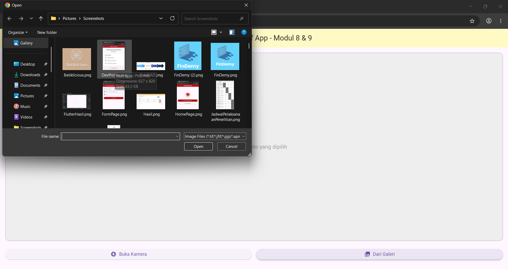

<div align="center">

# LAPORAN PRAKTIKUM
# APLIKASI BERBASIS PLATFORM


## MODUL 8-9
## MOBILE


**Disusun Oleh :**

**Sherine Naura Early Gunawan**

**2311102020**

**S1 IF-11-REG01**


**PROGRAM STUDI S1 INFORMATIKA**

**FAKULTAS INFORMATIKA**

**UNIVERSITAS TELKOM PURWOKERTO**

**2025/2026**

</div>

---

## 1. Source Code

```dart
import 'dart:io';
import 'package:flutter/material.dart';
import 'package:camera/camera.dart';
import 'package:image_picker/image_picker.dart';
import 'package:flutter_local_notifications/flutter_local_notifications.dart';

final FlutterLocalNotificationsPlugin flutterLocalNotificationsPlugin =
    FlutterLocalNotificationsPlugin();

List<CameraDescription> cameras = [];

void main() async {
  WidgetsFlutterBinding.ensureInitialized();

  try {
    cameras = await availableCameras();
  } catch (e) {
    debugPrint("Error menginisialisasi kamera: $e");
  }

  const AndroidInitializationSettings initializationSettingsAndroid =
      AndroidInitializationSettings('@mipmap/ic_launcher');

  const InitializationSettings initializationSettings = InitializationSettings(
    android: initializationSettingsAndroid,
  );

  await flutterLocalNotificationsPlugin.initialize(
    settings: initializationSettings,
    onDidReceiveNotificationResponse: (NotificationResponse response) {
      debugPrint("Notifikasi diklik: ${response.payload}");
    },
  );

  runApp(const MyApp());
}

class MyApp extends StatelessWidget {
  const MyApp({super.key});

  @override
  Widget build(BuildContext context) {
    return MaterialApp(
      debugShowCheckedModeBanner: false,
      title: 'Camera & Notification Demo',
      theme: ThemeData(primarySwatch: Colors.blue, useMaterial3: true),
      home: const HomeScreen(),
    );
  }
}

class HomeScreen extends StatefulWidget {
  const HomeScreen({super.key});

  @override
  State<HomeScreen> createState() => _HomeScreenState();
}

class _HomeScreenState extends State<HomeScreen> {
  File? _imageFile;
  CameraController? _cameraController;
  final ImagePicker _picker = ImagePicker();

  @override
  void dispose() {
    _cameraController?.dispose();
    super.dispose();
  }

  Future<void> _showNotification(String source) async {
    const AndroidNotificationDetails androidPlatformChannelSpecifics =
        AndroidNotificationDetails(
          'photo_channel_id',
          'Photo Notifications',
          channelDescription:
              'Notifikasi saat foto berhasil diambil atau dipilih',
          importance: Importance.max,
          priority: Priority.high,
        );

    const NotificationDetails platformChannelSpecifics = NotificationDetails(
      android: androidPlatformChannelSpecifics,
    );

    await flutterLocalNotificationsPlugin.show(
      id: 0,
      title: 'Foto Berhasil Dimuat!',
      body: 'Foto berhasil diambil dari $source.',
      notificationDetails: platformChannelSpecifics,
    );
  }

  Future<void> _openCamera() async {
    if (cameras.isEmpty) {
      if (!mounted) return;
      ScaffoldMessenger.of(context).showSnackBar(
        const SnackBar(content: Text('Kamera tidak ditemukan pada perangkat')),
      );
      return;
    }

    final CameraController cameraController = CameraController(
      cameras[0],
      ResolutionPreset.medium,
    );
    _cameraController = cameraController;

    try {
      await cameraController.initialize();
      if (!mounted) return;

      await showDialog(
        context: context,
        barrierDismissible: false,
        builder: (dialogContext) => AlertDialog(
          contentPadding: EdgeInsets.zero,
          content: SizedBox(
            width: double.maxFinite,
            child: AspectRatio(
              aspectRatio: cameraController.value.aspectRatio,
              child: CameraPreview(cameraController),
            ),
          ),
          actions: [
            TextButton(
              onPressed: () => Navigator.of(dialogContext).pop(),
              child: const Text('Batal'),
            ),
            IconButton(
              icon: const Icon(Icons.camera_alt, size: 40),
              onPressed: () async {
                try {
                  final XFile file = await cameraController.takePicture();
                  if (!mounted) return;
                  setState(() {
                    _imageFile = File(file.path);
                  });
                  Navigator.of(dialogContext).pop();
                  await _showNotification('Kamera Langsung');
                } catch (e) {
                  debugPrint("Error mengambil gambar: $e");
                }
              },
            ),
          ],
        ),
      );
    } catch (e) {
      debugPrint("Gagal membuka kamera: $e");
      if (mounted) {
        ScaffoldMessenger.of(context).showSnackBar(
          const SnackBar(
            content: Text(
              'Gagal membuka kamera. Periksa izin atau perangkat Anda.',
            ),
          ),
        );
      }
    } finally {
      await _cameraController?.dispose();
      _cameraController = null;
    }
  }

  Future<void> _pickFromGallery() async {
    try {
      final XFile? pickedFile = await _picker.pickImage(
        source: ImageSource.gallery,
      );

      if (pickedFile != null) {
        setState(() {
          _imageFile = File(pickedFile.path);
        });
        _showNotification('Galeri');
      }
    } catch (e) {
      debugPrint("Error membuka galeri: $e");
    }
  }

  @override
  Widget build(BuildContext context) {
    return Scaffold(
      appBar: AppBar(
        title: const Text('Camera dan Notif App - Modul 8 & 9'),
        centerTitle: true,
        backgroundColor: Colors.yellow.shade100,
      ),
      body: Padding(
        padding: const EdgeInsets.all(16.0),
        child: Column(
          children: [
            Expanded(
              child: Container(
                width: double.infinity,
                decoration: BoxDecoration(
                  color: Colors.grey.shade200,
                  borderRadius: BorderRadius.circular(12),
                  border: Border.all(color: Colors.grey.shade400),
                ),
                child: _imageFile != null
                    ? ClipRRect(
                        borderRadius: BorderRadius.circular(12),
                        child: Image.file(_imageFile!, fit: BoxFit.cover),
                      )
                    : const Center(
                        child: Text(
                          'Belum ada foto yang dipilih',
                          style: TextStyle(fontSize: 16, color: Colors.grey),
                        ),
                      ),
              ),
            ),
            const SizedBox(height: 24),
            Row(
              children: [
                Expanded(
                  child: ElevatedButton.icon(
                    onPressed: _openCamera,
                    icon: const Icon(Icons.camera),
                    label: const Text('Buka Kamera'),
                    style: ElevatedButton.styleFrom(
                      padding: const EdgeInsets.symmetric(vertical: 12),
                    ),
                  ),
                ),
                const SizedBox(width: 12),
                Expanded(
                  child: ElevatedButton.icon(
                    onPressed: _pickFromGallery,
                    icon: const Icon(Icons.photo_library),
                    label: const Text('Dari Galeri'),
                    style: ElevatedButton.styleFrom(
                      padding: const EdgeInsets.symmetric(vertical: 12),
                    ),
                  ),
                ),
              ],
            ),
            const SizedBox(height: 16),
          ],
        ),
      ),
    );
  }
}
```

## 2. Penjelasan kode

### a. Fungsi Utama (main)
``` dart
void main() async {
  WidgetsFlutterBinding.ensureInitialized();
  try {
    cameras = await availableCameras();
  } catch (e) {
    debugPrint("Error menginisialisasi kamera: $e");
  }

  const AndroidInitializationSettings initializationSettingsAndroid =
      AndroidInitializationSettings('@mipmap/ic_launcher');

  const InitializationSettings initializationSettings = InitializationSettings(
    android: initializationSettingsAndroid,
  );

  await flutterLocalNotificationsPlugin.initialize(
    settings: initializationSettings,
    onDidReceiveNotificationResponse: (NotificationResponse response) {
      debugPrint("Notifikasi diklik: ${response.payload}");
    },
  );

  runApp(const MyApp());
}
```

**Penjelasan:** Fungsi main() bertindak sebagai fungsi utama agar program dapat berjalan secara asinkronus. Disini, perintah WidgetsFlutterBinding.ensureInitialized() wajib dipanggil berfungsi untuk menghubungkan core framework Flutter dengan komponen native sistem operasi HP. Selain itu, fungsi availableCameras() bekerja mendeteksi perangkat keras kamera fisik yang tersedia pada perangkat, sementara objek flutterLocalNotificationsPlugin.initialize() mengaktifkan sistem pustaka notifikasi lokal menggunakan ikon bawaan @mipmap/ic_launcher serta mendaftarkan parameter onDidReceiveNotificationResponse untuk mendeteksi aksi ketika bar notifikasi tersebut diklik oleh pengguna.

---

### b. Fungsi MyApp
```dart
class MyApp extends StatelessWidget {
  const MyApp({super.key});

  @override
  Widget build(BuildContext context) {
    return MaterialApp(
      debugShowCheckedModeBanner: false,
      title: 'Camera & Notification Demo',
      theme: ThemeData(primarySwatch: Colors.blue, useMaterial3: true),
      home: const HomeScreen(),
    );
  }
}
```

**Penjelasan:** Widget MyApp merupakan sebuah StatelessWidget yang berfungsi sebagai fondasi paling dasar atau akar dari seluruh struktur visual aplikasi. Di dalam method build-nya, terdapat widget MaterialApp yang mengatur konfigurasi tema global bernuansa Material Design, di mana properti debugShowCheckedModeBanner: false dipakai untuk menghilangkan pita merah bertuliskan "DEBUG" di pojok kanan atas layar, properti theme untuk mengaktifkan standarisasi komponen visual modern versi Material 3, dan properti home untuk mengarahkan agar aplikasi langsung memuat halaman HomeScreen() sebagai antarmuka utama.

---

### c. Struktur Layout 
```dart 
return Scaffold(
  appBar: AppBar(
    title: const Text('Camera dan Notif App - Modul 8 & 9'),
    centerTitle: true,
    backgroundColor: Colors.yellow.shade100,
  ),
  body: Padding( ... ),
);
```

**Penjelasan:** Di dalam fungsi state ini, widget Scaffold digunakan sebagai kerangka utama untuk menyediakan struktur layout standar halaman Android, seperti memisahkan area bar menu atas dan area isi konten. Bagian atas halaman diatur oleh widget AppBar untuk menampilkan judul teks praktikum, yang menggunakan warna latar belakang kuning lewat Colors.yellow.shade100 serta diposisikan simetris tepat di tengah layar secara otomatis menggunakan parameter centerTitle: true.

### d. Logika Fitur Kamera 
```dart
Future<void> _openCamera() async {
    if (cameras.isEmpty) {
      if (!mounted) return;
      ScaffoldMessenger.of(context).showSnackBar(
        const SnackBar(content: Text('Kamera tidak ditemukan pada perangkat')),
      );
      return;
    }

    final CameraController cameraController = CameraController(
      cameras[0],
      ResolutionPreset.medium,
    );
    _cameraController = cameraController;

    try {
      await cameraController.initialize();
      if (!mounted) return;

      await showDialog(
        context: context,
        barrierDismissible: false,
        builder: (dialogContext) => AlertDialog(
          contentPadding: EdgeInsets.zero,
          content: SizedBox(
            width: double.maxFinite,
            child: AspectRatio(
              aspectRatio: cameraController.value.aspectRatio,
              child: CameraPreview(cameraController),
            ),
          ),
          actions: [
            TextButton(
              onPressed: () => Navigator.of(dialogContext).pop(),
              child: const Text('Batal'),
            ),
            IconButton(
              icon: const Icon(Icons.camera_alt, size: 40),
              onPressed: () async {
                try {
                  final XFile file = await cameraController.takePicture();
                  if (!mounted) return;
                  setState(() {
                    _imageFile = File(file.path);
                  });
                  Navigator.of(dialogContext).pop();
                  await _showNotification('Kamera Langsung');
                } catch (e) {
                  debugPrint("Error mengambil gambar: $e");
                }
              },
            ),
          ],
        ),
      );
    } catch (e) {
      debugPrint("Gagal membuka kamera: $e");
      if (mounted) {
        ScaffoldMessenger.of(context).showSnackBar(
          const SnackBar(
            content: Text(
              'Gagal membuka kamera. Periksa izin atau perangkat Anda.',
            ),
          ),
        );
      }
    } finally {
      await _cameraController?.dispose();
      _cameraController = null;
    }
  }
```

**Penjelasan:** Ketika fungsi asinkronus _openCamera() ini dipanggil, sistem pertama kali melakukan validasi fisik untuk memeriksa ketersediaan lensa kamera melalui variabel global cameras. Jika terdeteksi, program akan langsung membuat instansiasi CameraController baru dan melakukan proses inisialisasi perangkat keras secara otomatis sebelum akhirnya memicu fungsi showDialog untuk memunculkan jendela pop-up overlay AlertDialog di atas layar utama aplikasi.

Di dalam kotak dialog tersebut, widget CameraPreview bekerja sebagai elemen penayangan utama yang menampilkan rekaman video mentah secara langsung (live feed view) dari lensa HP secara real-time agar pengguna bisa membidik objek foto dengan pas. Begitu tombol ikon kamera (Icons.camera_alt) ditekan, alur asinkronus akan berlanjut ke fungsi takePicture() untuk menangkap gambar, memasukkannya ke dalam variabel state _imageFile agar memperbarui tampilan layar utama, lalu menutup dialog secara aman sekaligus memicu fungsi _showNotification() untuk mendorong push notification ke bar status perangkat.

---

## 3. Hasil

<div align="center">
    
</div>