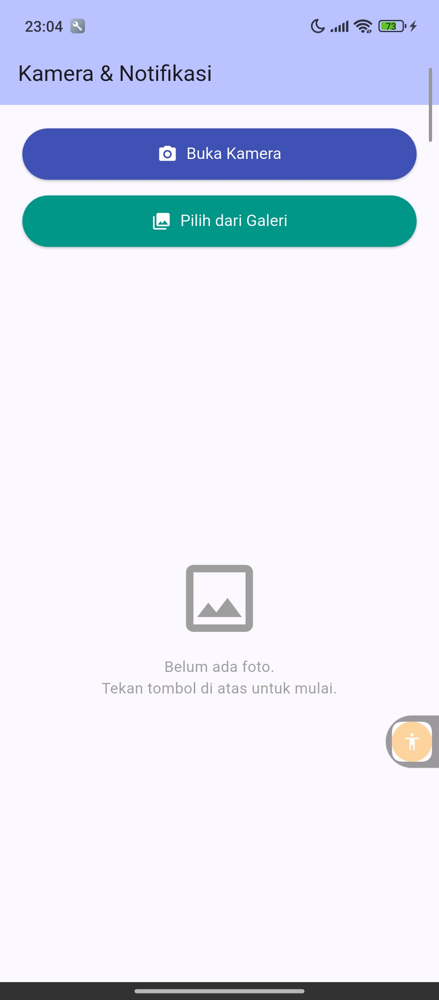
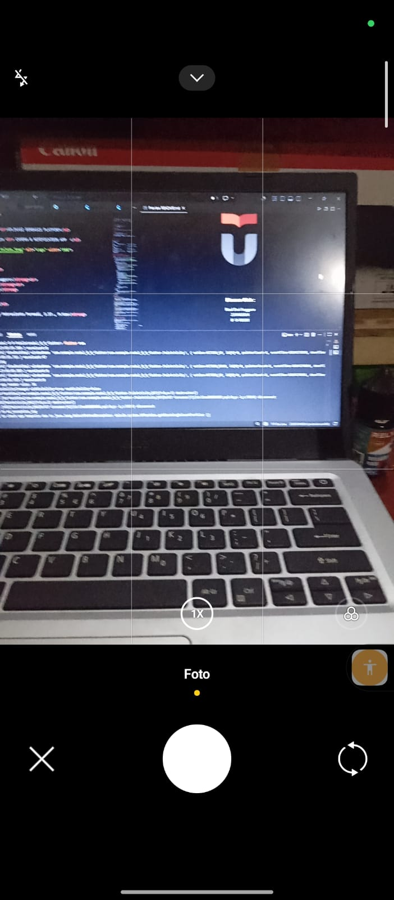
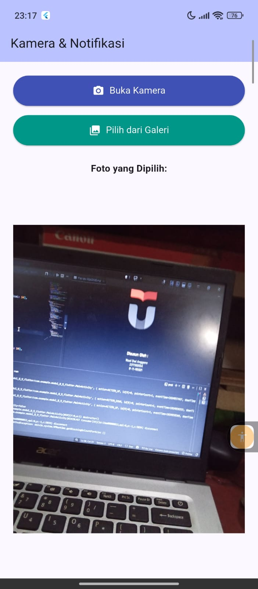
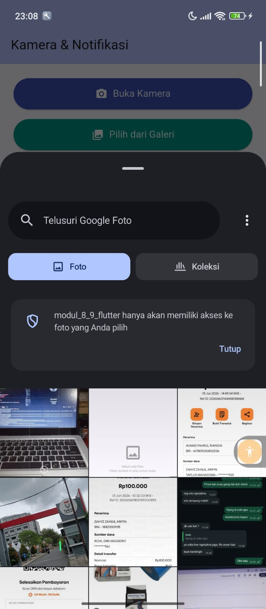

<div align="center">
  <br />
  <h1>LAPORAN PRAKTIKUM <br>APLIKASI BERBASIS PLATFORM</h1>
  <br />
  <h3>MODUL 08-09 - Mobile <br> CAMERA & NOTIFICATION APP  </h3>
  <br />
   
  <br />
  <br />
  <br />
  <h3>Disusun Oleh :</h3>
  <p>
    <strong>Rizal Dwi Anggoro</strong><br>
    <strong>2311102034</strong><br>
    <strong>IF-11-REG01</strong>
  </p>
  <br />
  <h3>Dosen Pengampu :</h3>
  <p>
    <strong>Dimas Fanny Hebrasianto Permadi, S.ST., M.Kom</strong>
  </p>
  <br />
  <br />
    <h4>Asisten Praktikum :</h4>
    <strong> Apri Pandu Wicaksono </strong> <br>
    <strong>Rangga Pradarrell Fathi</strong>
  <br />
  <h3>LABORATORIUM HIGH PERFORMANCE
 <br>FAKULTAS INFORMATIKA <br>UNIVERSITAS TELKOM PURWOKERTO <br>2026</h3>
</div>

---

## Struktur Folder

```
notifikasi_kamera/
├── android/
│   └── app/
│       └── src/
│           └── main/
│               └── AndroidManifest.xml       ← tambah permission kamera
├── ios/
│   └── Runner/
│       └── Info.plist                        ← tambah permission kamera & galeri
├── lib/
│   ├── main.dart                             ← entry point
│   ├── screens/
│   │   └── home_screen.dart                 ← halaman utama (2 tombol + tampil foto)
│   └── services/
│       └── notification_service.dart        ← setup & trigger notifikasi lokal
├── pubspec.yaml                              ← dependencies
└── README.md
```

## 1. Source Code dan Penjelasan

### 1.1 Code android/app/src/main/AndroidManifest.xml

```dart
<manifest xmlns:android="http://schemas.android.com/apk/res/android">

    <!-- Permission untuk camera, galeri/foto, dan notifikasi -->
    <uses-permission android:name="android.permission.CAMERA" />
    <uses-permission android:name="android.permission.READ_MEDIA_IMAGES" />
    <uses-permission android:name="android.permission.POST_NOTIFICATIONS" />

    <application
        android:label="modul_8_9_flutter"
        android:name="${applicationName}"
        android:icon="@mipmap/ic_launcher">

        <!-- FileProvider agar aplikasi bisa mengakses dan membagikan foto  -->
        <provider
            android:name="androidx.core.content.FileProvider"
            android:authorities="${applicationId}.fileprovider"
            android:exported="false"
            android:grantUriPermissions="true">
            <meta-data
                android:name="android.support.FILE_PROVIDER_PATHS"
                android:resource="@xml/file_paths" />
        </provider>

        <activity
            android:name=".MainActivity"
            android:exported="true"
            android:launchMode="singleTop"
            android:taskAffinity=""
            android:theme="@style/LaunchTheme"
            android:configChanges="orientation|keyboardHidden|keyboard|screenSize|smallestScreenSize|locale|layoutDirection|fontScale|screenLayout|density|uiMode"
            android:hardwareAccelerated="true"
            android:windowSoftInputMode="adjustResize">

            <meta-data
                android:name="io.flutter.embedding.android.NormalTheme"
                android:resource="@style/NormalTheme" />

            <intent-filter>
                <action android:name="android.intent.action.MAIN"/>
                <category android:name="android.intent.category.LAUNCHER"/>
            </intent-filter>

        </activity>

        <meta-data
            android:name="flutterEmbedding"
            android:value="2" />

    </application>

    <queries>
        <intent>
            <action android:name="android.intent.action.PROCESS_TEXT"/>
            <data android:mimeType="text/plain"/>
        </intent>
    </queries>

</manifest>
```

### Penjelasan :

**1. Permission Declarations:**

- `CAMERA` : Izin untuk mengakses kamera perangkat
- `READ_MEDIA_IMAGES` : Izin untuk membaca galeri/foto dari penyimpanan
- `POST_NOTIFICATIONS` : Izin untuk mengirim notifikasi lokal ke pengguna

**2. FileProvider Configuration:**

- Digunakan untuk berbagi file foto antar aplikasi dengan aman
- `android:authorities="${applicationId}.fileprovider"` : Mendefinisikan authority unik untuk aplikasi
- `android:grantUriPermissions="true"` : Memungkinkan pemberian URI permission
- Mengatur path untuk file yang akan dibagikan melalui resource `@xml/file_paths`

**3. Main Activity:**

- `MainActivity` adalah activity utama yang diluncurkan pertama kali
- `android:exported="true"` : Memungkinkan activity diakses dari aplikasi lain
- `android:launchMode="singleTop"` : Mencegah duplikasi activity di stack
- Intent filter menandai activity ini sebagai launcher utama aplikasi

**4. Flutter Embedding:**

- `flutterEmbedding` dengan value "2" menggunakan Flutter embedding versi 2 untuk kompatibilitas Android modern

**5. Queries:**

- Mendeklarasikan intent yang digunakan oleh aplikasi untuk proses teks

---

### 1.2 Code ios/Runner/Info.plist

```plist
<?xml version="1.0" encoding="UTF-8"?>
<!DOCTYPE plist PUBLIC "-//Apple//DTD PLIST 1.0//EN" "http://www.apple.com/DTDs/PropertyList-1.0.dtd">
<plist version="1.0">
<dict>
	<key>CADisableMinimumFrameDurationOnPhone</key>
	<true/>

	<key>CFBundleDevelopmentRegion</key>
	<string>$(DEVELOPMENT_LANGUAGE)</string>

	<key>CFBundleDisplayName</key>
	<string>Modul 8 9 Flutter</string>

	<key>CFBundleExecutable</key>
	<string>$(EXECUTABLE_NAME)</string>

	<!-- Izin Kamera -->
	<key>NSCameraUsageDescription</key>
	<string>Aplikasi membutuhkan akses kamera untuk mengambil foto.</string>

	<!-- Izin Galeri -->
	<key>NSPhotoLibraryUsageDescription</key>
	<string>Aplikasi membutuhkan akses galeri untuk memilih foto.</string>

</dict>
</plist>
```

### Penjelasan :

**1. Configurasi Bundle:**

- `CFBundleDisplayName` : Nama aplikasi yang ditampilkan di layar iPhone
- `CFBundleExecutable` dan `CFBundleIdentifier` : Identitas unik aplikasi
- `CFBundleVersion` dan `CFBundleSignature` : Versi dan signature aplikasi

**2. Privacy Permissions (Penting):**

- `NSCameraUsageDescription` : Pesan izin untuk mengakses kamera saat runtime
- `NSPhotoLibraryUsageDescription` : Pesan izin untuk mengakses galeri foto saat runtime
- Kedua permission ini WAJIB ada di iOS agar aplikasi bisa request izin ke user

**3. UI Settings:**

- `UIApplicationSupportsIndirectInputEvents` : Mendukung input tidak langsung (mouse, trackpad)
- `UILaunchStoryboardName` : File launch screen saat aplikasi dimulai
- `UISupportedInterfaceOrientations` : Orientasi layar yang didukung (portrait, landscape)

---

### 1.3 Code lib/main.dart

```dart
import 'package:flutter/material.dart';
import 'screens/home_screen.dart';
import 'services/notification_service.dart';

void main() async {
  WidgetsFlutterBinding.ensureInitialized();
  await NotificationService.init();
  runApp(const MyApp());
}

class MyApp extends StatelessWidget {
  const MyApp({super.key});

  @override
  Widget build(BuildContext context) {
    return MaterialApp(
      title: 'Kamera & Notifikasi',
      debugShowCheckedModeBanner: false,
      theme: ThemeData(
        colorScheme: ColorScheme.fromSeed(seedColor: Colors.indigo),
        useMaterial3: true,
      ),
      home: const HomeScreen(),
    );
  }
}
```

### Penjelasan :

**1. main() Function:**

- `WidgetsFlutterBinding.ensureInitialized()` : Menginisialisasi Flutter binding sebelum menjalankan operasi async
- `await NotificationService.init()` : Inisialisasi service notifikasi sebelum aplikasi berjalan
- `runApp()` : Menjalankan aplikasi Flutter dengan widget root

**2. MyApp Class:**

- `StatelessWidget` : Widget yang tidak memiliki state, hanya mengatur konfigurasi aplikasi
- `MaterialApp` : Root widget untuk aplikasi Material Design
- `debugShowCheckedModeBanner: false` : Menghilangkan banner "DEBUG" di pojok kanan atas

**3. Theme Configuration:**

- `ColorScheme.fromSeed(seedColor: Colors.indigo)` : Membuat color scheme dari warna utama (indigo)
- `useMaterial3: true` : Menggunakan Material Design 3 yang lebih modern
- `home: HomeScreen()` : Menentukan halaman utama aplikasi

---

### 1.4 Code lib/screens/home_screen.dart

```dart
import 'dart:io';
import 'package:flutter/material.dart';
import 'package:image_picker/image_picker.dart';
import '../services/notification_service.dart';

class HomeScreen extends StatefulWidget {
  const HomeScreen({super.key});

  @override
  State<HomeScreen> createState() => _HomeScreenState();
}

class _HomeScreenState extends State<HomeScreen> {
  File? _selectedImage;
  final ImagePicker _picker = ImagePicker();

  Future<void> _ambilFotoKamera() async {
    final XFile? photo =
        await _picker.pickImage(source: ImageSource.camera, imageQuality: 80);
    if (photo != null) {
      setState(() => _selectedImage = File(photo.path));
      await NotificationService.showNotification(
        title: '📷 Foto Berhasil Diambil',
        body: 'Foto dari kamera telah berhasil diambil dan ditampilkan.',
      );
    }
  }

  Future<void> _pilihDariGaleri() async {
    final XFile? image =
        await _picker.pickImage(source: ImageSource.gallery, imageQuality: 80);
    if (image != null) {
      setState(() => _selectedImage = File(image.path));
      await NotificationService.showNotification(
        title: '🖼️ Foto Berhasil Dipilih',
        body: 'Foto dari galeri telah berhasil dipilih dan ditampilkan.',
      );
    }
  }

  @override
  Widget build(BuildContext context) {
    return Scaffold(
      appBar: AppBar(
        title: const Text('Kamera & Notifikasi'),
        backgroundColor: Theme.of(context).colorScheme.inversePrimary,
      ),
      body: Padding(
        padding: const EdgeInsets.all(20),
        child: Column(
          crossAxisAlignment: CrossAxisAlignment.stretch,
          children: [
            // Tombol 1: Kamera
            ElevatedButton.icon(
              onPressed: _ambilFotoKamera,
              icon: const Icon(Icons.camera_alt),
              label: const Text('Buka Kamera'),
              style: ElevatedButton.styleFrom(
                padding: const EdgeInsets.symmetric(vertical: 14),
                backgroundColor: Colors.indigo,
                foregroundColor: Colors.white,
                textStyle: const TextStyle(fontSize: 16),
              ),
            ),
            const SizedBox(height: 12),

            // Tombol 2: Galeri
            ElevatedButton.icon(
              onPressed: _pilihDariGaleri,
              icon: const Icon(Icons.photo_library),
              label: const Text('Pilih dari Galeri'),
              style: ElevatedButton.styleFrom(
                padding: const EdgeInsets.symmetric(vertical: 14),
                backgroundColor: Colors.teal,
                foregroundColor: Colors.white,
                textStyle: const TextStyle(fontSize: 16),
              ),
            ),
            const SizedBox(height: 24),

            // Tampilan Foto
            Expanded(
              child: _selectedImage != null
                  ? Column(
                      children: [
                        const Text(
                          'Foto yang Dipilih:',
                          style: TextStyle(
                              fontSize: 16, fontWeight: FontWeight.bold),
                        ),
                        const SizedBox(height: 10),
                        Expanded(
                          child: ClipRRect(
                            borderRadius: BorderRadius.circular(12),
                            child: Image.file(
                              _selectedImage!,
                              fit: BoxFit.contain,
                              width: double.infinity,
                            ),
                          ),
                        ),
                      ],
                    )
                  : const Center(
                      child: Column(
                        mainAxisSize: MainAxisSize.min,
                        children: [
                          Icon(Icons.image_outlined,
                              size: 80, color: Colors.grey),
                          SizedBox(height: 12),
                          Text(
                            'Belum ada foto.\nTekan tombol di atas untuk mulai.',
                            textAlign: TextAlign.center,
                            style: TextStyle(color: Colors.grey, fontSize: 15),
                          ),
                        ],
                      ),
                    ),
            ),
          ],
        ),
      ),
    );
  }
}
```

### Penjelasan :

**1. State Management:**

- `StatefulWidget` : Memungkinkan state berubah saat interaksi user
- `File? _selectedImage` : Menyimpan file foto yang dipilih, nullable (`?`)
- `ImagePicker _picker` : Instance untuk mengambil foto dari kamera atau galeri

**2. Fungsi \_ambilFotoKamera():**

- `ImageSource.camera` : Membuka aplikasi kamera
- `imageQuality: 80` : Mengatur kualitas foto 80% untuk menghemat storage
- `setState()` : Memperbarui UI setelah foto dipilih
- `NotificationService.showNotification()` : Menampilkan notifikasi lokal saat foto berhasil

**3. Fungsi \_pilihDariGaleri():**

- `ImageSource.gallery` : Membuka galeri untuk memilih foto
- Logika sama dengan kamera namun menampilkan pesan notifikasi berbeda

**4. UI Layout:**

- `Scaffold` : Struktur dasar halaman (AppBar + Body)
- Dua `ElevatedButton` : Tombol untuk kamera dan galeri dengan warna berbeda
- Kondisi `_selectedImage != null` : Menampilkan foto jika ada, atau placeholder jika tidak

---

### 1.5 Code lib/services/notification_service.dart

```dart
import 'package:flutter_local_notifications/flutter_local_notifications.dart';

class NotificationService {
  static final FlutterLocalNotificationsPlugin _plugin =
      FlutterLocalNotificationsPlugin();

  static Future<void> init() async {
    const AndroidInitializationSettings androidSettings =
        AndroidInitializationSettings('@mipmap/ic_launcher');

    const DarwinInitializationSettings iosSettings =
        DarwinInitializationSettings(
      requestAlertPermission: true,
      requestBadgePermission: true,
      requestSoundPermission: true,
    );

    const InitializationSettings settings = InitializationSettings(
      android: androidSettings,
      iOS: iosSettings,
    );

    await _plugin.initialize(settings);
  }

  static Future<void> showNotification({
    required String title,
    required String body,
  }) async {
    const AndroidNotificationDetails androidDetails =
        AndroidNotificationDetails(
      'foto_channel',
      'Foto Notifikasi',
      channelDescription: 'Notifikasi setelah mengambil atau memilih foto',
      importance: Importance.high,
      priority: Priority.high,
    );

    const NotificationDetails details = NotificationDetails(
      android: androidDetails,
      iOS: DarwinNotificationDetails(),
    );

    await _plugin.show(0, title, body, details);
  }
}
```

### Penjelasan :

**1. NotificationService Class:**

- `static final _plugin` : Instance plugin notifikasi yang di-share di seluruh aplikasi
- Menggunakan static method agar bisa dipanggil tanpa membuat instance baru

**2. Fungsi init():**

- `AndroidInitializationSettings` : Setup notifikasi untuk Android dengan icon launcher
- `DarwinInitializationSettings` : Setup notifikasi untuk iOS (Darwin)
- `requestAlertPermission`, `requestBadgePermission`, `requestSoundPermission` : Request izin untuk alert, badge, dan sound di iOS
- `InitializationSettings` : Kombinasi setting Android dan iOS

**3. Fungsi showNotification():**

- `AndroidNotificationDetails` : Konfigurasi notifikasi Android dengan channel "foto_channel"
- `channelId: 'foto_channel'` dan `channelName: 'Foto Notifikasi'` : Mengelompokkan notifikasi berdasarkan channel
- `importance: Importance.high` dan `priority: Priority.high` : Notifikasi prioritas tinggi (muncul di bagian atas)
- `_plugin.show()` : Menampilkan notifikasi dengan ID, title, dan body yang ditentukan

---

### 1.6 Code pubspec.yaml

```yaml
name: modul_8_9_flutter
description: "Modul 8-9 2311102034 Rizal Dwi Anggoro."

publish_to: "none"
version: 1.0.0+1

environment:
  sdk: ^3.11.5

dependencies:
  flutter:
    sdk: flutter
  image_picker: ^1.0.7
  flutter_local_notifications: ^17.0.0
  permission_handler: ^11.3.0
  cupertino_icons: ^1.0.8

dev_dependencies:
  flutter_test:
    sdk: flutter
  flutter_lints: ^6.0.0

flutter:
  uses-material-design: true
```

### Penjelasan :

**1. Project Metadata:**

- `name: modul_8_9_flutter` : Nama package/project
- `description` : Deskripsi singkat aplikasi
- `version: 1.0.0+1` : Version code (1.0.0) dan build number (+1)
- `publish_to: 'none'` : Aplikasi tidak dipublikasikan ke pub.dev

**2. SDK Version:**

- `environment: sdk: ^3.11.5` : Memerlukan Flutter SDK versi 3.11.5 atau lebih tinggi

**3. Dependencies (Packages Utama):**

- `flutter: sdk: flutter` : Flutter framework utama
- `image_picker: ^1.0.7` : Package untuk mengambil foto dari kamera atau galeri
- `flutter_local_notifications: ^17.0.0` : Package untuk membuat dan menampilkan notifikasi lokal
- `permission_handler: ^11.3.0` : Package untuk mengelola permission runtime di Android dan iOS
- `cupertino_icons: ^1.0.8` : Icon library untuk iOS/Cupertino style

**4. Dev Dependencies:**

- `flutter_test: sdk: flutter` : Testing framework untuk Flutter
- `flutter_lints: ^6.0.0` : Linter untuk code quality dan style guidelines

**5. Flutter Config:**

- `uses-material-design: true` : Menggunakan Material Design icons dan style

---
## 2. Hasil Tampilan






