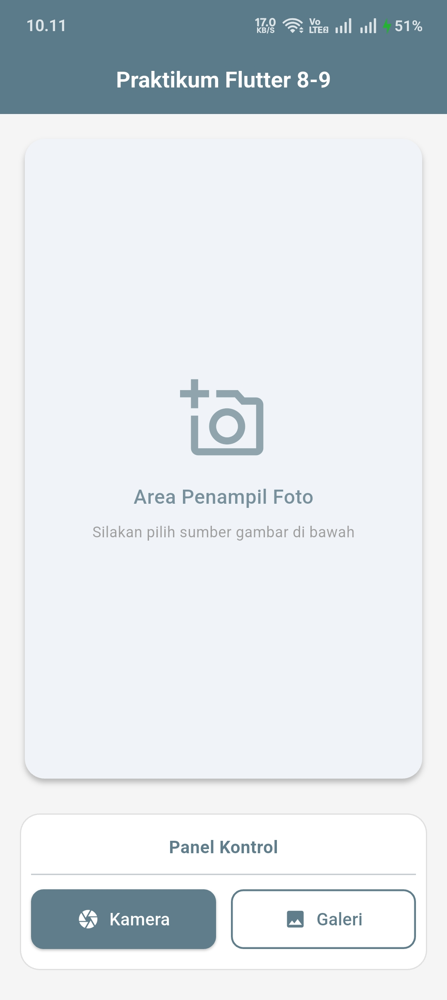
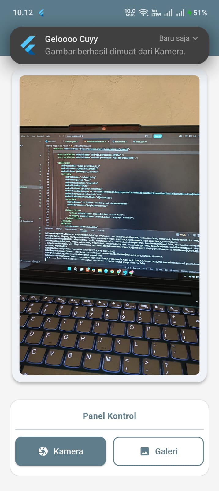
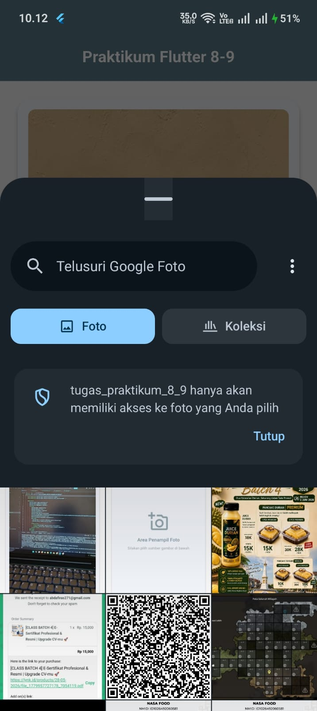
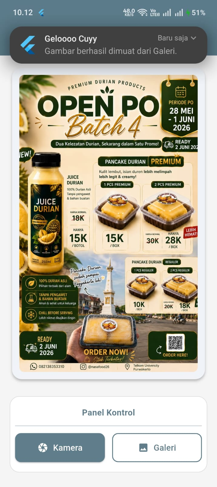

<div align="center">
  <br />

  <h1>LAPORAN PRAKTIKUM <br>
  APLIKASI BERBASIS PLATFORM
  </h1>

  <br />

  <h3>Modul 8-9 Mobile</h3>
CAMERA & NOTIFICATION APP
  <br>
  
  </h3>

  <br />

  <p align="center">

</p>

  <br />
  <br />
  <br />

  <h3>Disusun Oleh :</h3>

  <p>
    <strong>Abda Firas Rahman</strong><br>
    <strong>2311102049</strong><br>
    <strong>S1 IF-11-REG01</strong>
  </p>

  <br />

  <h3>Dosen Pengampu :</h3>

  <p>
    <strong>Dimas Fanny Hebrasianto Permadi, S.ST., M.Kom</strong>
  </p>
  
  <br />
  <br />
    <h4>Asisten Praktikum :</h4>
    <strong>Apri Pandu Wicaksono </strong> <br>
    <strong>Rangga Pradarrell Fathi</strong>
  <br />

  <h3>LABORATORIUM HIGH PERFORMANCE
 <br>FAKULTAS INFORMATIKA <br>UNIVERSITAS TELKOM PURWOKERTO <br>2026</h3>
</div>

<hr>

### Dasar Teori
## Flutter dan Konsep StatefulWidget
Flutter adalah framework buatan Google yang memungkinkan pembuatan aplikasi lintas platform lewat satu basis kode. Untuk mengakomodasi antarmuka yang bersifat dinamis—seperti layar yang harus langsung berubah setelah pengguna memotret gambar—digunakan class StatefulWidget. Perubahan data (misalnya masuknya file foto baru) akan dibungkus di dalam fungsi setState(). Fungsi ini bertugas memberi sinyal kepada sistem agar segera merender ulang (rebuild) tampilan layar dengan membawa data yang paling baru.

## Manajemen Perizinan (Android Manifest)
Sebelum aplikasi dapat mengendalikan perangkat keras bawaan ponsel, sistem operasi Android mewajibkan adanya deklarasi perizinan resmi di dalam file AndroidManifest.xml. Pada aplikasi ini, dibutuhkan setidaknya dua izin utama: android.permission.CAMERA agar sistem memperbolehkan aplikasi membuka lensa kamera, serta android.permission.POST_NOTIFICATIONS. Izin notifikasi ini diwajibkan oleh Android 13 ke atas agar spanduk peringatan (pop-up) tidak diblokir oleh sistem keamanan ponsel.

## Image Picker dan Penanganan File
Karena Flutter tidak memiliki fitur bawaan untuk mengakses kamera, digunakan package pihak ketiga bernama image_picker. Package ini menyediakan perintah sederhana untuk membuka kamera instan (ImageSource.camera) maupun ruang galeri (ImageSource.gallery). Berkas foto yang dipilih akan dikembalikan dalam format objek File (dari library dart:io). Berkas inilah yang kemudian disisipkan ke dalam widget Image.file untuk ditampilkan ke layar, lalu dipercantik menggunakan Card untuk efek bayangan dan ClipRRect agar sudut gambarnya melengkung.

## Sistem Notifikasi Lokal
Untuk memberikan konfirmasi visual bahwa pengambilan gambar telah berhasil, aplikasi mengimplementasikan package flutter_local_notifications. Berbeda dengan push notification yang membutuhkan server dan koneksi internet, notifikasi lokal ini dieksekusi secara mandiri oleh sistem internal ponsel. Setelah saluran notifikasinya didaftarkan, aplikasi bisa langsung memicu munculnya pesan peringatan di bilah atas layar (status bar) tepat setelah proses pemuatan foto selesai dilakukan.

## TAMPILAN NYA
## Tampilan Home


## Tampilan Kamera


## Tampilan Galery



### SOURCE CODE
### AndroidManifest.xml
```xml
<manifest xmlns:android="http://schemas.android.com/apk/res/android">

    <uses-permission android:name="android.permission.CAMERA" />
    <uses-permission android:name="android.permission.POST_NOTIFICATIONS" />

    <application
        android:label="tugas_praktikum_8_9"
        android:name="${applicationName}"
        android:icon="@mipmap/ic_launcher">
        <activity
            android:name=".MainActivity"
            android:exported="true"
            android:launchMode="singleTop"
            android:taskAffinity=""
            android:theme="@style/LaunchTheme"
            android:configChanges="orientation|keyboardHidden|keyboard|screenSize|smallestScreenSize|locale|layoutDirection|fontScale|screenLayout|density|uiMode"
            android:hardwareAccelerated="true"
            android:windowSoftInputMode="adjustResize">
            <meta-data
              android:name="io.flutter.embedding.android.NormalTheme"
              android:resource="@style/NormalTheme"
              />
            <intent-filter>
                <action android:name="android.intent.action.MAIN"/>
                <category android:name="android.intent.category.LAUNCHER"/>
            </intent-filter>
        </activity>
        <meta-data
            android:name="flutterEmbedding"
            android:value="2" />
    </application>
    <queries>
        <intent>
            <action android:name="android.intent.action.PROCESS_TEXT"/>
            <data android:mimeType="text/plain"/>
        </intent>
    </queries>
</manifest>
```
file AndroidManifest.xml berfungsi sebagai dokumen perizinan resmi antara aplikasi yang kita bangun dengan sistem operasi Android pada perangkat (native). Walaupun logika kode di main.dart sudah ditulis dengan sempurna, fitur-fitur perangkat keras tidak akan bisa berjalan jika tidak didaftarkan di dalam manifest ini. Oleh karena itu, kita wajib menambahkan tag `<uses-permission>` agar sistem keamanan HP tidak mencekal aplikasi. Izin pertama yang dideklarasikan adalah android.permission.CAMERA, yang memberikan hak akses penuh agar aplikasi bisa membuka lensa dan menangkap gambar secara langsung. Selain itu, terdapat izin android.permission.POST_NOTIFICATIONS yang sangat esensial untuk perangkat Android versi 13 ke atas. Tanpa adanya baris perizinan ini, sistem keamanan bawaan HP akan secara otomatis membungkam atau memblokir notifikasi lokal yang dikirimkan oleh aplikasi, sehingga pop-up keberhasilan tidak akan pernah muncul di layar pengguna.

### Main.dart
```dart
import 'dart:io';
import 'package:flutter/material.dart';
import 'package:image_picker/image_picker.dart';
import 'package:flutter_local_notifications/flutter_local_notifications.dart';

void main() async {
  WidgetsFlutterBinding.ensureInitialized();
  runApp(const MyApp());
}

class MyApp extends StatelessWidget {
  const MyApp({super.key});

  @override
  Widget build(BuildContext context) {
    return MaterialApp(
      debugShowCheckedModeBanner: false,
      title: 'Tugas Praktikum',
      theme: ThemeData(
        useMaterial3: true,
        colorScheme: ColorScheme.fromSeed(seedColor: Colors.blueGrey),
        appBarTheme: const AppBarTheme(
          backgroundColor: Colors.blueGrey,
          foregroundColor: Colors.white,
          centerTitle: true,
          elevation: 2,
        ),
      ),
      home: const HomeScreen(),
    );
  }
}

class HomeScreen extends StatefulWidget {
  const HomeScreen({super.key});

  @override
  State<HomeScreen> createState() => _HomeScreenState();
}

class _HomeScreenState extends State<HomeScreen> {
  File? _image;
  final ImagePicker _picker = ImagePicker();
  late FlutterLocalNotificationsPlugin flutterLocalNotificationsPlugin;

  @override
  void initState() {
    super.initState();
    _initializeNotifications();
  }

  void _initializeNotifications() {
    flutterLocalNotificationsPlugin = FlutterLocalNotificationsPlugin();
    
    const AndroidInitializationSettings initializationSettingsAndroid =
        AndroidInitializationSettings('@mipmap/ic_launcher');
        
    const InitializationSettings initializationSettings =
        InitializationSettings(android: initializationSettingsAndroid);
        
    flutterLocalNotificationsPlugin.initialize(initializationSettings);
  }

  Future<void> _showNotification(String source) async {
    const AndroidNotificationDetails androidPlatformChannelSpecifics =
        AndroidNotificationDetails(
      'praktikum_channel',
      'Notifikasi Praktikum',
      channelDescription: 'Notifikasi untuk hasil pengambilan gambar',
      importance: Importance.max,
      priority: Priority.high,
    );
    const NotificationDetails platformChannelSpecifics =
        NotificationDetails(android: androidPlatformChannelSpecifics);
        
    await flutterLocalNotificationsPlugin.show(
      0,
      'Geloooo Cuyy',
      'Gambar berhasil dimuat dari $source.',
      platformChannelSpecifics,
    );
  }

  Future<void> _getImage(ImageSource source) async {
    final XFile? pickedFile = await _picker.pickImage(source: source);

    if (pickedFile != null) {
      setState(() {
        _image = File(pickedFile.path);
      });
      
      String sourceName = source == ImageSource.camera ? 'Kamera' : 'Galeri';
      _showNotification(sourceName);
    }
  }

  @override
  Widget build(BuildContext context) {
    return Scaffold(
      backgroundColor: Colors.grey[100], 
      appBar: AppBar(
        title: const Text(
          'Praktikum Flutter 8-9',
          style: TextStyle(fontWeight: FontWeight.bold, fontSize: 18),
        ),
      ),
      body: Padding(
        padding: const EdgeInsets.all(16.0),
        child: Column(
          children: [
            // --- KARTU PENAMPIL FOTO ---
            Expanded(
              child: Card(
                elevation: 3,
                shape: RoundedRectangleBorder(
                  borderRadius: BorderRadius.circular(16),
                ),
                child: Container(
                  width: double.infinity,
                  padding: const EdgeInsets.all(12),
                  child: _image != null
                      ? ClipRRect(
                          borderRadius: BorderRadius.circular(8),
                          child: Image.file(_image!, fit: BoxFit.cover),
                        )
                      : Column(
                          mainAxisAlignment: MainAxisAlignment.center,
                          children: [
                            Icon(Icons.add_a_photo_outlined, 
                                size: 70, color: Colors.blueGrey.shade300),
                            const SizedBox(height: 16),
                            Text(
                              'Area Penampil Foto',
                              style: TextStyle(
                                  fontSize: 16, 
                                  color: Colors.blueGrey.shade400,
                                  fontWeight: FontWeight.w500),
                            ),
                            const SizedBox(height: 8),
                            Text(
                              'Silakan pilih sumber gambar di bawah',
                              style: TextStyle(fontSize: 12, color: Colors.grey.shade500),
                            ),
                          ],
                        ),
                ),
              ),
            ),
            
            const SizedBox(height: 24),
            
            // --- PANEL TOMBOL (Kiri & Kanan) ---
            Container(
              padding: const EdgeInsets.symmetric(vertical: 16, horizontal: 8),
              decoration: BoxDecoration(
                color: Colors.white,
                borderRadius: BorderRadius.circular(16),
                border: Border.all(color: Colors.grey.shade300),
              ),
              child: Column(
                children: [
                  const Text(
                    'Panel Kontrol',
                    style: TextStyle(fontWeight: FontWeight.bold, color: Colors.blueGrey),
                  ),
                  const Divider(height: 24),
                  Row(
                    children: [
                      // Tombol Kamera
                      Expanded(
                        child: ElevatedButton.icon(
                          onPressed: () => _getImage(ImageSource.camera),
                          icon: const Icon(Icons.camera),
                          label: const Text('Kamera'),
                          style: ElevatedButton.styleFrom(
                            backgroundColor: Colors.blueGrey,
                            foregroundColor: Colors.white,
                            padding: const EdgeInsets.symmetric(vertical: 14),
                            shape: RoundedRectangleBorder(
                              borderRadius: BorderRadius.circular(10),
                            ),
                          ),
                        ),
                      ),
                      const SizedBox(width: 12), // Jarak antar tombol
                      // Tombol Galeri
                      Expanded(
                        child: OutlinedButton.icon(
                          onPressed: () => _getImage(ImageSource.gallery),
                          icon: const Icon(Icons.image),
                          label: const Text('Galeri'),
                          style: OutlinedButton.styleFrom(
                            foregroundColor: Colors.blueGrey,
                            side: const BorderSide(color: Colors.blueGrey, width: 1.5),
                            padding: const EdgeInsets.symmetric(vertical: 14),
                            shape: RoundedRectangleBorder(
                              borderRadius: BorderRadius.circular(10),
                            ),
                          ),
                        ),
                      ),
                    ],
                  ),
                ],
              ),
            ),
            const SizedBox(height: 8),
          ],
        ),
      ),
    );
  }
}
```
### Penjelasan tiap widget
## MaterialApp
Berfungsi sebagai komponen paling luar (root) dari aplikasi untuk mengatur tema warna global dan struktur dasar antarmuka berbasis Material Design.

## Scaffold
Menyediakan kerangka dasar halaman visual aplikasi, yang memungkinkan penambahan elemen seperti bilah navigasi (AppBar) di bagian atas dan area konten utama di bagian body.

## AppBar
Berfungsi untuk menampilkan bilah navigasi di bagian paling atas layar yang berisi teks judul halaman aplikasi.

## Padding
Digunakan untuk memberikan jarak (spasi dalam) antara konten dengan tepi layar agar antarmuka tidak terlihat menempel pada batas pinggir perangkat.

## Column
Merupakan widget layout yang berfungsi untuk menyusun elemen-elemen atau widget di dalamnya secara vertikal dari atas ke bawah.

## Expanded
Digunakan untuk membuat widget di dalamnya menyesuaikan ukuran secara otomatis agar dapat mengisi sisa ruang kosong yang tersedia pada layar.

## Card
Memberikan efek visual berupa kotak dengan bayangan (elevasi) sehingga elemen di dalamnya, seperti area penampil foto, memiliki kedalaman dan terlihat lebih menonjol.

## ClipRRect
Berfungsi untuk memotong sudut-sudut gambar agar menjadi melengkung (rounded corners), sehingga gambar dapat menyesuaikan dengan bentuk pinggiran widget Card.

## Image.file
Digunakan untuk memuat dan menampilkan objek gambar yang jalurnya ditarik langsung dari direktori penyimpanan lokal perangkat (baik dari hasil kamera maupun galeri).

## Container
Berfungsi sebagai wadah pembungkus elemen lain, yang memungkinkan pengembang untuk mengatur gaya spesifik seperti warna latar belakang, garis batas (border), dan jarak.

## Row
Merupakan widget layout yang digunakan untuk menyusun beberapa elemen, seperti tombol aksi, secara horizontal atau bersebelahan dari kiri ke kanan.

## ElevatedButton.icon
Merupakan elemen tombol interaktif menonjol yang dilengkapi dengan parameter ikon, sehingga pengguna dapat melihat simbol visual beserta teks aksi Kamera secara bersamaan.

## OutlinedButton.icon
Merupakan elemen tombol interaktif dengan garis tepi yang dilengkapi dengan parameter ikon sehingga pengguna dapat melihat simbol visual beserta teks aksi Galeri secara bersamaan.