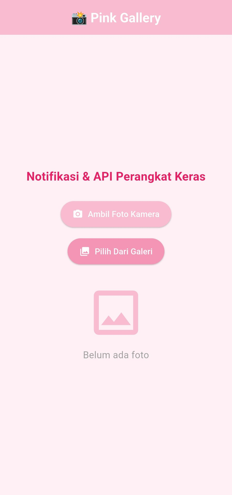
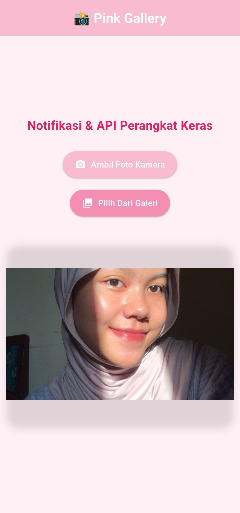
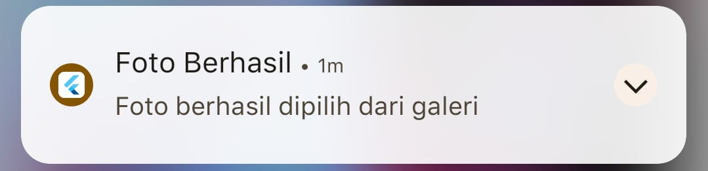

<div align="center">
  <br />

  <h1>
    LAPORAN PRAKTIKUM <br>
    APLIKASI BERBASIS PLATFORM
  </h1>

  <br />

  <h3>Modul 8 9 Mobile</h3>
  <h3>Notifikasi dan API Perangkat Keras pada Flutter</h3>

  <br />

  <p align="center">
    
  </p>

  <br />
  <br />
  <br />

  <h3>Disusun Oleh :</h3>

  <p>
    <strong>Nia Novela Ariandini</strong><br>
    <strong>2311102057</strong><br>
    <strong>S1 IF-11-01</strong>
  </p>

  <br />

  <h3>Dosen Pengampu :</h3>

  <p>
    <strong>Dimas Fanny Hebrasianto Permadi, S.ST., M.Kom</strong>
  </p>

  <br />
  <br />

  <h4>Asisten Praktikum :</h4>

  <strong>Apri Pandu Wicaksono</strong><br>
  <strong>Rangga Pradarrell Fathi</strong>

  <br />
  <br />

  <h3>
    LABORATORIUM HIGH PERFORMANCE
    <br>FAKULTAS INFORMATIKA
    <br>UNIVERSITAS TELKOM PURWOKERTO
    <br>2026
  </h3>
</div>

<hr>

# 1. Dasar Teori

### Flutter
Flutter adalah framework pengembangan aplikasi yang bersifat open-source dan dikembangkan oleh Google. Framework ini memungkinkan pengembang untuk membuat aplikasi pada berbagai platform, seperti Android, iOS, web, dan desktop, dengan menggunakan satu basis kode yang ditulis dalam bahasa pemrograman Dart.

### Image Picker
Image Picker merupakan package pada Flutter yang digunakan untuk mengakses media pada perangkat. Package ini memungkinkan aplikasi mengambil gambar secara langsung melalui kamera maupun memilih gambar yang telah tersimpan di galeri perangkat.

### Local Notification
Local Notification adalah fitur yang digunakan untuk menampilkan pemberitahuan secara langsung pada perangkat pengguna tanpa memerlukan koneksi ke server eksternal. Notifikasi ini dijalankan dan dikelola oleh aplikasi yang terpasang pada perangkat.

### API Perangkat Keras
API Perangkat Keras merupakan antarmuka yang memungkinkan aplikasi berinteraksi dengan komponen fisik yang terdapat pada perangkat. Melalui API ini, aplikasi dapat memanfaatkan berbagai fitur perangkat seperti kamera, penyimpanan, GPS, sensor, dan mikrofon sesuai kebutuhan aplikasi.

---

# 2. Source Code

```dart
import 'dart:io';

import 'package:flutter/material.dart';
import 'package:image_picker/image_picker.dart';
import 'package:flutter_local_notifications/flutter_local_notifications.dart';

final FlutterLocalNotificationsPlugin notificationsPlugin =
    FlutterLocalNotificationsPlugin();

void main() async {
  WidgetsFlutterBinding.ensureInitialized();

  const AndroidInitializationSettings androidSettings =
      AndroidInitializationSettings('@mipmap/ic_launcher');

  const InitializationSettings settings =
      InitializationSettings(android: androidSettings);

  await notificationsPlugin.initialize(settings);

  runApp(const MyApp());
}

class MyApp extends StatelessWidget {
  const MyApp({super.key});

  @override
  Widget build(BuildContext context) {
    return MaterialApp(
      debugShowCheckedModeBanner: false,
      title: 'Modul 8-9',
      theme: ThemeData(
        colorScheme: ColorScheme.fromSeed(
          seedColor: const Color(0xFFF8BBD0),
        ),
        scaffoldBackgroundColor: const Color(0xFFFFF0F5),
        useMaterial3: true,
      ),
      home: const HomePage(),
    );
  }
}

class HomePage extends StatefulWidget {
  const HomePage({super.key});

  @override
  State<HomePage> createState() => _HomePageState();
}

class _HomePageState extends State<HomePage> {
  File? imageFile;

  final ImagePicker picker = ImagePicker();

  Future<void> showNotification(String message) async {
    const AndroidNotificationDetails androidDetails =
        AndroidNotificationDetails(
      'foto_channel',
      'Foto Notification',
      importance: Importance.max,
      priority: Priority.high,
    );

    const NotificationDetails details =
        NotificationDetails(android: androidDetails);

    await notificationsPlugin.show(
      0,
      'Foto Berhasil',
      message,
      details,
    );
  }

  Future<void> openCamera() async {
    final XFile? photo =
        await picker.pickImage(source: ImageSource.camera);

    if (photo != null) {
      setState(() {
        imageFile = File(photo.path);
      });

      showNotification(
        'Foto berhasil diambil menggunakan kamera',
      );
    }
  }

  Future<void> openGallery() async {
    final XFile? photo =
        await picker.pickImage(source: ImageSource.gallery);

    if (photo != null) {
      setState(() {
        imageFile = File(photo.path);
      });

      showNotification(
        'Foto berhasil dipilih dari galeri',
      );
    }
  }

  @override
  Widget build(BuildContext context) {
    return Scaffold(
      appBar: AppBar(
        backgroundColor: const Color(0xFFF8BBD0),
        foregroundColor: Colors.white,
        centerTitle: true,
        title: const Text(
          "📸 Pink Gallery",
          style: TextStyle(
            fontWeight: FontWeight.bold,
          ),
        ),
      ),
      body: Center(
        child: SingleChildScrollView(
          child: Column(
            mainAxisAlignment: MainAxisAlignment.center,
            children: [
              const Text(
                "Notifikasi & API Perangkat Keras",
                style: TextStyle(
                  fontSize: 20,
                  fontWeight: FontWeight.bold,
                  color: Color(0xFFE91E63),
                ),
              ),

              const SizedBox(height: 25),

              ElevatedButton.icon(
                onPressed: openCamera,
                icon: const Icon(Icons.camera_alt),
                label: const Text("Ambil Foto Kamera"),
                style: ElevatedButton.styleFrom(
                  backgroundColor: const Color(0xFFF8BBD0),
                  foregroundColor: Colors.white,
                  padding: const EdgeInsets.symmetric(
                    horizontal: 20,
                    vertical: 12,
                  ),
                ),
              ),

              const SizedBox(height: 15),

              ElevatedButton.icon(
                onPressed: openGallery,
                icon: const Icon(Icons.photo_library),
                label: const Text("Pilih Dari Galeri"),
                style: ElevatedButton.styleFrom(
                  backgroundColor: const Color(0xFFF48FB1),
                  foregroundColor: Colors.white,
                  padding: const EdgeInsets.symmetric(
                    horizontal: 20,
                    vertical: 12,
                  ),
                ),
              ),

              const SizedBox(height: 30),

              imageFile != null
                  ? Container(
                      margin: const EdgeInsets.all(10),
                      decoration: BoxDecoration(
                        borderRadius: BorderRadius.circular(20),
                        boxShadow: const [
                          BoxShadow(
                            blurRadius: 10,
                            offset: Offset(0, 5),
                            color: Colors.black12,
                          ),
                        ],
                      ),
                      child: ClipRRect(
                        borderRadius: BorderRadius.circular(20),
                        child: Image.file(
                          imageFile!,
                          height: 300,
                        ),
                      ),
                    )
                  : const Column(
                      children: [
                        Icon(
                          Icons.image_outlined,
                          size: 100,
                          color: Color(0xFFF8BBD0),
                        ),
                        SizedBox(height: 10),
                        Text(
                          "Belum ada foto",
                          style: TextStyle(
                            fontSize: 16,
                            color: Colors.grey,
                          ),
                        ),
                      ],
                    ),
            ],
          ),
        ),
      ),
    );
  }
}
```

---

# 3. Penjelasan Singkat Tiap Widget

### MaterialApp
MaterialApp merupakan widget utama yang berfungsi sebagai fondasi aplikasi Flutter. Widget ini digunakan untuk mengatur konfigurasi aplikasi, seperti tema, navigasi, dan halaman awal yang akan ditampilkan.

### Scaffold
Scaffold adalah widget yang menyediakan struktur dasar tampilan aplikasi. Widget ini berperan sebagai wadah utama yang menampung komponen seperti AppBar, Body, Floating Action Button, dan elemen antarmuka lainnya.

### AppBar
AppBar digunakan untuk menampilkan bagian header pada aplikasi. Komponen ini umumnya berisi judul halaman, ikon navigasi, maupun tombol aksi yang membantu pengguna dalam berinteraksi dengan aplikasi.

### ElevatedButton
ElevatedButton merupakan widget tombol yang dapat menerima interaksi dari pengguna. Pada aplikasi ini, widget tersebut digunakan untuk menjalankan fungsi membuka kamera dan memilih gambar dari galeri.

### Column
Column adalah widget tata letak yang digunakan untuk menyusun beberapa widget secara vertikal dari atas ke bawah dalam satu kolom.

### SizedBox
SizedBox digunakan untuk memberikan ruang kosong atau jarak antar widget sehingga tampilan aplikasi menjadi lebih rapi dan mudah dibaca.

### Image.file
Image.file merupakan widget yang digunakan untuk menampilkan gambar yang berasal dari file lokal pada perangkat, seperti hasil foto dari kamera atau gambar yang dipilih dari galeri.

### StatefulWidget
StatefulWidget adalah jenis widget yang dapat mengalami perubahan tampilan secara dinamis sesuai dengan perubahan data atau state yang terjadi selama aplikasi berjalan.

---

# 5. Hasil Praktikum

### 1. Halaman awal aplikasi


### 2. Foto berhasil ditampilkan


### 3. Notifikasi berhasil muncul


---

# 6. Kesimpulan

Berdasarkan praktikum yang telah dilakukan, aplikasi Flutter berhasil memanfaatkan fitur perangkat keras berupa kamera dan galeri untuk mengambil serta memilih gambar. Selain itu, aplikasi juga mampu menampilkan notifikasi lokal sebagai umpan balik kepada pengguna setelah proses pengambilan atau pemilihan gambar berhasil dilakukan. Melalui praktikum ini dapat dipahami bahwa Flutter menyediakan dukungan yang baik dalam mengakses berbagai fitur perangkat melalui package tambahan, sehingga memudahkan pengembangan aplikasi yang interaktif dan fungsional.