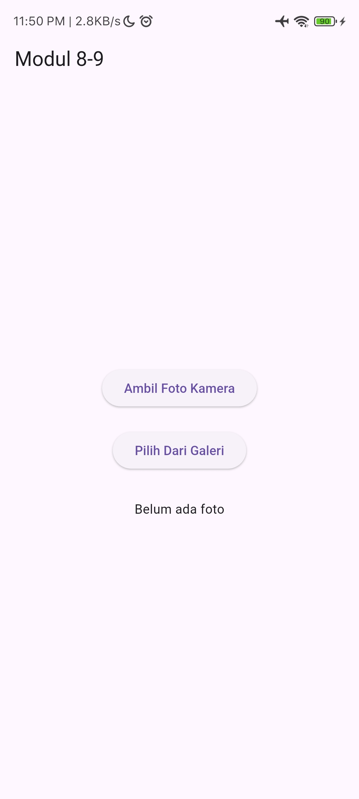
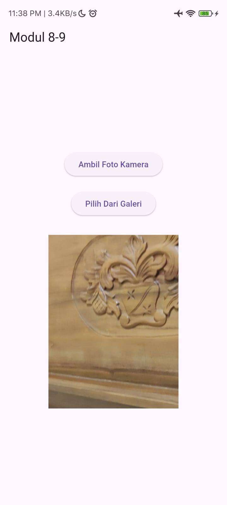
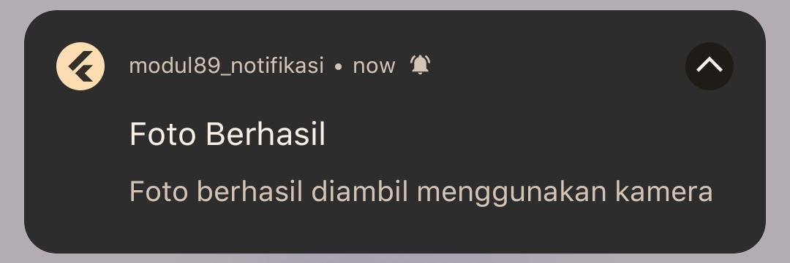

<div align="center">
  <br />

  <h1>
    LAPORAN PRAKTIKUM <br>
    APLIKASI BERBASIS PLATFORM
  </h1>

  <br />

  <h3>Modul 8 9 Mobile</h3>
  <h3>Notifikasi dan API Perangkat Keras pada Flutter</h3>

  <br />

  <p align="center">
    
  </p>

  <br />
  <br />
  <br />

  <h3>Disusun Oleh :</h3>

  <p>
    <strong>Muhammad Hamzah Haifan Ma'ruf</strong><br>
    <strong>2311102091</strong><br>
    <strong>S1 IF-11-01</strong>
  </p>

  <br />

  <h3>Dosen Pengampu :</h3>

  <p>
    <strong>Dimas Fanny Hebrasianto Permadi, S.ST., M.Kom</strong>
  </p>

  <br />
  <br />

  <h4>Asisten Praktikum :</h4>

  <strong>Apri Pandu Wicaksono</strong><br>
  <strong>Rangga Pradarrell Fathi</strong>

  <br />
  <br />

  <h3>
    LABORATORIUM HIGH PERFORMANCE
    <br>FAKULTAS INFORMATIKA
    <br>UNIVERSITAS TELKOM PURWOKERTO
    <br>2026
  </h3>
</div>

<hr>

# 1. Dasar Teori

### Flutter
Flutter merupakan framework open-source yang dikembangkan oleh Google untuk membangun aplikasi multiplatform menggunakan bahasa Dart.

### Image Picker
Image Picker digunakan untuk mengakses kamera maupun galeri perangkat sehingga pengguna dapat mengambil atau memilih gambar.

### Local Notification
Local Notification merupakan notifikasi yang ditampilkan oleh aplikasi secara lokal tanpa memerlukan server eksternal.

### API Perangkat Keras
API perangkat keras memungkinkan aplikasi mengakses fitur perangkat seperti kamera, galeri, GPS, sensor, dan mikrofon.

---

# 2. Source Code

```dart
import 'dart:io';

import 'package:flutter/material.dart';
import 'package:image_picker/image_picker.dart';
import 'package:flutter_local_notifications/flutter_local_notifications.dart';

final FlutterLocalNotificationsPlugin notificationsPlugin =
    FlutterLocalNotificationsPlugin();

void main() async {
  WidgetsFlutterBinding.ensureInitialized();

  const AndroidInitializationSettings androidSettings =
      AndroidInitializationSettings('@mipmap/ic_launcher');

  const InitializationSettings settings =
      InitializationSettings(android: androidSettings);

  await notificationsPlugin.initialize(settings);

  runApp(const MyApp());
}

class MyApp extends StatelessWidget {
  const MyApp({super.key});

  @override
  Widget build(BuildContext context) {
    return MaterialApp(
      debugShowCheckedModeBanner: false,
      title: 'Modul 8-9',
      home: HomePage(),
    );
  }
}

class HomePage extends StatefulWidget {
  const HomePage({super.key});

  @override
  State<HomePage> createState() => _HomePageState();
}

class _HomePageState extends State<HomePage> {

  File? imageFile;

  final ImagePicker picker = ImagePicker();

  Future<void> showNotification(String message) async {

    const AndroidNotificationDetails androidDetails =
        AndroidNotificationDetails(
      'foto_channel',
      'Foto Notification',
      importance: Importance.max,
      priority: Priority.high,
    );

    const NotificationDetails details =
        NotificationDetails(android: androidDetails);

    await notificationsPlugin.show(
      0,
      'Foto Berhasil',
      message,
      details,
    );
  }

  Future<void> openCamera() async {

    final XFile? photo =
        await picker.pickImage(source: ImageSource.camera);

    if (photo != null) {

      setState(() {
        imageFile = File(photo.path);
      });

      showNotification(
          'Foto berhasil diambil menggunakan kamera');
    }
  }

  Future<void> openGallery() async {

    final XFile? photo =
        await picker.pickImage(source: ImageSource.gallery);

    if (photo != null) {

      setState(() {
        imageFile = File(photo.path);
      });

      showNotification(
          'Foto berhasil dipilih dari galeri');
    }
  }

  @override
  Widget build(BuildContext context) {

    return Scaffold(
      appBar: AppBar(
        title: const Text("Modul 8-9"),
      ),

      body: Center(
        child: SingleChildScrollView(
          child: Column(

            mainAxisAlignment:
                MainAxisAlignment.center,

            children: [

              ElevatedButton(
                onPressed: openCamera,
                child: const Text(
                  "Ambil Foto Kamera",
                ),
              ),

              const SizedBox(height: 20),

              ElevatedButton(
                onPressed: openGallery,
                child: const Text(
                  "Pilih Dari Galeri",
                ),
              ),

              const SizedBox(height: 30),

              imageFile != null
                  ? Image.file(
                      imageFile!,
                      height: 300,
                    )
                  : const Text(
                      "Belum ada foto",
                    ),
            ],
          ),
        ),
      ),
    );
  }
}
```

---

# 3. Penjelasan Singkat Tiap Widget

### MaterialApp
Widget utama aplikasi Flutter.

### Scaffold
Kerangka dasar halaman aplikasi.

### AppBar
Menampilkan judul aplikasi.

### ElevatedButton
Tombol yang digunakan untuk membuka kamera dan galeri.

### Column
Menyusun widget secara vertikal.

### SizedBox
Memberikan jarak antar widget.

### Image.file
Menampilkan gambar dari penyimpanan perangkat.

### StatefulWidget
Mengelola perubahan state ketika gambar berhasil dipilih.

---

# 5. Hasil Praktikum

### 1. Halaman awal aplikasi


### 2. Foto berhasil ditampilkan


### 3. Notifikasi berhasil muncul


---

# 6. Kesimpulan

Aplikasi berhasil mengimplementasikan fitur pengambilan foto menggunakan kamera, pemilihan gambar dari galeri, menampilkan hasil gambar pada layar, serta menampilkan notifikasi lokal setelah gambar berhasil dipilih atau diambil. Dengan demikian seluruh tujuan praktikum telah tercapai.
