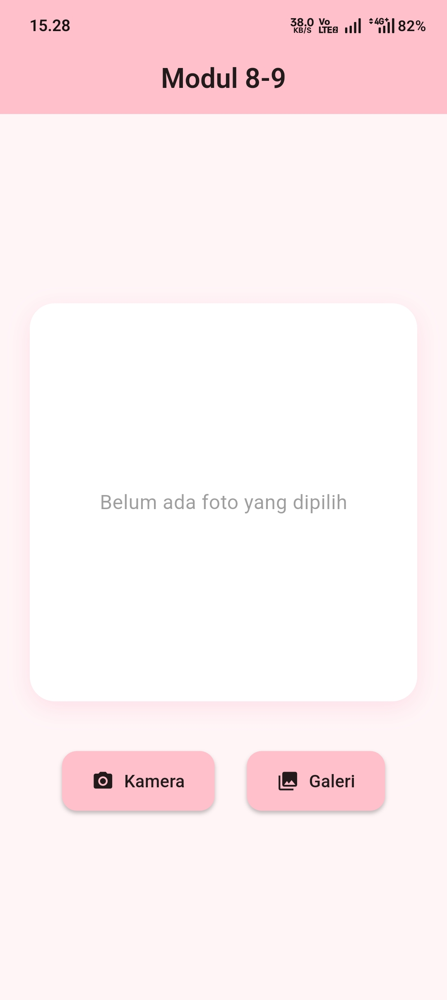
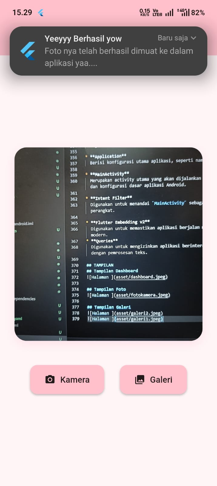
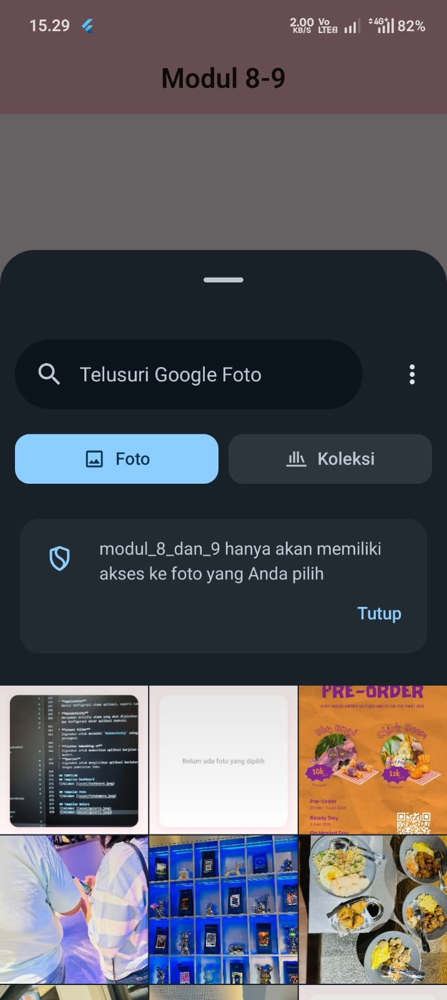
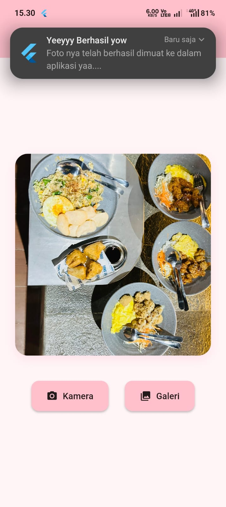

<div align="center">
  <br />

  <h1>LAPORAN PRAKTIKUM <br>
  APLIKASI BERBASIS PLATFORM
  </h1>

  <br />

  <h3>Modul 8-9 Mobile</h3>
CAMERA & NOTIFICATION APP
  <br>
  
  </h3>

  <br />

  <p align="center">

</p>

  <br />
  <br />
  <br />

  <h3>Disusun Oleh :</h3>

  <p>
    <strong>Aisyah Anis Mazaya</strong><br>
    <strong>2311102095</strong><br>
    <strong>S1 IF-11-REG01</strong>
  </p>

  <br />

  <h3>Dosen Pengampu :</h3>

  <p>
    <strong>Dimas Fanny Hebrasianto Permadi, S.ST., M.Kom</strong>
  </p>
  
  <br />
  <br />
    <h4>Asisten Praktikum :</h4>
    <strong>Apri Pandu Wicaksono </strong> <br>
    <strong>Rangga Pradarrell Fathi</strong>
  <br />

  <h3>LABORATORIUM HIGH PERFORMANCE
 <br>FAKULTAS INFORMATIKA <br>UNIVERSITAS TELKOM PURWOKERTO <br>2026</h3>
</div>

<hr>

### Dasar Teori
## 1. Akses Perangkat Keras pada Flutter
Fltter merupakan framework pengembangan aplikasi yang menggunakan bahasa pemrograman Dart. Meskipun Flutter memiliki sistem rendering sendiri untuk menampilkan antarmuka pengguna (UI), aplikasi yang dibuat sering kali membutuhkan akses ke fitur perangkat keras pada smartphone, seperti kamera, galeri, maupun sistem notifikasi. Untuk mengakses fitur-fitur tersebut, Flutter memanfaatkan plugin sebagai penghubung antara kode Dart dengan API native Android dan iOS. Dengan adanya plugin, pengembang dapat menggunakan berbagai fitur perangkat tanpa harus menulis kode native secara langsung.

## 2. Pengelolaan Media Menggunakan Image Picker
pengambilan gambar dilakukan menggunakan package *image_picker*. Package ini memungkinkan aplikasi untuk mengakses kamera maupun galeri perangkat dengan lebih mudah. Saat pengguna memilih opsi kamera (`ImageSource.camera`), sistem akan membuka aplikasi kamera bawaan perangkat untuk mengambil foto. Sedangkan jika memilih galeri (`ImageSource.gallery`), sistem akan menampilkan daftar gambar yang tersimpan di memori perangkat.

Setelah pengguna berhasil mengambil atau memilih gambar, data gambar akan dikembalikan dalam bentuk objek `XFile`. Objek tersebut kemudian dapat dikonversi menjadi tipe data `File` sehingga gambar dapat ditampilkan atau diolah lebih lanjut di dalam aplikasi Flutter.

## 3. Flutter Local Notifications
Notifikasi merupakan salah satu fitur yang sering digunakan dalam aplikasi mobile untuk memberikan informasi kepada pengguna. Secara umum, notifikasi dibedakan menjadi dua jenis, yaitu *push notification* yang dikirim melalui server dan *local notification* yang dijalankan langsung oleh aplikasi pada perangkat.

Dalam praktikum ini digunakan package *flutter_local_notifications* untuk menampilkan notifikasi lokal. Pada perangkat Android versi 8.0 ke atas, notifikasi memerlukan *Notification Channel* sebagai media pengaturan prioritas dan tingkat kepentingan notifikasi. Pengaturan ini memungkinkan notifikasi dapat muncul secara langsung di layar sebagai *heads-up notification*. Selain itu, aplikasi juga perlu menambahkan izin seperti `POST_NOTIFICATIONS` dan `VIBRATE` pada file `AndroidManifest.xml` agar notifikasi dapat berjalan dengan baik.

## 4. Core Library Desugaring pada Android
Beberapa package Flutter modern memanfaatkan fitur-fitur Java versi terbaru yang belum sepenuhnya didukung oleh seluruh versi Android. Oleh karena itu, diperlukan fitur *core library desugaring* agar aplikasi tetap dapat berjalan pada perangkat dengan versi Android yang lebih lama.
Desugaring merupakan proses yang dilakukan saat kompilasi untuk menyesuaikan fitur Java modern agar kompatibel dengan sistem Android yang lebih lawas. Konfigurasi ini biasanya dilakukan pada file `build.gradle.kts`. Dengan mengaktifkan *core library desugaring*, proses build aplikasi dapat berjalan dengan lancar dan package yang digunakan, seperti *flutter_local_notifications*, dapat berfungsi tanpa mengalami masalah kompatibilitas.

### Widget 
* **MaterialApp** : Widget utama yang digunakan untuk mengatur tema dan halaman awal aplikasi.
* **Scaffold** : Kerangka dasar halaman yang menampung AppBar dan body.
* **AppBar** : Menampilkan judul aplikasi pada bagian atas layar.
* **Center** : Memposisikan widget agar berada di tengah layar.
* **Padding** : Memberikan jarak antar widget maupun dari tepi layar.
* **Column** : Menyusun widget secara vertikal.
* **Row** : Menyusun widget secara horizontal, digunakan untuk menampilkan tombol Kamera dan Galeri.
* **Container** : Digunakan sebagai area untuk menampilkan gambar yang dipilih.
* **BoxDecoration** : Memberikan dekorasi pada Container seperti warna latar, sudut membulat, dan bayangan.
* **ClipRRect** : Membuat sudut gambar mengikuti bentuk Container yang membulat.
* **Image.file** : Menampilkan gambar yang dipilih dari penyimpanan perangkat.
* **SizedBox** : Memberikan jarak antar widget.
* **ElevatedButton.icon** : Membuat tombol dengan ikon dan teks secara bersamaan.

### SOURCE CODE
### Main.dart
```dart
import 'dart:io';
import 'package:flutter/material.dart';
import 'package:image_picker/image_picker.dart';
import 'package:flutter_local_notifications/flutter_local_notifications.dart';

// Inisialisasi plugin notifikasi lokal
final FlutterLocalNotificationsPlugin flutterLocalNotificationsPlugin =
    FlutterLocalNotificationsPlugin();

void main() async {
  WidgetsFlutterBinding.ensureInitialized();

  // Pengaturan dasar notifikasi untuk Android
  const AndroidInitializationSettings initializationSettingsAndroid =
      AndroidInitializationSettings('@mipmap/ic_launcher');
  const InitializationSettings initializationSettings = InitializationSettings(
    android: initializationSettingsAndroid,
  );

  await flutterLocalNotificationsPlugin.initialize(initializationSettings);

  runApp(const MyApp());
}

class MyApp extends StatelessWidget {
  const MyApp({super.key});

  @override
  Widget build(BuildContext context) {
    return MaterialApp(
      title: 'Tugas Praktikum',
      debugShowCheckedModeBanner: false,
      theme: ThemeData(
        colorScheme: ColorScheme.fromSeed(seedColor: const Color(0xFFFFB6C1)),
        scaffoldBackgroundColor: const Color(0xFFFFF5F7),
        useMaterial3: true,
      ),
      home: const HomePage(),
    );
  }
}

class HomePage extends StatefulWidget {
  const HomePage({super.key});

  @override
  State<HomePage> createState() => _HomePageState();
}

class _HomePageState extends State<HomePage> {
  File? _image;
  final ImagePicker _picker = ImagePicker();

  Future<void> _getImage(ImageSource source) async {
    final XFile? pickedFile = await _picker.pickImage(source: source);

    if (pickedFile != null) {
      setState(() {
        _image = File(pickedFile.path);
      });
      _showNotification();
    }
  }

  Future<void> _showNotification() async {
    const AndroidNotificationDetails androidPlatformChannelSpecifics =
        AndroidNotificationDetails(
          'photo_channel_id',
          'Photo Notifications',
          importance: Importance.max,
          priority: Priority.high,
        );
    const NotificationDetails platformChannelSpecifics = NotificationDetails(
      android: androidPlatformChannelSpecifics,
    );

    await flutterLocalNotificationsPlugin.show(
      0,
      'Yeeyyy Berhasil yow',
      'Foto nya telah berhasil dimuat ke dalam aplikasi yaa....',
      platformChannelSpecifics,
    );
  }

  @override
  Widget build(BuildContext context) {
    return Scaffold(
      appBar: AppBar(
        title: const Text(
          'Modul 8-9',
          style: TextStyle(color: Colors.black87, fontWeight: FontWeight.w600),
        ),
        backgroundColor: const Color(0xFFFFC0CB), // Header pink
        centerTitle: true,
        elevation: 0,
      ),
      body: Center(
        child: Padding(
          padding: const EdgeInsets.all(24.0),
          child: Column(
            mainAxisAlignment: MainAxisAlignment.center,
            children: [
              // Area penampil gambar
              Container(
                height: 320,
                width: double.infinity,
                decoration: BoxDecoration(
                  color: Colors.white,
                  borderRadius: BorderRadius.circular(20),
                  boxShadow: [
                    BoxShadow(
                      color: Colors.pink.withOpacity(0.1),
                      blurRadius: 15,
                      offset: const Offset(0, 5),
                    ),
                  ],
                ),
                child: _image == null
                    ? const Center(
                        child: Text(
                          'Belum ada foto yang dipilih',
                          style: TextStyle(color: Colors.grey, fontSize: 16),
                        ),
                      )
                    : ClipRRect(
                        borderRadius: BorderRadius.circular(20),
                        child: Image.file(_image!, fit: BoxFit.cover),
                      ),
              ),
              const SizedBox(height: 40),

              // Tombol aksi
              Row(
                mainAxisAlignment: MainAxisAlignment.spaceEvenly,
                children: [
                  ElevatedButton.icon(
                    onPressed: () => _getImage(ImageSource.camera),
                    icon: const Icon(Icons.camera_alt, color: Colors.black87),
                    label: const Text(
                      'Kamera',
                      style: TextStyle(color: Colors.black87),
                    ),
                    style: ElevatedButton.styleFrom(
                      backgroundColor: const Color(0xFFFFC0CB), 
                      padding: const EdgeInsets.symmetric(
                        horizontal: 24,
                        vertical: 14,
                      ),
                      shape: RoundedRectangleBorder(
                        borderRadius: BorderRadius.circular(12),
                      ),
                      elevation: 2,
                    ),
                  ),
                  ElevatedButton.icon(
                    onPressed: () => _getImage(ImageSource.gallery),
                    icon: const Icon(
                      Icons.photo_library,
                      color: Colors.black87,
                    ),
                    label: const Text(
                      'Galeri',
                      style: TextStyle(color: Colors.black87),
                    ),
                    style: ElevatedButton.styleFrom(
                      backgroundColor: const Color(0xFFFFC0CB), 
                      padding: const EdgeInsets.symmetric(
                        horizontal: 24,
                        vertical: 14,
                      ),
                      shape: RoundedRectangleBorder(
                        borderRadius: BorderRadius.circular(12),
                      ),
                      elevation: 2,
                    ),
                  ),
                ],
              ),
            ],
          ),
        ),
      ),
    );
  }
}
```
### Penjelasan Kode Program
## Import dan Inisialisasi Awal
Program mengimpor package Flutter serta package tambahan seperti `image_picker` dan `flutter_local_notifications`. Pada fungsi `main()`, digunakan `WidgetsFlutterBinding.ensureInitialized()` untuk memastikan proses inisialisasi berjalan dengan baik sebelum aplikasi dijalankan.

## Struktur Utama Aplikasi
Class `MyApp` berfungsi sebagai root aplikasi dan menggunakan `MaterialApp` untuk mengatur tema serta halaman utama. Aplikasi menerapkan tema dengan warna soft pink dan menampilkan `HomePage` sebagai halaman awal.

## Pengelolaan State
`HomePage` dibuat menggunakan `StatefulWidget` karena terdapat data yang dapat berubah, yaitu file gambar yang dipilih pengguna. Perubahan data dikelola menggunakan `setState()` sehingga tampilan dapat diperbarui secara otomatis.

## Pengambilan Gambar
Fungsi `_getImage()` digunakan untuk mengambil gambar dari kamera maupun galeri melalui package `image_picker`. Setelah gambar berhasil dipilih, file akan disimpan ke dalam variabel `_image` dan ditampilkan pada layar.

## Notifikasi Lokal
Fungsi `_showNotification()` digunakan untuk menampilkan notifikasi lokal ketika gambar berhasil dimuat. Notifikasi dikonfigurasi menggunakan `AndroidNotificationDetails` dengan prioritas tinggi agar dapat langsung muncul pada layar perangkat.

## Antarmuka Pengguna
Antarmuka aplikasi dibangun menggunakan widget seperti `Scaffold`, `AppBar`, `Container`, `Row`, dan `ElevatedButton`. Area tengah digunakan untuk menampilkan gambar yang dipilih, sedangkan bagian bawah berisi tombol Kamera dan Galeri untuk mengambil atau memilih gambar dari perangkat.

### AndroidManifest.xml
```xml
<manifest xmlns:android="http://schemas.android.com/apk/res/android">
    <uses-permission android:name="android.permission.POST_NOTIFICATIONS" />
    <uses-permission android:name="android.permission.VIBRATE" />
    <application
        android:label="modul_8_dan_9"
        android:name="${applicationName}"
        android:icon="@mipmap/ic_launcher">
        <activity
            android:name=".MainActivity"
            android:exported="true"
            android:launchMode="singleTop"
            android:taskAffinity=""
            android:theme="@style/LaunchTheme"
            android:configChanges="orientation|keyboardHidden|keyboard|screenSize|smallestScreenSize|locale|layoutDirection|fontScale|screenLayout|density|uiMode"
            android:hardwareAccelerated="true"
            android:windowSoftInputMode="adjustResize">
            <!-- Specifies an Android theme to apply to this Activity as soon as
                 the Android process has started. This theme is visible to the user
                 while the Flutter UI initializes. After that, this theme continues
                 to determine the Window background behind the Flutter UI. -->
            <meta-data
              android:name="io.flutter.embedding.android.NormalTheme"
              android:resource="@style/NormalTheme"
              />
            <intent-filter>
                <action android:name="android.intent.action.MAIN"/>
                <category android:name="android.intent.category.LAUNCHER"/>
            </intent-filter>
        </activity>
        <!-- Don't delete the meta-data below.
             This is used by the Flutter tool to generate GeneratedPluginRegistrant.java -->
        <meta-data
            android:name="flutterEmbedding"
            android:value="2" />
    </application>
    <!-- Required to query activities that can process text, see:
         https://developer.android.com/training/package-visibility and
         https://developer.android.com/reference/android/content/Intent#ACTION_PROCESS_TEXT.

         In particular, this is used by the Flutter engine in io.flutter.plugin.text.ProcessTextPlugin. -->
    <queries>
        <intent>
            <action android:name="android.intent.action.PROCESS_TEXT"/>
            <data android:mimeType="text/plain"/>
        </intent>
    </queries>
</manifest>
```
## Penjelasan AndroidManifest.xml
Beberapa konfigurasi yang ditambahkan pada file `AndroidManifest.xml` antara lain:
* **POST_NOTIFICATIONS**
  Digunakan untuk memberikan izin kepada aplikasi agar dapat menampilkan notifikasi kepada pengguna.

* **VIBRATE**
  Digunakan untuk mengaktifkan fitur getar saat notifikasi ditampilkan.

* **Application**
  Berisi konfigurasi utama aplikasi, seperti nama aplikasi, ikon aplikasi, serta registrasi komponen yang digunakan.

* **MainActivity**
  Merupakan activity utama yang akan dijalankan saat aplikasi pertama kali dibuka. Pada bagian ini juga terdapat pengaturan tema dan konfigurasi dasar aplikasi Android.

* **Intent Filter**
  Digunakan untuk menandai `MainActivity` sebagai halaman utama aplikasi sehingga dapat dijalankan melalui ikon launcher pada perangkat.

* **Flutter Embedding v2**
  Digunakan untuk memastikan aplikasi berjalan menggunakan Flutter Embedding versi 2 yang mendukung penggunaan plugin Flutter modern.
* **Queries**
  Digunakan untuk mengizinkan aplikasi berinteraksi dengan aktivitas tertentu pada sistem Android, khususnya yang berkaitan dengan pemrosesan teks.

## TAMPILAN 
## Tampilan Dashboard


## Tampilan Foto


## Tampilan Galeri

