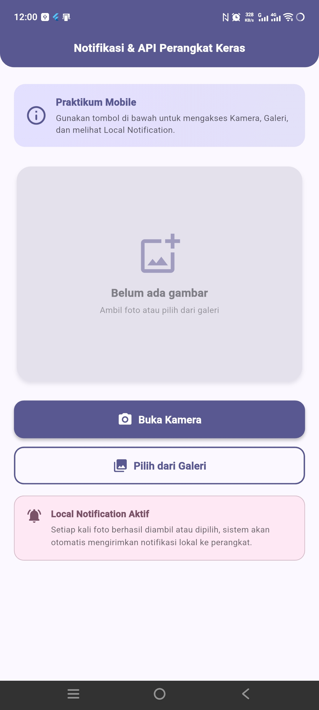
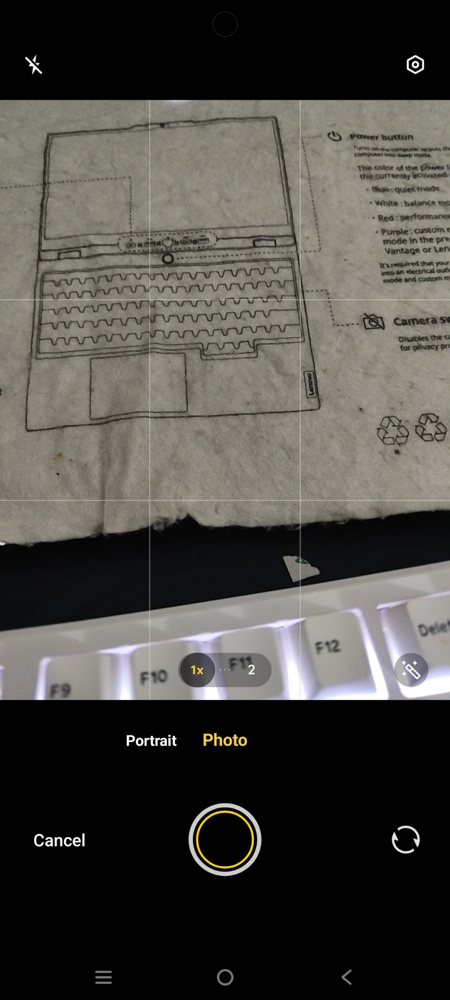
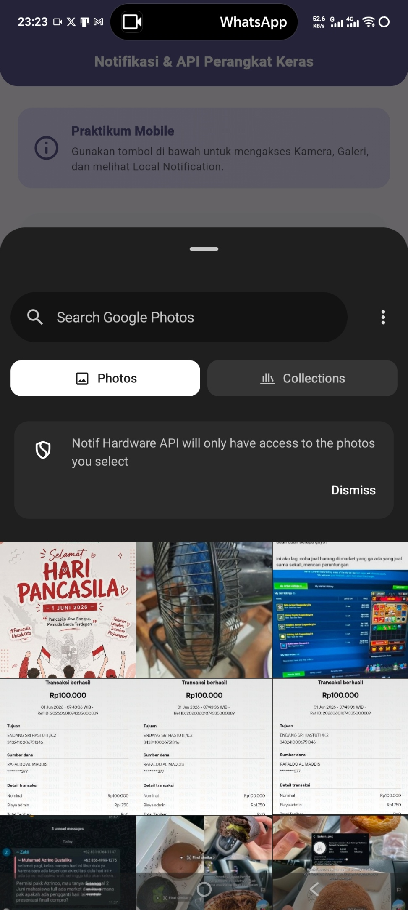
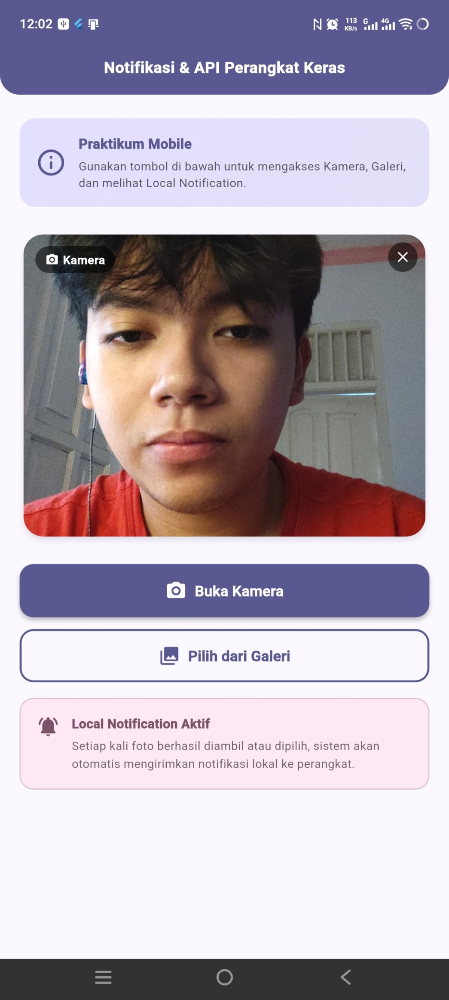
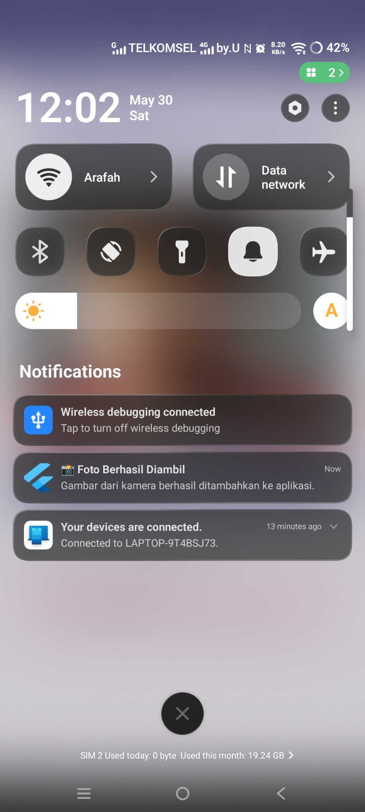

<div align="center">
  <br />
  <h1>LAPORAN PRAKTIKUM <br>APLIKASI BERBASIS PLATFORM</h1>
  <br />
  <h2>MODUL 8 & 9 FLUTTER </h2>
  <br /><br />

  

  <br /><br /><br />

  <h3>Disusun Oleh :</h3>

  <p>
    <strong>Rafaldo Al Maqdis</strong><br>
    <strong>2311102099</strong><br>
    <strong>S1 IF-11-REG 01</strong>
  </p>

  <br />

  <h3>Dosen Pengampu :</h3>

  <p>
    <strong>Dimas Fanny Hebrasianto Permadi, S.ST., M.Kom</strong>
  </p>

  <br /><br />

  <h4>Asisten Praktikum :</h4>

  <p>
    <strong>Apri Pandu Wicaksono</strong><br>
    <strong>Rangga Pradarrell Fathi</strong>
  </p>

  <br />

  <h2>
  LABORATORIUM HIGH PERFORMANCE <br>
  FAKULTAS INFORMATIKA <br>
  UNIVERSITAS TELKOM PURWOKERTO <br>
  2026
  </h2>
</div>

---


# 1. Pendahuluan

Flutter merupakan framework open-source yang dikembangkan oleh Google untuk membangun aplikasi multiplatform dengan satu basis kode. Dalam ekosistem mobile modern, aplikasi tidak hanya menampilkan data statis, tetapi juga perlu berinteraksi langsung dengan perangkat keras (hardware) dan sistem operasi. Dua kemampuan penting tersebut adalah akses terhadap perangkat keras seperti kamera dan penyimpanan, serta pengiriman notifikasi lokal kepada pengguna.

Pada praktikum ini, fokus pembahasan adalah penggunaan **Camera API**, **Gallery Picker**, dan **Local Notification** dalam aplikasi Flutter menggunakan package `image_picker`, `flutter_local_notifications`, dan `permission_handler`.

Aplikasi yang dibuat pada praktikum ini bernama **Notifikasi & API Perangkat Keras**. Aplikasi mendemonstrasikan:
1. **Kamera** — Mengambil foto langsung dari kamera perangkat Android menggunakan `image_picker`
2. **Galeri** — Memilih gambar yang sudah ada dari galeri foto perangkat
3. **Local Notification** — Mengirimkan notifikasi lokal secara otomatis setiap kali gambar berhasil diambil atau dipilih

Aplikasi menggunakan Material Design 3, null safety, StatefulWidget, serta error handling yang sederhana dan mudah dipahami untuk keperluan praktikum.

---

# 2. Dasar Teori

## 2.1 Flutter dan Null Safety

Flutter adalah framework UI open-source berbasis Dart untuk membangun aplikasi Android, iOS, web, dan desktop dari satu basis kode. Sejak Dart 2.12, Flutter mendukung **null safety** secara penuh, yang berarti variabel tidak dapat bernilai `null` kecuali secara eksplisit dideklarasikan dengan tanda `?`.

```dart
String nama = 'Flutter';   // Tidak boleh null
String? opsional = null;   // Boleh null
File? _imageFile;          // File gambar bersifat nullable (belum tentu ada)
```

## 2.2 image_picker

`image_picker` adalah package resmi Flutter yang menyediakan antarmuka untuk mengakses kamera dan galeri foto pada perangkat Android dan iOS. Package ini menggunakan **Android Intent** untuk meluncurkan aplikasi kamera atau galeri bawaan perangkat.

```dart
final ImagePicker _picker = ImagePicker();

// Mengambil foto dari kamera
final XFile? photo = await _picker.pickImage(
  source: ImageSource.camera,
  imageQuality: 85,
);

// Memilih gambar dari galeri
final XFile? image = await _picker.pickImage(
  source: ImageSource.gallery,
  imageQuality: 85,
);
```

`XFile` merupakan representasi file lintas platform. Untuk menampilkan gambar di Flutter, `XFile` dikonversi menjadi objek `File` dari package `dart:io`.

```dart
if (photo != null) {
  File imageFile = File(photo.path);
}
```

## 2.3 flutter_local_notifications

`flutter_local_notifications` adalah package yang memungkinkan aplikasi Flutter untuk menampilkan notifikasi lokal tanpa memerlukan koneksi internet. Notifikasi dikirim melalui sistem notifikasi Android (Notification Manager) atau iOS (UNUserNotificationCenter).

**Inisialisasi:**
```dart
final FlutterLocalNotificationsPlugin flutterLocalNotificationsPlugin =
    FlutterLocalNotificationsPlugin();

const AndroidInitializationSettings androidSettings =
    AndroidInitializationSettings('@mipmap/ic_launcher');

const InitializationSettings initSettings =
    InitializationSettings(android: androidSettings);

await flutterLocalNotificationsPlugin.initialize(initSettings);
```

**Menampilkan notifikasi:**
```dart
const AndroidNotificationDetails androidDetails = AndroidNotificationDetails(
  'channel_id',
  'Channel Name',
  importance: Importance.high,
  priority: Priority.high,
);

const NotificationDetails notifDetails =
    NotificationDetails(android: androidDetails);

await flutterLocalNotificationsPlugin.show(
  0,              // ID notifikasi
  'Judul',        // Judul
  'Isi pesan',    // Body
  notifDetails,
);
```

## 2.4 permission_handler

`permission_handler` adalah package untuk meminta izin runtime kepada pengguna pada Android dan iOS. Pada Android 6.0 (API 23) ke atas, izin sensitif seperti kamera dan penyimpanan harus diminta secara eksplisit saat runtime.

```dart
// Meminta izin kamera
final status = await Permission.camera.request();
if (status.isGranted) {
  // Izin diberikan, lanjutkan
}

// Meminta izin galeri (Android 13+)
final photosStatus = await Permission.photos.request();
```

## 2.5 Android Permission System

Android membagi izin menjadi dua kategori:

**Normal Permissions** — Diberikan otomatis saat install, contoh: `INTERNET`.

**Dangerous Permissions** — Harus diminta saat runtime, contoh:
- `CAMERA` — untuk mengakses kamera
- `READ_MEDIA_IMAGES` — membaca foto (Android 13+)
- `READ_EXTERNAL_STORAGE` — membaca storage (Android ≤ 12)
- `POST_NOTIFICATIONS` — menampilkan notifikasi (Android 13+)

Semua permission didaftarkan di `AndroidManifest.xml` dan diminta saat runtime menggunakan `permission_handler`.

## 2.6 FileProvider

`FileProvider` adalah komponen Android yang diperlukan agar aplikasi dapat berbagi URI file ke aplikasi lain (seperti kamera) secara aman. Package `image_picker` membutuhkan `FileProvider` terdaftar di `AndroidManifest.xml` beserta file konfigurasi `file_paths.xml`.

```xml
<provider
    android:name="androidx.core.content.FileProvider"
    android:authorities="${applicationId}.fileprovider"
    android:exported="false"
    android:grantUriPermissions="true">
    <meta-data
        android:name="android.support.FILE_PROVIDER_PATHS"
        android:resource="@xml/file_paths" />
</provider>
```

## 2.7 StatefulWidget

`StatefulWidget` adalah widget Flutter yang dapat mengubah tampilannya secara dinamis berdasarkan perubahan state. Digunakan ketika widget perlu merespons interaksi pengguna, seperti menampilkan gambar setelah diambil dari kamera.

```dart
class HomePage extends StatefulWidget {
  const HomePage({super.key});

  @override
  State<HomePage> createState() => _HomePageState();
}

class _HomePageState extends State<HomePage> {
  File? _imageFile; // State: file gambar

  void _updateImage(File file) {
    setState(() {       // setState memicu rebuild UI
      _imageFile = file;
    });
  }

  @override
  Widget build(BuildContext context) {
    return _imageFile != null
        ? Image.file(_imageFile!)
        : const Text('Belum ada gambar');
  }
}
```

## 2.8 Android Notification Channel

Sejak Android 8.0 (API 26), notifikasi harus dikirim melalui **Notification Channel**. Channel mendefinisikan kategori notifikasi, tingkat kepentingan, dan perilaku notifikasi.

```dart
const AndroidNotificationDetails androidDetails = AndroidNotificationDetails(
  'foto_channel_id',   // ID unik channel
  'Foto & Galeri',     // Nama channel (tampil di pengaturan)
  channelDescription: 'Notifikasi untuk aktivitas kamera dan galeri',
  importance: Importance.high,
  priority: Priority.high,
);
```

## 2.9 Core Library Desugaring

`flutter_local_notifications` memerlukan fitur Java 8+ (seperti `java.time`) yang tidak tersedia di semua versi Android. **Core Library Desugaring** adalah mekanisme yang memungkinkan aplikasi menggunakan API Java modern di perangkat Android lama dengan menambahkan library kompatibilitas saat build.

```kotlin
// build.gradle.kts
compileOptions {
    isCoreLibraryDesugaringEnabled = true
}

dependencies {
    coreLibraryDesugaring("com.android.tools:desugar_jdk_libs:2.1.4")
}
```

## 2.10 Material Design 3

Material Design 3 adalah sistem desain terbaru dari Google yang menghadirkan tampilan modern dan konsisten. Fitur yang digunakan pada praktikum ini meliputi:
- `ColorScheme.fromSeed()` untuk skema warna otomatis berbasis warna utama
- `ElevatedButton` dan `OutlinedButton` dengan style modern
- `Card` dengan `elevation` dan `shadowColor` untuk kedalaman visual
- `SnackBar` floating untuk feedback pengguna

---

# 3. Alat dan Bahan

Alat dan bahan yang digunakan pada praktikum ini adalah sebagai berikut.

1. Laptop atau komputer dengan RAM minimal 8GB
2. Sistem operasi Windows 10/11, macOS, atau Linux
3. Flutter SDK versi 3.10.0 atau lebih baru
4. Dart SDK (sudah included dalam Flutter SDK)
5. Android Studio (untuk SDK Manager dan emulator)
6. Visual Studio Code dengan ekstensi Flutter dan Dart
7. Perangkat Android fisik (direkomendasikan untuk fitur kamera) atau emulator AVD
8. USB Debugging aktif pada perangkat Android (jika menggunakan device fisik)
9. Package dependencies:
   - `image_picker: ^1.1.2`
   - `flutter_local_notifications: ^17.2.3`
   - `permission_handler: ^11.3.1`

---

# 4. Langkah-Langkah Praktikum

## 4.1 Membuat Proyek Flutter Baru

Buka terminal dan buat proyek Flutter baru dengan perintah berikut.

```bash
flutter create notifikasi_hardware_api
cd notifikasi_hardware_api
```

## 4.2 Update pubspec.yaml

Edit file `pubspec.yaml` dan tambahkan dependency yang diperlukan.

```yaml
dependencies:
  flutter:
    sdk: flutter
  cupertino_icons: ^1.0.6
  image_picker: ^1.1.2
  flutter_local_notifications: ^17.2.3
  permission_handler: ^11.3.1
```

Kemudian jalankan perintah berikut untuk mengunduh package.

```bash
flutter pub get
```

## 4.3 Konfigurasi build.gradle.kts

Buka file `android/app/build.gradle.kts` dan tambahkan konfigurasi Core Library Desugaring yang diperlukan oleh `flutter_local_notifications`.

```kotlin
compileOptions {
    sourceCompatibility = JavaVersion.VERSION_17
    targetCompatibility = JavaVersion.VERSION_17
    isCoreLibraryDesugaringEnabled = true  // Tambahkan baris ini
}

defaultConfig {
    minSdk = 21
    multiDexEnabled = true  // Tambahkan baris ini
}

dependencies {
    coreLibraryDesugaring("com.android.tools:desugar_jdk_libs:2.1.4")
    implementation("androidx.multidex:multidex:2.0.1")
}
```

## 4.4 Konfigurasi AndroidManifest.xml

Tambahkan permission dan konfigurasi `FileProvider` pada file `android/app/src/main/AndroidManifest.xml`.

**Permission yang ditambahkan:**
- `CAMERA` — Akses kamera perangkat
- `READ_MEDIA_IMAGES` — Akses galeri foto (Android 13+)
- `READ_EXTERNAL_STORAGE` — Akses storage (Android ≤ 12)
- `POST_NOTIFICATIONS` — Menampilkan notifikasi (Android 13+)

**FileProvider** didaftarkan sebagai provider agar `image_picker` dapat berbagi URI file kamera secara aman.

## 4.5 Membuat file_paths.xml

Buat folder `xml` di dalam `android/app/src/main/res/`, kemudian buat file `file_paths.xml` yang mendefinisikan path yang diizinkan oleh FileProvider.

```xml
<paths>
    <external-cache-path name="image_capture" path="." />
    <external-files-path name="image_picker" path="." />
    <cache-path name="cache" path="." />
    <files-path name="files" path="." />
</paths>
```

## 4.6 Update MainActivity.kt

Pastikan file `android/app/src/main/kotlin/.../MainActivity.kt` menggunakan Flutter v2 embedding.

```kotlin
package com.example.notifikasi_hardware_api

import io.flutter.embedding.android.FlutterActivity

class MainActivity: FlutterActivity() {
}
```

## 4.7 Menulis main.dart

File `lib/main.dart` berisi seluruh kode aplikasi dalam satu file, meliputi:

**Bagian yang ditulis:**
- Import package yang diperlukan (`dart:io`, `flutter`, `image_picker`, `flutter_local_notifications`, `permission_handler`)
- Inisialisasi plugin notifikasi secara global
- Fungsi `main()` dengan `WidgetsFlutterBinding.ensureInitialized()`
- Fungsi `_initNotifications()` untuk setup plugin
- `MyApp` sebagai root widget dengan tema Material Design 3
- `HomePage` sebagai `StatefulWidget` utama
- Fungsi `_pickFromCamera()` untuk mengakses kamera
- Fungsi `_pickFromGallery()` untuk mengakses galeri
- Fungsi `_showNotification()` untuk menampilkan local notification
- Widget-widget UI: info card, image preview, action buttons, notification info

## 4.8 Menjalankan Aplikasi

Hubungkan perangkat Android via USB atau jalankan emulator, kemudian jalankan perintah berikut.

```bash
flutter clean
flutter pub get
flutter run
```

Pastikan perangkat terdeteksi dengan perintah:

```bash
flutter devices
```

---

# 5. Source Code Lengkap

## 5.1 pubspec.yaml

```yaml
name: notifikasi_hardware_api
description: >
  Project praktikum Flutter - Notifikasi & API Perangkat Keras.
  Mencakup penggunaan kamera, galeri, dan local notification.

publish_to: 'none'
version: 1.0.0+1

environment:
  sdk: '>=3.0.0 <4.0.0'
  flutter: '>=3.10.0'

dependencies:
  flutter:
    sdk: flutter
  cupertino_icons: ^1.0.6
  image_picker: ^1.1.2
  flutter_local_notifications: ^17.2.3
  permission_handler: ^11.3.1

dev_dependencies:
  flutter_test:
    sdk: flutter
  flutter_lints: ^3.0.0

flutter:
  uses-material-design: true
```

## 5.2 android/app/build.gradle.kts

```kotlin
plugins {
    id("com.android.application")
    id("kotlin-android")
    id("dev.flutter.flutter-gradle-plugin")
}

android {
    namespace = "com.example.notifikasi_hardware_api"
    compileSdk = flutter.compileSdkVersion
    ndkVersion = flutter.ndkVersion

    compileOptions {
        sourceCompatibility = JavaVersion.VERSION_17
        targetCompatibility = JavaVersion.VERSION_17
        isCoreLibraryDesugaringEnabled = true
    }

    kotlinOptions {
        jvmTarget = JavaVersion.VERSION_17.toString()
    }

    defaultConfig {
        applicationId = "com.example.notifikasi_hardware_api"
        minSdk = 21
        targetSdk = flutter.targetSdkVersion
        versionCode = flutter.versionCode
        versionName = flutter.versionName
        multiDexEnabled = true
    }

    buildTypes {
        release {
            signingConfig = signingConfigs.getByName("debug")
        }
    }
}

flutter {
    source = "../.."
}

dependencies {
    coreLibraryDesugaring("com.android.tools:desugar_jdk_libs:2.1.4")
    implementation("androidx.multidex:multidex:2.0.1")
}
```

## 5.3 android/app/src/main/AndroidManifest.xml

```xml
<?xml version="1.0" encoding="utf-8"?>
<manifest xmlns:android="http://schemas.android.com/apk/res/android">

    <!-- Izin mengakses kamera perangkat -->
    <uses-permission android:name="android.permission.CAMERA" />

    <!-- Izin membaca media foto (Android 13+ / API 33+) -->
    <uses-permission android:name="android.permission.READ_MEDIA_IMAGES" />

    <!-- Izin membaca storage (Android 12 ke bawah) -->
    <uses-permission android:name="android.permission.READ_EXTERNAL_STORAGE"
        android:maxSdkVersion="32" />

    <!-- Izin menulis storage (Android 9 ke bawah) -->
    <uses-permission android:name="android.permission.WRITE_EXTERNAL_STORAGE"
        android:maxSdkVersion="28" />

    <!-- Izin notifikasi (Android 13+) -->
    <uses-permission android:name="android.permission.POST_NOTIFICATIONS" />

    <!-- Izin internet -->
    <uses-permission android:name="android.permission.INTERNET" />

    <!-- Fitur kamera tidak wajib agar bisa install di device tanpa kamera -->
    <uses-feature android:name="android.hardware.camera"
        android:required="false" />
    <uses-feature android:name="android.hardware.camera.autofocus"
        android:required="false" />

    <application
        android:label="Notif Hardware API"
        android:name="${applicationName}"
        android:icon="@mipmap/ic_launcher"
        android:enableOnBackInvokedCallback="true">

        <activity
            android:name=".MainActivity"
            android:exported="true"
            android:launchMode="singleTop"
            android:taskAffinity=""
            android:theme="@style/LaunchTheme"
            android:configChanges="orientation|keyboardHidden|keyboard|screenSize|smallestScreenSize|locale|layoutDirection|fontScale|screenLayout|density|uiMode"
            android:hardwareAccelerated="true"
            android:windowSoftInputMode="adjustResize">

            <meta-data
                android:name="io.flutter.embedding.android.NormalTheme"
                android:resource="@style/NormalTheme" />

            <!-- Wajib untuk Flutter v2 embedding -->
            <meta-data
                android:name="flutterEmbedding"
                android:value="2" />

            <intent-filter>
                <action android:name="android.intent.action.MAIN" />
                <category android:name="android.intent.category.LAUNCHER" />
            </intent-filter>
        </activity>

        <!-- FileProvider: Wajib untuk image_picker di Android -->
        <provider
            android:name="androidx.core.content.FileProvider"
            android:authorities="${applicationId}.fileprovider"
            android:exported="false"
            android:grantUriPermissions="true">
            <meta-data
                android:name="android.support.FILE_PROVIDER_PATHS"
                android:resource="@xml/file_paths" />
        </provider>

    </application>

</manifest>
```

## 5.4 android/app/src/main/res/xml/file_paths.xml

```xml
<?xml version="1.0" encoding="utf-8"?>
<paths>
    <external-cache-path name="image_capture" path="." />
    <external-files-path name="image_picker" path="." />
    <cache-path name="cache" path="." />
    <files-path name="files" path="." />
</paths>
```

## 5.5 android/app/src/main/kotlin/.../MainActivity.kt

```kotlin
package com.example.notifikasi_hardware_api

import io.flutter.embedding.android.FlutterActivity

class MainActivity: FlutterActivity() {
}
```

## 5.6 lib/main.dart

```dart
// ============================================================
// main.dart
// Project  : Notifikasi & API Perangkat Keras
// Deskripsi: Demonstrasi penggunaan kamera, galeri, dan local
//            notification pada Flutter (Praktikum Mobile)
// ============================================================

import 'dart:io';

import 'package:flutter/material.dart';
import 'package:flutter_local_notifications/flutter_local_notifications.dart';
import 'package:image_picker/image_picker.dart';
import 'package:permission_handler/permission_handler.dart';

// ─── Inisialisasi plugin notifikasi (global) ──────────────────
final FlutterLocalNotificationsPlugin flutterLocalNotificationsPlugin =
    FlutterLocalNotificationsPlugin();

// ─── Entry point aplikasi ─────────────────────────────────────
void main() async {
  WidgetsFlutterBinding.ensureInitialized();
  await _initNotifications();
  runApp(const MyApp());
}

// ─── Fungsi inisialisasi Flutter Local Notifications ─────────
Future<void> _initNotifications() async {
  const AndroidInitializationSettings androidSettings =
      AndroidInitializationSettings('@mipmap/ic_launcher');

  const InitializationSettings initSettings = InitializationSettings(
    android: androidSettings,
  );

  await flutterLocalNotificationsPlugin.initialize(
    initSettings,
    onDidReceiveNotificationResponse: (NotificationResponse response) {
      debugPrint('Notifikasi diklik: ${response.payload}');
    },
  );
}

// ─── Root Widget ──────────────────────────────────────────────
class MyApp extends StatelessWidget {
  const MyApp({super.key});

  @override
  Widget build(BuildContext context) {
    return MaterialApp(
      title: 'Notifikasi & Hardware API',
      debugShowCheckedModeBanner: false,
      theme: ThemeData(
        colorScheme: ColorScheme.fromSeed(
          seedColor: const Color(0xFF6C63FF),
          brightness: Brightness.light,
        ),
        useMaterial3: true,
      ),
      home: const HomePage(),
    );
  }
}

// ─── Halaman Utama ────────────────────────────────────────────
class HomePage extends StatefulWidget {
  const HomePage({super.key});

  @override
  State<HomePage> createState() => _HomePageState();
}

class _HomePageState extends State<HomePage> {
  File? _imageFile;
  final ImagePicker _picker = ImagePicker();
  bool _isLoading = false;
  String _imageSource = '';

  // ── 1. Ambil Foto dari Kamera ──────────────────────────────
  Future<void> _pickFromCamera() async {
    final cameraStatus = await Permission.camera.request();

    if (!cameraStatus.isGranted) {
      _showSnackBar('Izin kamera diperlukan untuk fitur ini.');
      return;
    }

    setState(() => _isLoading = true);

    try {
      final XFile? photo = await _picker.pickImage(
        source: ImageSource.camera,
        imageQuality: 85,
        maxWidth: 1080,
      );

      if (photo != null) {
        setState(() {
          _imageFile = File(photo.path);
          _imageSource = 'Kamera';
        });

        await _showNotification(
          title: '📸 Foto Berhasil Diambil',
          body: 'Gambar dari kamera berhasil ditambahkan ke aplikasi.',
          payload: 'camera',
        );
      }
    } catch (e) {
      _showSnackBar('Gagal membuka kamera: $e');
    } finally {
      setState(() => _isLoading = false);
    }
  }

  // ── 2. Pilih Gambar dari Galeri ────────────────────────────
  Future<void> _pickFromGallery() async {
    final storageStatus = await Permission.photos.request();

    if (!storageStatus.isGranted) {
      final legacyStatus = await Permission.storage.request();
      if (!legacyStatus.isGranted) {
        _showSnackBar('Izin galeri diperlukan untuk fitur ini.');
        return;
      }
    }

    setState(() => _isLoading = true);

    try {
      final XFile? image = await _picker.pickImage(
        source: ImageSource.gallery,
        imageQuality: 85,
        maxWidth: 1080,
      );

      if (image != null) {
        setState(() {
          _imageFile = File(image.path);
          _imageSource = 'Galeri';
        });

        await _showNotification(
          title: '🖼️ Gambar Dipilih',
          body: 'Gambar dari galeri berhasil ditambahkan ke aplikasi.',
          payload: 'gallery',
        );
      }
    } catch (e) {
      _showSnackBar('Gagal membuka galeri: $e');
    } finally {
      setState(() => _isLoading = false);
    }
  }

  // ── 3. Tampilkan Local Notification ───────────────────────
  Future<void> _showNotification({
    required String title,
    required String body,
    String? payload,
  }) async {
    const AndroidNotificationDetails androidDetails =
        AndroidNotificationDetails(
      'foto_channel_id',
      'Foto & Galeri',
      channelDescription: 'Notifikasi untuk aktivitas kamera dan galeri',
      importance: Importance.high,
      priority: Priority.high,
      showWhen: true,
      icon: '@mipmap/ic_launcher',
      color: Color(0xFF6C63FF),
    );

    const NotificationDetails notifDetails = NotificationDetails(
      android: androidDetails,
    );

    await flutterLocalNotificationsPlugin.show(
      DateTime.now().millisecond,
      title,
      body,
      notifDetails,
      payload: payload,
    );
  }

  void _showSnackBar(String message) {
    if (!mounted) return;
    ScaffoldMessenger.of(context).showSnackBar(
      SnackBar(
        content: Text(message),
        behavior: SnackBarBehavior.floating,
        shape: RoundedRectangleBorder(
            borderRadius: BorderRadius.circular(10)),
        margin: const EdgeInsets.all(16),
      ),
    );
  }

  void _clearImage() {
    setState(() {
      _imageFile = null;
      _imageSource = '';
    });
  }

  @override
  Widget build(BuildContext context) {
    final colorScheme = Theme.of(context).colorScheme;

    return Scaffold(
      backgroundColor: colorScheme.surface,
      appBar: AppBar(
        title: const Text(
          'Notifikasi & API Perangkat Keras',
          style: TextStyle(fontWeight: FontWeight.w700, fontSize: 16),
        ),
        centerTitle: true,
        backgroundColor: colorScheme.primary,
        foregroundColor: Colors.white,
        elevation: 0,
        shape: const RoundedRectangleBorder(
          borderRadius:
              BorderRadius.vertical(bottom: Radius.circular(20)),
        ),
      ),
      body: SingleChildScrollView(
        padding:
            const EdgeInsets.symmetric(horizontal: 20, vertical: 24),
        child: Column(
          crossAxisAlignment: CrossAxisAlignment.stretch,
          children: [
            _buildInfoCard(colorScheme),
            const SizedBox(height: 24),
            _buildImagePreview(colorScheme),
            const SizedBox(height: 24),
            _buildActionButtons(colorScheme),
            const SizedBox(height: 16),
            _buildNotificationInfo(colorScheme),
          ],
        ),
      ),
    );
  }

  Widget _buildInfoCard(ColorScheme colorScheme) {
    return Container(
      padding: const EdgeInsets.all(16),
      decoration: BoxDecoration(
        gradient: LinearGradient(
          colors: [
            colorScheme.primaryContainer,
            colorScheme.secondaryContainer,
          ],
        ),
        borderRadius: BorderRadius.circular(16),
      ),
      child: Row(
        children: [
          Icon(Icons.info_outline_rounded,
              color: colorScheme.primary, size: 32),
          const SizedBox(width: 12),
          Expanded(
            child: Column(
              crossAxisAlignment: CrossAxisAlignment.start,
              children: [
                Text('Praktikum Mobile',
                    style: TextStyle(
                        fontWeight: FontWeight.bold,
                        color: colorScheme.primary)),
                const SizedBox(height: 4),
                Text(
                  'Gunakan tombol di bawah untuk mengakses '
                  'Kamera, Galeri, dan melihat Local Notification.',
                  style: TextStyle(
                      fontSize: 12,
                      color:
                          colorScheme.onSurface.withOpacity(0.7)),
                ),
              ],
            ),
          ),
        ],
      ),
    );
  }

  Widget _buildImagePreview(ColorScheme colorScheme) {
    return Card(
      elevation: 4,
      shadowColor: colorScheme.primary.withOpacity(0.2),
      shape:
          RoundedRectangleBorder(borderRadius: BorderRadius.circular(20)),
      child: ClipRRect(
        borderRadius: BorderRadius.circular(20),
        child: AspectRatio(
          aspectRatio: 4 / 3,
          child: _isLoading
              ? Center(
                  child: CircularProgressIndicator(
                      color: colorScheme.primary))
              : _imageFile != null
                  ? Stack(
                      fit: StackFit.expand,
                      children: [
                        Image.file(_imageFile!, fit: BoxFit.cover),
                        Positioned(
                          top: 12,
                          left: 12,
                          child: Container(
                            padding: const EdgeInsets.symmetric(
                                horizontal: 10, vertical: 5),
                            decoration: BoxDecoration(
                                color: Colors.black54,
                                borderRadius:
                                    BorderRadius.circular(20)),
                            child: Row(
                              mainAxisSize: MainAxisSize.min,
                              children: [
                                Icon(
                                  _imageSource == 'Kamera'
                                      ? Icons.camera_alt
                                      : Icons.photo_library,
                                  color: Colors.white,
                                  size: 14,
                                ),
                                const SizedBox(width: 4),
                                Text(_imageSource,
                                    style: const TextStyle(
                                        color: Colors.white,
                                        fontSize: 12,
                                        fontWeight: FontWeight.w600)),
                              ],
                            ),
                          ),
                        ),
                        Positioned(
                          top: 8,
                          right: 8,
                          child: GestureDetector(
                            onTap: _clearImage,
                            child: Container(
                              decoration: const BoxDecoration(
                                  color: Colors.black54,
                                  shape: BoxShape.circle),
                              padding: const EdgeInsets.all(6),
                              child: const Icon(Icons.close,
                                  color: Colors.white, size: 18),
                            ),
                          ),
                        ),
                      ],
                    )
                  : Container(
                      color: colorScheme.surfaceVariant,
                      child: Column(
                        mainAxisAlignment: MainAxisAlignment.center,
                        children: [
                          Icon(Icons.add_photo_alternate_outlined,
                              size: 64,
                              color: colorScheme.primary
                                  .withOpacity(0.5)),
                          const SizedBox(height: 12),
                          Text('Belum ada gambar',
                              style: TextStyle(
                                  fontSize: 16,
                                  fontWeight: FontWeight.w600,
                                  color: colorScheme.onSurface
                                      .withOpacity(0.5))),
                          const SizedBox(height: 4),
                          Text('Ambil foto atau pilih dari galeri',
                              style: TextStyle(
                                  fontSize: 12,
                                  color: colorScheme.onSurface
                                      .withOpacity(0.4))),
                        ],
                      ),
                    ),
        ),
      ),
    );
  }

  Widget _buildActionButtons(ColorScheme colorScheme) {
    return Column(
      crossAxisAlignment: CrossAxisAlignment.stretch,
      children: [
        ElevatedButton.icon(
          onPressed: _isLoading ? null : _pickFromCamera,
          icon: const Icon(Icons.camera_alt_rounded, size: 22),
          label: const Text('Buka Kamera',
              style: TextStyle(
                  fontSize: 15, fontWeight: FontWeight.w600)),
          style: ElevatedButton.styleFrom(
            backgroundColor: colorScheme.primary,
            foregroundColor: Colors.white,
            padding: const EdgeInsets.symmetric(vertical: 16),
            shape: RoundedRectangleBorder(
                borderRadius: BorderRadius.circular(14)),
          ),
        ),
        const SizedBox(height: 12),
        OutlinedButton.icon(
          onPressed: _isLoading ? null : _pickFromGallery,
          icon: Icon(Icons.photo_library_rounded,
              size: 22, color: colorScheme.primary),
          label: Text('Pilih dari Galeri',
              style: TextStyle(
                  fontSize: 15,
                  fontWeight: FontWeight.w600,
                  color: colorScheme.primary)),
          style: OutlinedButton.styleFrom(
            side: BorderSide(color: colorScheme.primary, width: 2),
            padding: const EdgeInsets.symmetric(vertical: 16),
            shape: RoundedRectangleBorder(
                borderRadius: BorderRadius.circular(14)),
          ),
        ),
      ],
    );
  }

  Widget _buildNotificationInfo(ColorScheme colorScheme) {
    return Container(
      padding: const EdgeInsets.all(16),
      decoration: BoxDecoration(
        color: colorScheme.tertiaryContainer.withOpacity(0.5),
        borderRadius: BorderRadius.circular(14),
        border: Border.all(
            color: colorScheme.tertiary.withOpacity(0.3), width: 1),
      ),
      child: Row(
        crossAxisAlignment: CrossAxisAlignment.start,
        children: [
          Icon(Icons.notifications_active_rounded,
              color: colorScheme.tertiary, size: 24),
          const SizedBox(width: 12),
          Expanded(
            child: Column(
              crossAxisAlignment: CrossAxisAlignment.start,
              children: [
                Text('Local Notification Aktif',
                    style: TextStyle(
                        fontWeight: FontWeight.bold,
                        color: colorScheme.tertiary,
                        fontSize: 13)),
                const SizedBox(height: 4),
                Text(
                  'Setiap kali foto berhasil diambil atau dipilih, '
                  'sistem akan otomatis mengirimkan notifikasi '
                  'lokal ke perangkat.',
                  style: TextStyle(
                      fontSize: 12,
                      color: colorScheme.onSurface.withOpacity(0.65),
                      height: 1.5),
                ),
              ],
            ),
          ),
        ],
      ),
    );
  }
}
```

---

# 6. Hasil Praktikum

Berikut adalah tampilan aplikasi yang berhasil dijalankan pada perangkat Android.







---

# 7. Pembahasan

## 7.1 Alur Kerja Aplikasi

Aplikasi bekerja dengan alur sebagai berikut. Ketika pengguna membuka aplikasi, halaman utama menampilkan placeholder gambar dan dua tombol aksi. Saat tombol "Buka Kamera" atau "Pilih dari Galeri" ditekan, aplikasi terlebih dahulu meminta izin runtime kepada pengguna melalui `permission_handler`. Jika izin diberikan, aplikasi meluncurkan kamera atau galeri menggunakan `image_picker`. Setelah gambar berhasil diperoleh, state aplikasi diperbarui melalui `setState()` sehingga preview gambar langsung ditampilkan, dan notifikasi lokal dikirimkan melalui `flutter_local_notifications`.

```
Pengguna tekan tombol
    │
    ▼
Request izin runtime (permission_handler)
    │
    ├── Ditolak → Tampilkan SnackBar peringatan
    │
    └── Diberikan
            │
            ▼
        Buka kamera / galeri (image_picker)
            │
            ├── Dibatalkan → Tidak ada aksi
            │
            └── Gambar dipilih
                    │
                    ├── setState() → Preview gambar tampil
                    └── show() → Notifikasi lokal terkirim
```

## 7.2 Camera API dan Gallery Picker

Package `image_picker` tidak mengakses hardware kamera secara langsung dari Flutter. Sebaliknya, package ini mengirimkan **Android Intent** ke sistem operasi, yang kemudian meluncurkan aplikasi kamera atau galeri bawaan perangkat. Pendekatan ini mengikuti prinsip Android bahwa akses ke perangkat keras sensitif dilakukan melalui lapisan OS untuk menjaga keamanan.

Untuk kamera, intent yang digunakan adalah `ACTION_IMAGE_CAPTURE`. Foto disimpan sementara di direktori cache melalui URI yang dikelola oleh `FileProvider`. Setelah foto diambil, path file dikembalikan sebagai `XFile` yang kemudian dikonversi ke `File` untuk ditampilkan menggunakan widget `Image.file()`.

Untuk galeri, intent `ACTION_GET_CONTENT` digunakan untuk membuka file picker. Pada Android 13+, izin `READ_MEDIA_IMAGES` diperlukan, sedangkan pada Android 12 ke bawah digunakan `READ_EXTERNAL_STORAGE`.

## 7.3 Local Notification

Notifikasi lokal bekerja sepenuhnya tanpa koneksi internet. Plugin `flutter_local_notifications` berkomunikasi langsung dengan **Android Notification Manager** melalui platform channel Flutter. Terdapat tiga komponen utama yang diinisialisasi:

**Notification Channel** mendefinisikan kategori notifikasi. Pada Android 8.0 ke atas, setiap notifikasi harus dikaitkan dengan sebuah channel. Channel memiliki ID unik, nama yang ditampilkan di pengaturan, dan tingkat kepentingan (`Importance.high` untuk heads-up notification).

**Initialization Settings** mengonfigurasi ikon notifikasi yang diambil dari `@mipmap/ic_launcher`, yaitu ikon default aplikasi Flutter.

**show()** adalah fungsi yang memicu tampilnya notifikasi. ID notifikasi dibuat unik menggunakan `DateTime.now().millisecond` agar setiap notifikasi dapat ditampilkan secara independen tanpa menimpa notifikasi sebelumnya.

## 7.4 Permission Handling

Aplikasi mengelola dua jenis permission secara terpisah. Untuk kamera, `Permission.camera` diminta secara langsung. Untuk galeri, aplikasi mencoba `Permission.photos` terlebih dahulu (Android 13+), dan jika tidak tersedia, beralih ke `Permission.storage` (Android 12 ke bawah). Pendekatan ini memastikan kompatibilitas aplikasi di berbagai versi Android dari API 21 hingga API 34.

## 7.5 State Management

`StatefulWidget` digunakan untuk mengelola tiga variabel state utama: `_imageFile` (file gambar yang dipilih), `_isLoading` (status loading), dan `_imageSource` (keterangan sumber gambar). Setiap perubahan state dipicu melalui `setState()` yang menyebabkan Flutter merender ulang widget tree dan memperbarui tampilan secara otomatis.

## 7.6 Error Handling

Setiap operasi kamera dan galeri dibungkus dalam blok `try-catch-finally`. Jika terjadi exception (misalnya kamera tidak tersedia di emulator), error ditangkap dan ditampilkan kepada pengguna melalui `SnackBar` yang informatif. Blok `finally` memastikan variabel `_isLoading` selalu dikembalikan ke `false` meskipun terjadi error, sehingga tombol tidak tertahan dalam kondisi loading.

---

# 8. Kesimpulan

Berdasarkan praktikum yang telah dilakukan, dapat disimpulkan bahwa:

1. **image_picker** memudahkan akses ke kamera dan galeri dengan menggunakan Android Intent, sehingga developer tidak perlu mengimplementasikan akses hardware secara langsung.
2. **flutter_local_notifications** memungkinkan pengiriman notifikasi lokal tanpa internet melalui Android Notification Manager dengan konfigurasi channel yang fleksibel.
3. **permission_handler** menyediakan abstraksi yang konsisten untuk meminta izin runtime di berbagai versi Android, termasuk perbedaan izin antara Android 12 dan Android 13.
4. **FileProvider** wajib dikonfigurasi agar `image_picker` dapat berbagi URI file kamera secara aman antar proses Android.
5. **Core Library Desugaring** diperlukan oleh `flutter_local_notifications` untuk mendukung API Java modern di perangkat dengan Android versi lama.
6. **StatefulWidget** dan `setState()` memberikan cara yang sederhana namun efektif untuk memperbarui tampilan berdasarkan perubahan data, seperti menampilkan preview gambar setelah diambil.
7. **Error handling** dengan `try-catch-finally` penting untuk memastikan aplikasi tetap responsif meskipun terjadi kondisi error pada akses hardware.

---

# Referensi

1. Flutter Documentation. (2024). *Flutter Official Documentation*. https://docs.flutter.dev/
2. Flutter API Documentation. *StatefulWidget Class*. https://api.flutter.dev/flutter/widgets/StatefulWidget-class.html
3. Flutter API Documentation. *Image.file Constructor*. https://api.flutter.dev/flutter/widgets/Image/Image.file.html
4. pub.dev. (2024). *image_picker package*. https://pub.dev/packages/image_picker
5. pub.dev. (2024). *flutter_local_notifications package*. https://pub.dev/packages/flutter_local_notifications
6. pub.dev. (2024). *permission_handler package*. https://pub.dev/packages/permission_handler
7. Android Developers. *Notifications Overview*. https://developer.android.com/develop/ui/views/notifications
8. Android Developers. *Request App Permissions*. https://developer.android.com/training/permissions/requesting
9. Android Developers. *FileProvider*. https://developer.android.com/reference/androidx/core/content/FileProvider
10. Android Developers. *Core Library Desugaring*. https://developer.android.com/studio/write/java8-support
11. Dart Documentation. (2024). *Null Safety*. https://dart.dev/null-safety
12. Material Design. (2024). *Material Design 3*. https://m3.material.io/

---

<div align="center">
</div>
