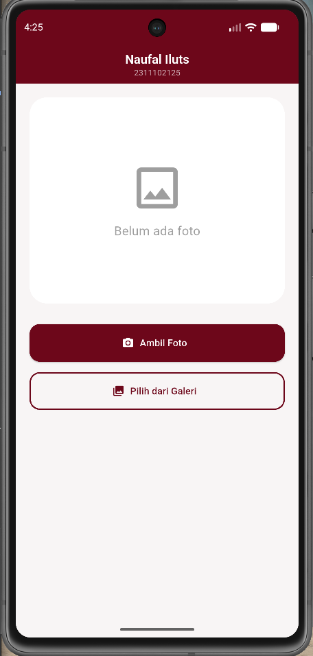
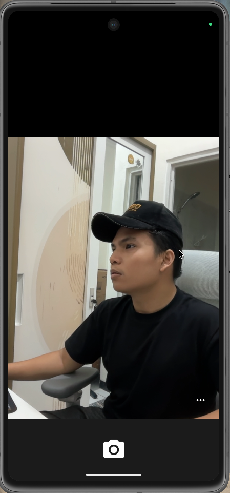
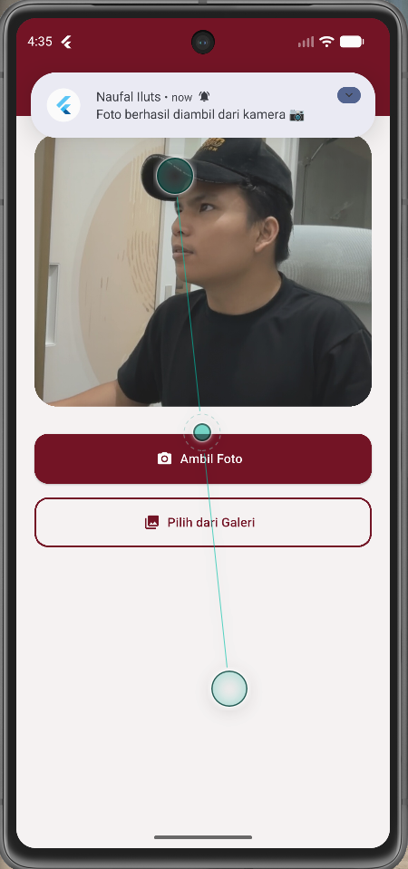
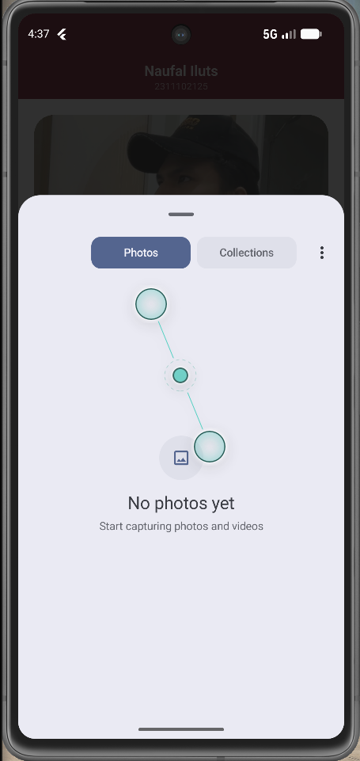

<div align="center">
  <br />
  <h1>LAPORAN PRAKTIKUM</h1>
  <h2>APLIKASI BERBASIS PLATFORM</h2>
  <br />
  <h3>Modul 8 & 9 Mobile<br> NOTIFIKASI & API PERANGKAT KERAS </h3>
  <br />
  <br />
  
  <br />
  <br />
  <h3>Disusun Oleh :</h3>
  <p>
    <strong>NAUFAL LUTHFI ASSARY</strong><br>
    <strong>2311102125</strong><br>
    <strong>S1 IF-11-REG01</strong>
  </p>
  <br />
  <h3>Dosen Pengampu :</h3>
  <p>
    <strong>Dimas Fanny Hebrasianto Permadi, S.ST., M.Kom</strong>
  </p>
  <br />
  <h4>Asisten Praktikum :</h4>
  <p>
    <strong>Apri Pandu Wicaksono</strong><br>
    <strong>Rangga Pradarrell Fathi</strong>
  </p>
  <br />
  <h3>
    LABORATORIUM HIGH PERFORMANCE<br>
    FAKULTAS INFORMATIKA<br>
    UNIVERSITAS TELKOM PURWOKERTO<br>
    2026
  </h3>
</div>

---

## 1. Dasar Teori

Flutter merupakan framework pengembangan aplikasi mobile yang dikembangkan oleh Google dan menggunakan bahasa pemrograman Dart. Flutter memungkinkan pengembang untuk membuat aplikasi lintas platform (cross-platform) yang dapat berjalan pada sistem operasi Android, iOS, Web, maupun Desktop dengan menggunakan satu basis kode (single codebase). Flutter menyediakan berbagai widget yang memudahkan pengembang dalam membangun antarmuka pengguna yang interaktif, responsif, dan memiliki performa yang tinggi.

Pada pengembangan aplikasi mobile, akses terhadap perangkat keras (hardware) seperti kamera dan penyimpanan merupakan salah satu fitur yang sering digunakan. Flutter menyediakan berbagai package untuk mempermudah integrasi dengan perangkat keras, salah satunya adalah package `image_picker`. Package ini memungkinkan aplikasi untuk mengakses kamera perangkat guna mengambil foto secara langsung maupun mengakses galeri untuk memilih gambar yang telah tersimpan. Dengan adanya fitur ini, aplikasi dapat memanfaatkan sumber daya perangkat untuk mendukung kebutuhan pengguna dalam mengelola media berupa gambar atau foto.

Selain akses perangkat keras, aplikasi mobile juga memerlukan mekanisme komunikasi dengan pengguna melalui notifikasi. Notifikasi merupakan pesan yang ditampilkan oleh sistem operasi untuk memberikan informasi tertentu kepada pengguna, baik saat aplikasi sedang aktif maupun berjalan di latar belakang. Pada Flutter, implementasi notifikasi lokal dapat dilakukan menggunakan package `flutter_local_notifications`. Notifikasi lokal digunakan untuk memberikan informasi secara langsung tanpa memerlukan koneksi internet atau server eksternal. Dalam praktikum ini, notifikasi digunakan untuk memberikan informasi kepada pengguna bahwa proses pengambilan foto melalui kamera atau pemilihan gambar dari galeri telah berhasil dilakukan.

---

## 2. Penjelasan Kode

---

### pubspec.yaml

#### Penjelasan Dependencies yang Digunakan

#### 1. Image Picker

```yaml
yaml image_picker: ^1.1.2 
```

Package image_picker digunakan untuk mengakses fitur kamera dan galeri pada perangkat Android maupun iOS. Pada aplikasi yang dibuat, package ini berfungsi untuk mengambil foto menggunakan kamera serta memilih gambar dari galeri perangkat.

Fitur yang digunakan:
- Membuka kamera perangkat.
- Mengambil foto secara langsung.
- Membuka galeri perangkat.
- Memilih gambar dari galeri.
- Mengembalikan file gambar yang dipilih pengguna.

---

#### 2. Flutter Local Notifications

```yaml
yaml flutter_local_notifications: ^17.2.2 
```

Package flutter_local_notifications digunakan untuk membuat dan menampilkan notifikasi lokal pada perangkat. Notifikasi lokal merupakan notifikasi yang dikirim oleh aplikasi tanpa memerlukan koneksi internet atau server eksternal.

Pada aplikasi ini, package digunakan untuk memberikan notifikasi kepada pengguna setelah berhasil mengambil foto menggunakan kamera atau memilih gambar dari galeri.

Fitur yang digunakan:
- Membuat channel notifikasi.
- Menampilkan notifikasi lokal.
- Menampilkan judul dan isi pesan notifikasi.

---

#### 3. Permission Handler

```yaml
yaml permission_handler: ^11.3.1 
```

Package permission_handler digunakan untuk mengelola dan meminta izin akses perangkat kepada pengguna. Package ini diperlukan karena sistem operasi Android mewajibkan aplikasi meminta izin terlebih dahulu sebelum mengakses fitur tertentu seperti kamera dan notifikasi.

Pada aplikasi ini, package digunakan untuk:
- Meminta izin penggunaan kamera.
- Meminta izin menampilkan notifikasi.
- Memastikan aplikasi memiliki hak akses sebelum menjalankan fitur perangkat keras.

---

### AndroidManifest.xml

#### Penjelasan Permission pada AndroidManifest.xml

#### 1. Permission Camera

```xml
xml <uses-permission android:name="android.permission.CAMERA"/> 
```

Permission ini digunakan untuk memberikan izin kepada aplikasi agar dapat mengakses kamera perangkat Android. Tanpa permission ini, aplikasi tidak dapat membuka atau menggunakan kamera meskipun sudah menggunakan package image_picker.

Pada aplikasi praktikum ini, permission kamera digunakan untuk menjalankan fitur Ambil Foto, sehingga pengguna dapat mengambil gambar secara langsung menggunakan kamera perangkat.

Fungsi:
- Mengakses kamera perangkat.
- Mengambil foto secara langsung.
- Mendukung implementasi Camera API pada Flutter.

---

#### 2. Permission Notification

```xml
xml <uses-permission android:name="android.permission.POST_NOTIFICATIONS"/> 
```

Permission ini digunakan untuk memberikan izin kepada aplikasi agar dapat menampilkan notifikasi pada perangkat Android. Permission ini mulai diwajibkan pada Android 13 (API Level 33) ke atas.

Pada aplikasi praktikum ini, permission notifikasi digunakan untuk menampilkan notifikasi lokal setelah pengguna berhasil mengambil foto menggunakan kamera atau memilih gambar dari galeri.

Fungsi:
- Menampilkan notifikasi lokal kepada pengguna.
- Memberikan informasi bahwa proses pengambilan atau pemilihan foto telah berhasil dilakukan.
- Mendukung implementasi package flutter_local_notifications.

---

### Code main.dart

```dart
import 'dart:io';

import 'package:flutter/material.dart';
import 'package:image_picker/image_picker.dart';
import 'package:flutter_local_notifications/flutter_local_notifications.dart';
import 'package:permission_handler/permission_handler.dart';

final FlutterLocalNotificationsPlugin notificationPlugin =
    FlutterLocalNotificationsPlugin();

void main() async {
  WidgetsFlutterBinding.ensureInitialized();

  const AndroidInitializationSettings androidSettings =
      AndroidInitializationSettings('@mipmap/ic_launcher');

  const InitializationSettings settings = InitializationSettings(
    android: androidSettings,
  );

  await notificationPlugin.initialize(settings);

  // Request permission notifikasi Android 13+
  await Permission.notification.request();

  runApp(const MyApp());
}

class MyApp extends StatelessWidget {
  const MyApp({super.key});

  @override
  Widget build(BuildContext context) {
    return MaterialApp(
      debugShowCheckedModeBanner: false,
      title: "Modul 9",
      theme: ThemeData(
        scaffoldBackgroundColor: const Color(0xFFF8F5F5),
        primaryColor: const Color(0xFF6D071A),
        useMaterial3: true,
      ),
      home: const HomePage(),
    );
  }
}

class HomePage extends StatefulWidget {
  const HomePage({super.key});

  @override
  State<HomePage> createState() => _HomePageState();
}

class _HomePageState extends State<HomePage> {
  File? imageFile;

  Future<void> showNotification(String message) async {
    const AndroidNotificationDetails androidDetails =
        AndroidNotificationDetails(
      'photo_channel',
      'Photo Notification',
      channelDescription: 'Notifikasi setelah memilih foto',
      importance: Importance.max,
      priority: Priority.high,
    );

    const NotificationDetails notificationDetails =
        NotificationDetails(android: androidDetails);

    await notificationPlugin.show(
      0,
      'Naufal Iluts',
      message,
      notificationDetails,
    );
  }

  Future<void> openCamera() async {
    PermissionStatus cameraPermission =
        await Permission.camera.request();

    if (!cameraPermission.isGranted) {
      ScaffoldMessenger.of(context).showSnackBar(
        const SnackBar(
          content: Text('Izin kamera ditolak'),
        ),
      );
      return;
    }

    final ImagePicker picker = ImagePicker();

    final XFile? image =
        await picker.pickImage(source: ImageSource.camera);

    if (image != null) {
      setState(() {
        imageFile = File(image.path);
      });

      await showNotification(
        "Foto berhasil diambil dari kamera 📷",
      );
    }
  }

  Future<void> openGallery() async {
    final ImagePicker picker = ImagePicker();

    final XFile? image =
        await picker.pickImage(source: ImageSource.gallery);

    if (image != null) {
      setState(() {
        imageFile = File(image.path);
      });

      await showNotification(
        "Foto berhasil dipilih dari galeri 🖼️",
      );
    }
  }

  Widget buildImagePreview() {
    if (imageFile == null) {
      return Container(
        height: 300,
        decoration: BoxDecoration(
          color: Colors.white,
          borderRadius: BorderRadius.circular(25),
        ),
        child: const Center(
          child: Column(
            mainAxisAlignment: MainAxisAlignment.center,
            children: [
              Icon(
                Icons.image_outlined,
                size: 80,
                color: Colors.grey,
              ),
              SizedBox(height: 10),
              Text(
                "Belum ada foto",
                style: TextStyle(
                  fontSize: 18,
                  color: Colors.grey,
                ),
              ),
            ],
          ),
        ),
      );
    }

    return ClipRRect(
      borderRadius: BorderRadius.circular(25),
      child: Image.file(
        imageFile!,
        height: 300,
        width: double.infinity,
        fit: BoxFit.cover,
      ),
    );
  }

  @override
  Widget build(BuildContext context) {
    const maroon = Color(0xFF6D071A);

    return Scaffold(
      appBar: AppBar(
        backgroundColor: maroon,
        centerTitle: true,
        title: const Column(
          mainAxisSize: MainAxisSize.min,
          children: [
            Text(
              "Naufal Iluts",
              style: TextStyle(
                color: Colors.white,
                fontWeight: FontWeight.bold,
                fontSize: 18,
              ),
            ),
            Text(
              "2311102125",
              style: TextStyle(
                color: Colors.white70,
                fontSize: 12,
              ),
            ),
          ],
        ),
      ),

      body: Padding(
        padding: const EdgeInsets.all(20),
        child: Column(
          children: [
            buildImagePreview(),

            const SizedBox(height: 30),

            SizedBox(
              width: double.infinity,
              height: 55,
              child: ElevatedButton.icon(
                onPressed: openCamera,
                icon: const Icon(Icons.camera_alt),
                label: const Text("Ambil Foto"),
                style: ElevatedButton.styleFrom(
                  backgroundColor: maroon,
                  foregroundColor: Colors.white,
                  shape: RoundedRectangleBorder(
                    borderRadius:
                        BorderRadius.circular(15),
                  ),
                ),
              ),
            ),

            const SizedBox(height: 15),

            SizedBox(
              width: double.infinity,
              height: 55,
              child: OutlinedButton.icon(
                onPressed: openGallery,
                icon: const Icon(Icons.photo_library),
                label: const Text("Pilih dari Galeri"),
                style: OutlinedButton.styleFrom(
                  foregroundColor: maroon,
                  side: const BorderSide(
                    color: maroon,
                    width: 2,
                  ),
                  shape: RoundedRectangleBorder(
                    borderRadius:
                        BorderRadius.circular(15),
                  ),
                ),
              ),
            ),
          ],
        ),
      ),
    );
  }
}
```

#### Import Library

- import 'dart:io';
  
  Digunakan untuk mengelola file gambar yang dipilih dari kamera atau galeri.

- import 'package:flutter/material.dart';
  
  Digunakan untuk membangun antarmuka (UI) aplikasi menggunakan widget Material Design.

- import 'package:image_picker/image_picker.dart';
  
  Digunakan untuk mengakses kamera dan galeri perangkat.

- import 'package:flutter_local_notifications/flutter_local_notifications.dart';
  
  Digunakan untuk membuat dan menampilkan notifikasi lokal.

- import 'package:permission_handler/permission_handler.dart';
  
  Digunakan untuk meminta izin akses kamera dan notifikasi kepada pengguna.

---

#### Inisialisasi Notifikasi

- `final FlutterLocalNotificationsPlugin notificationPlugin = FlutterLocalNotificationsPlugin();`

  Membuat objek plugin notifikasi yang digunakan untuk menampilkan notifikasi lokal.

---

#### Fungsi Main

- `WidgetsFlutterBinding.ensureInitialized();`

  Menginisialisasi Flutter sebelum menjalankan plugin.

- `await notificationPlugin.initialize(settings);`

  Mengaktifkan plugin notifikasi.

- `await Permission.notification.request();`

  Meminta izin notifikasi kepada pengguna.

- `runApp(const MyApp());`

  Menjalankan aplikasi Flutter.

---

#### Widget MyApp

- `class MyApp extends StatelessWidget`

  Widget utama aplikasi yang digunakan untuk mengatur tema dan halaman awal aplikasi.

- `MaterialApp()`

  Digunakan sebagai root widget aplikasi Flutter.

---

#### Widget HomePage

- `class HomePage extends StatefulWidget`

  Digunakan karena data gambar dapat berubah ketika pengguna memilih atau mengambil foto.

---

#### Variabel Penyimpanan Gambar

- `File? imageFile;`

  Digunakan untuk menyimpan file gambar hasil kamera atau galeri.

---

#### Fungsi Notifikasi

- `Future<void> showNotification(String message)`

  Digunakan untuk menampilkan notifikasi lokal setelah pengguna berhasil mengambil atau memilih gambar.

- `notificationPlugin.show(...)`

  Menampilkan notifikasi pada perangkat Android.

---

#### Fungsi Kamera

- `Future<void> openCamera() async`

  Digunakan untuk membuka kamera perangkat.

- `Permission.camera.request();`

  Meminta izin penggunaan kamera.

- `picker.pickImage(source: ImageSource.camera);`

  Membuka kamera dan mengambil foto.

- `setState(() { imageFile = File(image.path); });`

  Menyimpan hasil foto dan memperbarui tampilan aplikasi.

- `showNotification(...)`
  Menampilkan notifikasi setelah foto berhasil diambil.

---

#### Fungsi Galeri

- `Future<void> openGallery() async`

  Digunakan untuk membuka galeri perangkat.

- `picker.pickImage(source: ImageSource.gallery);`

  Memilih gambar dari galeri.

- `setState(() { imageFile = File(image.path); });`

  Menyimpan gambar yang dipilih.

- `showNotification(...)`

  Menampilkan notifikasi setelah gambar berhasil dipilih.

---

#### Fungsi Preview Gambar

- `Widget buildImagePreview()`

  Digunakan untuk menampilkan gambar pada halaman utama.

- `Image.file(...)`

  Menampilkan file gambar yang telah dipilih pengguna.

- `Container(...)`

  Menampilkan placeholder ketika belum ada gambar yang dipilih.

---

#### AppBar

- `AppBar(...)`

  Menampilkan header aplikasi.

- `Text("Naufal Iluts")`

  Menampilkan nama mahasiswa.

- `Text("2311102125")`

  Menampilkan NIM mahasiswa.

---

#### Tombol Ambil Foto

- `ElevatedButton.icon(...)`

  Tombol yang digunakan untuk membuka kamera dan mengambil foto.

- `onPressed: openCamera`

  Memanggil fungsi kamera ketika tombol ditekan.

---

#### Tombol Pilih Galeri

- `OutlinedButton.icon(...)`

  Tombol yang digunakan untuk membuka galeri.

- `onPressed: openGallery`

  Memanggil fungsi galeri ketika tombol ditekan.

---

## 3. Screenshot Hasil

### 1. Home


### 2. Proses Mengambil Foto


### 3. Foto berhasil diambil, beserta tampilan notifikasi


### 4. Memilih Foto dari Galeri


---

## 4. Referensi

- [Flutter Docs](https://docs.flutter.dev)
- [Dart](https://dart.dev)
- [Modul](https://telkomuniversityofficial-my.sharepoint.com/:b:/g/personal/dimasfhp_telkomuniversity_ac_id/IQAzpAVjVmeTRYI3rgKxGZE7AcpC_xRo2dpbh8ZyHd3c1lQ?e=pZRgq9)
