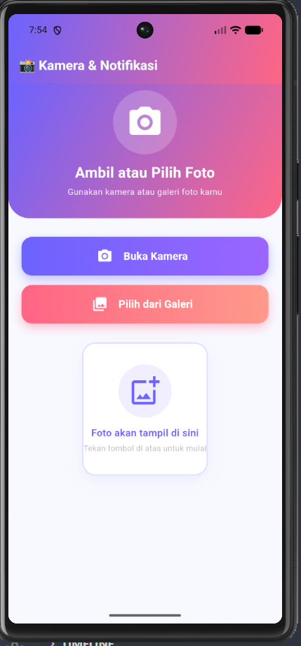
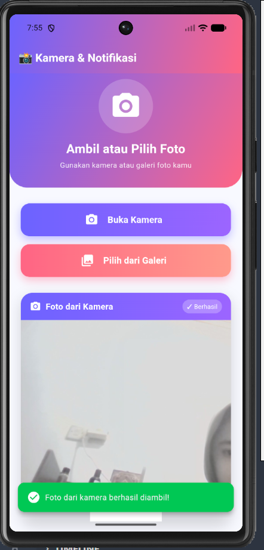
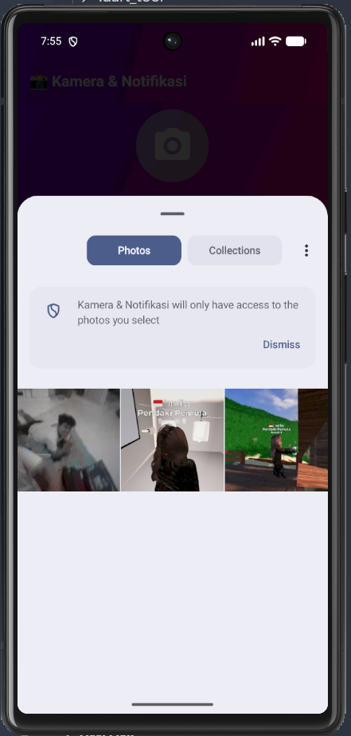
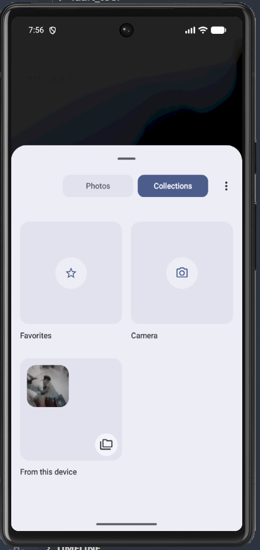

<div align="center">
  <br />
  <h1>LAPORAN PRAKTIKUM <br>APLIKASI BERBASIS PLATFORM</h1>
  <br />
  <h3> Modul 08-09 Mobile <br> Notifikasi & API Perangkat Keras </h3>
  <br />
   
  <br />
  <br />
  <br />
  <h3>Disusun Oleh :</h3>
  <p>
    <strong>Agnes Refilina Fiska</strong><br>
    <strong>2311102126</strong><br>
    <strong>S1 IF-11-01</strong>
  </p>
  <br />
  <h3>Dosen Pengampu :</h3>
  <p>
    <strong>Dimas Fanny Hebrasianto Permadi, S.ST., M.Kom</strong>
  </p>
  <br />
  <br />
    <h4>Asisten Praktikum :</h4>
    <strong> Apri Pandu Wicaksono </strong> <br>
    <strong>Rangga Pradarrell Fathi</strong>
  <br />
  <h3>LABORATORIUM HIGH PERFORMANCE
 <br>FAKULTAS INFORMATIKA <br>UNIVERSITAS TELKOM PURWOKERTO <br>2026</h3>
</div>

## 1. Landasan Teori

### A. Notifikasi dan Kamera

Perkembangan aplikasi mobile saat ini menuntut adanya kemampuan untuk berinteraksi secara langsung dengan komponen perangkat keras (hardware) maupun sistem operasi yang tertanam pada smartphone. Di antara berbagai fitur yang paling banyak dimanfaatkan, kamera menjadi salah satu komponen utama yang memungkinkan pengguna mengabadikan momen secara langsung maupun mengakses koleksi gambar yang telah tersimpan di galeri. Di sisi lain, sistem notifikasi hadir sebagai mekanisme umpan balik (feedback) yang memberikan informasi secara cepat dan responsif kepada pengguna.

Dalam kerangka pengembangan Flutter, akses terhadap fitur-fitur perangkat keras dapat dilakukan dengan lebih mudah berkat adanya sistem plugin yang berfungsi sebagai jembatan antara kode Dart dan API native pada platform Android maupun iOS. Dengan memanfaatkan manajemen state dinamis melalui StatefulWidget, Flutter mampu melakukan pembaruan tampilan antarmuka secara real-time, misalnya ketika data berupa file gambar hasil tangkapan kamera berhasil diterima oleh sistem.

Selain interaksi yang terjadi di dalam antarmuka aplikasi itu sendiri, komunikasi yang berlangsung di luar aplikasi juga memegang peranan yang tidak kalah penting. Dalam konteks inilah notifikasi lokal (local notifications) mengambil perannya. Berbeda dengan push notification yang bergantung pada keberadaan server eksternal, notifikasi lokal bekerja sepenuhnya dari dalam perangkat, di mana pemicunya dijadwalkan dan dikendalikan langsung oleh aplikasi. Mekanisme ini terbukti efektif sebagai sarana konfirmasi instan atas status suatu proses yang sedang atau telah selesai dijalankan.

## 2. Sourcecode

### Sourcecode notification_service.dart

```dart
import 'dart:typed_data';
import 'package:flutter/material.dart';
import 'package:flutter_local_notifications/flutter_local_notifications.dart';

class NotificationService {
  static final FlutterLocalNotificationsPlugin _notificationsPlugin =
      FlutterLocalNotificationsPlugin();

  static Future<void> initialize() async {
    const AndroidInitializationSettings androidSettings =
        AndroidInitializationSettings('@mipmap/ic_launcher');

    const DarwinInitializationSettings iosSettings =
        DarwinInitializationSettings(
      requestAlertPermission: true,
      requestBadgePermission: true,
      requestSoundPermission: true,
    );

    const InitializationSettings initSettings = InitializationSettings(
      android: androidSettings,
      iOS: iosSettings,
    );

    await _notificationsPlugin.initialize(initSettings);
  }

  static Future<void> showPhotoNotification(String source) async {
    final String emoji = source == 'Kamera' ? '📷' : '🖼️';
    final String title = '$emoji Foto Berhasil Disimpan!';
    final String body = source == 'Kamera'
        ? '✨ Kamu baru saja mengambil foto keren dari kamera! Lihat hasilnya sekarang.'
        : '🎉 Foto dari galeri berhasil dipilih! Tampilan sudah diperbarui.';

    final AndroidNotificationDetails androidDetails =
        AndroidNotificationDetails(
      'photo_channel',
      'Notifikasi Foto',
      channelDescription:
          'Notifikasi ketika foto berhasil diambil atau dipilih',
      importance: Importance.max,
      priority: Priority.high,
      showWhen: true,
      autoCancel: false,
      ongoing: false,
      timeoutAfter: 15000,
      styleInformation: BigTextStyleInformation(
        body,
        htmlFormatBigText: false,
        contentTitle: title,
        htmlFormatContentTitle: false,
        summaryText: 'Kamera & Notifikasi App',
        htmlFormatSummaryText: false,
      ),
      color: const Color(0xFF6C63FF),
      ledColor: const Color(0xFF6C63FF),
      ledOnMs: 1000,
      ledOffMs: 500,
      enableLights: true,
      enableVibration: true,
      vibrationPattern: Int64List.fromList([0, 500, 200, 500]),
      playSound: true,
      icon: '@mipmap/ic_launcher',
      largeIcon: const DrawableResourceAndroidBitmap('@mipmap/ic_launcher'),
    );

    const DarwinNotificationDetails iosDetails = DarwinNotificationDetails(
      presentAlert: true,
      presentBadge: true,
      presentSound: true,
    );

    final NotificationDetails notificationDetails = NotificationDetails(
      android: androidDetails,
      iOS: iosDetails,
    );

    await _notificationsPlugin.show(
      0,
      title,
      body,
      notificationDetails,
    );
  }
}

```

### Sourcecode home_page.dart

```dart
import 'dart:io';
import 'package:flutter/material.dart';
import 'package:image_picker/image_picker.dart';
import 'notification_service.dart';

class HomePage extends StatefulWidget {
  const HomePage({super.key});

  @override
  State<HomePage> createState() => _HomePageState();
}

class _HomePageState extends State<HomePage> {
  File? _selectedImage;
  final ImagePicker _picker = ImagePicker();
  bool _isLoading = false;
  String _imageSource = '';

  Future<void> _pickFromCamera() async {
    setState(() => _isLoading = true);
    try {
      final XFile? photo = await _picker.pickImage(
        source: ImageSource.camera,
        imageQuality: 85,
        maxWidth: 1080,
      );
      if (photo != null) {
        setState(() {
          _selectedImage = File(photo.path);
          _imageSource = 'Kamera';
        });
        await NotificationService.showPhotoNotification('Kamera');
        _showSuccessSnackBar('Foto dari kamera berhasil diambil!');
      }
    } catch (e) {
      _showErrorSnackBar('Gagal membuka kamera');
    } finally {
      setState(() => _isLoading = false);
    }
  }

  Future<void> _pickFromGallery() async {
    setState(() => _isLoading = true);
    try {
      final XFile? image = await _picker.pickImage(
        source: ImageSource.gallery,
        imageQuality: 85,
        maxWidth: 1080,
      );
      if (image != null) {
        setState(() {
          _selectedImage = File(image.path);
          _imageSource = 'Galeri';
        });
        await NotificationService.showPhotoNotification('Galeri');
        _showSuccessSnackBar('Foto dari galeri berhasil dipilih!');
      }
    } catch (e) {
      _showErrorSnackBar('Gagal membuka galeri');
    } finally {
      setState(() => _isLoading = false);
    }
  }

  void _showSuccessSnackBar(String message) {
    ScaffoldMessenger.of(context).showSnackBar(
      SnackBar(
        content: Row(children: [
          const Icon(Icons.check_circle, color: Colors.white),
          const SizedBox(width: 8),
          Expanded(child: Text(message)),
        ]),
        backgroundColor: const Color(0xFF00C853),
        duration: const Duration(seconds: 3),
        behavior: SnackBarBehavior.floating,
        shape: RoundedRectangleBorder(borderRadius: BorderRadius.circular(12)),
      ),
    );
  }

  void _showErrorSnackBar(String message) {
    ScaffoldMessenger.of(context).showSnackBar(
      SnackBar(
        content: Row(children: [
          const Icon(Icons.error, color: Colors.white),
          const SizedBox(width: 8),
          Expanded(child: Text(message)),
        ]),
        backgroundColor: const Color(0xFFFF5252),
        duration: const Duration(seconds: 4),
        behavior: SnackBarBehavior.floating,
        shape: RoundedRectangleBorder(borderRadius: BorderRadius.circular(12)),
      ),
    );
  }

  @override
  Widget build(BuildContext context) {
    return Scaffold(
      backgroundColor: const Color(0xFFF8F9FF),
      appBar: AppBar(
        title: const Text(
          '📸 Kamera & Notifikasi',
          style: TextStyle(
            fontWeight: FontWeight.bold,
            fontSize: 20,
            color: Colors.white,
          ),
        ),
        flexibleSpace: Container(
          decoration: const BoxDecoration(
            gradient: LinearGradient(
              colors: [Color(0xFF6C63FF), Color(0xFFFF6584)],
              begin: Alignment.topLeft,
              end: Alignment.bottomRight,
            ),
          ),
        ),
        elevation: 0,
      ),
      body: SingleChildScrollView(
        child: Column(
          children: [
            // Header Banner
            Container(
              width: double.infinity,
              padding: const EdgeInsets.only(bottom: 30, top: 10),
              decoration: const BoxDecoration(
                gradient: LinearGradient(
                  colors: [Color(0xFF6C63FF), Color(0xFFFF6584)],
                  begin: Alignment.topLeft,
                  end: Alignment.bottomRight,
                ),
                borderRadius: BorderRadius.only(
                  bottomLeft: Radius.circular(32),
                  bottomRight: Radius.circular(32),
                ),
              ),
              child: Column(
                children: [
                  Container(
                    padding: const EdgeInsets.all(20),
                    decoration: BoxDecoration(
                      color: Colors.white.withOpacity(0.2),
                      shape: BoxShape.circle,
                    ),
                    child: const Icon(Icons.camera_alt_rounded,
                        size: 56, color: Colors.white),
                  ),
                  const SizedBox(height: 12),
                  const Text(
                    'Ambil atau Pilih Foto',
                    style: TextStyle(
                      fontSize: 22,
                      fontWeight: FontWeight.bold,
                      color: Colors.white,
                    ),
                  ),
                  const SizedBox(height: 4),
                  Text(
                    'Gunakan kamera atau galeri foto kamu',
                    style: TextStyle(
                      fontSize: 13,
                      color: Colors.white.withOpacity(0.85),
                    ),
                  ),
                ],
              ),
            ),

            Padding(
              padding: const EdgeInsets.all(20),
              child: Column(
                children: [
                  const SizedBox(height: 8),

                  // Tombol Kamera
                  Container(
                    width: double.infinity,
                    height: 58,
                    decoration: BoxDecoration(
                      gradient: const LinearGradient(
                        colors: [Color(0xFF6C63FF), Color(0xFF9C64FF)],
                      ),
                      borderRadius: BorderRadius.circular(16),
                      boxShadow: [
                        BoxShadow(
                          color: const Color(0xFF6C63FF).withOpacity(0.4),
                          blurRadius: 12,
                          offset: const Offset(0, 6),
                        ),
                      ],
                    ),
                    child: ElevatedButton.icon(
                      onPressed: _isLoading ? null : _pickFromCamera,
                      icon: _isLoading
                          ? const SizedBox(
                              width: 20,
                              height: 20,
                              child: CircularProgressIndicator(
                                  strokeWidth: 2, color: Colors.white))
                          : const Icon(Icons.camera_alt,
                              size: 24, color: Colors.white),
                      label: Text(
                        _isLoading ? 'Memproses...' : '  Buka Kamera',
                        style: const TextStyle(
                            fontSize: 16,
                            fontWeight: FontWeight.bold,
                            color: Colors.white),
                      ),
                      style: ElevatedButton.styleFrom(
                        backgroundColor: Colors.transparent,
                        shadowColor: Colors.transparent,
                        shape: RoundedRectangleBorder(
                            borderRadius: BorderRadius.circular(16)),
                      ),
                    ),
                  ),

                  const SizedBox(height: 14),

                  // Tombol Galeri
                  Container(
                    width: double.infinity,
                    height: 58,
                    decoration: BoxDecoration(
                      gradient: const LinearGradient(
                        colors: [Color(0xFFFF6584), Color(0xFFFF9A8B)],
                      ),
                      borderRadius: BorderRadius.circular(16),
                      boxShadow: [
                        BoxShadow(
                          color: const Color(0xFFFF6584).withOpacity(0.4),
                          blurRadius: 12,
                          offset: const Offset(0, 6),
                        ),
                      ],
                    ),
                    child: ElevatedButton.icon(
                      onPressed: _isLoading ? null : _pickFromGallery,
                      icon: const Icon(Icons.photo_library_rounded,
                          size: 24, color: Colors.white),
                      label: const Text(
                        '  Pilih dari Galeri',
                        style: TextStyle(
                            fontSize: 16,
                            fontWeight: FontWeight.bold,
                            color: Colors.white),
                      ),
                      style: ElevatedButton.styleFrom(
                        backgroundColor: Colors.transparent,
                        shadowColor: Colors.transparent,
                        shape: RoundedRectangleBorder(
                            borderRadius: BorderRadius.circular(16)),
                      ),
                    ),
                  ),

                  const SizedBox(height: 28),

                  // Area Foto
                  AnimatedSwitcher(
                    duration: const Duration(milliseconds: 400),
                    child: _selectedImage != null
                        ? _buildImageCard()
                        : _buildPlaceholder(),
                  ),
                ],
              ),
            ),
          ],
        ),
      ),
    );
  }

  Widget _buildImageCard() {
    return Container(
      key: const ValueKey('image_card'),
      decoration: BoxDecoration(
        borderRadius: BorderRadius.circular(20),
        boxShadow: [
          BoxShadow(
            color: Colors.black.withOpacity(0.15),
            blurRadius: 20,
            offset: const Offset(0, 8),
          ),
        ],
      ),
      child: ClipRRect(
        borderRadius: BorderRadius.circular(20),
        child: Column(
          children: [
            // Header foto
            Container(
              padding: const EdgeInsets.symmetric(horizontal: 16, vertical: 12),
              decoration: BoxDecoration(
                gradient: LinearGradient(
                  colors: _imageSource == 'Kamera'
                      ? [const Color(0xFF6C63FF), const Color(0xFF9C64FF)]
                      : [const Color(0xFFFF6584), const Color(0xFFFF9A8B)],
                ),
              ),
              child: Row(
                children: [
                  Icon(
                    _imageSource == 'Kamera'
                        ? Icons.camera_alt
                        : Icons.photo_library_rounded,
                    color: Colors.white,
                    size: 20,
                  ),
                  const SizedBox(width: 8),
                  Text(
                    'Foto dari $_imageSource',
                    style: const TextStyle(
                      color: Colors.white,
                      fontWeight: FontWeight.bold,
                      fontSize: 15,
                    ),
                  ),
                  const Spacer(),
                  Container(
                    padding:
                        const EdgeInsets.symmetric(horizontal: 8, vertical: 4),
                    decoration: BoxDecoration(
                      color: Colors.white.withOpacity(0.25),
                      borderRadius: BorderRadius.circular(20),
                    ),
                    child: const Text('✓ Berhasil',
                        style: TextStyle(color: Colors.white, fontSize: 11)),
                  ),
                ],
              ),
            ),
            // Gambar
            Image.file(
              _selectedImage!,
              height: 300,
              width: double.infinity,
              fit: BoxFit.cover,
            ),
            // Footer hapus
            Container(
              color: Colors.white,
              padding: const EdgeInsets.symmetric(vertical: 4),
              child: TextButton.icon(
                onPressed: () => setState(() {
                  _selectedImage = null;
                  _imageSource = '';
                }),
                icon:
                    const Icon(Icons.delete_outline, color: Color(0xFFFF5252)),
                label: const Text('Hapus Foto',
                    style: TextStyle(
                        color: Color(0xFFFF5252), fontWeight: FontWeight.w600)),
              ),
            ),
          ],
        ),
      ),
    );
  }

  Widget _buildPlaceholder() {
    return Container(
      key: const ValueKey('placeholder'),
      height: 200,
      decoration: BoxDecoration(
        color: Colors.white,
        borderRadius: BorderRadius.circular(20),
        border: Border.all(color: const Color(0xFFE0E0FF), width: 2),
        boxShadow: [
          BoxShadow(
            color: const Color(0xFF6C63FF).withOpacity(0.08),
            blurRadius: 20,
            offset: const Offset(0, 8),
          ),
        ],
      ),
      child: Column(
        mainAxisAlignment: MainAxisAlignment.center,
        children: [
          Container(
            padding: const EdgeInsets.all(16),
            decoration: BoxDecoration(
              color: const Color(0xFFF0EEFF),
              shape: BoxShape.circle,
            ),
            child: const Icon(Icons.add_photo_alternate_outlined,
                size: 48, color: Color(0xFF6C63FF)),
          ),
          const SizedBox(height: 12),
          const Text('Foto akan tampil di sini',
              style: TextStyle(
                  fontSize: 15,
                  fontWeight: FontWeight.w600,
                  color: Color(0xFF6C63FF))),
          const SizedBox(height: 4),
          Text('Tekan tombol di atas untuk mulai',
              style: TextStyle(fontSize: 12, color: Colors.grey[400])),
        ],
      ),
    );
  }
}

```

### Sourcecode main.dart

```dart
import 'package:flutter/material.dart';
import 'notification_service.dart';
import 'home_page.dart';

void main() async {
  WidgetsFlutterBinding.ensureInitialized();
  await NotificationService.initialize();
  runApp(const MyApp());
}

class MyApp extends StatelessWidget {
  const MyApp({super.key});

  @override
  Widget build(BuildContext context) {
    return MaterialApp(
      title: 'Kamera & Notifikasi',
      debugShowCheckedModeBanner: false,
      theme: ThemeData(
        colorScheme: ColorScheme.fromSeed(
          seedColor: const Color(0xFF1565C0),
        ),
        useMaterial3: true,
      ),
      home: const HomePage(),
    );
  }
}

```

### Sourcecode pubspec.yml 

```yml
name: flutter_application_1
description: Tugas Praktikum - Notifikasi & API Perangkat Keras
publish_to: 'none'
version: 1.0.0+1

environment:
  sdk: '>=3.0.0 <4.0.0'

dependencies:
  flutter:
    sdk: flutter
  image_picker: ^1.0.7
  flutter_local_notifications: ^17.0.0
  permission_handler: ^11.3.0
  cupertino_icons: ^1.0.6

dev_dependencies:
  flutter_test:
    sdk: flutter
  flutter_lints: ^3.0.0

flutter:
  uses-material-design: true
```

### Sourcecode AndroidManifest.xml 

```xml
<manifest xmlns:android="http://schemas.android.com/apk/res/android">

    <uses-permission android:name="android.permission.INTERNET"/>
    <uses-permission android:name="android.permission.CAMERA"/>
    <uses-permission android:name="android.permission.READ_EXTERNAL_STORAGE"
        android:maxSdkVersion="32"/>
    <uses-permission android:name="android.permission.READ_MEDIA_IMAGES"/>
    <uses-permission android:name="android.permission.POST_NOTIFICATIONS"/>
    <uses-permission android:name="android.permission.SCHEDULE_EXACT_ALARM"/>
    <uses-feature android:name="android.hardware.camera" android:required="false"/>

    <application
        android:label="Kamera & Notifikasi"
        android:name="${applicationName}"
        android:icon="@mipmap/ic_launcher"
        android:enableOnBackInvokedCallback="true">

        <activity
            android:name=".MainActivity"
            android:exported="true"
            android:launchMode="singleTop"
            android:taskAffinity=""
            android:theme="@style/LaunchTheme"
            android:configChanges="orientation|keyboardHidden|keyboard|screenSize|smallestScreenSize|locale|layoutDirection|fontScale|screenLayout|density|uiMode"
            android:hardwareAccelerated="true"
            android:windowSoftInputMode="adjustResize">
            <meta-data
                android:name="io.flutter.embedding.android.NormalTheme"
                android:resource="@style/NormalTheme"/>
            <intent-filter>
                <action android:name="android.intent.action.MAIN"/>
                <category android:name="android.intent.category.LAUNCHER"/>
            </intent-filter>
        </activity>

        <provider
            android:name="androidx.core.content.FileProvider"
            android:authorities="${applicationId}.fileprovider"
            android:exported="false"
            android:grantUriPermissions="true">
            <meta-data
                android:name="android.support.FILE_PROVIDER_PATHS"
                android:resource="@xml/file_paths"/>
        </provider>

        <receiver
            android:name="com.dexterous.flutterlocalnotifications.ScheduledNotificationReceiver"
            android:exported="false"/>

        <meta-data android:name="flutterEmbedding" android:value="2"/>
    </application>

    <queries>
        <intent>
            <action android:name="android.media.action.IMAGE_CAPTURE"/>
        </intent>
        <intent>
            <action android:name="android.intent.action.GET_CONTENT"/>
        </intent>
    </queries>
</manifest>
```

### 3. Hasil Penugasan






## 4. Penjelasan

Berikut adalah penjelasan yang mengimplementasikan fitur kamera dan notifikasi sesuai dengan tugas praktikum:

A. Fitur Kamera dan Akses Galeri

Aplikasi ini menggunakan dua pendekatan untuk mengambil foto, yaitu melalui kamera langsung (Camera API) dan pemilihan gambar dari galeri (image_picker).

**Pengambilan Foto dari Kamera:**
Tombol "Buka Kamera" memanggil fungsi `_pickFromCamera()` yang menggunakan plugin image_picker dengan source kamera:

```Dart
final XFile? photo = await _picker.pickImage(
  source: ImageSource.camera,
  imageQuality: 85,
  maxWidth: 1080,
);
```

Hasil foto disimpan ke variabel `_selectedImage` bertipe `File` dan langsung ditampilkan di halaman yang sama menggunakan widget `Image.file()`.

**Pemilihan dari Galeri (image_picker):**
Tombol "Pilih dari Galeri" memanggil `_pickFromGallery()` yang membuka galeri bawaan perangkat:

```Dart
final XFile? image = await _picker.pickImage(
  source: ImageSource.gallery,
  imageQuality: 85,
  maxWidth: 1080,
);
```

Jika pengguna memilih foto (`image != null`), file disimpan ke state dan UI diperbarui otomatis melalui `setState()`.

**Izin Perangkat (Permissions):**
Akses kamera dan galeri dideklarasikan di `AndroidManifest.xml` agar sistem Android mengizinkan aplikasi mengakses perangkat keras:

```XML
<uses-permission android:name="android.permission.CAMERA" />
<uses-permission android:name="android.permission.READ_EXTERNAL_STORAGE"
    android:maxSdkVersion="32" />
<uses-permission android:name="android.permission.READ_MEDIA_IMAGES" />
```

B. Fitur Notifikasi

Fitur notifikasi diimplementasikan menggunakan plugin `flutter_local_notifications` untuk menampilkan pemberitahuan setelah foto berhasil diambil atau dipilih.

**Inisialisasi Notifikasi:**
Sebelum aplikasi berjalan, plugin diinisialisasi di `main()` dengan pengaturan ikon dan izin:

```Dart
const AndroidInitializationSettings androidSettings =
    AndroidInitializationSettings('@mipmap/ic_launcher');
await _notificationsPlugin.initialize(initSettings);
```

**Menampilkan Notifikasi:**
Fungsi `showPhotoNotification(source)` mengatur detail channel notifikasi Android dan menampilkan notifikasi ke layar dengan pesan yang berbeda sesuai sumber foto:

```Dart
await _notificationsPlugin.show(
  0,
  '📸 Foto Berhasil Disimpan!',
  'Foto dari $source berhasil ditampilkan.',
  notificationDetails,
);
```

Fungsi ini dipanggil tepat setelah `_pickFromCamera()` atau `_pickFromGallery()` berhasil mendapatkan foto. Channel `photo_channel` dengan `Importance.max` memastikan notifikasi muncul sebagai heads-up popup di atas layar.

**Izin Notifikasi (Android 13+):**
Tercatat pada `AndroidManifest.xml` untuk meminta izin menampilkan notifikasi kepada pengguna:

```XML
<uses-permission android:name="android.permission.POST_NOTIFICATIONS" />
```

## Kesimpulan

Pada praktikum ini telah berhasil dibangun sebuah aplikasi Flutter yang mengintegrasikan fitur kamera dan sistem notifikasi lokal pada perangkat Android. Melalui plugin `image_picker`, akses ke kamera maupun galeri foto perangkat dapat dilakukan dengan mudah hanya menggunakan parameter `ImageSource.camera` atau `ImageSource.gallery` tanpa perlu menulis kode native secara langsung. Penggunaan `StatefulWidget` bersama `setState()` memungkinkan tampilan UI diperbarui secara real-time setiap kali foto baru diambil atau dipilih. Sementara itu, plugin `flutter_local_notifications` berhasil menampilkan notifikasi secara otomatis sebagai konfirmasi kepada pengguna setelah foto berhasil didapatkan, tanpa memerlukan koneksi server eksternal. Konfigurasi izin pada `AndroidManifest.xml` juga menjadi bagian penting dalam praktikum ini, karena setiap fitur yang mengakses perangkat keras wajib dideklarasikan izinnya dengan menyesuaikan perbedaan kebijakan antara versi Android lama dan baru. Secara keseluruhan, praktikum ini membuktikan bahwa Flutter mampu mengintegrasikan fitur perangkat keras dan sistem operasi dengan efisien melalui mekanisme plugin, sekaligus menghasilkan antarmuka yang responsif dan interaktif bagi pengguna.
