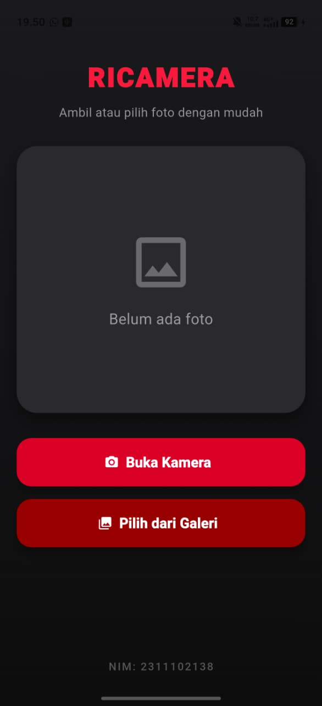
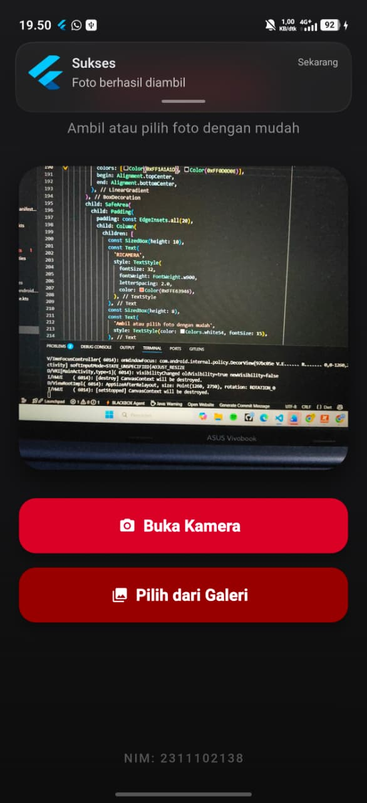
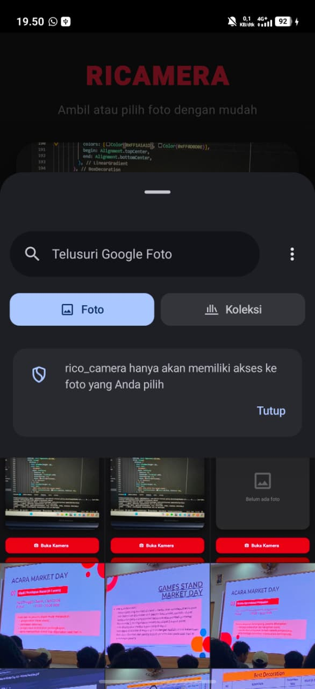
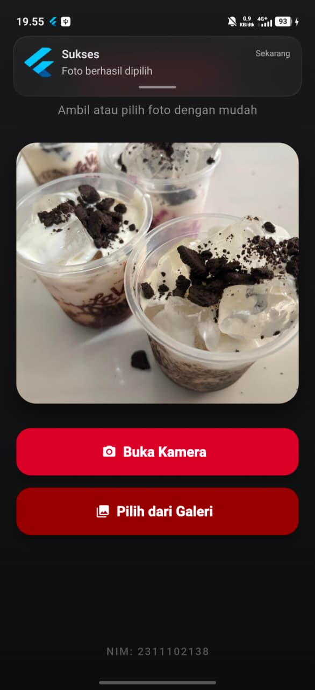

<div align="center">
   <h2>LAPORAN PRAKTIKUM<br>APLIKASI BERBASIS PLATFORM</h2>
   <h>
   <br>
   <h4>MODUL 08 & 09 Mobile<br>Notifikasi & API Perangkat Keras</h4>
   <br>
   
   <br><br>
 
**Disusun Oleh :**<br>
RICO ADE PRATAMA<br>
2311102138<br>
PS1IF-11-REG01
<br><br>
 
**Dosen Pengampu :**<br>
Dimas Fanny Hebrasianto Permadi, S.ST., M.Kom
<br><br>
 
**Assisten Praktikum :**<br>
Apri Pandu Wicaksono
<br>Rangga Pradarrell Fathi
<br><br>
 
PROGRAM STUDI S1 TEKNIK INFORMATIKA<br>
FAKULTAS INFORMATIKA<br>
UNIVERSITAS TELKOM PURWOKERTO<br>
2026

</div>

---

## 1. Dasar Teori

**1. Akses API Perangkat Keras (Kamera dan Galeri)**
Aplikasi seluler memerlukan akses ke _Application Programming Interface_ (API) perangkat keras bawaan untuk mengoperasikan kamera dan sistem penyimpanan (galeri). Pada _framework_ Flutter, interaksi dengan API _native_ (Android/iOS) dapat disederhanakan menggunakan _plugin_ pihak ketiga seperti `image_picker`. _Plugin_ ini berfungsi sebagai penghubung (_bridge_) yang memungkinkan aplikasi untuk mengambil gambar baru secara langsung melalui kamera atau memilih berkas gambar yang sudah ada di dalam galeri perangkat untuk kemudian dirender ke dalam aplikasi.

**2. Notifikasi Lokal (Local Notifications)**
Notifikasi lokal adalah pesan sistem yang dipicu dan diproses sepenuhnya di dalam perangkat pengguna, tanpa memerlukan intervensi dari peladen (_server_) eksternal. Dengan memanfaatkan _package_ `flutter_local_notifications`, aplikasi dapat menampilkan pemberitahuan secara mandiri. Pada sistem operasi Android yang lebih baru, implementasi ini mensyaratkan konfigurasi _Notification Channel_ (saluran notifikasi) agar pesan dapat dikategorikan dan diizinkan tampil oleh sistem antarmuka perangkat.

**3. State Management dan Pemrosesan Asinkron**
Pengambilan gambar dari perangkat keras merupakan proses asinkron (_asynchronous_), yang berarti aplikasi harus menunggu hingga proses tersebut selesai mengembalikan data. Oleh karena itu, antarmuka diimplementasikan menggunakan `StatefulWidget`. Setelah berkas gambar berhasil didapatkan, metode `setState()` harus dipanggil untuk memicu pembaruan status (_state_). Hal ini menginstruksikan aplikasi untuk merender ulang (_rebuild_) antarmuka, sehingga gambar yang baru diambil dan notifikasi keberhasilannya dapat segera ditampilkan di layar.

## 2. Kode Program Unguided

TUGAS PRAKTIKUM<br>
Notifikasi & API Perangkat Keras<br>
Buat aplikasi Flutter sederhana dengan fitur berikut:

1. Ambil Foto
   Tampilkan 2 tombol di halaman utama: • Tombol pertama → buka kamera langsung (Camera API) • Tombol kedua → pilih foto dari galeri (image_picker) Foto yang diambil/dipilih ditampilkan di halaman yang sama.

2. Notifikasi
   Setelah foto berhasil diambil atau dipilih, tampilkan notifikasi lokal menggunakan flutter_local_notifications dengan isi pesan bebas.<br>

Output yang dikumpulkan meliputi :

- Screenshot hasilnya
- Source code
- Penjelasan singkat tiap widget
- Pengumpulan cukup up Folder Nama - NIM Isi folder: - Folder Source Code - Folder SS - PDF (Penjelasan dari source code)

### Struktur Project

```php
Modul_08_09_Mobile/rico_camera/   # Folder utama proyek Flutter
├── android/                      # Direktori konfigurasi khusus platform Android
│   └── app/
│       └── build.gradle.kts      # File konfigurasi Gradle (tempat menambahkan fitur desugaring)
├── lib/                          # Direktori utama penyimpanan kode Dart
│   └── main.dart                 # Titik awal eksekusi program & halaman utama (UI kamera, galeri, dan notifikasi)
└── pubspec.yaml                  # File konfigurasi dependensi (tempat mendaftarkan image_picker dan flutter_local_notifications)
```

### Kode pubspec.yaml

```yaml
name: rico_camera
description: "A new Flutter project."
# The following line prevents the package from being accidentally published to
# pub.dev using `flutter pub publish`. This is preferred for private packages.
publish_to: "none" # Remove this line if you wish to publish to pub.dev

# The following defines the version and build number for your application.
# A version number is three numbers separated by dots, like 1.2.43
# followed by an optional build number separated by a +.
# Both the version and the builder number may be overridden in flutter
# build by specifying --build-name and --build-number, respectively.
# In Android, build-name is used as versionName while build-number used as versionCode.
# Read more about Android versioning at https://developer.android.com/studio/publish/versioning
# In iOS, build-name is used as CFBundleShortVersionString while build-number is used as CFBundleVersion.
# Read more about iOS versioning at
# https://developer.apple.com/library/archive/documentation/General/Reference/InfoPlistKeyReference/Articles/CoreFoundationKeys.html
# In Windows, build-name is used as the major, minor, and patch parts
# of the product and file versions while build-number is used as the build suffix.
version: 1.0.0+1

environment:
  sdk: ^3.11.5

# Dependencies specify other packages that your package needs in order to work.
# To automatically upgrade your package dependencies to the latest versions
# consider running `flutter pub upgrade --major-versions`. Alternatively,
# dependencies can be manually updated by changing the version numbers below to
# the latest version available on pub.dev. To see which dependencies have newer
# versions available, run `flutter pub outdated`.
dependencies:
  flutter:
    sdk: flutter

  # The following adds the Cupertino Icons font to your application.
  # Use with the CupertinoIcons class for iOS style icons.
  cupertino_icons: ^1.0.8
  image_picker: ^1.1.2
  flutter_local_notifications: ^17.2.1
  permission_handler: ^11.3.1

dev_dependencies:
  flutter_test:
    sdk: flutter

  # The "flutter_lints" package below contains a set of recommended lints to
  # encourage good coding practices. The lint set provided by the package is
  # activated in the `analysis_options.yaml` file located at the root of your
  # package. See that file for information about deactivating specific lint
  # rules and activating additional ones.
  flutter_lints: ^6.0.0

# For information on the generic Dart part of this file, see the
# following page: https://dart.dev/tools/pub/pubspec

# The following section is specific to Flutter packages.
flutter:
  # The following line ensures that the Material Icons font is
  # included with your application, so that you can use the icons in
  # the material Icons class.
  uses-material-design: true

  # To add assets to your application, add an assets section, like this:
  # assets:
  #   - images/a_dot_burr.jpeg
  #   - images/a_dot_ham.jpeg

  # An image asset can refer to one or more resolution-specific "variants", see
  # https://flutter.dev/to/resolution-aware-images

  # For details regarding adding assets from package dependencies, see
  # https://flutter.dev/to/asset-from-package

  # To add custom fonts to your application, add a fonts section here,
  # in this "flutter" section. Each entry in this list should have a
  # "family" key with the font family name, and a "fonts" key with a
  # list giving the asset and other descriptors for the font. For
  # example:
  # fonts:
  #   - family: Schyler
  #     fonts:
  #       - asset: fonts/Schyler-Regular.ttf
  #       - asset: fonts/Schyler-Italic.ttf
  #         style: italic
  #   - family: Trajan Pro
  #     fonts:
  #       - asset: fonts/TrajanPro.ttf
  #       - asset: fonts/TrajanPro_Bold.ttf
  #         weight: 700
  #
  # For details regarding fonts from package dependencies,
  # see https://flutter.dev/to/font-from-package
```

### Penjelasan Kode

File untuk kode **`pubspec.yaml`** ini merupakan pusat pengaturan proyek Flutter. Bagian paling penting untuk praktikum ini ada pada blok **`dependencies`**, yaitu tempat kita mendaftarkan _plugin_ tambahan agar aplikasi bisa menggunakan fitur bawaan HP. Terdapat 3 _plugin_ utama yang ditambahkan:

- **`image_picker`**: Berfungsi untuk membuka kamera dan memilih foto dari galeri.
- **`flutter_local_notifications`**: Berfungsi untuk memunculkan pesan notifikasi (_pop-up_) di layar HP.
- **`permission_handler`**: Berfungsi untuk memunculkan kotak dialog perizinan (meminta izin akses kamera dan notifikasi kepada pengguna).

### Kode AndroidManifest.xml

```xml
<manifest xmlns:android="http://schemas.android.com/apk/res/android">
    <!-- Izin untuk Kamera dan Galeri -->
    <uses-permission android:name="android.permission.CAMERA" />
    <uses-permission android:name="android.permission.READ_EXTERNAL_STORAGE" />
    <uses-permission android:name="android.permission.READ_MEDIA_IMAGES" />

    <!-- Izin untuk Notifikasi -->
    <uses-permission android:name="android.permission.POST_NOTIFICATIONS"/>
    <uses-permission android:name="android.permission.RECEIVE_BOOT_COMPLETED"/>
    <uses-permission android:name="android.permission.VIBRATE" />
    <application
        android:label="rico_camera"
        android:name="${applicationName}"
        android:icon="@mipmap/ic_launcher">
        <activity
            android:name=".MainActivity"
            android:exported="true"
            android:launchMode="singleTop"
            android:taskAffinity=""
            android:theme="@style/LaunchTheme"
            android:configChanges="orientation|keyboardHidden|keyboard|screenSize|smallestScreenSize|locale|layoutDirection|fontScale|screenLayout|density|uiMode"
            android:hardwareAccelerated="true"
            android:windowSoftInputMode="adjustResize">
            <!-- Specifies an Android theme to apply to this Activity as soon as
                 the Android process has started. This theme is visible to the user
                 while the Flutter UI initializes. After that, this theme continues
                 to determine the Window background behind the Flutter UI. -->
            <meta-data
              android:name="io.flutter.embedding.android.NormalTheme"
              android:resource="@style/NormalTheme"
              />
            <intent-filter>
                <action android:name="android.intent.action.MAIN"/>
                <category android:name="android.intent.category.LAUNCHER"/>
            </intent-filter>
        </activity>
        <!-- Don't delete the meta-data below.
             This is used by the Flutter tool to generate GeneratedPluginRegistrant.java -->
        <meta-data
            android:name="flutterEmbedding"
            android:value="2" />
    </application>
    <!-- Required to query activities that can process text, see:
         https://developer.android.com/training/package-visibility and
         https://developer.android.com/reference/android/content/Intent#ACTION_PROCESS_TEXT.

         In particular, this is used by the Flutter engine in io.flutter.plugin.text.ProcessTextPlugin. -->
    <queries>
        <intent>
            <action android:name="android.intent.action.PROCESS_TEXT"/>
            <data android:mimeType="text/plain"/>
        </intent>
    </queries>
</manifest>

```

### Penjelasan Kode

File untuk kode **`AndroidManifest.xml`** ini merupakan pusat informasi yang dibaca oleh sistem Android sebelum aplikasi dijalankan. Bagian terpenting dari modifikasi kode di atas adalah penambahan tag **`<uses-permission>`**, yang berfungsi untuk mendaftarkan hak akses (izin) ke sistem HP. Tanpa mendaftarkan izin-izin ini di `AndroidManifest.xml`, fitur kamera dan notifikasinya akan diblokir oleh sistem keamanan Android dan aplikasi bisa _crash_ (berhenti tiba-tiba). Terdapat 2 kelompok izin utama yang ditambahkan:

- **Izin Kamera & Galeri:** (`CAMERA`, `READ_EXTERNAL_STORAGE`, `READ_MEDIA_IMAGES`) wajib ditambahkan agar sistem Android mengizinkan aplikasi untuk membuka lensa kamera secara langsung dan membaca file foto yang ada di dalam memori penyimpanan HP.
- **Izin Notifikasi:** (`POST_NOTIFICATIONS`, `VIBRATE`, `RECEIVE_BOOT_COMPLETED`) wajib ditambahkan agar aplikasi memiliki hak untuk memunculkan pesan _pop-up_ notifikasi di layar dan membuat HP bergetar saat notifikasinya masuk.

### Kode main.dart (Folder lib)

```dart
import 'dart:io';
import 'package:flutter/material.dart';
import 'package:image_picker/image_picker.dart';
import 'package:flutter_local_notifications/flutter_local_notifications.dart';
import 'package:permission_handler/permission_handler.dart';

void main() async {
  WidgetsFlutterBinding.ensureInitialized();
  await Permission.notification.request();
  await NotificationService.init();
  runApp(const MyApp());
}

class NotificationService {
  static final FlutterLocalNotificationsPlugin notifications =
      FlutterLocalNotificationsPlugin();

  static Future<void> init() async {
    const AndroidInitializationSettings androidSettings =
        AndroidInitializationSettings('@mipmap/ic_launcher');

    const InitializationSettings settings = InitializationSettings(
      android: androidSettings,
    );

    await notifications.initialize(
      settings,
      onDidReceiveNotificationResponse: (NotificationResponse response) {},
    );
  }

  static Future<void> showNotification(String title, String body) async {
    const AndroidNotificationDetails androidDetails =
        AndroidNotificationDetails(
          'photo_channel',
          'Photo Notifications',
          channelDescription: 'Notifikasi setelah foto berhasil',
          importance: Importance.max,
          priority: Priority.high,
          playSound: true,
        );

    const NotificationDetails details = NotificationDetails(
      android: androidDetails,
    );

    await notifications.show(0, title, body, details);
  }
}

class MyApp extends StatelessWidget {
  const MyApp({super.key});

  @override
  Widget build(BuildContext context) {
    return MaterialApp(
      debugShowCheckedModeBanner: false,
      title: 'Modul 08-09 - Rico Camera',
      theme: ThemeData(
        useMaterial3: true,
        colorSchemeSeed: const Color(0xFFE63946),
      ),
      home: const HomePage(),
    );
  }
}

class HomePage extends StatefulWidget {
  const HomePage({super.key});

  @override
  State<HomePage> createState() => _HomePageState();
}

class _HomePageState extends State<HomePage> {
  File? _image;
  final ImagePicker _picker = ImagePicker();

  Future<void> _pickImage(ImageSource source) async {
    try {
      final XFile? pickedFile = await _picker.pickImage(source: source);

      if (pickedFile != null) {
        setState(() {
          _image = File(pickedFile.path);
        });

        if (source == ImageSource.camera) {
          await NotificationService.showNotification(
            'Sukses',
            'Foto berhasil diambil',
          );
        } else {
          await NotificationService.showNotification(
            'Sukses',
            'Foto berhasil dipilih',
          );
        }
      }
    } catch (e) {
      debugPrint("Error mengambil gambar: $e");
    }
  }

  Widget buildButton({
    required String text,
    required IconData icon,
    required Color color,
    required VoidCallback onPressed,
  }) {
    return SizedBox(
      width: double.infinity,
      height: 58,
      child: ElevatedButton.icon(
        onPressed: onPressed,
        icon: Icon(icon, color: Colors.white),
        label: Text(
          text,
          style: const TextStyle(
            fontSize: 17,
            fontWeight: FontWeight.bold,
            color: Colors.white,
          ),
        ),
        style: ElevatedButton.styleFrom(
          backgroundColor: color,
          elevation: 8,
          shape: RoundedRectangleBorder(
            borderRadius: BorderRadius.circular(18),
          ),
        ),
      ),
    );
  }

  Widget buildImagePreview() {
    if (_image == null) {
      return Container(
        height: 320,
        decoration: BoxDecoration(
          color: const Color(0xFF2A2A2D),
          borderRadius: BorderRadius.circular(25),
          boxShadow: const [
            BoxShadow(
              blurRadius: 15,
              color: Colors.black45,
              offset: Offset(0, 8),
            ),
          ],
        ),
        child: const Center(
          child: Column(
            mainAxisAlignment: MainAxisAlignment.center,
            children: [
              Icon(Icons.image_outlined, size: 80, color: Colors.white30),
              SizedBox(height: 15),
              Text(
                'Belum ada foto',
                style: TextStyle(fontSize: 18, color: Colors.white54),
              ),
            ],
          ),
        ),
      );
    }

    return Container(
      height: 320,
      decoration: BoxDecoration(
        borderRadius: BorderRadius.circular(25),
        boxShadow: const [
          BoxShadow(
            blurRadius: 20,
            color: Colors.black54,
            offset: Offset(0, 10),
          ),
        ],
        image: DecorationImage(image: FileImage(_image!), fit: BoxFit.cover),
      ),
    );
  }

  @override
  Widget build(BuildContext context) {
    return Scaffold(
      body: Container(
        width: double.infinity,
        decoration: const BoxDecoration(
          gradient: LinearGradient(
            colors: [Color(0xFF1A1A1D), Color(0xFF0D0D0E)],
            begin: Alignment.topCenter,
            end: Alignment.bottomCenter,
          ),
        ),
        child: SafeArea(
          child: Padding(
            padding: const EdgeInsets.all(20),
            child: Column(
              children: [
                const SizedBox(height: 10),
                const Text(
                  'RICAMERA',
                  style: TextStyle(
                    fontSize: 32,
                    fontWeight: FontWeight.w900,
                    letterSpacing: 2.0,
                    color: Color(0xFFE63946),
                  ),
                ),
                const SizedBox(height: 8),
                const Text(
                  'Ambil atau pilih foto dengan mudah',
                  style: TextStyle(color: Colors.white54, fontSize: 15),
                ),
                const SizedBox(height: 30),
                buildImagePreview(),
                const SizedBox(height: 30),
                buildButton(
                  text: 'Buka Kamera',
                  icon: Icons.camera_alt,
                  color: const Color(0xFFC8102E),
                  onPressed: () => _pickImage(ImageSource.camera),
                ),
                const SizedBox(height: 15),
                buildButton(
                  text: 'Pilih dari Galeri',
                  icon: Icons.photo_library,
                  color: const Color(0xFF8B0000),
                  onPressed: () => _pickImage(ImageSource.gallery),
                ),
                const Spacer(),
                const Text(
                  'NIM: 2311102138',
                  style: TextStyle(
                    color: Colors.white30,
                    fontSize: 13,
                    letterSpacing: 1.5,
                    fontWeight: FontWeight.w500,
                  ),
                ),
              ],
            ),
          ),
        ),
      ),
    );
  }
}

```

### Penjelasan Kode

Pada kode **`main.dart`** ini merupakan pusat kendali dari seluruh aplikasi RICAMERA, di mana logika pemrograman (fungsi) dan desain antarmuka (UI) digabungkan. Secara garis besar, file ini terbagi menjadi tiga fungsi utama:

- **1. Pengaturan Notifikasi & Perizinan (`NotificationService` & `main`)**
  Sebelum aplikasi menampilkan halaman utama, sistem akan terlebih dahulu meminta izin kepada pengguna untuk menampilkan notifikasi (`Permission.notification.request()`). Kelas `NotificationService` bertugas mengatur detail notifikasi lokal (seperti _icon_, nama _channel_, dan suara) agar siap dipanggil kapan saja.
- **2. Logika Pengambilan Gambar (`_pickImage`)**
  Fungsi asinkron ini adalah inti dari aplikasi. Saat pengguna menekan tombol, fungsi ini akan memanggil `ImagePicker` untuk membuka **Kamera** atau **Galeri**. Jika foto berhasil didapatkan, fungsi `setState()` dipanggil agar UI langsung menampilkan foto tersebut di layar. Bersamaan dengan itu, fungsi ini juga langsung memicu `NotificationService` untuk memunculkan pesan _pop-up_ "Foto berhasil diambil/dipilih".
- **3. Desain Antarmuka (`HomePage`)**
  Bagian ini berisi tata letak (UI) yang dilihat pengguna. Terdiri dari _background_ bergradasi gelap, teks judul "RICAMERA", kotak pratinjau gambar (`buildImagePreview`), dua tombol _custom_ untuk fungsi kamera dan galeri (`buildButton`), serta disematkan identitas NIM di bagian paling bawah antarmuka.

### Hasil Output dan Contoh Langkah-langkah Penyelesaian

1. Tampilan Halaman Utama (Home)
   
2. Tampilan Hasil Foto yang berhasil diambil langsung dari kamera (Jika klik tombol Buka Kamera)
   
3. Tampilan Ambil Foto langsung dari galeri (Jika klik tombol Pilih dari Galeri)
   
4. Tampilan Hasil Foto yang berhasil diambil dari galeri
   

## 3. Kesimpulan dan Penutup

Tugas Praktikum Modul 8 & 9 ini membuat aplikasi pengelola media gambar menggunakan Flutter. Fokus utamanya adalah penerapan integrasi _Hardware API_ melalui pustaka `image_picker` untuk mengakses kamera dan memuat foto dari galeri, serta pemunculan pemberitahuan sistem menggunakan _Local Notifications_. Cocok digunakan sebagai pembelajaran praktikum bagi mahasiswa program studi Informatika untuk merancang aplikasi mobile.

## 4. Referensi

- [1] [Materi Modul 08 & 09 Mobile](https://telkomuniversityofficial-my.sharepoint.com/personal/dimasfhp_telkomuniversity_ac_id/_layouts/15/onedrive.aspx?id=%2Fpersonal%2Fdimasfhp_telkomuniversity_ac_id%2FDocuments%2FAplikasi+Berbasis+Platform%2FMODUL+PRAKTIKUM+Pemrograman+Perangkat+Bergerak+2024.pdf&parent=%2Fpersonal%2Fdimasfhp_telkomuniversity_ac_id%2FDocuments%2FAplikasi+Berbasis+Platform&ga=1)
