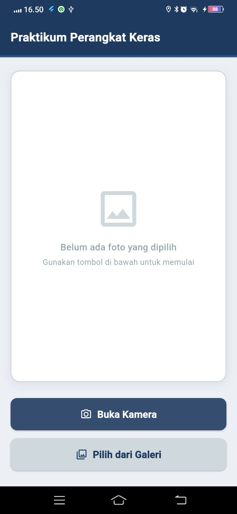
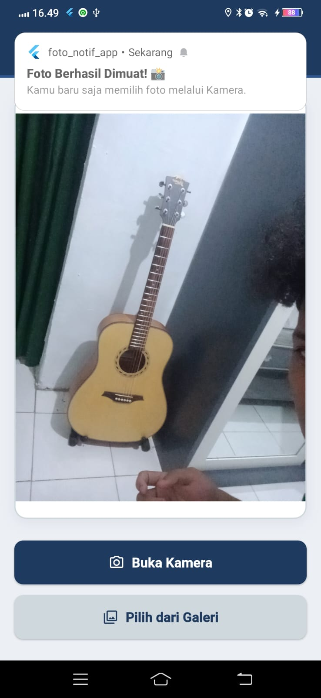
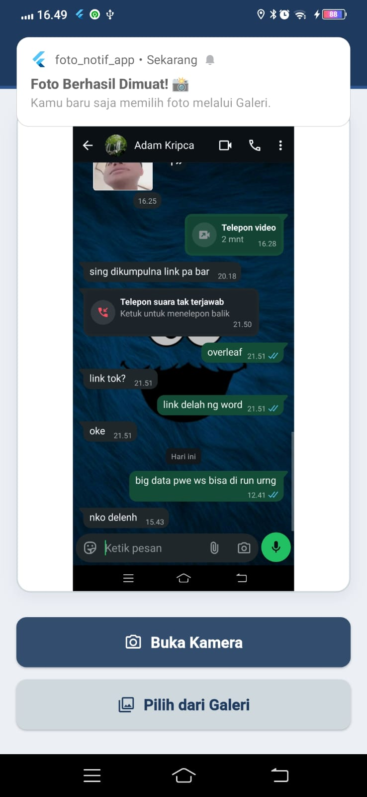

<div align="center">
  <br />

  <h1>
    LAPORAN PRAKTIKUM <br>
    APLIKASI BERBASIS PLATFORM
  </h1>

  <br />

  <h3>Modul 8 9 Mobile</h3>
  <h3>Notifikasi dan API Perangkat Keras pada Flutter</h3>

  <br />

  <p align="center">
    
  </p>

  <br />
  <br />
  <br />

  <h3>Disusun Oleh :</h3>

  <p>
    <strong>Syamsul Adam</strong><br>
    <strong>2311102144</strong><br>
    <strong>S1 IF-11-01</strong>
  </p>

  <br />

  <h3>Dosen Pengampu :</h3>

  <p>
    <strong>Dimas Fanny Hebrasianto Permadi, S.ST., M.Kom</strong>
  </p>

  <br />
  <br />

  <h4>Asisten Praktikum :</h4>

  <strong>Apri Pandu Wicaksono</strong><br>
  <strong>Rangga Pradarrell Fathi</strong>

  <br />
  <br />

  <h3>
    LABORATORIUM HIGH PERFORMANCE
    <br>FAKULTAS INFORMATIKA
    <br>UNIVERSITAS TELKOM PURWOKERTO
    <br>2026
  </h3>
</div>

<hr>

## Dasar Teori

Flutter merupakan framework multiplatform yang memungkinkan pengembang membangun aplikasi Android, iOS, web, dan desktop hanya dengan satu basis kode. Pada praktikum Modul 8-9 ini, aplikasi yang dibuat adalah **Camera & Notification App**, yaitu aplikasi yang menggabungkan dua fitur utama: pengambilan foto menggunakan kamera atau galeri, serta menampilkan notifikasi lokal setelah foto berhasil dipilih.

### Camera & Image Picker

Flutter tidak memiliki akses kamera secara bawaan, sehingga diperlukan package tambahan yaitu `image_picker`. Package ini memungkinkan aplikasi untuk mengambil foto langsung dari kamera perangkat maupun memilih foto dari galeri. Pengambilan foto dilakukan menggunakan `ImagePicker` dengan memanggil method `pickImage()` yang menerima parameter `source`. Nilai `ImageSource.camera` digunakan untuk membuka kamera, sedangkan `ImageSource.gallery` digunakan untuk membuka galeri. Hasil dari `pickImage()` berupa objek `XFile?` yang kemudian dikonversi menjadi `File` dari package `dart:io` agar dapat ditampilkan menggunakan widget `Image.file`.

### Local Notification

Notifikasi lokal pada Flutter diimplementasikan menggunakan package `flutter_local_notifications`. Package ini memungkinkan aplikasi menampilkan notifikasi sistem di perangkat Android maupun iOS tanpa memerlukan koneksi internet atau server. Sebelum notifikasi dapat digunakan, plugin harus diinisialisasi terlebih dahulu menggunakan `FlutterLocalNotificationsPlugin` dengan pengaturan `AndroidInitializationSettings`. Inisialisasi dilakukan di dalam fungsi `main()` sebelum `runApp()` dipanggil agar plugin siap digunakan sebelum aplikasi berjalan. Notifikasi ditampilkan menggunakan method `show()` yang menerima parameter ID notifikasi, judul, isi pesan, dan detail notifikasi berupa `NotificationDetails`.

### StatefulWidget dan setState

Karena tampilan aplikasi perlu diperbarui ketika foto dipilih (menampilkan foto yang baru diambil), halaman utama menggunakan `StatefulWidget`. Setiap kali foto berhasil dipilih, variabel `imageFile` diperbarui menggunakan `setState()` sehingga widget `Image.file` otomatis merender ulang tampilan dengan foto terbaru.
---

# 2. Source Code

```dart
import 'dart:io';
import 'package:flutter/material.dart';
import 'package:image_picker/image_picker.dart';
import 'package:flutter_local_notifications/flutter_local_notifications.dart';

// ── Palet Warna ──────────────────────────────────────────────
const Color kNavy = Color(0xFF1E3A5F); // biru tua utama
const Color kNavyLight = Color(
  0xFF2E5590,
); // biru tua lebih cerah (hover/accent)
const Color kSilver = Color(0xFFECEFF4); // abu muda (background)
const Color kSilverDark = Color(
  0xFFCFD8DC,
); // abu sedikit lebih gelap (border/card)
const Color kWhite = Color(0xFFFFFFFF);
const Color kTextDim = Color(0xFF90A4AE); // abu untuk teks sekunder
// ─────────────────────────────────────────────────────────────

void main() {
  WidgetsFlutterBinding.ensureInitialized();
  runApp(const MyApp());
}

class MyApp extends StatelessWidget {
  const MyApp({super.key});

  @override
  Widget build(BuildContext context) {
    return MaterialApp(
      debugShowCheckedModeBanner: false,
      title: 'Praktikum Kamera & Notifikasi',
      theme: ThemeData(
        useMaterial3: true,
        colorScheme: ColorScheme.fromSeed(
          seedColor: kNavy,
          brightness: Brightness.light,
        ),
        scaffoldBackgroundColor: kSilver,
        appBarTheme: const AppBarTheme(
          backgroundColor: kNavy,
          foregroundColor: kWhite,
          elevation: 0,
          centerTitle: false,
          titleTextStyle: TextStyle(
            color: kWhite,
            fontSize: 18,
            fontWeight: FontWeight.w600,
            letterSpacing: 0.3,
          ),
        ),
        elevatedButtonTheme: ElevatedButtonThemeData(
          style: ElevatedButton.styleFrom(
            shape: RoundedRectangleBorder(
              borderRadius: BorderRadius.circular(10),
            ),
            padding: const EdgeInsets.symmetric(vertical: 14),
          ),
        ),
      ),
      home: const HomeScreen(),
    );
  }
}

class HomeScreen extends StatefulWidget {
  const HomeScreen({super.key});

  @override
  State<HomeScreen> createState() => _HomeScreenState();
}

class _HomeScreenState extends State<HomeScreen> {
  File? _image;
  final ImagePicker _picker = ImagePicker();

  final FlutterLocalNotificationsPlugin _localNotificationsPlugin =
      FlutterLocalNotificationsPlugin();

  @override
  void initState() {
    super.initState();
    _initNotification();
  }

  // 1. Inisialisasi notifikasi
  Future<void> _initNotification() async {
    const AndroidInitializationSettings initSettingsAndroid =
        AndroidInitializationSettings('@mipmap/ic_launcher');

    const InitializationSettings initSettings = InitializationSettings(
      android: initSettingsAndroid,
    );

    await _localNotificationsPlugin.initialize(initSettings);

    await _localNotificationsPlugin
        .resolvePlatformSpecificImplementation<
          AndroidFlutterLocalNotificationsPlugin
        >()
        ?.requestNotificationsPermission();
  }

  // 2. Tampilkan notifikasi lokal
  Future<void> _showNotification(String source) async {
    const AndroidNotificationDetails androidDetails =
        AndroidNotificationDetails(
          'channel_id_foto',
          'Notifikasi Foto',
          channelDescription: 'Notifikasi saat berhasil mengambil/memilih foto',
          importance: Importance.max,
          priority: Priority.high,
        );

    const NotificationDetails notifDetails = NotificationDetails(
      android: androidDetails,
    );

    await _localNotificationsPlugin.show(
      0,
      'Foto Berhasil Dimuat! 📸',
      'Kamu baru saja memilih foto melalui $source.',
      notifDetails,
    );
  }

  // 3. Ambil gambar dari kamera / galeri
  Future<void> _getImage(ImageSource source) async {
    final XFile? pickedFile = await _picker.pickImage(source: source);

    if (pickedFile != null) {
      setState(() {
        _image = File(pickedFile.path);
      });

      final String sourceText = source == ImageSource.camera
          ? 'Kamera'
          : 'Galeri';
      await _showNotification(sourceText);
    }
  }

  @override
  Widget build(BuildContext context) {
    return Scaffold(
      appBar: AppBar(
        title: const Text('Praktikum Perangkat Keras'),
        // Garis bawah tipis berwarna biru cerah sebagai aksen
        bottom: PreferredSize(
          preferredSize: const Size.fromHeight(3),
          child: Container(height: 3, color: kNavyLight),
        ),
      ),
      body: Padding(
        padding: const EdgeInsets.fromLTRB(16, 20, 16, 24),
        child: Column(
          crossAxisAlignment: CrossAxisAlignment.stretch,
          children: [
            // ── Area Gambar ──────────────────────────────────
            Expanded(
              child: Container(
                decoration: BoxDecoration(
                  color: kWhite,
                  borderRadius: BorderRadius.circular(14),
                  border: Border.all(color: kSilverDark, width: 1.5),
                  boxShadow: [
                    BoxShadow(
                      color: kNavy.withOpacity(0.08),
                      blurRadius: 12,
                      offset: const Offset(0, 4),
                    ),
                  ],
                ),
                clipBehavior: Clip.antiAlias,
                child: _image != null
                    ? Image.file(_image!, fit: BoxFit.contain)
                    : Column(
                        mainAxisAlignment: MainAxisAlignment.center,
                        children: [
                          Icon(
                            Icons.image_outlined,
                            size: 72,
                            color: kSilverDark,
                          ),
                          const SizedBox(height: 12),
                          const Text(
                            'Belum ada foto yang dipilih',
                            style: TextStyle(
                              color: kTextDim,
                              fontSize: 14,
                              fontWeight: FontWeight.w500,
                            ),
                          ),
                          const SizedBox(height: 4),
                          const Text(
                            'Gunakan tombol di bawah untuk memulai',
                            style: TextStyle(color: kTextDim, fontSize: 12),
                          ),
                        ],
                      ),
              ),
            ),

            const SizedBox(height: 24),

            // ── Tombol Kamera ────────────────────────────────
            ElevatedButton.icon(
              onPressed: () => _getImage(ImageSource.camera),
              icon: const Icon(Icons.camera_alt_outlined),
              label: const Text(
                'Buka Kamera',
                style: TextStyle(fontWeight: FontWeight.w600, fontSize: 15),
              ),
              style: ElevatedButton.styleFrom(
                backgroundColor: kNavy,
                foregroundColor: kWhite,
              ),
            ),

            const SizedBox(height: 12),

            // ── Tombol Galeri ────────────────────────────────
            ElevatedButton.icon(
              onPressed: () => _getImage(ImageSource.gallery),
              icon: const Icon(Icons.photo_library_outlined),
              label: const Text(
                'Pilih dari Galeri',
                style: TextStyle(fontWeight: FontWeight.w600, fontSize: 15),
              ),
              style: ElevatedButton.styleFrom(
                backgroundColor: kSilverDark,
                foregroundColor: kNavy,
              ),
            ),
          ],
        ),
      ),
    );
  }
}

```

---

# 3. Penjelasan Singkat Tiap Widget

### WidgetsFlutterBinding.ensureInitialized()
Dipanggil di awal fungsi main(). Widget ini memastikan bahwa binding antara framework Flutter dan engine dasar sudah siap sebelum aplikasi dijalankan. Hal ini sangat penting untuk memastikan komponen native, seperti inisialisasi notifikasi, dapat berjalan dengan aman sejak awal.

### FlutterLocalNotificationsPlugin
Objek dari package flutter_local_notifications yang diinisialisasi di awal (initState) untuk mengelola seluruh operasi notifikasi lokal. Objek ini digunakan untuk meminta izin notifikasi pada Android terbaru dan menampilkan pesan pop-up ke sistem.

### AndroidInitializationSettings
Konfigurasi awal yang wajib ada untuk mengatur bagaimana notifikasi ditampilkan di platform Android. Kode ini menerima parameter '@mipmap/ic_launcher' yang berarti notifikasi akan menggunakan ikon bawaan aplikasi yang ada di folder mipmap Android.

### AndroidNotificationDetails
Objek konfigurasi yang menentukan detail spesifik dari notifikasi yang muncul di Android. Di sini diatur channel ID ('channel_id_foto'), nama channel ('Notifikasi Foto'), deskripsi, serta tingkat kepentingannya (Importance.max dan Priority.high) agar notifikasi langsung muncul di atas layar (heads-up).

### MaterialApp
Widget root atau akar aplikasi yang mengatur konfigurasi global. Pada kode ini, MaterialApp menonaktifkan banner debug, mengatur judul, dan menerapkan tema global (ThemeData) berbasis Material 3 dengan warna utama kNavy.

### Scaffold
Kerangka dasar halaman yang menyediakan struktur tata letak aplikasi Material Design. Pada aplikasi ini, Scaffold menggunakan warna latar belakang abu-abu muda (kSilver) dan menampung AppBar di bagian atas serta body sebagai ruang konten utama.

### AppBar
Header halaman yang menampilkan teks "Praktikum Perangkat Keras". Menggunakan centerTitle: false (rata kiri) dengan teks berwarna putih. AppBar ini juga dimodifikasi menggunakan properti bottom dan PreferredSize untuk menambahkan garis bawah tipis berwarna biru cerah (kNavyLight) sebagai aksen desain.

### Padding
Widget pembungkus yang memberikan jarak antara batas tepi layar dengan konten di dalamnya. Di sini digunakan EdgeInsets.fromLTRB(16, 20, 16, 24) untuk memberi ruang di kiri, atas, kanan, dan bawah Column utama.

### Column
Widget tata letak yang menyusun anak-anaknya secara vertikal dari atas ke bawah. Pada halaman ini, Column menggunakan CrossAxisAlignment.stretch agar area foto dan tombol-tombol melebar memenuhi layar dari kiri ke kanan.

### Expanded
Widget fleksibel yang memaksa widget anaknya (dalam hal ini area foto) untuk mengisi seluruh sisa ruang vertikal yang kosong di dalam Column. Ini memastikan tombol selalu berada di bawah layar, sementara area foto mengambil ruang paling besar secara dinamis.

### Container (Area Foto)
Widget yang bertugas sebagai bingkai atau kanvas gambar. Dilengkapi dengan BoxDecoration untuk memberikan warna latar putih, sudut melengkung (borderRadius.circular(14)), garis tepi (border), dan efek bayangan tipis (boxShadow). Menggunakan clipBehavior: Clip.antiAlias agar sudut gambar yang dimuat ikut membulat menyesuaikan bentuk Container.

### Image.file
Widget untuk menampilkan gambar dari file sistem lokal perangkat. Menerima objek File dari variabel _image. Properti fit: BoxFit.contain digunakan agar keseluruhan foto terlihat utuh di dalam bingkai tanpa ada bagian yang terpotong.

### Icon
Widget untuk menampilkan ikon bawaan Material Design. Di dalam aplikasi ini, ikon digunakan untuk status kosong (Icons.image_outlined berukuran besar), serta disematkan di dalam tombol (Icons.camera_alt_outlined dan Icons.photo_library_outlined).

### SizedBox
Widget yang digunakan untuk memberikan jarak kosong (margin). Pada kode ini, SizedBox disisipkan di antara area foto dan tombol (height: 24), serta di antara tombol kamera dan tombol galeri (height: 12) agar tata letak tidak menempel.

### ElevatedButton.icon
Widget tombol solid yang dilengkapi dengan ikon dan teks. Aplikasi ini menggunakan dua ElevatedButton.icon:

Tombol Kamera: Bergaya warna utama kNavy dengan teks putih, memanggil metode _getImage(ImageSource.camera).

Tombol Galeri: Bergaya warna abu-abu kSilverDark dengan teks biru tua, memanggil metode _getImage(ImageSource.gallery). Keduanya diatur bentuknya agar sudutnya agak melengkung (borderRadius: BorderRadius.circular(10)).

### ImagePicker
Objek dari package image_picker yang berfungsi membuka antarmuka perangkat keras secara native. Metode pickImage() digunakan untuk menangkap aksi pengguna (memotret dari kamera atau mengambil dari galeri) dan mengembalikan data dalam bentuk XFile.

### setState()
Metode penting dari StatefulWidget yang bertugas memberitahu framework Flutter bahwa ada perubahan data (seperti file foto _image yang baru terpilih). Ketika setState() dipanggil, Flutter akan me-render ulang layar sehingga foto langsung tertampil menggantikan ikon placeholder kosong.

---

# 5. Hasil Praktikum

### 1. Halaman awal aplikasi


### 2. Foto dengan kamera


### 3. Ambil Foto di Galery


---

# 6. Kesimpulan

Aplikasi berhasil mengimplementasikan fitur pengambilan foto menggunakan kamera, pemilihan gambar dari galeri, menampilkan hasil gambar pada layar, serta menampilkan notifikasi lokal setelah gambar berhasil dipilih atau diambil. Dengan demikian seluruh tujuan praktikum telah tercapai.