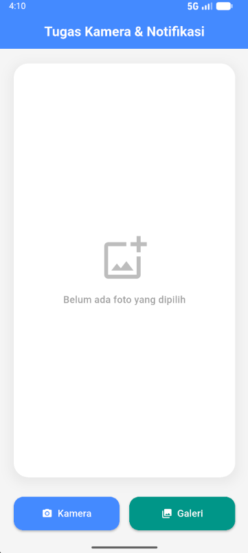
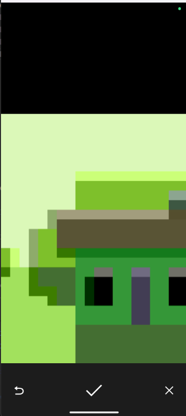
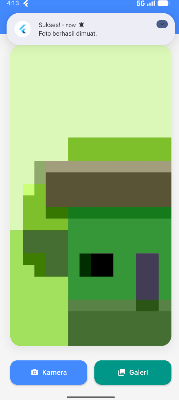

<div align="center">
  <br />
  <h1>LAPORAN PRAKTIKUM</h1>
  <h2>APLIKASI BERBASIS PLATFORM</h2>
  <br />
  <h3>Flutter Modul 8&9</h3>
  <h3>Notifikasi & API Perangkat Keras</h3>
  <br />
  <br />
  
  <br />
  <br />
  <h3>Disusun Oleh :</h3>
  <p>
    <strong>AVRIZAL SETYO AJI NUGROHO</strong><br>
    <strong>2311102145</strong><br>
    <strong>S1 IF-11-REG01</strong>
  </p>
  <br />
  <h3>Dosen Pengampu :</h3>
  <p>
    <strong>Dimas Fanny Hebrasianto Permadi, S.ST., M.Kom</strong>
  </p>
  <br />
  <h4>Asisten Praktikum :</h4>
  <p>
    <strong>Apri Pandu Wicaksono</strong><br>
    <strong>Rangga Pradarrell Fathi</strong>
  </p>
  <br />
  <h3>
    LABORATORIUM HIGH PERFORMANCE<br>
    FAKULTAS INFORMATIKA<br>
    UNIVERSITAS TELKOM PURWOKERTO<br>
    2026
  </h3>
</div>

---

## 1. Dasar Teori

### Komponen Utama dalam Pengembangan UI Flutter

Akses Perangkat Keras (Camera & Storage): Secara bawaan, framework Flutter tidak dapat langsung berkomunikasi dengan perangkat keras ponsel. Untuk mengakses Kamera dan Galeri, digunakan plugin penjembatan seperti image_picker. Plugin ini menerjemahkan kode Dart menjadi perintah native (Java/Kotlin untuk Android). Penggunaan fitur ini mewajibkan pengembang untuk mendeklarasikan izin (permissions) secara eksplisit di dalam file sistem, seperti AndroidManifest.xml.

Notifikasi Lokal (Local Notifications): Berbeda dengan push notification yang dikirim melalui server internet (seperti Firebase), notifikasi lokal dieksekusi secara mandiri oleh perangkat itu sendiri tanpa butuh koneksi internet. Plugin flutter_local_notifications digunakan untuk membuat channel, mengatur tingkat prioritas, dan memicu OS (sistem operasi) agar memunculkan pesan pop-up di bar status.

Manajemen State (StatefulWidget): Aplikasi ini menggunakan StatefulWidget karena antarmukanya bersifat dinamis. Ketika pengguna berhasil mengambil foto, status aplikasi berubah (dari tidak ada gambar menjadi ada gambar), sehingga layar perlu dirender ulang (rebuild) menggunakan perintah setState.

---

## 2. Kode

```dart
import 'dart:io';
import 'package:flutter/material.dart';
import 'package:image_picker/image_picker.dart';
import 'package:flutter_local_notifications/flutter_local_notifications.dart';

void main() => runApp(
  const MaterialApp(
    debugShowCheckedModeBanner: false, // Menghilangkan pita debug
    home: HomePage(),
  ),
);

class HomePage extends StatefulWidget {
  const HomePage({super.key});
  @override
  State<HomePage> createState() => _HomePageState();
}

class _HomePageState extends State<HomePage> {
  File? _image;
  final ImagePicker _picker = ImagePicker();
  final FlutterLocalNotificationsPlugin _notificationsPlugin =
      FlutterLocalNotificationsPlugin();

  @override
  void initState() {
    super.initState();
    _initializeNotifications();
  }

  // Inisialisasi Notifikasi
  void _initializeNotifications() async {
    const initializationSettings = InitializationSettings(
      android: AndroidInitializationSettings('@mipmap/ic_launcher'),
    );
    await _notificationsPlugin.initialize(initializationSettings);
  }

  // Fungsi Tampil Notifikasi
  Future<void> _showNotification() async {
    const androidDetails = AndroidNotificationDetails(
      'channel_id',
      'Foto Notification',
      importance: Importance.max,
      priority: Priority.high,
    );
    await _notificationsPlugin.show(
      0,
      'Sukses!',
      'Foto berhasil dimuat.',
      const NotificationDetails(android: androidDetails),
    );
  }

  // Fungsi Ambil/Pilih Foto
  Future<void> _pickImage(ImageSource source) async {
    final XFile? pickedFile = await _picker.pickImage(source: source);
    if (pickedFile != null) {
      setState(() => _image = File(pickedFile.path));
      _showNotification();
    }
  }

  @override
  Widget build(BuildContext context) {
    return Scaffold(
      backgroundColor: Colors.grey[100], // Warna latar belakang aplikasi
      appBar: AppBar(
        centerTitle: true,
        elevation: 0,
        backgroundColor: Colors.blueAccent,
        foregroundColor: Colors.white,
        title: const Text(
          "Tugas Kamera & Notifikasi",
          style: TextStyle(fontWeight: FontWeight.bold),
        ),
      ),
      body: Padding(
        padding: const EdgeInsets.all(24.0), // Jarak aman dari tepi layar
        child: Column(
          children: [
            // Area Preview Gambar
            Expanded(
              child: Container(
                width: double.infinity,
                decoration: BoxDecoration(
                  color: Colors.white,
                  borderRadius: BorderRadius.circular(24),
                  boxShadow: [
                    BoxShadow(
                      color: Colors.black.withOpacity(0.05),
                      blurRadius: 15,
                      spreadRadius: 5,
                      offset: const Offset(0, 5),
                    ),
                  ],
                ),
                child: ClipRRect(
                  borderRadius: BorderRadius.circular(24),
                  child: _image == null
                      ? const Column(
                          mainAxisAlignment: MainAxisAlignment.center,
                          children: [
                            Icon(
                              Icons.add_photo_alternate_outlined,
                              size: 80,
                              color: Colors.black26,
                            ),
                            SizedBox(height: 16),
                            Text(
                              "Belum ada foto yang dipilih",
                              style: TextStyle(
                                fontSize: 16,
                                color: Colors.black38,
                                fontWeight: FontWeight.w500,
                              ),
                            ),
                          ],
                        )
                      : Image.file(
                          _image!,
                          fit: BoxFit.cover, // Gambar memenuhi area kontainer
                        ),
                ),
              ),
            ),

            const SizedBox(height: 32), // Jarak antara gambar dan tombol
            // Area Tombol
            Row(
              mainAxisAlignment: MainAxisAlignment.spaceEvenly,
              children: [
                // Tombol Kamera
                Expanded(
                  child: ElevatedButton.icon(
                    onPressed: () => _pickImage(ImageSource.camera),
                    icon: const Icon(Icons.camera_alt),
                    label: const Text("Kamera", style: TextStyle(fontSize: 16)),
                    style: ElevatedButton.styleFrom(
                      padding: const EdgeInsets.symmetric(vertical: 16),
                      backgroundColor: Colors.blueAccent,
                      foregroundColor: Colors.white,
                      shape: RoundedRectangleBorder(
                        borderRadius: BorderRadius.circular(16),
                      ),
                      elevation: 2,
                    ),
                  ),
                ),
                const SizedBox(width: 16),
                // Tombol Galeri
                Expanded(
                  child: ElevatedButton.icon(
                    onPressed: () => _pickImage(ImageSource.gallery),
                    icon: const Icon(Icons.photo_library),
                    label: const Text("Galeri", style: TextStyle(fontSize: 16)),
                    style: ElevatedButton.styleFrom(
                      padding: const EdgeInsets.symmetric(vertical: 16),
                      backgroundColor: Colors.teal,
                      foregroundColor: Colors.white,
                      shape: RoundedRectangleBorder(
                        borderRadius: BorderRadius.circular(16),
                      ),
                      elevation: 2,
                    ),
                  ),
                ),
              ],
            ),
            const SizedBox(height: 16),
          ],
        ),
      ),
    );
  }
}


```
### penjelasan
# 1. Bagian Inisialisasi Notifikasi (`_initializeNotifications`)

Fungsi ini dipanggil pertama kali saat aplikasi dibuka melalui `initState`. Tujuannya adalah mendaftarkan pengaturan dasar notifikasi ke sistem Android, termasuk menentukan ikon yang akan muncul di bar notifikasi menggunakan ikon default `@mipmap/ic_launcher`.

---

# 2. Bagian Pemicu Notifikasi (`_showNotification`)

Fungsi ini berisi konfigurasi detail dari pesan notifikasi yang akan muncul. Pada bagian ini didefinisikan:

* **Channel ID** (wajib untuk Android 8.0 ke atas)
* Tingkat prioritas maksimal menggunakan `Importance.max`
* Judul notifikasi: **"Sukses!"**
* Isi pesan notifikasi: **"Foto berhasil dimuat."**

---

# 3. Fungsi Pengambil Gambar (`_pickImage`)

Fungsi ini bersifat asinkron karena aplikasi harus menunggu sampai pengguna selesai memotret atau memilih foto dari galeri. Oleh karena itu digunakan `Future` dan `await`.

Fungsi menerima parameter `ImageSource` yang dapat berupa:

* `ImageSource.camera`
* `ImageSource.gallery`

Jika proses berhasil (`pickedFile != null`), maka lokasi file gambar akan disimpan ke variabel `_image` di dalam `setState`.

Setelah `setState` memperbarui tampilan aplikasi, fungsi `_showNotification()` dipanggil untuk menampilkan notifikasi bahwa foto berhasil dimuat.

---

# 4. Bagian Antarmuka / UI (`build`)

## Scaffold

`Scaffold` digunakan sebagai kerangka dasar halaman yang menyediakan `AppBar` dan `body`.

## Ternary Operator

```dart
_image == null ? ... : Image.file(...)
```

Kode tersebut merupakan ternary operator (bentuk singkat dari `if-else`).

* Jika `_image` masih kosong, aplikasi menampilkan teks dan ikon **"Belum ada foto"**.
* Jika `_image` sudah berisi gambar, aplikasi menampilkan widget `Image.file` untuk merender gambar dari penyimpanan lokal perangkat.

## Expanded

Widget `Expanded` digunakan agar area gambar otomatis mengisi sisa ruang kosong di layar dan mencegah terjadinya error overflow.

## ElevatedButton.icon

Widget `ElevatedButton.icon` digunakan sebagai tombol untuk memanggil fungsi `_pickImage()` berdasarkan sumber gambar yang dipilih pengguna.

Tombol-tombol tersebut disusun secara horizontal menggunakan widget `Row`.


---

## 3. Screenshot Hasil
**Halaman Awal**

**Kamera**

**notif**


---

## 4. Referensi

- Dart: [https://dart.dev](https://dart.dev)
- Flutter Docs: [https://docs.flutter.dev](https://docs.flutter.dev)
