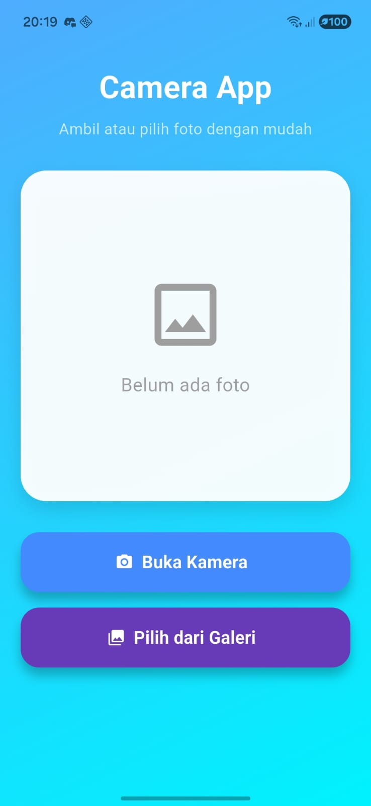
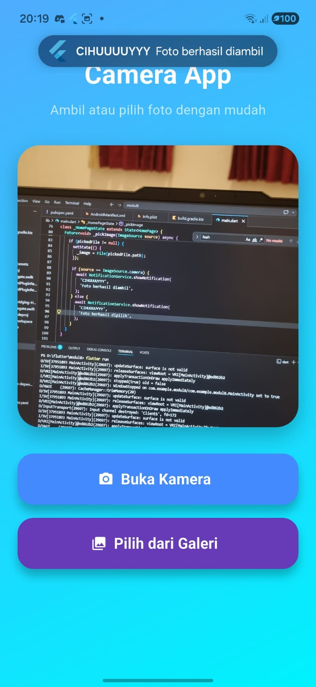
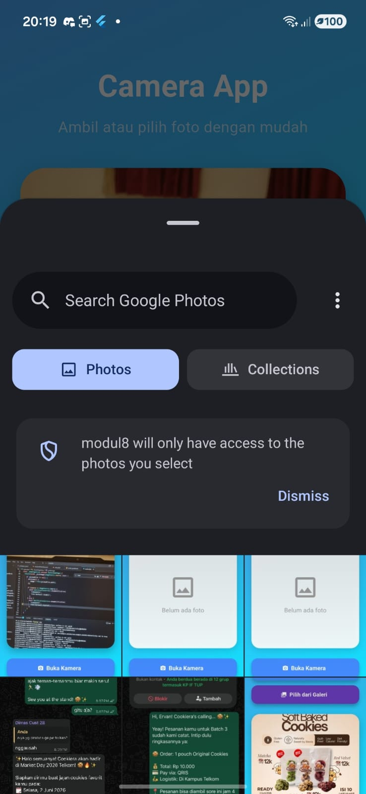
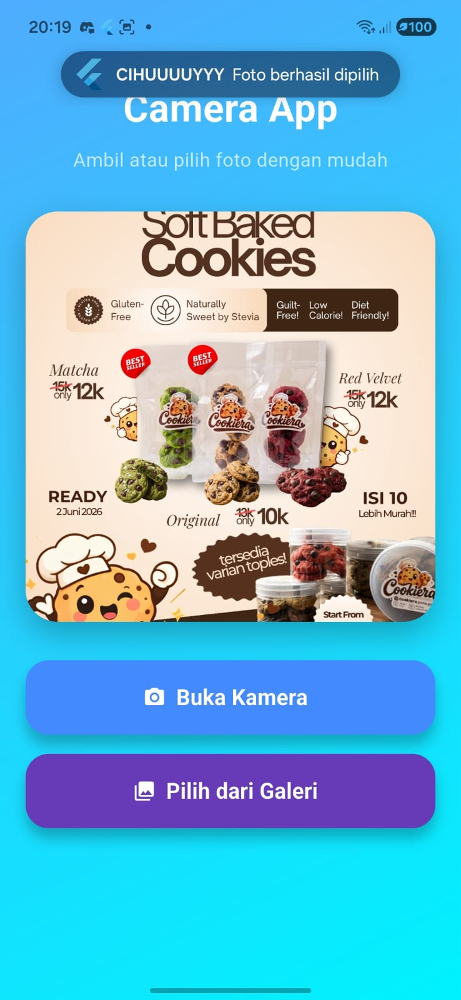

<div align="center">
  <br />
  <h1>LAPORAN PRAKTIKUM <br>APLIKASI BERBASIS PLATFORM</h1>
  <br />
  <h3>MODUL 8 & 9<br> NAVIGASI DAN NOTIFIKASI</h3>
  <br />
   
  <br />
  <br />
  <br />
  <h3>Disusun Oleh :</h3>
  <p>
    <strong>DANENDRA ARDEN SHADUQ</strong><br>
    <strong>2311102146</strong><br>
    <strong>S1 IF-11-REG01</strong>
  </p>
  <br />
  <br />
  <h3>Dosen Pengampu :</h3>
  <p>
    <strong>Dimas Fanny Hebrasianto Permadi, S.ST., M.Kom</strong>
  </p>
  <br />
  <br />
    <h4>Asisten Praktikum :</h4>
    <strong> Apri Pandu Wicaksono </strong> <br>
    <strong>Rangga Pradarrell Fathi</strong>
  <br />
  <h3>LABORATORIUM HIGH PERFORMANCE
 <br>FAKULTAS INFORMATIKA <br>UNIVERSITAS TELKOM PURWOKERTO <br>2026</h3>
</div>

---

## 1. Dasar Teori

### Image Picker

Image Picker merupakan package pada Flutter yang digunakan untuk mengambil gambar dari kamera perangkat maupun memilih gambar dari galeri. Package ini memanfaatkan API bawaan sistem operasi Android maupun iOS untuk mengakses media perangkat. Dalam implementasinya, package ini memungkinkan aplikasi membuka kamera secara langsung maupun menampilkan galeri sehingga pengguna dapat memilih gambar yang diinginkan.

Fungsi utama Image Picker pada aplikasi ini yaitu:

- Mengakses kamera perangkat
- Mengakses galeri foto
- Mengambil file gambar
- Menampilkan hasil gambar pada aplikasi

### Local Notification

Local Notification adalah notifikasi yang dibuat dan ditampilkan oleh aplikasi secara lokal tanpa memerlukan koneksi ke server eksternal. Pada Flutter, implementasi notifikasi lokal dapat dilakukan menggunakan package flutter_local_notifications.

Notifikasi lokal berguna untuk memberikan informasi kepada pengguna terkait suatu aksi yang telah berhasil dilakukan, seperti:

- Konfirmasi foto berhasil diambil
- Konfirmasi foto berhasil dipilih dari galeri
- Memberikan umpan balik secara langsung kepada pengguna

Pada aplikasi ini, notifikasi lokal digunakan untuk menampilkan pesan setelah pengguna berhasil mengambil atau memilih foto.

### Permission Handler

Permission Handler merupakan package Flutter yang digunakan untuk mengelola izin akses perangkat seperti kamera, notifikasi, penyimpanan, dan lokasi. Sistem operasi modern seperti Android memerlukan izin eksplisit dari pengguna sebelum aplikasi dapat mengakses fitur tertentu.

Dalam aplikasi ini, permission handler digunakan untuk:

- Meminta izin notifikasi
- Mendukung akses fitur kamera
- Memastikan aplikasi berjalan sesuai kebijakan keamanan sistem operasi

---

## 2. Code & Penjelasan

### pubspec.yaml

```dart
name: modul8
description: "A new Flutter project."
# The following line prevents the package from being accidentally published to
# pub.dev using `flutter pub publish`. This is preferred for private packages.
publish_to: 'none' # Remove this line if you wish to publish to pub.dev

# The following defines the version and build number for your application.
# A version number is three numbers separated by dots, like 1.2.43
# followed by an optional build number separated by a +.
# Both the version and the builder number may be overridden in flutter
# build by specifying --build-name and --build-number, respectively.
# In Android, build-name is used as versionName while build-number used as versionCode.
# Read more about Android versioning at https://developer.android.com/studio/publish/versioning
# In iOS, build-name is used as CFBundleShortVersionString while build-number is used as CFBundleVersion.
# Read more about iOS versioning at
# https://developer.apple.com/library/archive/documentation/General/Reference/InfoPlistKeyReference/Articles/CoreFoundationKeys.html
# In Windows, build-name is used as the major, minor, and patch parts
# of the product and file versions while build-number is used as the build suffix.
version: 1.0.0+1

environment:
  sdk: ^3.11.4

# Dependencies specify other packages that your package needs in order to work.
# To automatically upgrade your package dependencies to the latest versions
# consider running `flutter pub upgrade --major-versions`. Alternatively,
# dependencies can be manually updated by changing the version numbers below to
# the latest version available on pub.dev. To see which dependencies have newer
# versions available, run `flutter pub outdated`.
dependencies:
  flutter:
    sdk: flutter
  image_picker: ^1.1.2
  flutter_local_notifications: ^17.2.2
  permission_handler: ^11.3.1

  # The following adds the Cupertino Icons font to your application.
  # Use with the CupertinoIcons class for iOS style icons.
  cupertino_icons: ^1.0.8

dev_dependencies:
  flutter_test:
    sdk: flutter

  # The "flutter_lints" package below contains a set of recommended lints to
  # encourage good coding practices. The lint set provided by the package is
  # activated in the `analysis_options.yaml` file located at the root of your
  # package. See that file for information about deactivating specific lint
  # rules and activating additional ones.
  flutter_lints: ^6.0.0

# For information on the generic Dart part of this file, see the
# following page: https://dart.dev/tools/pub/pubspec

# The following section is specific to Flutter packages.
flutter:

  # The following line ensures that the Material Icons font is
  # included with your application, so that you can use the icons in
  # the material Icons class.
  uses-material-design: true

  # To add assets to your application, add an assets section, like this:
  # assets:
  #   - images/a_dot_burr.jpeg
  #   - images/a_dot_ham.jpeg

  # An image asset can refer to one or more resolution-specific "variants", see
  # https://flutter.dev/to/resolution-aware-images

  # For details regarding adding assets from package dependencies, see
  # https://flutter.dev/to/asset-from-package

  # To add custom fonts to your application, add a fonts section here,
  # in this "flutter" section. Each entry in this list should have a
  # "family" key with the font family name, and a "fonts" key with a
  # list giving the asset and other descriptors for the font. For
  # example:
  # fonts:
  #   - family: Schyler
  #     fonts:
  #       - asset: fonts/Schyler-Regular.ttf
  #       - asset: fonts/Schyler-Italic.ttf
  #         style: italic
  #   - family: Trajan Pro
  #     fonts:
  #       - asset: fonts/TrajanPro.ttf
  #       - asset: fonts/TrajanPro_Bold.ttf
  #         weight: 700
  #
  # For details regarding fonts from package dependencies,
  # see https://flutter.dev/to/font-from-package
```
**Penjelasan:**

File `pubspec.yaml` merupakan file konfigurasi pada Flutter yang digunakan untuk mengatur informasi proyek serta dependency yang dibutuhkan aplikasi. Pada aplikasi ini, file tersebut berisi package `image_picker` untuk mengakses kamera dan galeri, `flutter_local_notifications` untuk menampilkan notifikasi lokal, serta `permission_handler` untuk meminta izin akses perangkat. Selain itu, konfigurasi `uses-material-design: true` digunakan agar aplikasi dapat memanfaatkan komponen antarmuka Material Design.

### AndroidManifest.xml

```dart
<manifest xmlns:android="http://schemas.android.com/apk/res/android">

    <!-- Permission -->
    <uses-permission android:name="android.permission.CAMERA"/>
    <uses-permission android:name="android.permission.POST_NOTIFICATIONS"/>

    <application
        android:label="modul8"
        android:name="${applicationName}"
        android:icon="@mipmap/ic_launcher">

        <activity
            android:name=".MainActivity"
            android:exported="true"
            android:launchMode="singleTop"
            android:taskAffinity=""
            android:theme="@style/LaunchTheme"
            android:configChanges="orientation|keyboardHidden|keyboard|screenSize|smallestScreenSize|locale|layoutDirection|fontScale|screenLayout|density|uiMode"
            android:hardwareAccelerated="true"
            android:windowSoftInputMode="adjustResize">

            <meta-data
                android:name="io.flutter.embedding.android.NormalTheme"
                android:resource="@style/NormalTheme"/>

            <intent-filter>
                <action android:name="android.intent.action.MAIN"/>
                <category android:name="android.intent.category.LAUNCHER"/>
            </intent-filter>
        </activity>

        <!-- Flutter embedding -->
        <meta-data
            android:name="flutterEmbedding"
            android:value="2" />

    </application>

    <queries>
        <intent>
            <action android:name="android.intent.action.PROCESS_TEXT"/>
            <data android:mimeType="text/plain"/>
        </intent>
    </queries>

</manifest>
```
**Penjelasan:**

File `AndroidManifest.xml` digunakan untuk mengatur konfigurasi utama aplikasi Android, termasuk deklarasi izin akses dan pengaturan aplikasi. Pada kode ini ditambahkan permission `CAMERA` agar aplikasi dapat mengakses kamera perangkat serta `POST_NOTIFICATIONS` untuk menampilkan notifikasi lokal. Bagian `<application>` berisi identitas aplikasi seperti nama dan ikon, sedangkan `<activity>` mengatur aktivitas utama yang dijalankan saat aplikasi dibuka. Selain itu, konfigurasi `flutterEmbedding` digunakan agar aplikasi dapat berjalan dengan Flutter embedding versi 2. Dengan konfigurasi ini, aplikasi dapat menggunakan fitur kamera dan notifikasi dengan baik pada perangkat Android.

### Code main.dart

```dart
import 'dart:io';
import 'package:flutter/material.dart';
import 'package:image_picker/image_picker.dart';
import 'package:flutter_local_notifications/flutter_local_notifications.dart';
import 'package:permission_handler/permission_handler.dart';

void main() async {
  WidgetsFlutterBinding.ensureInitialized();

  await Permission.notification.request();
  await NotificationService.init();

  runApp(const MyApp());
}

class NotificationService {
  static final FlutterLocalNotificationsPlugin notifications =
      FlutterLocalNotificationsPlugin();

  static Future<void> init() async {
    const AndroidInitializationSettings androidSettings =
        AndroidInitializationSettings('@mipmap/ic_launcher');

    const InitializationSettings settings =
        InitializationSettings(android: androidSettings);

    await notifications.initialize(settings);
  }

  static Future<void> showNotification(String title, String body) async {
    const AndroidNotificationDetails androidDetails =
        AndroidNotificationDetails(
      'photo_channel',
      'Photo Notifications',
      channelDescription: 'Notifikasi setelah foto berhasil',
      importance: Importance.max,
      priority: Priority.high,
      playSound: true,
    );

    const NotificationDetails details =
        NotificationDetails(android: androidDetails);

    await notifications.show(
      0,
      title,
      body,
      details,
    );
  }
}

class MyApp extends StatelessWidget {
  const MyApp({super.key});

  @override
  Widget build(BuildContext context) {
    return MaterialApp(
      debugShowCheckedModeBanner: false,
      title: 'Modul 8',
      theme: ThemeData(
        useMaterial3: true,
      ),
      home: const HomePage(),
    );
  }
}

class HomePage extends StatefulWidget {
  const HomePage({super.key});

  @override
  State<HomePage> createState() => _HomePageState();
}

class _HomePageState extends State<HomePage> {
  File? _image;
  final ImagePicker _picker = ImagePicker();

  Future<void> _pickImage(ImageSource source) async {
    final XFile? pickedFile = await _picker.pickImage(source: source);

    if (pickedFile != null) {
      setState(() {
        _image = File(pickedFile.path);
      });

      if (source == ImageSource.camera) {
        await NotificationService.showNotification(
          'CIHUUUUYYY',
          'Foto berhasil diambil',
        );
      } else {
        await NotificationService.showNotification(
          'CIHUUUUYYY',
          'Foto berhasil dipilih',
        );
      }
    }
  }

  Widget buildButton({
    required String text,
    required IconData icon,
    required Color color,
    required VoidCallback onPressed,
  }) {
    return SizedBox(
      width: double.infinity,
      height: 58,
      child: ElevatedButton.icon(
        onPressed: onPressed,
        icon: Icon(icon, color: Colors.white),
        label: Text(
          text,
          style: const TextStyle(
            fontSize: 17,
            fontWeight: FontWeight.bold,
            color: Colors.white,
          ),
        ),
        style: ElevatedButton.styleFrom(
          backgroundColor: color,
          elevation: 8,
          shape: RoundedRectangleBorder(
            borderRadius: BorderRadius.circular(18),
          ),
        ),
      ),
    );
  }

  Widget buildImagePreview() {
    if (_image == null) {
      return Container(
        height: 320,
        decoration: BoxDecoration(
          color: Colors.white.withOpacity(0.95),
          borderRadius: BorderRadius.circular(25),
          boxShadow: const [
            BoxShadow(
              blurRadius: 15,
              color: Colors.black12,
              offset: Offset(0, 8),
            ),
          ],
        ),
        child: const Center(
          child: Column(
            mainAxisAlignment: MainAxisAlignment.center,
            children: [
              Icon(
                Icons.image_outlined,
                size: 80,
                color: Colors.grey,
              ),
              SizedBox(height: 15),
              Text(
                'Belum ada foto',
                style: TextStyle(
                  fontSize: 18,
                  color: Colors.grey,
                ),
              ),
            ],
          ),
        ),
      );
    }

    return Container(
      height: 320,
      decoration: BoxDecoration(
        borderRadius: BorderRadius.circular(25),
        boxShadow: const [
          BoxShadow(
            blurRadius: 20,
            color: Colors.black26,
            offset: Offset(0, 10),
          ),
        ],
        image: DecorationImage(
          image: FileImage(_image!),
          fit: BoxFit.cover,
        ),
      ),
    );
  }

  @override
  Widget build(BuildContext context) {
    return Scaffold(
      body: Container(
        width: double.infinity,
        decoration: const BoxDecoration(
          gradient: LinearGradient(
            colors: [
              Color(0xFF4FACFE),
              Color(0xFF00F2FE),
            ],
            begin: Alignment.topLeft,
            end: Alignment.bottomRight,
          ),
        ),
        child: SafeArea(
          child: Padding(
            padding: const EdgeInsets.all(20),
            child: Column(
              children: [
                const SizedBox(height: 10),

                const Text(
                  'Camera App',
                  style: TextStyle(
                    fontSize: 30,
                    fontWeight: FontWeight.bold,
                    color: Colors.white,
                  ),
                ),

                const SizedBox(height: 8),

                const Text(
                  'Ambil atau pilih foto dengan mudah',
                  style: TextStyle(
                    color: Colors.white70,
                    fontSize: 15,
                  ),
                ),

                const SizedBox(height: 30),

                buildImagePreview(),

                const SizedBox(height: 30),

                buildButton(
                  text: 'Buka Kamera',
                  icon: Icons.camera_alt,
                  color: Colors.blueAccent,
                  onPressed: () => _pickImage(ImageSource.camera),
                ),

                const SizedBox(height: 15),

                buildButton(
                  text: 'Pilih dari Galeri',
                  icon: Icons.photo_library,
                  color: Colors.deepPurple,
                  onPressed: () => _pickImage(ImageSource.gallery),
                ),
              ],
            ),
          ),
        ),
      ),
    );
  }
}
```

**Penjelasan:**

Kode diawali pada fungsi `main()` untuk menginisialisasi Flutter, meminta izin notifikasi, dan mengaktifkan layanan notifikasi lokal. Aplikasi dibangun menggunakan `MaterialApp` dan `HomePage` dengan tampilan berupa area preview gambar serta tombol kamera dan galeri. Pemilihan gambar dilakukan melalui method `_pickImage()` menggunakan package `image_picker`, kemudian hasil foto ditampilkan langsung pada layar. Setelah gambar berhasil diambil atau dipilih, aplikasi menampilkan notifikasi lokal menggunakan `flutter_local_notifications`. Dengan demikian, aplikasi ini mengintegrasikan fitur kamera, galeri, notifikasi lokal, dan antarmuka sederhana dalam satu implementasi.

---

## 3. Hasil Tampilan (*Output*)

### Halaman Home


### Hasil Dari Kamera


### Pengambilan Dari Galeri


### Hasil Dari Galeri

