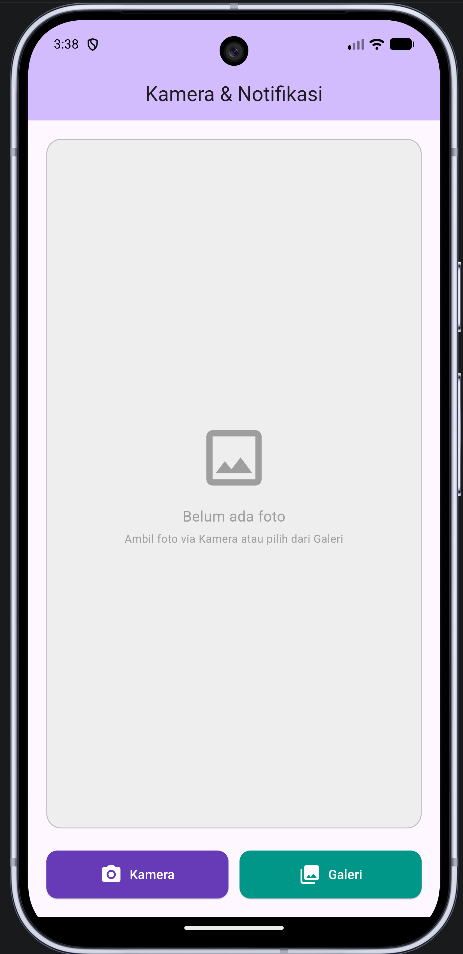
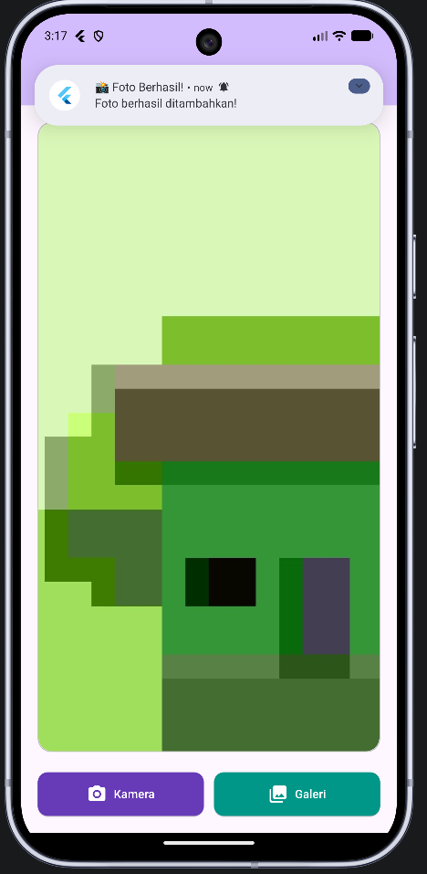

<div align="center">

<br>

# LAPORAN PRAKTIKUM  
# APLIKASI BERBASIS PLATFORM

<br>

## MODUL 08-09
## Mobile - Camera & Notification app

<br>


<br><br>

### Disusun Oleh

**Yoga Hogantara**  
**2311102153**  
**S1 IF-11-REG01**

<br>

### Dosen Pengampu

**Dimas Fanny Hebrasianto Permadi, S.ST., M.Kom**

<br>

### Asisten Praktikum

**Apri Pandu Wicaksono**  
**Rangga Pradarrell Fathi**

<br><br>

### LABORATORIUM HIGH PERFORMANCE  
### FAKULTAS INFORMATIKA  
### UNIVERSITAS TELKOM PURWOKERTO  
### 2026

</div>

---

# Laporan Praktikum Modul 8-9
## Notifikasi & API Perangkat Keras

---

## Dasar Teori

Flutter merupakan framework multiplatform yang memungkinkan pengembang membangun aplikasi Android, iOS, web, dan desktop hanya dengan satu basis kode. Pada praktikum Modul 8-9 ini, aplikasi yang dibuat adalah **Camera & Notification App**, yaitu aplikasi yang menggabungkan dua fitur utama: pengambilan foto menggunakan kamera atau galeri, serta menampilkan notifikasi lokal setelah foto berhasil dipilih.

### Camera & Image Picker

Flutter tidak memiliki akses kamera secara bawaan, sehingga diperlukan package tambahan yaitu `image_picker`. Package ini memungkinkan aplikasi untuk mengambil foto langsung dari kamera perangkat maupun memilih foto dari galeri. Pengambilan foto dilakukan menggunakan `ImagePicker` dengan memanggil method `pickImage()` yang menerima parameter `source`. Nilai `ImageSource.camera` digunakan untuk membuka kamera, sedangkan `ImageSource.gallery` digunakan untuk membuka galeri. Hasil dari `pickImage()` berupa objek `XFile?` yang kemudian dikonversi menjadi `File` dari package `dart:io` agar dapat ditampilkan menggunakan widget `Image.file`.

Pada implementasi ini, method `pickImage()` juga menerima parameter tambahan seperti `imageQuality: 80` untuk mengompres kualitas gambar dan `maxWidth: 1080` untuk membatasi lebar maksimal gambar, sehingga penggunaan memori lebih efisien.

### Local Notification

Notifikasi lokal pada Flutter diimplementasikan menggunakan package `flutter_local_notifications`. Package ini memungkinkan aplikasi menampilkan notifikasi sistem di perangkat Android maupun iOS tanpa memerlukan koneksi internet atau server. Sebelum notifikasi dapat digunakan, plugin harus diinisialisasi terlebih dahulu menggunakan `FlutterLocalNotificationsPlugin` dengan pengaturan `AndroidInitializationSettings`. Inisialisasi dilakukan di dalam fungsi `main()` sebelum `runApp()` dipanggil agar plugin siap digunakan sebelum aplikasi berjalan.

Pada Android 13 ke atas, aplikasi wajib meminta izin notifikasi secara eksplisit menggunakan `requestNotificationsPermission()` yang dipanggil melalui `resolvePlatformSpecificImplementation<AndroidFlutterLocalNotificationsPlugin>()`. Notifikasi ditampilkan menggunakan method `show()` yang menerima parameter ID notifikasi, judul, isi pesan, dan detail notifikasi berupa `NotificationDetails`.

### StatefulWidget dan setState

Karena tampilan aplikasi perlu diperbarui ketika foto dipilih (menampilkan foto yang baru diambil), halaman utama menggunakan `StatefulWidget`. Setiap kali foto berhasil dipilih, variabel `_imageFile` diperbarui menggunakan `setState()` sehingga widget `Image.file` otomatis merender ulang tampilan dengan foto terbaru. Selain itu, variabel `_isLoading` digunakan untuk mengelola state loading indicator selama proses pengambilan foto berlangsung.

---

## Code Program

```dart
import 'dart:io';

import 'package:flutter/material.dart';
import 'package:flutter_local_notifications/flutter_local_notifications.dart';
import 'package:image_picker/image_picker.dart';


final FlutterLocalNotificationsPlugin flutterLocalNotificationsPlugin =
    FlutterLocalNotificationsPlugin();

Future<void> main() async {
  // Pastikan binding Flutter sudah siap sebelum inisialisasi plugin
  WidgetsFlutterBinding.ensureInitialized();

  // ── Konfigurasi Android Initialization Settings ──
  const AndroidInitializationSettings initSettingsAndroid =
      AndroidInitializationSettings('@mipmap/ic_launcher'); // Ikon notifikasi

  // ── Gabungkan semua platform settings ──
  const InitializationSettings initSettings = InitializationSettings(
    android: initSettingsAndroid,
  );

  // ── Inisialisasi plugin ──
  await flutterLocalNotificationsPlugin.initialize(initSettings);

  // ── Minta permission notifikasi (Android 13+) ──
  await flutterLocalNotificationsPlugin
      .resolvePlatformSpecificImplementation<
          AndroidFlutterLocalNotificationsPlugin>()
      ?.requestNotificationsPermission();

  runApp(const MyApp());
}

// ROOT APP
class MyApp extends StatelessWidget {
  const MyApp({super.key});

  @override
  Widget build(BuildContext context) {
    return MaterialApp(
      title: 'Kamera & Notifikasi',
      debugShowCheckedModeBanner: false,
      theme: ThemeData(
        colorScheme: ColorScheme.fromSeed(seedColor: Colors.deepPurple),
        useMaterial3: true,
      ),
      home: const FotoPickerPage(),
    );
  }
}

// HALAMAN UTAMA
class FotoPickerPage extends StatefulWidget {
  const FotoPickerPage({super.key});

  @override
  State<FotoPickerPage> createState() => _FotoPickerPageState();
}

class _FotoPickerPageState extends State<FotoPickerPage> {
  File? _imageFile; // Menyimpan file foto yang dipilih
  bool _isLoading = false; // Indikator loading saat mengambil foto

  final ImagePicker _picker = ImagePicker(); // Instance ImagePicker

  // Ambil foto dari Kamera atau Galeri
  Future<void> _pickImage(ImageSource source) async {
    setState(() => _isLoading = true);

    try {
      // Membuka kamera atau galeri sesuai [source]
      final XFile? pickedFile = await _picker.pickImage(
        source: source,
        imageQuality: 80, // Kompres kualitas gambar (0-100)
        maxWidth: 1080, // Batasi lebar maksimal
      );

      if (pickedFile != null) {
        // Jika foto berhasil dipilih, update state
        setState(() {
          _imageFile = File(pickedFile.path);
        });

        // Tampilkan notifikasi lokal setelah foto berhasil dimuat
        await _showNotification();
      }
    } catch (e) {
      // Tampilkan error jika terjadi masalah (misal: permission ditolak)
      if (mounted) {
        ScaffoldMessenger.of(context).showSnackBar(
          SnackBar(
            content: Text('Gagal mengambil foto: $e'),
            backgroundColor: Colors.red,
          ),
        );
      }
    } finally {
      // Selalu matikan loading indicator setelah selesai
      if (mounted) setState(() => _isLoading = false);
    }
  }

  // Tampilkan Notifikasi Lokal
  Future<void> _showNotification() async {
    // Konfigurasi detail notifikasi untuk Android
    const AndroidNotificationDetails androidDetails =
        AndroidNotificationDetails(
      'foto_channel_id', // Channel ID (unik)
      'Notifikasi Foto', // Nama channel (tampil di pengaturan HP)
      channelDescription: 'Notifikasi saat foto berhasil ditambahkan',
      importance: Importance.high, // Prioritas notifikasi
      priority: Priority.high,
      icon: '@mipmap/ic_launcher', // Ikon notifikasi
      playSound: true, // Mainkan suara
    );

    // Gabungkan detail untuk semua platform
    const NotificationDetails notificationDetails = NotificationDetails(
      android: androidDetails,
    );

    // Tampilkan notifikasi
    await flutterLocalNotificationsPlugin.show(
      0, // ID notifikasi (0 = selalu timpa notif sebelumnya)
      '📸 Foto Berhasil!', // Judul notifikasi
      'Foto berhasil ditambahkan!', // Isi pesan notifikasi
      notificationDetails,
    );
  }

  // BUILD UI
  @override
  Widget build(BuildContext context) {
    return Scaffold(
      appBar: AppBar(
        title: const Text('Kamera & Notifikasi'),
        backgroundColor: Theme.of(context).colorScheme.inversePrimary,
        centerTitle: true,
      ),
      body: Padding(
        padding: const EdgeInsets.all(20.0),
        child: Column(
          children: [
            // ── Area Tampilan Foto ──
            Expanded(
              child: Container(
                width: double.infinity,
                decoration: BoxDecoration(
                  color: Colors.grey.shade200,
                  borderRadius: BorderRadius.circular(16),
                  border: Border.all(color: Colors.grey.shade400),
                ),
                child: _buildImagePreview(),
              ),
            ),

            const SizedBox(height: 24),

            // ── Tombol Kamera & Galeri ──
            Row(
              children: [
                // Tombol Kamera
                Expanded(
                  child: ElevatedButton.icon(
                    onPressed: _isLoading
                        ? null // Nonaktifkan saat loading
                        : () => _pickImage(ImageSource.camera),
                    icon: const Icon(Icons.camera_alt_rounded),
                    label: const Text('Kamera'),
                    style: ElevatedButton.styleFrom(
                      backgroundColor: Colors.deepPurple,
                      foregroundColor: Colors.white,
                      padding: const EdgeInsets.symmetric(vertical: 14),
                      shape: RoundedRectangleBorder(
                        borderRadius: BorderRadius.circular(12),
                      ),
                    ),
                  ),
                ),

                const SizedBox(width: 12),

                // Tombol Galeri
                Expanded(
                  child: ElevatedButton.icon(
                    onPressed: _isLoading
                        ? null
                        : () => _pickImage(ImageSource.gallery),
                    icon: const Icon(Icons.photo_library_rounded),
                    label: const Text('Galeri'),
                    style: ElevatedButton.styleFrom(
                      backgroundColor: Colors.teal,
                      foregroundColor: Colors.white,
                      padding: const EdgeInsets.symmetric(vertical: 14),
                      shape: RoundedRectangleBorder(
                        borderRadius: BorderRadius.circular(12),
                      ),
                    ),
                  ),
                ),
              ],
            ),
          ],
        ),
      ),
    );
  }

  // WIDGET HELPER: Preview Gambar / Placeholder
  Widget _buildImagePreview() {
    // Tampilkan loading indicator
    if (_isLoading) {
      return const Center(
        child: Column(
          mainAxisAlignment: MainAxisAlignment.center,
          children: [
            CircularProgressIndicator(),
            SizedBox(height: 12),
            Text('Memuat foto...'),
          ],
        ),
      );
    }

    // Tampilkan foto jika sudah ada
    if (_imageFile != null) {
      return ClipRRect(
        borderRadius: BorderRadius.circular(16),
        child: Image.file(
          _imageFile!,
          fit: BoxFit.cover,
          width: double.infinity,
          height: double.infinity,
        ),
      );
    }

    // Tampilkan placeholder jika belum ada foto
    return const Center(
      child: Column(
        mainAxisAlignment: MainAxisAlignment.center,
        children: [
          Icon(Icons.image_outlined, size: 80, color: Colors.grey),
          SizedBox(height: 12),
          Text(
            'Belum ada foto',
            style: TextStyle(color: Colors.grey, fontSize: 16),
          ),
          SizedBox(height: 4),
          Text(
            'Ambil foto via Kamera atau pilih dari Galeri',
            style: TextStyle(color: Colors.grey, fontSize: 12),
            textAlign: TextAlign.center,
          ),
        ],
      ),
    );
  }
}
```

---

## Penjelasan Singkat Tiap Widget

### `WidgetsFlutterBinding.ensureInitialized()`
Dipanggil di awal fungsi `main()` sebelum operasi asynchronous apapun. Memastikan binding Flutter sudah siap sebelum plugin seperti `flutter_local_notifications` diinisialisasi. Wajib ada ketika `main()` bersifat `async`.

### `FlutterLocalNotificationsPlugin`
Objek global dari package `flutter_local_notifications` yang dideklarasikan di luar fungsi `main()` agar dapat diakses secara global oleh seluruh bagian aplikasi, termasuk method `_showNotification()` di dalam class `_FotoPickerPageState`.

### `AndroidInitializationSettings`
Konfigurasi inisialisasi notifikasi untuk platform Android. Menerima nama ikon yang digunakan sebagai ikon notifikasi, dalam hal ini `'@mipmap/ic_launcher'` yaitu ikon bawaan aplikasi.

### `InitializationSettings`
Menggabungkan pengaturan inisialisasi dari semua platform yang didukung. Pada aplikasi ini hanya menggunakan konfigurasi Android (`android: initSettingsAndroid`).

### `requestNotificationsPermission()`
Dipanggil melalui `resolvePlatformSpecificImplementation<AndroidFlutterLocalNotificationsPlugin>()` untuk meminta izin notifikasi secara eksplisit kepada pengguna. Wajib dilakukan pada Android 13 (API 33) ke atas agar notifikasi dapat ditampilkan.

### `AndroidNotificationDetails`
Konfigurasi yang menentukan detail notifikasi Android, antara lain:
- `'foto_channel_id'` — Channel ID unik yang diperlukan oleh Android 8.0 ke atas.
- `'Notifikasi Foto'` — Nama channel yang tampil di pengaturan notifikasi perangkat.
- `channelDescription` — Deskripsi channel notifikasi.
- `importance: Importance.high` dan `priority: Priority.high` — Mengatur agar notifikasi muncul sebagai heads-up notification.
- `playSound: true` — Memainkan suara default saat notifikasi muncul.

### `flutterLocalNotificationsPlugin.show()`
Method yang menampilkan notifikasi ke sistem. Menerima parameter ID notifikasi (`0` agar notifikasi baru selalu menimpa notifikasi sebelumnya), judul `'📸 Foto Berhasil!'`, isi pesan `'Foto berhasil ditambahkan!'`, dan objek `NotificationDetails`.

### `MaterialApp`
Widget root aplikasi yang mengatur konfigurasi global seperti judul `'Kamera & Notifikasi'`, tema Material 3 dengan warna seed `Colors.deepPurple`, dan halaman awal `FotoPickerPage`. Properti `debugShowCheckedModeBanner: false` menghilangkan banner debug di pojok kanan atas.

### `Scaffold`
Kerangka dasar halaman yang menyediakan struktur layout Material Design berupa `AppBar` sebagai header dan `body` sebagai konten utama.

### `AppBar`
Header halaman yang menampilkan judul `'Kamera & Notifikasi'` di tengah (`centerTitle: true`) dengan warna latar belakang `inversePrimary` dari tema aplikasi.

### `Padding`
Widget pembungkus yang memberikan jarak 20 piksel di seluruh sisi konten utama agar tidak terlalu rapat ke tepi layar.

### `Column`
Widget layout yang menyusun widget-widget anaknya secara vertikal. Digunakan sebagai layout utama body untuk menyusun area foto dan baris tombol secara berurutan.

### `Expanded`
Membuat `Container` area foto mengisi sisa ruang yang tersedia di dalam `Column` secara fleksibel, sehingga tampilan foto tidak memiliki tinggi yang tetap dan menyesuaikan ukuran layar.

### `Container` (Area Tampilan Foto)
Wadah utama untuk menampilkan foto. Memiliki dekorasi berupa warna abu-abu terang (`Colors.grey.shade200`), sudut melengkung (`BorderRadius.circular(16)`), dan border abu-abu. Kontennya dikelola oleh method helper `_buildImagePreview()`.

### `_buildImagePreview()` (Method Helper)
Method yang mengembalikan widget berbeda tergantung state:
- **Loading** (`_isLoading == true`): Menampilkan `CircularProgressIndicator` dan teks "Memuat foto...".
- **Ada foto** (`_imageFile != null`): Menampilkan foto menggunakan `Image.file` dibungkus `ClipRRect`.
- **Belum ada foto**: Menampilkan placeholder berupa `Icon` dan teks instruksi.

### `CircularProgressIndicator`
Widget indikator loading berbentuk lingkaran berputar yang ditampilkan saat proses pengambilan foto sedang berlangsung (`_isLoading == true`), memberikan umpan balik visual kepada pengguna bahwa aplikasi sedang bekerja.

### `ClipRRect`
Memotong tampilan widget anaknya mengikuti bentuk persegi dengan sudut melengkung (`BorderRadius.circular(16)`). Digunakan agar foto yang ditampilkan memiliki sudut membulat sesuai `Container` pembungkusnya.

### `Image.file`
Widget untuk menampilkan gambar dari file lokal perangkat. Menerima objek `File` hasil konversi dari `XFile`. Properti `fit: BoxFit.cover` memastikan foto mengisi seluruh area tampilan tanpa distorsi.

### `Row`
Widget layout yang menyusun dua tombol (Kamera dan Galeri) secara horizontal berdampingan, masing-masing dibungkus widget `Expanded` agar kedua tombol memiliki lebar yang sama.

### `ElevatedButton.icon` (Tombol Kamera)
Tombol berlabel `'Kamera'` dengan ikon `Icons.camera_alt_rounded`. Memiliki latar belakang ungu (`Colors.deepPurple`) dan sudut melengkung. Ketika ditekan, memanggil `_pickImage(ImageSource.camera)` untuk membuka kamera. Dinonaktifkan (`onPressed: null`) saat `_isLoading` bernilai `true`.

### `ElevatedButton.icon` (Tombol Galeri)
Tombol berlabel `'Galeri'` dengan ikon `Icons.photo_library_rounded`. Memiliki latar belakang teal (`Colors.teal`) dan sudut melengkung. Ketika ditekan, memanggil `_pickImage(ImageSource.gallery)` untuk membuka galeri. Juga dinonaktifkan saat proses loading berlangsung.

### `ImagePicker`
Instance dari package `image_picker` yang tersimpan sebagai field `_picker`. Method `pickImage()` mengembalikan `XFile?` (nullable) dengan parameter `source`, `imageQuality: 80`, dan `maxWidth: 1080`.

### `ScaffoldMessenger.showSnackBar()`
Menampilkan pesan error sementara di bagian bawah layar menggunakan `SnackBar` berlatar belakang merah apabila terjadi exception saat proses pengambilan foto, misalnya ketika izin kamera ditolak pengguna.

### `setState()`
Digunakan di dua tempat: pertama untuk mengubah `_isLoading` menjadi `true` saat mulai proses pengambilan foto, dan kedua untuk memperbarui `_imageFile` dan mengembalikan `_isLoading` ke `false` setelah proses selesai. `mounted` dicek terlebih dahulu sebelum memanggil `setState()` di dalam blok `catch` dan `finally` untuk menghindari error apabila widget sudah tidak aktif.

---

## Tampilan

### 1. Tampilan Awal (Belum Ada Foto)

` yang menerima parameter `source`. Nilai `ImageSource.camera` digunakan untuk membuka kamera, sedangkan `ImageSource.gallery` digunakan untuk membuka galeri. Hasil dari `pickImage()` berupa objek `XFile?` yang kemudian dikonversi menjadi `File` dari package `dart:io` agar dapat ditampilkan menggunakan widget `Image.file`.

Pada implementasi ini, method `pickImage()` juga menerima parameter tambahan seperti `imageQuality: 80` untuk mengompres kualitas gambar dan `maxWidth: 1080` untuk membatasi lebar maksimal gambar, sehingga penggunaan memori lebih efisien.

### Local Notification

Notifikasi lokal pada Flutter diimplementasikan menggunakan package `flutter_local_notifications`. Package ini memungkinkan aplikasi menampilkan notifikasi sistem di perangkat Android maupun iOS tanpa memerlukan koneksi internet atau server. Sebelum notifikasi dapat digunakan, plugin harus diinisialisasi terlebih dahulu menggunakan `FlutterLocalNotificationsPlugin` dengan pengaturan `AndroidInitializationSettings`. Inisialisasi dilakukan di dalam fungsi `main()` sebelum `runApp()` dipanggil agar plugin siap digunakan sebelum aplikasi berjalan.

Pada Android 13 ke atas, aplikasi wajib meminta izin notifikasi secara eksplisit menggunakan `requestNotificationsPermission()` yang dipanggil melalui `resolvePlatformSpecificImplementation<AndroidFlutterLocalNotificationsPlugin>()`. Notifikasi ditampilkan menggunakan method `show()` yang menerima parameter ID notifikasi, judul, isi pesan, dan detail notifikasi berupa `NotificationDetails`.

### StatefulWidget dan setState

Karena tampilan aplikasi perlu diperbarui ketika foto dipilih (menampilkan foto yang baru diambil), halaman utama menggunakan `StatefulWidget`. Setiap kali foto berhasil dipilih, variabel `_imageFile` diperbarui menggunakan `setState()` sehingga widget `Image.file` otomatis merender ulang tampilan dengan foto terbaru. Selain itu, variabel `_isLoading` digunakan untuk mengelola state loading indicator selama proses pengambilan foto berlangsung.

---

## Code Program

```dart
import 'dart:io';

import 'package:flutter/material.dart';
import 'package:flutter_local_notifications/flutter_local_notifications.dart';
import 'package:image_picker/image_picker.dart';


final FlutterLocalNotificationsPlugin flutterLocalNotificationsPlugin =
    FlutterLocalNotificationsPlugin();

Future<void> main() async {
  // Pastikan binding Flutter sudah siap sebelum inisialisasi plugin
  WidgetsFlutterBinding.ensureInitialized();

  // ── Konfigurasi Android Initialization Settings ──
  const AndroidInitializationSettings initSettingsAndroid =
      AndroidInitializationSettings('@mipmap/ic_launcher'); // Ikon notifikasi

  // ── Gabungkan semua platform settings ──
  const InitializationSettings initSettings = InitializationSettings(
    android: initSettingsAndroid,
  );

  // ── Inisialisasi plugin ──
  await flutterLocalNotificationsPlugin.initialize(initSettings);

  // ── Minta permission notifikasi (Android 13+) ──
  await flutterLocalNotificationsPlugin
      .resolvePlatformSpecificImplementation<
          AndroidFlutterLocalNotificationsPlugin>()
      ?.requestNotificationsPermission();

  runApp(const MyApp());
}

// ROOT APP
class MyApp extends StatelessWidget {
  const MyApp({super.key});

  @override
  Widget build(BuildContext context) {
    return MaterialApp(
      title: 'Kamera & Notifikasi',
      debugShowCheckedModeBanner: false,
      theme: ThemeData(
        colorScheme: ColorScheme.fromSeed(seedColor: Colors.deepPurple),
        useMaterial3: true,
      ),
      home: const FotoPickerPage(),
    );
  }
}

// HALAMAN UTAMA
class FotoPickerPage extends StatefulWidget {
  const FotoPickerPage({super.key});

  @override
  State<FotoPickerPage> createState() => _FotoPickerPageState();
}

class _FotoPickerPageState extends State<FotoPickerPage> {
  File? _imageFile; // Menyimpan file foto yang dipilih
  bool _isLoading = false; // Indikator loading saat mengambil foto

  final ImagePicker _picker = ImagePicker(); // Instance ImagePicker

  // Ambil foto dari Kamera atau Galeri
  Future<void> _pickImage(ImageSource source) async {
    setState(() => _isLoading = true);

    try {
      // Membuka kamera atau galeri sesuai [source]
      final XFile? pickedFile = await _picker.pickImage(
        source: source,
        imageQuality: 80, // Kompres kualitas gambar (0-100)
        maxWidth: 1080, // Batasi lebar maksimal
      );

      if (pickedFile != null) {
        // Jika foto berhasil dipilih, update state
        setState(() {
          _imageFile = File(pickedFile.path);
        });

        // Tampilkan notifikasi lokal setelah foto berhasil dimuat
        await _showNotification();
      }
    } catch (e) {
      // Tampilkan error jika terjadi masalah (misal: permission ditolak)
      if (mounted) {
        ScaffoldMessenger.of(context).showSnackBar(
          SnackBar(
            content: Text('Gagal mengambil foto: $e'),
            backgroundColor: Colors.red,
          ),
        );
      }
    } finally {
      // Selalu matikan loading indicator setelah selesai
      if (mounted) setState(() => _isLoading = false);
    }
  }

  // Tampilkan Notifikasi Lokal
  Future<void> _showNotification() async {
    // Konfigurasi detail notifikasi untuk Android
    const AndroidNotificationDetails androidDetails =
        AndroidNotificationDetails(
      'foto_channel_id', // Channel ID (unik)
      'Notifikasi Foto', // Nama channel (tampil di pengaturan HP)
      channelDescription: 'Notifikasi saat foto berhasil ditambahkan',
      importance: Importance.high, // Prioritas notifikasi
      priority: Priority.high,
      icon: '@mipmap/ic_launcher', // Ikon notifikasi
      playSound: true, // Mainkan suara
    );

    // Gabungkan detail untuk semua platform
    const NotificationDetails notificationDetails = NotificationDetails(
      android: androidDetails,
    );

    // Tampilkan notifikasi
    await flutterLocalNotificationsPlugin.show(
      0, // ID notifikasi (0 = selalu timpa notif sebelumnya)
      '📸 Foto Berhasil!', // Judul notifikasi
      'Foto berhasil ditambahkan!', // Isi pesan notifikasi
      notificationDetails,
    );
  }

  // BUILD UI
  @override
  Widget build(BuildContext context) {
    return Scaffold(
      appBar: AppBar(
        title: const Text('Kamera & Notifikasi'),
        backgroundColor: Theme.of(context).colorScheme.inversePrimary,
        centerTitle: true,
      ),
      body: Padding(
        padding: const EdgeInsets.all(20.0),
        child: Column(
          children: [
            // ── Area Tampilan Foto ──
            Expanded(
              child: Container(
                width: double.infinity,
                decoration: BoxDecoration(
                  color: Colors.grey.shade200,
                  borderRadius: BorderRadius.circular(16),
                  border: Border.all(color: Colors.grey.shade400),
                ),
                child: _buildImagePreview(),
              ),
            ),

            const SizedBox(height: 24),

            // ── Tombol Kamera & Galeri ──
            Row(
              children: [
                // Tombol Kamera
                Expanded(
                  child: ElevatedButton.icon(
                    onPressed: _isLoading
                        ? null // Nonaktifkan saat loading
                        : () => _pickImage(ImageSource.camera),
                    icon: const Icon(Icons.camera_alt_rounded),
                    label: const Text('Kamera'),
                    style: ElevatedButton.styleFrom(
                      backgroundColor: Colors.deepPurple,
                      foregroundColor: Colors.white,
                      padding: const EdgeInsets.symmetric(vertical: 14),
                      shape: RoundedRectangleBorder(
                        borderRadius: BorderRadius.circular(12),
                      ),
                    ),
                  ),
                ),

                const SizedBox(width: 12),

                // Tombol Galeri
                Expanded(
                  child: ElevatedButton.icon(
                    onPressed: _isLoading
                        ? null
                        : () => _pickImage(ImageSource.gallery),
                    icon: const Icon(Icons.photo_library_rounded),
                    label: const Text('Galeri'),
                    style: ElevatedButton.styleFrom(
                      backgroundColor: Colors.teal,
                      foregroundColor: Colors.white,
                      padding: const EdgeInsets.symmetric(vertical: 14),
                      shape: RoundedRectangleBorder(
                        borderRadius: BorderRadius.circular(12),
                      ),
                    ),
                  ),
                ),
              ],
            ),
          ],
        ),
      ),
    );
  }

  // WIDGET HELPER: Preview Gambar / Placeholder
  Widget _buildImagePreview() {
    // Tampilkan loading indicator
    if (_isLoading) {
      return const Center(
        child: Column(
          mainAxisAlignment: MainAxisAlignment.center,
          children: [
            CircularProgressIndicator(),
            SizedBox(height: 12),
            Text('Memuat foto...'),
          ],
        ),
      );
    }

    // Tampilkan foto jika sudah ada
    if (_imageFile != null) {
      return ClipRRect(
        borderRadius: BorderRadius.circular(16),
        child: Image.file(
          _imageFile!,
          fit: BoxFit.cover,
          width: double.infinity,
          height: double.infinity,
        ),
      );
    }

    // Tampilkan placeholder jika belum ada foto
    return const Center(
      child: Column(
        mainAxisAlignment: MainAxisAlignment.center,
        children: [
          Icon(Icons.image_outlined, size: 80, color: Colors.grey),
          SizedBox(height: 12),
          Text(
            'Belum ada foto',
            style: TextStyle(color: Colors.grey, fontSize: 16),
          ),
          SizedBox(height: 4),
          Text(
            'Ambil foto via Kamera atau pilih dari Galeri',
            style: TextStyle(color: Colors.grey, fontSize: 12),
            textAlign: TextAlign.center,
          ),
        ],
      ),
    );
  }
}
```

---

## Penjelasan Singkat Tiap Widget

### `WidgetsFlutterBinding.ensureInitialized()`
Dipanggil di awal fungsi `main()` sebelum operasi asynchronous apapun. Memastikan binding Flutter sudah siap sebelum plugin seperti `flutter_local_notifications` diinisialisasi. Wajib ada ketika `main()` bersifat `async`.

### `FlutterLocalNotificationsPlugin`
Objek global dari package `flutter_local_notifications` yang dideklarasikan di luar fungsi `main()` agar dapat diakses secara global oleh seluruh bagian aplikasi, termasuk method `_showNotification()` di dalam class `_FotoPickerPageState`.

### `AndroidInitializationSettings`
Konfigurasi inisialisasi notifikasi untuk platform Android. Menerima nama ikon yang digunakan sebagai ikon notifikasi, dalam hal ini `'@mipmap/ic_launcher'` yaitu ikon bawaan aplikasi.

### `InitializationSettings`
Menggabungkan pengaturan inisialisasi dari semua platform yang didukung. Pada aplikasi ini hanya menggunakan konfigurasi Android (`android: initSettingsAndroid`).

### `requestNotificationsPermission()`
Dipanggil melalui `resolvePlatformSpecificImplementation<AndroidFlutterLocalNotificationsPlugin>()` untuk meminta izin notifikasi secara eksplisit kepada pengguna. Wajib dilakukan pada Android 13 (API 33) ke atas agar notifikasi dapat ditampilkan.

### `AndroidNotificationDetails`
Konfigurasi yang menentukan detail notifikasi Android, antara lain:
- `'foto_channel_id'` — Channel ID unik yang diperlukan oleh Android 8.0 ke atas.
- `'Notifikasi Foto'` — Nama channel yang tampil di pengaturan notifikasi perangkat.
- `channelDescription` — Deskripsi channel notifikasi.
- `importance: Importance.high` dan `priority: Priority.high` — Mengatur agar notifikasi muncul sebagai heads-up notification.
- `playSound: true` — Memainkan suara default saat notifikasi muncul.

### `flutterLocalNotificationsPlugin.show()`
Method yang menampilkan notifikasi ke sistem. Menerima parameter ID notifikasi (`0` agar notifikasi baru selalu menimpa notifikasi sebelumnya), judul `'📸 Foto Berhasil!'`, isi pesan `'Foto berhasil ditambahkan!'`, dan objek `NotificationDetails`.

### `MaterialApp`
Widget root aplikasi yang mengatur konfigurasi global seperti judul `'Kamera & Notifikasi'`, tema Material 3 dengan warna seed `Colors.deepPurple`, dan halaman awal `FotoPickerPage`. Properti `debugShowCheckedModeBanner: false` menghilangkan banner debug di pojok kanan atas.

### `Scaffold`
Kerangka dasar halaman yang menyediakan struktur layout Material Design berupa `AppBar` sebagai header dan `body` sebagai konten utama.

### `AppBar`
Header halaman yang menampilkan judul `'Kamera & Notifikasi'` di tengah (`centerTitle: true`) dengan warna latar belakang `inversePrimary` dari tema aplikasi.

### `Padding`
Widget pembungkus yang memberikan jarak 20 piksel di seluruh sisi konten utama agar tidak terlalu rapat ke tepi layar.

### `Column`
Widget layout yang menyusun widget-widget anaknya secara vertikal. Digunakan sebagai layout utama body untuk menyusun area foto dan baris tombol secara berurutan.

### `Expanded`
Membuat `Container` area foto mengisi sisa ruang yang tersedia di dalam `Column` secara fleksibel, sehingga tampilan foto tidak memiliki tinggi yang tetap dan menyesuaikan ukuran layar.

### `Container` (Area Tampilan Foto)
Wadah utama untuk menampilkan foto. Memiliki dekorasi berupa warna abu-abu terang (`Colors.grey.shade200`), sudut melengkung (`BorderRadius.circular(16)`), dan border abu-abu. Kontennya dikelola oleh method helper `_buildImagePreview()`.

### `_buildImagePreview()` (Method Helper)
Method yang mengembalikan widget berbeda tergantung state:
- **Loading** (`_isLoading == true`): Menampilkan `CircularProgressIndicator` dan teks "Memuat foto...".
- **Ada foto** (`_imageFile != null`): Menampilkan foto menggunakan `Image.file` dibungkus `ClipRRect`.
- **Belum ada foto**: Menampilkan placeholder berupa `Icon` dan teks instruksi.

### `CircularProgressIndicator`
Widget indikator loading berbentuk lingkaran berputar yang ditampilkan saat proses pengambilan foto sedang berlangsung (`_isLoading == true`), memberikan umpan balik visual kepada pengguna bahwa aplikasi sedang bekerja.

### `ClipRRect`
Memotong tampilan widget anaknya mengikuti bentuk persegi dengan sudut melengkung (`BorderRadius.circular(16)`). Digunakan agar foto yang ditampilkan memiliki sudut membulat sesuai `Container` pembungkusnya.

### `Image.file`
Widget untuk menampilkan gambar dari file lokal perangkat. Menerima objek `File` hasil konversi dari `XFile`. Properti `fit: BoxFit.cover` memastikan foto mengisi seluruh area tampilan tanpa distorsi.

### `Row`
Widget layout yang menyusun dua tombol (Kamera dan Galeri) secara horizontal berdampingan, masing-masing dibungkus widget `Expanded` agar kedua tombol memiliki lebar yang sama.

### `ElevatedButton.icon` (Tombol Kamera)
Tombol berlabel `'Kamera'` dengan ikon `Icons.camera_alt_rounded`. Memiliki latar belakang ungu (`Colors.deepPurple`) dan sudut melengkung. Ketika ditekan, memanggil `_pickImage(ImageSource.camera)` untuk membuka kamera. Dinonaktifkan (`onPressed: null`) saat `_isLoading` bernilai `true`.

### `ElevatedButton.icon` (Tombol Galeri)
Tombol berlabel `'Galeri'` dengan ikon `Icons.photo_library_rounded`. Memiliki latar belakang teal (`Colors.teal`) dan sudut melengkung. Ketika ditekan, memanggil `_pickImage(ImageSource.gallery)` untuk membuka galeri. Juga dinonaktifkan saat proses loading berlangsung.

### `ImagePicker`
Instance dari package `image_picker` yang tersimpan sebagai field `_picker`. Method `pickImage()` mengembalikan `XFile?` (nullable) dengan parameter `source`, `imageQuality: 80`, dan `maxWidth: 1080`.

### `ScaffoldMessenger.showSnackBar()`
Menampilkan pesan error sementara di bagian bawah layar menggunakan `SnackBar` berlatar belakang merah apabila terjadi exception saat proses pengambilan foto, misalnya ketika izin kamera ditolak pengguna.

### `setState()`
Digunakan di dua tempat: pertama untuk mengubah `_isLoading` menjadi `true` saat mulai proses pengambilan foto, dan kedua untuk memperbarui `_imageFile` dan mengembalikan `_isLoading` ke `false` setelah proses selesai. `mounted` dicek terlebih dahulu sebelum memanggil `setState()` di dalam blok `catch` dan `finally` untuk menghindari error apabila widget sudah tidak aktif.

---

## Tampilan

### 1. Tampilan Awal (Belum Ada Foto)



### 2. Tampilan Setelah Foto Dipilih dari Galeri



### 3. Notifikasi Setelah Foto Berhasil Dipilih


---

## Kesimpulan

Berdasarkan praktikum yang telah dilakukan, dapat disimpulkan bahwa Flutter mampu mengintegrasikan fitur kamera dan notifikasi lokal menggunakan package eksternal dengan cara yang terstruktur dan efisien. Package `image_picker` memungkinkan aplikasi mengakses kamera dan galeri perangkat melalui satu method `pickImage()` yang fleksibel, sedangkan package `flutter_local_notifications` digunakan untuk menampilkan notifikasi sistem ketika foto berhasil dipilih.

Pada aplikasi ini, inisialisasi plugin notifikasi dilakukan langsung di dalam fungsi `main()` menggunakan `WidgetsFlutterBinding.ensureInitialized()` sebelum `runApp()` dipanggil, sehingga plugin siap digunakan sejak awal aplikasi berjalan. Permintaan izin notifikasi untuk Android 13 ke atas juga ditangani di sini melalui `requestNotificationsPermission()`.

Halaman utama menggunakan `StatefulWidget` dengan dua variabel state: `_imageFile` untuk menyimpan foto yang dipilih, dan `_isLoading` sebagai indikator loading selama proses pengambilan foto. Keduanya diperbarui menggunakan `setState()` sehingga tampilan selalu sinkron dengan kondisi terkini. Pengecekan `mounted` sebelum `setState()` di dalam blok `catch` dan `finally` menjadi praktik penting untuk menghindari error pada widget yang sudah tidak aktif.

Dari praktikum ini, dapat dipahami bahwa penggunaan package eksternal seperti `image_picker` dan `flutter_local_notifications` sangat memperluas kemampuan aplikasi Flutter dalam mengakses fitur perangkat keras dan sistem operasi yang tidak tersedia secara bawaan dalam framework Flutter itu sendiri.)

---

## Kesimpulan

Berdasarkan praktikum yang telah dilakukan, dapat disimpulkan bahwa Flutter mampu mengintegrasikan fitur kamera dan notifikasi lokal menggunakan package eksternal dengan cara yang terstruktur dan efisien. Package `image_picker` memungkinkan aplikasi mengakses kamera dan galeri perangkat melalui satu method `pickImage()` yang fleksibel, sedangkan package `flutter_local_notifications` digunakan untuk menampilkan notifikasi sistem ketika foto berhasil dipilih.

Pada aplikasi ini, inisialisasi plugin notifikasi dilakukan langsung di dalam fungsi `main()` menggunakan `WidgetsFlutterBinding.ensureInitialized()` sebelum `runApp()` dipanggil, sehingga plugin siap digunakan sejak awal aplikasi berjalan. Permintaan izin notifikasi untuk Android 13 ke atas juga ditangani di sini melalui `requestNotificationsPermission()`.

Halaman utama menggunakan `StatefulWidget` dengan dua variabel state: `_imageFile` untuk menyimpan foto yang dipilih, dan `_isLoading` sebagai indikator loading selama proses pengambilan foto. Keduanya diperbarui menggunakan `setState()` sehingga tampilan selalu sinkron dengan kondisi terkini. Pengecekan `mounted` sebelum `setState()` di dalam blok `catch` dan `finally` menjadi praktik penting untuk menghindari error pada widget yang sudah tidak aktif.

Dari praktikum ini, dapat dipahami bahwa penggunaan package eksternal seperti `image_picker` dan `flutter_local_notifications` sangat memperluas kemampuan aplikasi Flutter dalam mengakses fitur perangkat keras dan sistem operasi yang tidak tersedia secara bawaan dalam framework Flutter itu sendiri.