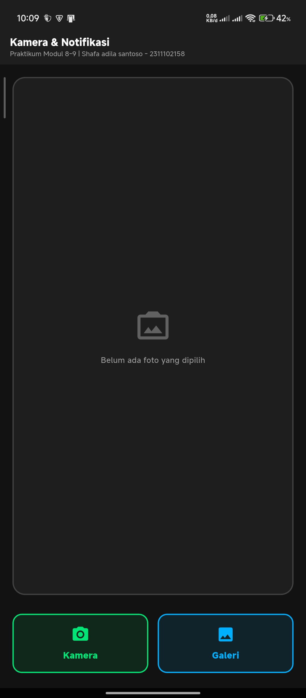
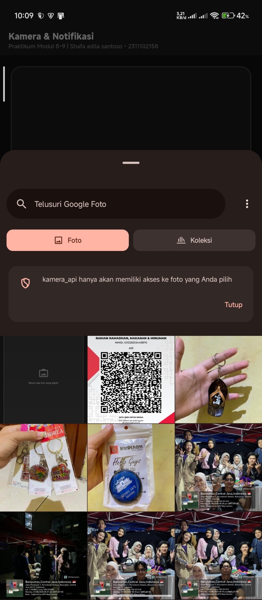
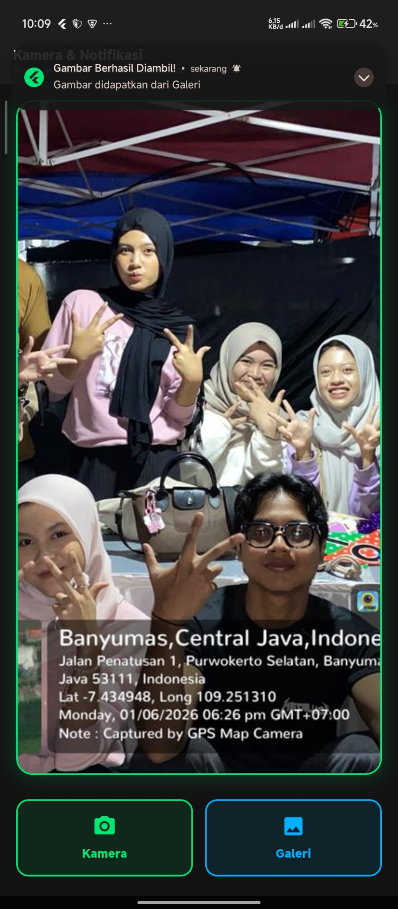
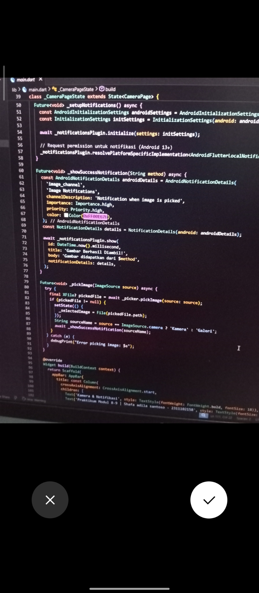
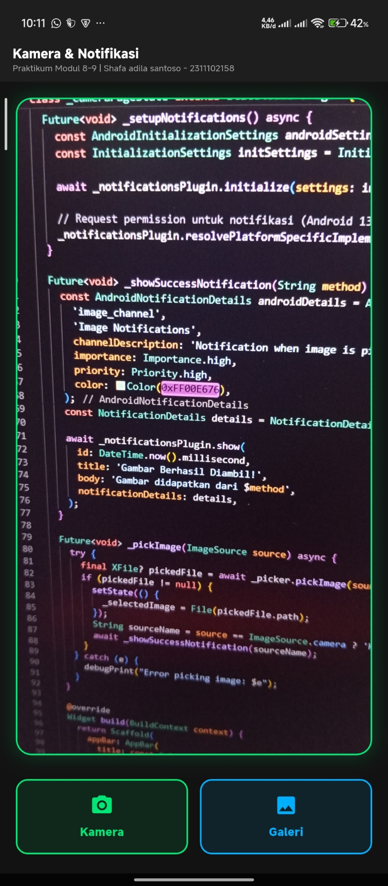

<div align="center">
  <br />
  <h1>LAPORAN PRAKTIKUM <br>APLIKASI BERBASIS PLATFORM</h1>
  <br />
  <h3>MODUL 8-9<br> NOTIFIKASI & API PERANGKAT KERAS <br>(Aplikasi Kamera & Notifikasi)</h3>
  <br />
   
  <br />
  <br />
  <br />
  <h3>Disusun Oleh :</h3>
  <p>
    <strong>SHAFA ADILA SANTOSO</strong><br>
    <strong>2311102158</strong><br>
    <strong>S1 IF-11-REG01</strong>
  </p>
  <br />
  <br />
  <h3>Dosen Pengampu :</h3>
  <p>
    <strong>Dimas Fanny Hebrasianto Permadi, S.ST., M.Kom</strong>
  </p>
  <br />
  <br />
    <h4>Asisten Praktikum :</h4>
    <strong> Apri Pandu Wicaksono </strong> <br>
    <strong>Rangga Pradarrell Fathi</strong>
  <br />
  <h3>LABORATORIUM HIGH PERFORMANCE
 <br>FAKULTAS INFORMATIKA <br>UNIVERSITAS TELKOM PURWOKERTO <br>2026</h3>
</div>

---

## 1. Dasar Teori

### 1.1 Flutter

Flutter adalah framework UI dari Google untuk membuat aplikasi mobile (Android/iOS) menggunakan bahasa Dart. Flutter menerapkan konsep widget sebagai komponen utama untuk membangun tampilan yang atraktif dan responsif.

### 1.2 Image Picker

`image_picker` adalah plugin Flutter yang memungkinkan aplikasi untuk berinteraksi dengan API antarmuka pengguna pada sistem operasi untuk memilih gambar dari galeri perangkat atau mengambil gambar baru secara langsung menggunakan kamera.

### 1.3 Flutter Local Notifications

`flutter_local_notifications` adalah plugin yang digunakan untuk membuat dan menampilkan notifikasi pop-up lokal pada perangkat. Berbeda dengan notifikasi push (seperti Firebase dari server), notifikasi lokal dipicu secara langsung dari dalam sistem kode perangkat itu sendiri.

### 1.4 StatefulWidget & Animasi

Aplikasi ini menggunakan **StatefulWidget** karena memerlukan perubahan *state* saat gambar dipilih (UI perlu di-*rebuild* untuk menampilkan gambar baru). Selain itu, *state* juga diperlukan untuk menjalankan `AnimationController` (Animasi `FadeTransition`) guna menampilkan gambar secara halus.

### 1.5 Widget yang Digunakan

Aplikasi ini menggunakan beberapa widget utama:

- **Scaffold**: kerangka dasar visual halaman aplikasi.
- **Container**: mengelola dekorasi UI (*gradient background*, warna, *border radius*).
- **Column & Row**: menyusun widget secara vertikal dan horizontal.
- **Image.file**: menampilkan file gambar/foto dari sistem memori perangkat.
- **ElevatedButton**: tombol utama berdesain modern untuk memanggil fitur kamera dan galeri.

---

## 2. Implementasi Program

### 2.1 Deskripsi Aplikasi

Aplikasi bertema “Notifikasi & API Perangkat Keras” ini dibuat dengan tujuan memahami fungsionalitas *hardware* dan *service* sistem operasi melalui Flutter. Fitur utama yang diimplementasikan:

1. **Fitur Ambil Foto (Kamera)**: Terdapat tombol "Kamera" untuk mengambil gambar baru menggunakan API kamera perangkat.
2. **Fitur Pilih Foto (Galeri)**: Terdapat tombol "Galeri" untuk memilih foto yang sudah ada dari penyimpanan perangkat.
3. **Penampil Gambar**: Foto yang berhasil dipilih atau diambil akan langsung ditampilkan pada area tengah layar.
4. **Fitur Notifikasi Lokal**: Setelah gambar berhasil didapatkan, sebuah notifikasi pop-up akan muncul dari sistem tray HP yang menginformasikan dari mana asal gambar (Kamera/Galeri).

Saat proses berlangsung:

- Sistem menggunakan class `ImagePicker` untuk menangkap/mengambil objek *File* gambar.
- Melakukan pembaruan state (`setState`) pada variabel `_image`.
- Plugin `flutterLocalNotificationsPlugin.show()` dipanggil untuk mengirim perintah ke *service notification* Android.

---

## 3. Code & Penjelasan

### 3.1 `pubspec.yaml` (Menambahkan Dependensi Plugin API)

Dalam pengembangan aplikasi Flutter yang membutuhkan akses ke fitur sistem operasi (seperti kamera dan notifikasi), kita tidak bisa hanya mengandalkan kode Dart standar. Kita harus mengimpor *library* pihak ketiga yang sudah disediakan oleh komunitas.

```yaml
dependencies:
  flutter:
    sdk: flutter
  image_picker: ^1.2.2 # Plugin untuk memanggil API Kamera & Galeri bawaan OS
  flutter_local_notifications: ^21.0.0 # Plugin untuk membuat notifikasi pop-up sistem
```

**Penjelasan:**

- `image_picker` bertugas menjadi jembatan antara aplikasi Flutter kita dengan aplikasi kamera bawaan HP Android/iOS.
- `flutter_local_notifications` digunakan untuk membangun jendela notifikasi di *notification tray* (layar atas HP) tanpa harus menggunakan layanan internet (notifikasi berjalan secara *offline*).

### 3.2 Konfigurasi Izin Akses Android (`AndroidManifest.xml`)

Sebelum aplikasi diizinkan mengakses perangkat keras, kita diwajibkan mendeklarasikan permohonan izin (permissions) di dalam file pengaturan utama Android.

```xml
<manifest xmlns:android="http://schemas.android.com/apk/res/android">
    <!-- Izin utama untuk mengakses perangkat keras Kamera HP -->
    <uses-permission android:name="android.permission.CAMERA" />
    <!-- Izin khusus Android 13+ untuk memperbolehkan aplikasi mengirim notifikasi -->
    <uses-permission android:name="android.permission.POST_NOTIFICATIONS"/>
```

**Penjelasan:**
Setiap izin memiliki peran penting. Jika izin `CAMERA` tidak disertakan, aplikasi akan *crash* saat tombol kamera ditekan. Demikian juga dengan `POST_NOTIFICATIONS`, jika tidak dicantumkan, sistem Android 13 ke atas akan secara otomatis memblokir notifikasi pop-up.

### 3.3 Inisialisasi Sistem Notifikasi di `main.dart`

Plugin notifikasi membutuhkan persiapan sebelum bisa memunculkan pesan. Inisialisasi ini dilakukan di dalam metode `initState()`, yang artinya kode ini hanya akan dieksekusi satu kali tepat ketika halaman pertama kali dimuat.

```dart
  void _initializeNotifications() async {
    // 1. Membuat instansiasi objek dari class notifikasi
    flutterLocalNotificationsPlugin = FlutterLocalNotificationsPlugin();
  
    // 2. Menentukan ikon apa yang akan muncul di sebelah pesan notifikasi
    // '@mipmap/ic_launcher' berarti menggunakan ikon bawaan aplikasi Flutter
    const AndroidInitializationSettings initializationSettingsAndroid =
        AndroidInitializationSettings('@mipmap/ic_launcher');
      
    // 3. Membungkus pengaturan platform Android ke dalam objek InitializationSettings
    const InitializationSettings initializationSettings = InitializationSettings(
      android: initializationSettingsAndroid,
    );
  
    // 4. Mengeksekusi proses inisialisasi ke sistem operasi
    await flutterLocalNotificationsPlugin.initialize(
      settings: initializationSettings,
    );
  
    // 5. Khusus untuk OS Android terbaru (Android 13+ / API 33+),
    // aplikasi harus memunculkan dialog pop-up yang meminta izin pengguna
    flutterLocalNotificationsPlugin.resolvePlatformSpecificImplementation<
        AndroidFlutterLocalNotificationsPlugin>()?.requestNotificationsPermission();
  }
```

**Penjelasan:**
Proses ini sangat esensial karena *service* notifikasi Android harus mengenali aplikasi mana yang mencoba mengirim pesan. Tanpa inisialisasi ikon (`@mipmap/ic_launcher`), notifikasi bisa gagal tayang karena sistem menolaknya. Pemanggilan `requestNotificationsPermission()` juga menjamin aplikasi mematuhi standar privasi terbaru dari Google.

### 3.4 Proses Pemilihan Gambar dan Reaktivitas UI (`_getImage`)

Fungsi `_getImage` adalah *core logic* yang akan dijalankan ketika pengguna menekan tombol "Kamera" atau "Galeri". Karena proses pengambilan foto bisa memakan waktu (menunggu pengguna menjepret foto), maka fungsinya harus bersifat *asynchronous* (`Future`).

```dart
  Future<void> _pickImage(ImageSource source) async {
    // 1. Menghentikan sementara eksekusi kode di sini, lalu membuka antarmuka kamera/galeri
    // Hasilnya akan disimpan di variabel pickedFile
    final XFile? pickedFile = await _picker.pickImage(source: source);

    // 2. Mengecek apakah pengguna benar-benar mengambil foto atau malah membatalkannya (Back)
    if (pickedFile != null) {
    
      // 3. Mengubah State UI. Karena menggunakan StatefulWidget, pemanggilan setState()
      // akan memaksa layar untuk menggambar ulang (rebuild) dirinya.
      setState(() {
        // Mengubah XFile (format umum) menjadi File (format lokal OS)
        _selectedImage = File(pickedFile.path); 
      });
    
      // 4. Memanggil fungsi _showSuccessNotification untuk memberi tahu pengguna
      // bahwa foto sudah sukses termuat di layar.
      String sourceName = source == ImageSource.camera ? 'Kamera' : 'Galeri';
      await _showSuccessNotification(sourceName);
    }
  }
```

**Penjelasan:**
Penggunaan `await _picker.pickImage()` sangat penting agar aplikasi Flutter tidak *freeze* atau *hang* saat antarmuka kamera HP terbuka. Penggunaan `setState()` juga menjadi kunci mengapa gambar yang awalnya berupa *placeholder* kosong tiba-tiba bisa terisi dengan gambar asli. Tanpa `setState`, meskipun variabel `_selectedImage` sudah berisi data foto, layar tidak akan menyadarinya.

### 3.5 Pembuatan Konstruksi Jendela Notifikasi (`_showNotification`)

Fungsi ini dipanggil sebagai langkah terakhir dari rangkaian aksi pengambilan gambar.

```dart
  Future<void> _showSuccessNotification(String method) async {
    // 1. Membuat konfigurasi spesifik untuk perangkat Android
    const AndroidNotificationDetails androidDetails = AndroidNotificationDetails(
      'image_channel', // ID unik untuk channel notifikasi
      'Image Notifications', // Nama channel yang terlihat di pengaturan HP
      channelDescription: 'Notification when image is picked',
      importance: Importance.high, // Mengatur agar notifikasi diprioritaskan
      priority: Priority.high, // Memaksa notifikasi untuk muncul sebagai pop-up (Heads-up)
      color: Color(0xFF00E676),
    );
  
    // 2. Membungkus pengaturan di atas agar kompatibel secara umum
    const NotificationDetails details = NotificationDetails(android: androidDetails);
  
    // 3. Memicu eksekusi ke sistem OS untuk segera menayangkan notifikasinya
    await _notificationsPlugin.show(
      id: DateTime.now().millisecond, // ID notifikasi
      title: 'Gambar Berhasil Diambil!', // Judul huruf tebal pada notifikasi
      body: 'Gambar didapatkan dari $method', // Isi teks notifikasi
      notificationDetails: details, // Memasukkan konfigurasi dari step 2
    );
  }
```

**Penjelasan:**
Parameter `Importance.high` dan `Priority.high` adalah trik pemrograman agar notifikasi tidak hanya bersembunyi secara diam-diam di menu *tray*, melainkan muncul secara proaktif (*Heads-up Notification*).

---

## 4. Hasil Tampilan (*Output*)

Berikut adalah tangkapan layar (*screenshot*) hasil eksekusi aplikasi API Kamera & Notifikasi:

### 4.1 Halaman Utama (Kondisi Awal / *Default*)


### 4.2 Proses Memilih Foto dari Galeri


### 4.3 Hasil Unggah (*Upload*) dari Galeri


### 4.4 Tampilan Notifikasi (*Pop-Up*)


### 4.5 Proses Mengambil Foto Menggunakan Kamera


### 4.6 Hasil Foto dari Kamera

