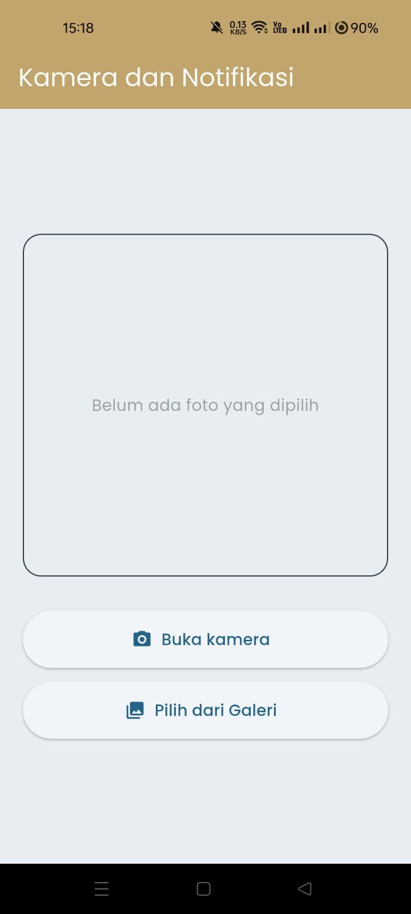
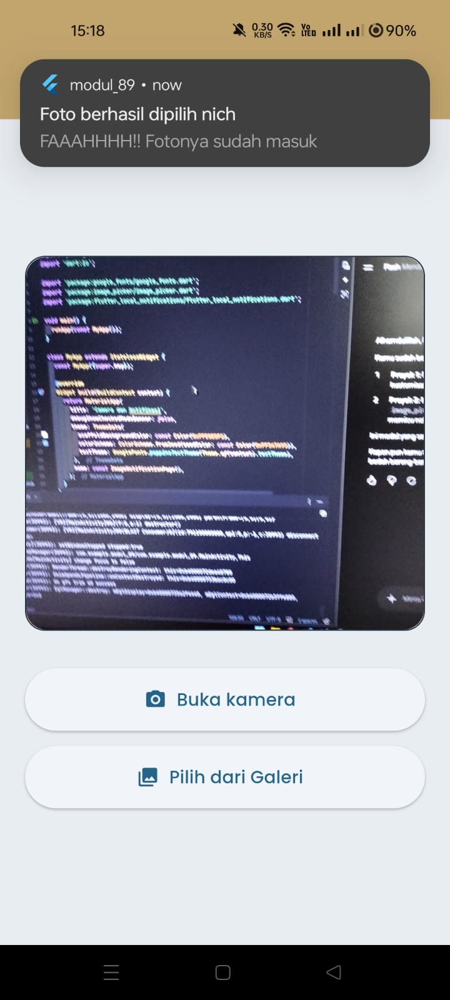
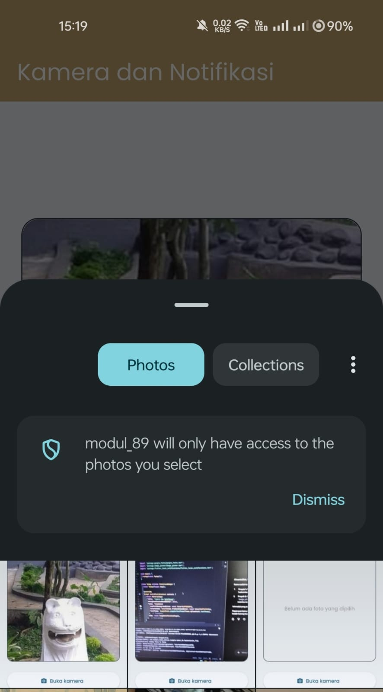
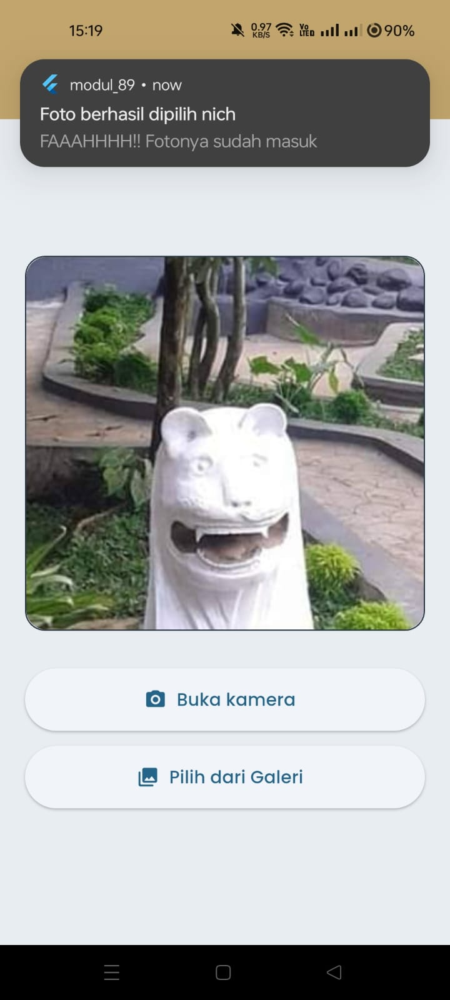

<div align="center">
  <br />

  <h1>LAPORAN PRAKTIKUM <br>
  APLIKASI BERBASIS PLATFORM
  </h1>

  <br />

  <h3>MODUL 8 & 9 <br>
  NAVIGASI DAN NOTIFIKASI
  </h3>

  <br />

  

  <br />
  <br />
  <br />

  <h3>Disusun Oleh :</h3>

  <p>
    <strong>Fahreza Ilham Wicaksono</strong><br>
    <strong>2311102191</strong><br>
    <strong>S1 IF-11-REG01</strong>
  </p>

  <br />

  <h3>Dosen Pengampu :</h3>

  <p>
    <strong>Dimas Fanny Hebrasianto Permadi, S.ST., M.Kom</strong>
  </p>
  
  <br />
  <br />
    <h4>Asisten Praktikum :</h4>
    <strong> Apri Pandu Wicaksono </strong> <br>
    <strong>Rangga Pradarrell Fathi</strong>
  <br />

  <h3>LABORATORIUM HIGH PERFORMANCE
 <br>FAKULTAS INFORMATIKA <br>UNIVERSITAS TELKOM PURWOKERTO <br>2026</h3>
</div>

<hr>

## Tugas

Notifikasi & API Perangkat Keras
Buat aplikasi Flutter sederhana dengan fitur berikut:

1. Ambil Foto
Tampilkan 2 tombol di halaman utama:
• Tombol pertama → buka kamera langsung (Camera API)
• Tombol kedua → pilih foto dari galeri (image_picker)
Foto yang diambil/dipilih ditampilkan di halaman yang sama.

2. Notifikasi

Setelah foto berhasil diambil atau dipilih, tampilkan notifikasi lokal menggunakan flutter_local_notifications dengan isi pesan bebas.

Output yang dikumpulkan meliputi:

- Screenshot hasilnya
- Source code
- Penjelasan singkat tiap widget

## Pengerjaan

Aplikasi ini merupakan aplikasi sederhana untuk menampilkan foto yang diambil dari kamera atau galeri. Di dalam aplikasi terdapat beberapa tombol seperti tombol untuk mengambil foto secara langsung dan tombol untuk memilih gambar dari galeri.

### MyApp

```dart
class MyApp extends StatelessWidget {
  const MyApp({super.key});

  @override
  Widget build(BuildContext context) {
    return MaterialApp(
      title: 'Camera dan Notifikasi',
      debugShowCheckedModeBanner: false,
      theme: ThemeData(
        scaffoldBackgroundColor: const Color(0xFFE8EDF2),
        colorScheme: ColorScheme.fromSeed(seedColor: const Color(0xFF547A95)),
        textTheme: GoogleFonts.poppinsTextTheme(Theme.of(context).textTheme),
      ),
      home: const ImageNotificationPage(),
    );
  }
}
```

Class `MyApp` berfungsi sebagai root aplikasi yang mengatur tampilan dasar aplikasi sebelum halaman utama ditampilkan. Pada bagian `MaterialApp`, aplikasi diberikan judul Camera dan Notifikasi serta menonaktifkan banner debug menggunakan `debugShowCheckedModeBanner: false`. Tema aplikasi diatur menggunakan `ThemeData` dengan warna latar belakang utama berwarna terang dan skema warna yang dibuat dari warna dasar tertentu menggunakan `ColorScheme.fromSeed`.Tampilan teks aplikasi menggunakan font `Poppins` melalui `GoogleFonts.poppinsTextTheme`. Setelah seluruh konfigurasi selesai, aplikasi akan langsung membuka halaman `ImageNotificationPage` sebagai halaman utama.

### ImageNotificationPage

```dart
class ImageNotificationPage extends StatefulWidget {
  const ImageNotificationPage({super.key});

  @override
  State<ImageNotificationPage> createState() => _ImageNotificationPageState();
}
```

Class `ImageNotificationPage` merupakan `StatefulWidget` yang digunakan untuk menampilkan halaman utama aplikasi kamera dan notifikasi. Penggunaan `StatefulWidget` memungkinkan halaman dapat berubah secara dinamis, misalnya saat gambar berhasil dipilih lalu ditampilkan ke layar. Class ini hanya bertugas membuat state melalui `createState`, sedangkan seluruh logika aplikasi diproses pada class `_ImageNotificationPageState`.

#### _ImageNotificationPageState

```dart
class _ImageNotificationPageState extends State<ImageNotificationPage> {
  File? _selectedImage;

  final ImagePicker _picker = ImagePicker();
  final FlutterLocalNotificationsPlugin _localNotificationsPlugin = FlutterLocalNotificationsPlugin();

  // Inisialisasi
  @override
  void initState() {
    super.initState();
    _initNotifications();
  }
  
  // Fungsi untuk setup dan izin notifikasi
  Future<void> _initNotifications() async {
    const AndroidInitializationSettings androidInitializationSettings =
        AndroidInitializationSettings('@mipmap/ic_launcher');

    const InitializationSettings initializationSettings = InitializationSettings(
      android: androidInitializationSettings
    );

    //  Jalankan init
    await _localNotificationsPlugin.initialize(initializationSettings);

    // Izin notifikasi
    await _localNotificationsPlugin
    .resolvePlatformSpecificImplementation<AndroidFlutterLocalNotificationsPlugin>()
    ?.requestNotificationsPermission();
  }

  // Fungsi untuk menampilkan notifikasi lokal
  Future<void> _showNotification() async {
    const AndroidNotificationDetails androidNotificationDetails =
        AndroidNotificationDetails(
          'channel_foto_id',
          'FAAAHHHH Notifikasi Foto',
          channelDescription: 'FAAHHH Foto berhasil dipilih',
          importance: Importance.max,
          priority: Priority.high,
          ticker: 'ticker',
        );

    const NotificationDetails notificationDetails = NotificationDetails(
      android: androidNotificationDetails,
    );

    // Menampilkan notifikasi secara langsung
    await _localNotificationsPlugin.show(
      0,
      'Foto berhasil dipilih nich',
      'FAAAHHHH!! Fotonya sudah masuk',
      notificationDetails,
    );
  }

  // Fungsi untuk mengambil fotp
  Future<void> _pickImage(ImageSource source) async {
    try {
      final XFile? pickedFile = await _picker.pickImage(
        source: source,
        imageQuality: 80,
      );

      if (pickedFile != null) {
        setState(() {
          _selectedImage = File(pickedFile.path);
        });

        // Panggil notifikasi
        await _showNotification();
      }
    } catch (error) {
      debugPrint('Error mengambil gambar: $error');
    }
  }

  @override
  Widget build(BuildContext context) {
    return Scaffold(
      appBar: AppBar(
        title: const Text('Kamera dan Notifikasi'),
        backgroundColor: const Color(0xFFC2A56D),
        foregroundColor: Colors.white,
      ),
      body: Padding(
        padding: const EdgeInsets.all(20.0),
        child: Column(
          mainAxisAlignment: MainAxisAlignment.center,
          children: [
            Container(
              width: double.infinity,
              height: 300,
              decoration: BoxDecoration(
                color: const Color(0xFFE8EDF2),
                borderRadius: BorderRadius.circular(16),
                border: Border.all(color: const Color(0xFF2C3947)),
              ),
              child: _selectedImage != null
                  ? ClipRRect(
                      borderRadius: BorderRadius.circular(16),
                      child: Image.file(_selectedImage!, fit: BoxFit.cover),
                    )
                  : const Center(
                      child: Text(
                        'Belum ada foto yang dipilih',
                        style: TextStyle(color: Colors.grey),
                      ),
                    ),
            ),
            const SizedBox(height: 30),

            // Tombol buka kamera
            ElevatedButton.icon(
              onPressed: () => _pickImage(ImageSource.camera), // parameter source kamera
              icon: const Icon(Icons.camera_alt_rounded),
              label: const Text('Buka kamera'),
              style: ElevatedButton.styleFrom(
                minimumSize: const Size(double.infinity, 50),
              ),
            ),
            const SizedBox(height: 12),

            // Tombol ambil dari galeri
            ElevatedButton.icon(
              onPressed: () => _pickImage(ImageSource.gallery), // parameter source galeri
              icon: const Icon(Icons.photo_library_rounded),
              label: const Text('Pilih dari Galeri'),
              style: ElevatedButton.styleFrom(
                minimumSize: const Size(double.infinity, 50),
              ),
            ),
          ],
        ),
      ),
    );
  }
}
```

Class `_ImageNotificationPageState` berisi seluruh logika utama aplikasi, mulai dari pengambilan gambar, pengelolaan notifikasi, hingga menampilkan hasil gambar ke halaman. Variabel `_selectedImage` digunakan untuk menyimpan gambar yang dipilih pengguna dalam bentuk file. Selain itu, terdapat objek `_picker` dari `ImagePicker` yang digunakan untuk membuka kamera atau galeri, serta `_localNotificationsPlugin` yang digunakan untuk mengatur dan menampilkan notifikasi lokal pada perangkat. Berikut penjelasan fungsi-fungsi didalam `_ImageNotificationPageState`:

1. Fungsi `initState()`
Dijalankan pertama kali saat halaman dibuka. Pada fungsi ini aplikasi langsung memanggil `_initNotifications()` untuk melakukan konfigurasi notifikasi sebelum fitur lain digunakan.
2. Fungsi `_initNotifications()`
Digunakan untuk melakukan inisialisasi notifikasi lokal Android. Fungsi ini mengatur ikon notifikasi melalui `AndroidInitializationSettings`, kemudian menjalankan proses inisialisasi menggunakan `initialize`. Setelah itu aplikasi meminta izin notifikasi kepada pengguna menggunakan `requestNotificationsPermission()` agar notifikasi dapat muncul pada perangkat.
3. Fungsi `_showNotification()`
Digunakan untuk menampilkan notifikasi lokal ketika gambar berhasil dipilih. Pada fungsi ini dibuat detail notifikasi Android seperti nama channel, deskripsi channel, tingkat prioritas, dan tingkat kepentingan notifikasi. Setelah pengaturan selesai, notifikasi ditampilkan menggunakan method `show()` dengan judul dan isi pesan tertentu.
4. Fungsi `_pickImage()`
Digunakan untuk mengambil gambar dari kamera atau galeri. Fungsi ini menerima parameter `ImageSource` source untuk menentukan sumber gambar yang digunakan. Proses pengambilan gambar dilakukan menggunakan `_picker.pickImage()`. Jika gambar berhasil dipilih, aplikasi akan memperbarui tampilan menggunakan `setState()` dan menyimpan gambar ke variabel `_selectedImage`. Setelah gambar berhasil disimpan, fungsi `_showNotification()` dipanggil untuk menampilkan notifikasi bahwa gambar telah berhasil dipilih. Jika terjadi kesalahan saat mengambil gambar, pesan error akan ditampilkan melalui `debugPrint`.

Pada fungsi `build()` aplikasi menampilkan antarmuka utama menggunakan `Scaffold`. Bagian `AppBar` digunakan untuk menampilkan judul halaman. Pada bagian body, aplikasi menampilkan area preview gambar menggunakan `Container`. Jika gambar sudah dipilih maka gambar akan ditampilkan menggunakan `Image.file`, sedangkan jika belum ada gambar maka akan muncul teks informasi bahwa belum ada foto yang dipilih. Di bawah area gambar terdapat dua tombol utama. Tombol pertama digunakan untuk membuka kamera dengan memanggil `_pickImage(ImageSource.camera)`, sedangkan tombol kedua digunakan untuk mengambil gambar dari galeri menggunakan `_pickImage(ImageSource.gallery)`. Kedua tombol dibuat menggunakan `ElevatedButton.icon` agar menampilkan ikon dan teks secara bersamaan.

## Source Code

```dart
import 'package:flutter/material.dart';
import 'dart:io';

import 'package:google_fonts/google_fonts.dart';
import 'package:image_picker/image_picker.dart';
import 'package:flutter_local_notifications/flutter_local_notifications.dart';

void main() {
  runApp(const MyApp());
}

class MyApp extends StatelessWidget {
  const MyApp({super.key});

  @override
  Widget build(BuildContext context) {
    return MaterialApp(
      title: 'Camera dan Notifikasi',
      debugShowCheckedModeBanner: false,
      theme: ThemeData(
        scaffoldBackgroundColor: const Color(0xFFE8EDF2),
        colorScheme: ColorScheme.fromSeed(seedColor: const Color(0xFF547A95)),
        textTheme: GoogleFonts.poppinsTextTheme(Theme.of(context).textTheme),
      ),
      home: const ImageNotificationPage(),
    );
  }
}

class ImageNotificationPage extends StatefulWidget {
  const ImageNotificationPage({super.key});

  @override
  State<ImageNotificationPage> createState() => _ImageNotificationPageState();
}

class _ImageNotificationPageState extends State<ImageNotificationPage> {
  File? _selectedImage;

  final ImagePicker _picker = ImagePicker();
  final FlutterLocalNotificationsPlugin _localNotificationsPlugin = FlutterLocalNotificationsPlugin();

  // Inisialisasi
  @override
  void initState() {
    super.initState();
    _initNotifications();
  }
  
  // Fungsi untuk setup dan izin notifikasi
  Future<void> _initNotifications() async {
    const AndroidInitializationSettings androidInitializationSettings =
        AndroidInitializationSettings('@mipmap/ic_launcher');

    const InitializationSettings initializationSettings = InitializationSettings(
      android: androidInitializationSettings
    );

    //  Jalankan init
    await _localNotificationsPlugin.initialize(initializationSettings);

    // Izin notifikasi
    await _localNotificationsPlugin
    .resolvePlatformSpecificImplementation<AndroidFlutterLocalNotificationsPlugin>()
    ?.requestNotificationsPermission();
  }

  // Fungsi untuk menampilkan notifikasi lokal
  Future<void> _showNotification() async {
    const AndroidNotificationDetails androidNotificationDetails =
        AndroidNotificationDetails(
          'channel_foto_id',
          'FAAAHHHH Notifikasi Foto',
          channelDescription: 'FAAHHH Foto berhasil dipilih',
          importance: Importance.max,
          priority: Priority.high,
          ticker: 'ticker',
        );

    const NotificationDetails notificationDetails = NotificationDetails(
      android: androidNotificationDetails,
    );

    // Menampilkan notifikasi secara langsung
    await _localNotificationsPlugin.show(
      0,
      'Foto berhasil dipilih nich',
      'FAAAHHHH!! Fotonya sudah masuk',
      notificationDetails,
    );
  }

  // Fungsi untuk mengambil fotp
  Future<void> _pickImage(ImageSource source) async {
    try {
      final XFile? pickedFile = await _picker.pickImage(
        source: source,
        imageQuality: 80,
      );

      if (pickedFile != null) {
        setState(() {
          _selectedImage = File(pickedFile.path);
        });

        // Panggil notifikasi
        await _showNotification();
      }
    } catch (error) {
      debugPrint('Error mengambil gambar: $error');
    }
  }

  @override
  Widget build(BuildContext context) {
    return Scaffold(
      appBar: AppBar(
        title: const Text('Kamera dan Notifikasi'),
        backgroundColor: const Color(0xFFC2A56D),
        foregroundColor: Colors.white,
      ),
      body: Padding(
        padding: const EdgeInsets.all(20.0),
        child: Column(
          mainAxisAlignment: MainAxisAlignment.center,
          children: [
            Container(
              width: double.infinity,
              height: 300,
              decoration: BoxDecoration(
                color: const Color(0xFFE8EDF2),
                borderRadius: BorderRadius.circular(16),
                border: Border.all(color: const Color(0xFF2C3947)),
              ),
              child: _selectedImage != null
                  ? ClipRRect(
                      borderRadius: BorderRadius.circular(16),
                      child: Image.file(_selectedImage!, fit: BoxFit.cover),
                    )
                  : const Center(
                      child: Text(
                        'Belum ada foto yang dipilih',
                        style: TextStyle(color: Colors.grey),
                      ),
                    ),
            ),
            const SizedBox(height: 30),

            // Tombol buka kamera
            ElevatedButton.icon(
              onPressed: () => _pickImage(ImageSource.camera), // parameter source kamera
              icon: const Icon(Icons.camera_alt_rounded),
              label: const Text('Buka kamera'),
              style: ElevatedButton.styleFrom(
                minimumSize: const Size(double.infinity, 50),
              ),
            ),
            const SizedBox(height: 12),

            // Tombol ambil dari galeri
            ElevatedButton.icon(
              onPressed: () => _pickImage(ImageSource.gallery), // parameter source galeri
              icon: const Icon(Icons.photo_library_rounded),
              label: const Text('Pilih dari Galeri'),
              style: ElevatedButton.styleFrom(
                minimumSize: const Size(double.infinity, 50),
              ),
            ),
          ],
        ),
      ),
    );
  }
}
```

## Output







