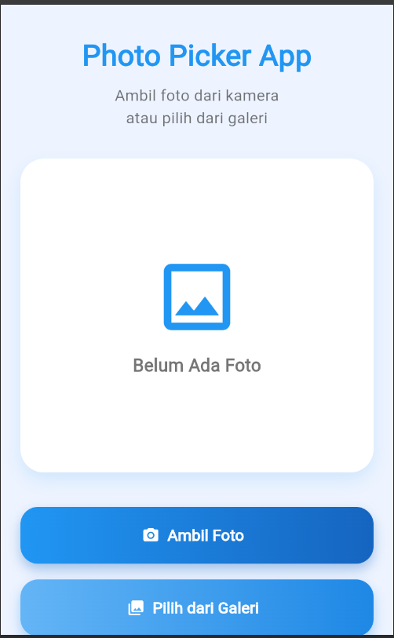
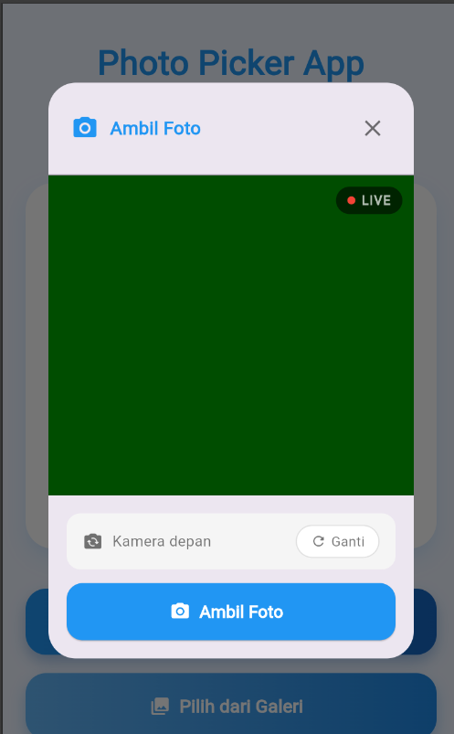
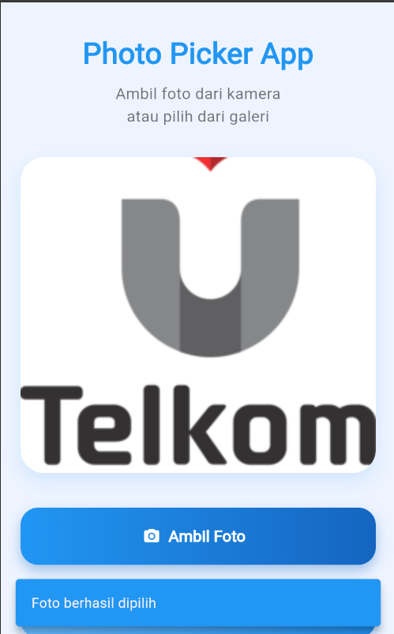

<div align="center">
  <br />

  <h1>LAPORAN PRAKTIKUM <br>
  APLIKASI BERBASIS PLATFORM
  </h1>

  <br />

  <h3>MODUL VIII & IX

  API PERANGKAT KERAS
  </h3>

  <br />

  

  <br />
  <br />
  <br />

  <h3>Disusun Oleh :</h3>

  <p>
    <strong>Andreas Besar Wibowo</strong><br>
    <strong>2311102198</strong><br>
    <strong>S1 IF-11-REG01</strong>
  </p>

  <br />

  <h3>Dosen Pengampu :</h3>

  <p>
    <strong>Dimas Fanny Hebrasianto Permadi, S.ST., M.Kom</strong>
  </p>
  
  <br />
    <h4>Asisten Praktikum :</h4>
    <strong>Apri Pandu Wicaksono </strong> <br>
    <strong>Rangga Pradarrell Fathi</strong>
  <br />

  <h3>LABORATORIUM HIGH PERFORMANCE
 <br>FAKULTAS INFORMATIKA <br>UNIVERSITAS TELKOM PURWOKERTO <br>2026</h3>
</div>

<hr>

## Dasar Teori
### 9.1. Camera API
Pada bahasan kali ini, kita akan menggunakan packages atau plugin Camera supaya aplikasi yang dibuat dapat mengakses kamera yang ada pada device.
**1. iOS**

Plugin ini dapat berjalan di versi iOS 10.0 atau lebih tinggi. Jika dijalankan di versi di bawah 10.0, pastikan bahwa ada program untuk cek versi dari iOS sebelum menggunakan fitur yang ada pada kamera. Plugin untuk cek versi iOS yaitu device_info_plus.

Tambahkan 2 baris pada ios/Runner/Info.plist:
- Satu baris dengan Privacy - Camera Usage Description
- Dan satu baris dengan Privacy - Microphone Usage DescriptioN

Atau dengan format teks penambahan key:
```dart
<key>NSCameraUsageDescription</key>
<string>Can I use the camera please?</string>
<key>NSMicrophoneUsageDescription</key>
<string>Can I use the mic please?</string>
```

**2. Android**
Ubah minimum versi Android sdk ke 21 (atau lebih tinggi) pada file android/app/build.gradle.
```dart
minSdkVersion 21
```
Hal tersebut penting karena MediaRecorder tidak bekerja dengan baik di emulator sesuai dengan dokumentasi.

Berikut contoh aplikasi flutter dengan menampilkan kamera:
```dart
import 'dart:async';

import 'package:flutter/material.dart';
import 'package:camera/camera.dart';

List<CameraDescription> cameras;

Future<void> main() async {
  WidgetsFlutterBinding.ensureInitialized();

  cameras = await availableCameras();

  runApp(CameraApp());
}

class CameraApp extends StatefulWidget {
  @override
  _CameraAppState createState() => _CameraAppState();
}

class _CameraAppState extends State<CameraApp> {
  CameraController controller;

  @override
  void initState() {
    super.initState();

    controller = CameraController(
      cameras[0],
      ResolutionPreset.max,
    );

    controller.initialize().then((_) {
      if (!mounted) {
        return;
      }

      setState(() {});
    });
  }

  @override
  void dispose() {
    controller?.dispose();
    super.dispose();
  }

  @override
  Widget build(BuildContext context) {
    if (!controller.value.isInitialized) {
      return Container();
    }

    return MaterialApp(
      home: CameraPreview(controller),
    );
  }
}
```
### 9.2. Media API
Pada bahasan kali ini, kita akan menggunakan packages atau plugin Image Picker supaya aplikasi dapat mengakses media galeri pada device. Pada platform iOS diperlukan konfigurasi tambahan, namun pada android tidak diperlukan konfigurasi tambahan. Berikut untuk konfigurasi tambahan:

**1. iOS**

Pada iOS diperlukan versi iOS 9.0.0 keatas, pastikan build version di set ke iOS 9.0.0 atau lebih tinggi. tambahkan konfigurasi pada file info.plist di Runner iOS.
- Rubah format tampilan .plist dengan tipe source code.
- Tambahkan potongan kode berikut pada info.plist
```dart
<key>NSPhotoLibraryUsageDescription</key>
<string>Can I use the photo library?</string>
<key>NSCameraUsageDescription</key>
<string>Can I use the camera please?</string>
<key>NSMicrophoneUsageDescription</key>
<string>Can I use the mic please?</string>
```
- Konfigurasi tambahan pada iOS sudah selesai.
Untuk pengunaan image picker, dapat dilihat pada potongan kode berikut :
```dart
class ImageFromGalleryEx extends StatefulWidget {
  final type;

  ImageFromGalleryEx(this.type);

  @override
  ImageFromGalleryExState createState() =>
      ImageFromGalleryExState(this.type);
}

class ImageFromGalleryExState extends State<ImageFromGalleryEx> {
  var _image;
  var imagePicker;
  var type;

  ImageFromGalleryExState(this.type);

  @override
  void initState() {
    super.initState();
    imagePicker = new ImagePicker();
  }

  @override
  Widget build(BuildContext context) {
    return Scaffold(
      appBar: AppBar(
        title: Text(
          type == ImageSourceType.camera
              ? "Image from Camera"
              : "Image from Gallery",
        ),
      ),
      body: Column(
        children: <Widget>[
          SizedBox(
            height: 52,
          ),
          Center(
            child: GestureDetector(
              onTap: () async {
                var source = type == ImageSourceType.camera
                    ? ImageSource.camera
                    : ImageSource.gallery;

                XFile image = await imagePicker.pickImage(
                  source: source,
                  imageQuality: 50,
                  preferredCameraDevice: CameraDevice.front,
                );

                setState(() {
                  _image = File(image.path);
                });
              },
              child: Container(
                width: 200,
                height: 200,
                decoration: BoxDecoration(
                  color: Colors.red[200],
                ),
              ),
            ),
          ),
        ],
      ),
    );
  }

  @override
  Widget build(BuildContext context) {
    return Scaffold(
      appBar: AppBar(
        title: Text(
          type == ImageSourceType.camera
              ? "Image from Camera"
              : "Image from Gallery",
        ),
      ),
      body: Column(
        children: <Widget>[
          SizedBox(
            height: 52,
          ),
          Center(
            child: GestureDetector(
              onTap: () async {
                var source = type == ImageSourceType.camera
                    ? ImageSource.camera
                    : ImageSource.gallery;

                XFile image = await imagePicker.pickImage(
                  source: source,
                  imageQuality: 50,
                  preferredCameraDevice: CameraDevice.front,
                );

                setState(() {
                  _image = File(image.path);
                });
              },
              child: Container(
                width: 200,
                height: 200,
                decoration: BoxDecoration(
                  color: Colors.red[200],
                ),
                child: _image != null
                    ? Image.file(
                        _image,
                        width: 200.0,
                        height: 200.0,
                        fit: BoxFit.fitHeight,
                      )
                    : Container(
                        decoration: BoxDecoration(
                          color: Colors.red[200],
                        ),
                        width: 200,
                        height: 200,
                        child: Icon(
                          Icons.camera_alt,
                          color: Colors.grey[800],
                        ),
                      ),
              ),
            ),
          ),
        ],
      ),
    );
  }
}
```
## Tugas
**Tugas Praktik Modul 8 & 9 – Flutter**

Buat aplikasi Flutter sederhana dengan fitur berikut:
1. Ambil Foto

Tampilkan 2 tombol di halaman utama: • Tombol pertama → buka kamera langsung (Camera API) • Tombol kedua → pilih foto dari galeri (image_picker) Foto yang diambil/dipilih ditampilkan di halaman yang sama.

2. Notifikasi

Setelah foto berhasil diambil atau dipilih, tampilkan notifikasi lokal menggunakan flutter_local_notifications dengan isi pesan bebas.

### Output yang dikumpulkan meliputi :
- Screenshot hasilnya
- Source code
- Penjelasan singkat tiap widget

## Hasil
### Output
1. Home



2. Camera



3. Gallery



### Source Code
```dart
import 'dart:html' as html;
import 'dart:typed_data';
import 'dart:ui_web' as ui;

import 'package:flutter/material.dart';

void main() {
  runApp(const MyApp());
}

class MyApp extends StatelessWidget {
  const MyApp({super.key});

  @override
  Widget build(BuildContext context) {
    return MaterialApp(
      debugShowCheckedModeBanner: false,
      title: 'Photo Picker App',
      theme: ThemeData(
        primarySwatch: Colors.blue,
        scaffoldBackgroundColor: const Color(0xffEEF4FF),
      ),
      home: const HomePage(),
    );
  }
}

// =============================================
// HOME PAGE
// =============================================
class HomePage extends StatefulWidget {
  const HomePage({super.key});

  @override
  State<HomePage> createState() => _HomePageState();
}

class _HomePageState extends State<HomePage> {
  Uint8List? imageBytes;

  /// Cek apakah perangkat mobile (touch screen)
  bool get isMobile {
    final maxTouchPoints = html.window.navigator.maxTouchPoints ?? 0;
    return maxTouchPoints > 0;
  }

  // =============================================
  // SNACKBAR
  // =============================================
  void showSnack(String message) {
    ScaffoldMessenger.of(context).showSnackBar(
      SnackBar(
        content: Text(message),
        behavior: SnackBarBehavior.floating,
        backgroundColor: Colors.blue,
        duration: const Duration(seconds: 2),
      ),
    );
  }

  // =============================================
  // OPEN CAMERA
  // =============================================
  Future<void> openCamera() async {
    if (isMobile) {
      // HP/Tablet: pakai file input + capture attribute
      final input = html.FileUploadInputElement();
      input.accept = 'image/*';
      input.setAttribute('capture', 'environment');
      input.click();

      input.onChange.listen((e) {
        final file = input.files?.first;
        if (file == null) return;

        final reader = html.FileReader();
        reader.readAsArrayBuffer(file);
        reader.onLoadEnd.listen((_) {
          setState(() => imageBytes = reader.result as Uint8List);
          showSnack('Foto berhasil diambil');
        });
      });
    } else {
      // Laptop/Desktop: pakai webcam dialog
      final result = await showDialog<Uint8List>(
        context: context,
        barrierDismissible: false,
        builder: (_) => const WebcamDialog(),
      );

      if (result != null) {
        setState(() => imageBytes = result);
        showSnack('Foto berhasil diambil');
      }
    }
  }

  // =============================================
  // OPEN GALLERY
  // =============================================
  Future<void> openGallery() async {
    final input = html.FileUploadInputElement();
    input.accept = 'image/*';
    input.click();

    input.onChange.listen((e) {
      final file = input.files?.first;
      if (file == null) return;

      final reader = html.FileReader();
      reader.readAsArrayBuffer(file);
      reader.onLoadEnd.listen((_) {
        setState(() => imageBytes = reader.result as Uint8List);
        showSnack('Foto berhasil dipilih');
      });
    });
  }

  // =============================================
  // IMAGE PREVIEW
  // =============================================
  Widget buildImagePreview() {
    if (imageBytes != null) {
      return ClipRRect(
        borderRadius: BorderRadius.circular(24),
        child: Image.memory(
          imageBytes!,
          fit: BoxFit.cover,
          width: double.infinity,
          height: double.infinity,
        ),
      );
    }

    return Column(
      mainAxisAlignment: MainAxisAlignment.center,
      children: const [
        Icon(Icons.image_outlined, size: 90, color: Colors.blue),
        SizedBox(height: 12),
        Text(
          'Belum Ada Foto',
          style: TextStyle(
            fontSize: 18,
            fontWeight: FontWeight.w600,
            color: Colors.black54,
          ),
        ),
      ],
    );
  }

  // =============================================
  // BUTTON
  // =============================================
  Widget buildButton({
    required String title,
    required IconData icon,
    required VoidCallback onPressed,
    required List<Color> colors,
  }) {
    return Container(
      width: double.infinity,
      height: 58,
      margin: const EdgeInsets.only(bottom: 16),
      decoration: BoxDecoration(
        borderRadius: BorderRadius.circular(18),
        gradient: LinearGradient(colors: colors),
        boxShadow: [
          BoxShadow(
            color: colors.last.withOpacity(0.35),
            blurRadius: 10,
            offset: const Offset(0, 6),
          ),
        ],
      ),
      child: ElevatedButton.icon(
        onPressed: onPressed,
        icon: Icon(icon, color: Colors.white),
        label: Text(
          title,
          style: const TextStyle(fontSize: 16, fontWeight: FontWeight.bold),
        ),
        style: ElevatedButton.styleFrom(
          backgroundColor: Colors.transparent,
          foregroundColor: Colors.white,
          shadowColor: Colors.transparent,
          shape: RoundedRectangleBorder(
            borderRadius: BorderRadius.circular(18),
          ),
        ),
      ),
    );
  }

  // =============================================
  // UI
  // =============================================
  @override
  Widget build(BuildContext context) {
    return Scaffold(
      body: SafeArea(
        child: SingleChildScrollView(
          padding: const EdgeInsets.all(20),
          child: Column(
            children: [
              const SizedBox(height: 10),
              const Text(
                'Photo Picker App',
                style: TextStyle(
                  fontSize: 30,
                  fontWeight: FontWeight.bold,
                  color: Colors.blue,
                ),
              ),
              const SizedBox(height: 8),
              const Text(
                'Ambil foto dari kamera\natau pilih dari galeri',
                textAlign: TextAlign.center,
                style: TextStyle(fontSize: 16, color: Colors.black54),
              ),
              const SizedBox(height: 30),
              Container(
                width: double.infinity,
                height: 320,
                decoration: BoxDecoration(
                  color: Colors.white,
                  borderRadius: BorderRadius.circular(24),
                  boxShadow: [
                    BoxShadow(
                      color: Colors.blue.withOpacity(0.15),
                      blurRadius: 15,
                      offset: const Offset(0, 8),
                    ),
                  ],
                ),
                child: buildImagePreview(),
              ),
              const SizedBox(height: 35),
              buildButton(
                title: 'Ambil Foto',
                icon: Icons.camera_alt_rounded,
                onPressed: openCamera,
                colors: const [Color(0xff2196F3), Color(0xff1565C0)],
              ),
              buildButton(
                title: 'Pilih dari Galeri',
                icon: Icons.photo_library_rounded,
                onPressed: openGallery,
                colors: const [Color(0xff64B5F6), Color(0xff1E88E5)],
              ),
            ],
          ),
        ),
      ),
    );
  }
}

// =============================================
// WEBCAM DIALOG (khusus laptop/desktop)
// =============================================
class WebcamDialog extends StatefulWidget {
  const WebcamDialog({super.key});

  @override
  State<WebcamDialog> createState() => _WebcamDialogState();
}

class _WebcamDialogState extends State<WebcamDialog> {
  html.VideoElement? _videoElement;
  html.MediaStream? _stream;
  bool _isLoading = true;
  bool _isFrontCamera = true;
  String _errorMessage = '';
  static int _viewId = 0;
  late String _currentViewId;

  @override
  void initState() {
    super.initState();
    _currentViewId = 'webcam-view-${_viewId++}';
    _initWebcam();
  }

  // =============================================
  // INIT WEBCAM
  // =============================================
  Future<void> _initWebcam() async {
    setState(() {
      _isLoading = true;
      _errorMessage = '';
    });

    try {
      // Stop stream lama kalau ada
      _stream?.getTracks().forEach((track) => track.stop());

      final constraints = {
        'video': {
          'facingMode': _isFrontCamera ? 'user' : 'environment',
          'width': {'ideal': 1280},
          'height': {'ideal': 720},
        },
        'audio': false,
      };

      final stream = await html.window.navigator.mediaDevices!
          .getUserMedia(constraints);

      _stream = stream;

      // Buat video element baru
      _videoElement = html.VideoElement()
        ..srcObject = stream
        ..autoplay = true
        ..muted = true
        ..style.width = '100%'
        ..style.height = '100%'
        ..style.objectFit = 'cover';

      // Register platform view
      ui.platformViewRegistry.registerViewFactory(
        _currentViewId,
            (int id) => _videoElement!,
      );

      // Tunggu video siap
      await _videoElement!.onLoadedMetadata.first;

      if (mounted) {
        setState(() => _isLoading = false);
      }
    } catch (e) {
      if (mounted) {
        setState(() {
          _isLoading = false;
          _errorMessage =
          'Tidak bisa mengakses kamera.\nPastikan izin kamera sudah diberikan.';
        });
      }
    }
  }

  // =============================================
  // GANTI KAMERA (depan / belakang)
  // =============================================
  Future<void> _switchCamera() async {
    setState(() => _isFrontCamera = !_isFrontCamera);
    _currentViewId = 'webcam-view-${_viewId++}';
    await _initWebcam();
  }

  // =============================================
  // CAPTURE FOTO
  // =============================================
  Future<void> _capturePhoto() async {
    if (_videoElement == null) return;

    final canvas = html.CanvasElement(
      width: _videoElement!.videoWidth,
      height: _videoElement!.videoHeight,
    );

    final ctx = canvas.context2D;

    // Flip horizontal kalau kamera depan (mirror effect)
    if (_isFrontCamera) {
      ctx.translate(_videoElement!.videoWidth.toDouble(), 0);
      ctx.scale(-1, 1);
    }

    ctx.drawImage(_videoElement!, 0, 0);

    final blob = await canvas.toBlob('image/jpeg', 0.95);
    final reader = html.FileReader();
    reader.readAsArrayBuffer(blob);

    reader.onLoadEnd.listen((_) {
      final bytes = reader.result as Uint8List;
      _stopStream();
      Navigator.of(context).pop(bytes);
    });
  }

  // =============================================
  // STOP STREAM
  // =============================================
  void _stopStream() {
    _stream?.getTracks().forEach((track) => track.stop());
  }

  @override
  void dispose() {
    _stopStream();
    super.dispose();
  }

  // =============================================
  // UI DIALOG
  // =============================================
  @override
  Widget build(BuildContext context) {
    return Dialog(
      shape: RoundedRectangleBorder(borderRadius: BorderRadius.circular(24)),
      child: SizedBox(
        width: 400,
        child: Column(
          mainAxisSize: MainAxisSize.min,
          children: [
            // HEADER
            Padding(
              padding: const EdgeInsets.fromLTRB(20, 16, 12, 16),
              child: Row(
                children: [
                  const Icon(Icons.camera_alt_rounded, color: Colors.blue),
                  const SizedBox(width: 10),
                  const Text(
                    'Ambil Foto',
                    style: TextStyle(
                      fontSize: 16,
                      fontWeight: FontWeight.bold,
                      color: Colors.blue,
                    ),
                  ),
                  const Spacer(),
                  IconButton(
                    onPressed: () {
                      _stopStream();
                      Navigator.of(context).pop();
                    },
                    icon: const Icon(Icons.close),
                    style: IconButton.styleFrom(foregroundColor: Colors.black54),
                  ),
                ],
              ),
            ),

            const Divider(height: 1),

            // VIDEO PREVIEW
            Container(
              width: double.infinity,
              height: 280,
              color: Colors.black,
              child: _buildVideoPreview(),
            ),

            // CONTROLS
            Padding(
              padding: const EdgeInsets.all(16),
              child: Column(
                children: [
                  // INFO KAMERA
                  Container(
                    padding: const EdgeInsets.symmetric(
                        horizontal: 14, vertical: 10),
                    decoration: BoxDecoration(
                      color: Colors.grey.shade100,
                      borderRadius: BorderRadius.circular(12),
                    ),
                    child: Row(
                      children: [
                        const Icon(Icons.flip_camera_ios_rounded,
                            size: 18, color: Colors.black54),
                        const SizedBox(width: 8),
                        Text(
                          _isFrontCamera ? 'Kamera depan' : 'Kamera belakang',
                          style: const TextStyle(
                            fontSize: 13,
                            color: Colors.black54,
                          ),
                        ),
                        const Spacer(),
                        GestureDetector(
                          onTap: _isLoading ? null : _switchCamera,
                          child: Container(
                            padding: const EdgeInsets.symmetric(
                                horizontal: 12, vertical: 5),
                            decoration: BoxDecoration(
                              color: Colors.white,
                              borderRadius: BorderRadius.circular(20),
                              border: Border.all(color: Colors.grey.shade300),
                            ),
                            child: Row(
                              children: const [
                                Icon(Icons.refresh_rounded,
                                    size: 14, color: Colors.black54),
                                SizedBox(width: 4),
                                Text(
                                  'Ganti',
                                  style: TextStyle(
                                    fontSize: 12,
                                    color: Colors.black54,
                                  ),
                                ),
                              ],
                            ),
                          ),
                        ),
                      ],
                    ),
                  ),

                  const SizedBox(height: 12),

                  // TOMBOL AMBIL FOTO
                  SizedBox(
                    width: double.infinity,
                    height: 50,
                    child: ElevatedButton.icon(
                      onPressed: (_isLoading || _errorMessage.isNotEmpty)
                          ? null
                          : _capturePhoto,
                      icon: const Icon(Icons.camera_alt_rounded),
                      label: const Text(
                        'Ambil Foto',
                        style: TextStyle(
                            fontSize: 15, fontWeight: FontWeight.bold),
                      ),
                      style: ElevatedButton.styleFrom(
                        backgroundColor: Colors.blue,
                        foregroundColor: Colors.white,
                        shape: RoundedRectangleBorder(
                          borderRadius: BorderRadius.circular(14),
                        ),
                      ),
                    ),
                  ),
                ],
              ),
            ),
          ],
        ),
      ),
    );
  }

  // =============================================
  // VIDEO PREVIEW WIDGET
  // =============================================
  Widget _buildVideoPreview() {
    if (_errorMessage.isNotEmpty) {
      return Center(
        child: Padding(
          padding: const EdgeInsets.all(20),
          child: Column(
            mainAxisAlignment: MainAxisAlignment.center,
            children: [
              const Icon(Icons.videocam_off_rounded,
                  size: 48, color: Colors.white38),
              const SizedBox(height: 12),
              Text(
                _errorMessage,
                textAlign: TextAlign.center,
                style: const TextStyle(color: Colors.white60, fontSize: 14),
              ),
              const SizedBox(height: 16),
              ElevatedButton.icon(
                onPressed: _initWebcam,
                icon: const Icon(Icons.refresh_rounded, size: 16),
                label: const Text('Coba lagi'),
                style: ElevatedButton.styleFrom(
                  backgroundColor: Colors.blue,
                  foregroundColor: Colors.white,
                  shape: RoundedRectangleBorder(
                    borderRadius: BorderRadius.circular(10),
                  ),
                ),
              ),
            ],
          ),
        ),
      );
    }

    if (_isLoading) {
      return const Center(
        child: Column(
          mainAxisAlignment: MainAxisAlignment.center,
          children: [
            CircularProgressIndicator(color: Colors.white54),
            SizedBox(height: 12),
            Text(
              'Memuat kamera...',
              style: TextStyle(color: Colors.white54, fontSize: 13),
            ),
          ],
        ),
      );
    }

    return Stack(
      children: [
        // VIDEO
        HtmlElementView(viewType: _currentViewId),

        // INDIKATOR LIVE
        Positioned(
          top: 10,
          right: 10,
          child: Container(
            padding: const EdgeInsets.symmetric(horizontal: 10, vertical: 4),
            decoration: BoxDecoration(
              color: Colors.black54,
              borderRadius: BorderRadius.circular(20),
            ),
            child: Row(
              mainAxisSize: MainAxisSize.min,
              children: [
                Container(
                  width: 7,
                  height: 7,
                  decoration: const BoxDecoration(
                    color: Colors.red,
                    shape: BoxShape.circle,
                  ),
                ),
                const SizedBox(width: 5),
                const Text(
                  'LIVE',
                  style: TextStyle(
                    color: Colors.white70,
                    fontSize: 11,
                    fontWeight: FontWeight.bold,
                    letterSpacing: 1,
                  ),
                ),
              ],
            ),
          ),
        ),
      ],
    );
  }
}
```
### Penjelasan Singkat
Aplikasi Flutter untuk Photo Picker yang dibuat untuk mengambil foto dari kamera atau memilih gambar dari galeri pada platform web. Aplikasi ini memiliki tampilan modern dengan preview gambar dan notifikasi ketika foto berhasil dipilih. Dalam aplikasi ini memiliki beberapa spesifikasi yaitu :
- Menggunakan `StatelessWidget` dan `StatefulWidget` untuk membangun tampilan aplikasi dan mengelola perubahan data gambar.
- Memiliki fitur mengambil foto dari kamera serta memilih gambar dari galeri menggunakan `dart:html`.
- Menggunakan `Uint8List` dan `Image.memory` untuk menyimpan dan menampilkan preview gambar yang dipilih.
- Menampilkan `SnackBar` sebagai notifikasi ketika foto berhasil diambil atau dipilih.
- Tampilan aplikasi dibuat lebih modern menggunakan `Container`, `Column`, `ElevatedButton`, `Gradient`, dan `BoxShadow`.
