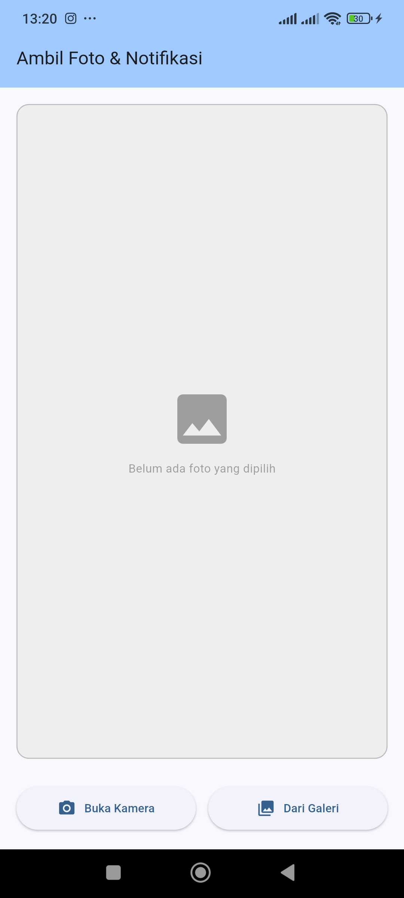
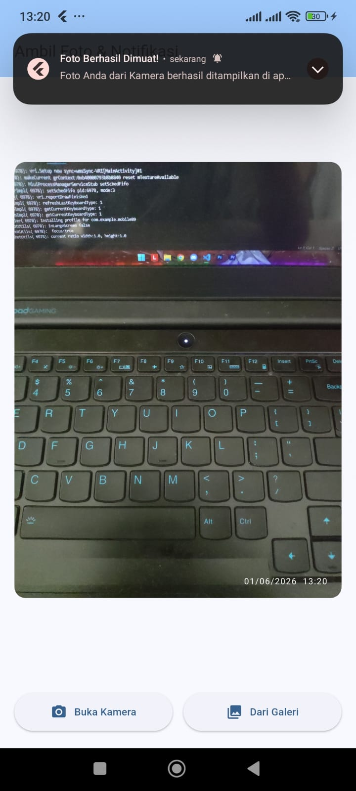
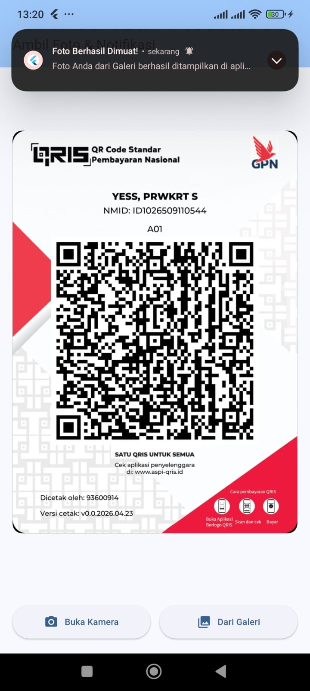

<div align="center">
  <br>

  <h1>LAPORAN PRAKTIKUM <br>
  APLIKASI BERBASIS PLATFORM
  </h1>

  <br>

  <h3>Modul 8-9 Mobile</h3>

  <br>

  


  <br>
  <br>
  <br>

  <h3>Disusun Oleh :</h3>

  <p>
    <strong>Irshad Benaya Fardeca</strong><br>
    <strong>2311102199</strong><br>
    <strong>S1 IF-11-REG01</strong>
  </p>

  <br>

  <h3>Dosen Pengampu :</h3>

  <p>
    <strong>Dimas Fanny Hebrasianto Permadi, S.ST., M.Kom</strong>
  </p>
  
  <br>
  <br>
    <h4>Asisten Praktikum :</h4>
    <strong>Apri Pandu Wicaksono </strong> <br>
    <strong>Rangga Pradarrell Fathi</strong>
  <br>

  <h3>LABORATORIUM HIGH PERFORMANCE
 <br>FAKULTAS INFORMATIKA <br>UNIVERSITAS TELKOM PURWOKERTO <br>2026</h3>
</div>
<hr>

# TUGAS PRAKTIKUM
# Notifikasi & API Perangkat Keras
## Buat aplikasi Flutter sederhana dengan fitur berikut:
### 1. Ambil Foto
Tampilkan 2 tombol di halaman utama:
• Tombol pertama → buka kamera langsung (Camera API)
• Tombol kedua → pilih foto dari galeri (image_picker)
Foto yang diambil/dipilih ditampilkan di halaman yang sama.

### 2. Notifikasi
Setelah foto berhasil diambil atau dipilih, tampilkan notifikasi lokal menggunakan flutter_local_notifications dengan isi pesan bebas.

## Source Code
```dart
import 'dart:io';
import 'package:flutter/material.dart';
import 'package:image_picker/image_picker.dart';
import 'package:flutter_local_notifications/flutter_local_notifications.dart';

void main() async {
  WidgetsFlutterBinding.ensureInitialized();
  
  // Inisialisasi Notifikasi Lokal
  await NotificationService.init();
  
  runApp(const MyApp());
}

class MyApp extends StatelessWidget {
  const MyApp({super.key});

  @override
  Widget build(BuildContext context) {
    return MaterialApp(
      debugShowCheckedModeBanner: false,
      title: 'Kamera & Notifikasi',
      theme: ThemeData(
        colorScheme: ColorScheme.fromSeed(seedColor: Colors.blue),
        useMaterial3: true,
      ),
      home: const HomeScreen(),
    );
  }
}

class HomeScreen extends StatefulWidget {
  const HomeScreen({super.key});

  @override
  State<HomeScreen> createState() => _HomeScreenState();
}

class _HomeScreenState extends State<HomeScreen> {
  File? _selectedImage;
  final ImagePicker _picker = ImagePicker();

  // Fungsi untuk mengambil/memilih foto
  Future<void> _getImage(ImageSource source) async {
    try {
      final XFile? pickedFile = await _picker.pickImage(
        source: source,
        imageQuality: 80, // Optimasi ukuran gambar
      );

      if (pickedFile != null) {
        setState(() {
          _selectedImage = File(pickedFile.path);
        });

        // Trigger notifikasi setelah foto berhasil diambil/dipilih
        String sourceText = source == ImageSource.camera ? "Kamera" : "Galeri";
        NotificationService.showNotification(
          title: "Foto Berhasil Dimuat!",
          body: "Foto Anda dari $sourceText berhasil ditampilkan di aplikasi.",
        );
      }
    } catch (e) {
      debugPrint("Error mengambil gambar: $e");
    }
  }

  @override
  Widget build(BuildContext context) {
    return Scaffold(
      appBar: AppBar(
        title: const Text('Ambil Foto & Notifikasi'),
        backgroundColor: Theme.of(context).colorScheme.inversePrimary,
      ),
      body: Padding(
        padding: const EdgeInsets.all(16.0),
        child: Column(
          children: [
            // Area Tampilan Foto
            Expanded(
              child: Center(
                child: _selectedImage != null
                    ? ClipRRect(
                        borderRadius: BorderRadius.circular(12),
                        child: Image.file(
                          _selectedImage!,
                          fit: BoxFit.cover,
                        ),
                      )
                    : Container(
                        width: double.infinity,
                        decoration: BoxDecoration(
                          color: Colors.grey[200],
                          borderRadius: BorderRadius.circular(12),
                          border: Border.all(color: Colors.grey[400]!),
                        ),
                        child: const Column(
                          mainAxisAlignment: MainAxisAlignment.center,
                          children: [
                            Icon(Icons.image, size: 64, color: Colors.grey),
                            SizedBox(height: 8),
                            Text(
                              'Belum ada foto yang dipilih',
                              style: TextStyle(color: Colors.grey),
                            ),
                          ],
                        ),
                      ),
              ),
            ),
            const SizedBox(height: 24),
            
            // Tombol Aksi
            Row(
              children: [
                Expanded(
                  child: ElevatedButton.icon(
                    onPressed: () => _getImage(ImageSource.camera),
                    icon: const Icon(Icons.camera_alt),
                    label: const Text('Buka Kamera'),
                    style: ElevatedButton.styleFrom(
                      padding: const EdgeInsets.symmetric(vertical: 12),
                    ),
                  ),
                ),
                const SizedBox(width: 12),
                Expanded(
                  child: ElevatedButton.icon(
                    onPressed: () => _getImage(ImageSource.gallery),
                    icon: const Icon(Icons.photo_library),
                    label: const Text('Dari Galeri'),
                    style: ElevatedButton.styleFrom(
                      padding: const EdgeInsets.symmetric(vertical: 12),
                    ),
                  ),
                ),
              ],
            ),
          ],
        ),
      ),
    );
  }
}

// ==========================================
// Service Khusus Manajemen Notifikasi
// ==========================================
class NotificationService {
  static final FlutterLocalNotificationsPlugin _notificationsPlugin =
      FlutterLocalNotificationsPlugin();

  static Future<void> init() async {
    // Pengaturan untuk Android
    const AndroidInitializationSettings initializationSettingsAndroid =
        AndroidInitializationSettings('@mipmap/ic_launcher');

    // Pengaturan untuk iOS
    const DarwinInitializationSettings initializationSettingsDarwin =
        DarwinInitializationSettings(
      requestAlertPermission: true,
      requestBadgePermission: true,
      requestSoundPermission: true,
    );

    const InitializationSettings initializationSettings = InitializationSettings(
      android: initializationSettingsAndroid,
      iOS: initializationSettingsDarwin,
    );

    // Minta izin notifikasi khusus Android 13+ (API 33+)
    await _notificationsPlugin
        .resolvePlatformSpecificImplementation<
            AndroidFlutterLocalNotificationsPlugin>()
        ?.requestNotificationsPermission();

    await _notificationsPlugin.initialize(settings: initializationSettings);
  }

  static Future<void> showNotification({
    required String title,
    required String body,
  }) async {
    const AndroidNotificationDetails androidDetails = AndroidNotificationDetails(
      'channel_id_foto',
      'Notifikasi Foto',
      channelDescription: 'Notifikasi saat foto berhasil diambil atau dipilih',
      importance: Importance.max,
      priority: Priority.high,
    );

    const DarwinNotificationDetails iosDetails = DarwinNotificationDetails();

    const NotificationDetails platformDetails = NotificationDetails(
      android: androidDetails,
      iOS: iosDetails,
    );

    await _notificationsPlugin.show(
      id: 0,
      title: title,
      body: body,
      notificationDetails: platformDetails,
    );
  }
}
```

### 1. Widget Utama & Navigasi
* **`MyApp` (`StatelessWidget`)**: Akar (*root*) aplikasi untuk mengatur konfigurasi global seperti tema warna (`ThemeData`) dan halaman awal.
* **`MaterialApp`**: Widget dasar yang membungkus aplikasi dengan standar *Material Design*.
* **`HomeScreen` (`StatefulWidget`)**: Halaman utama yang bersifat dinamis. Menggunakan *StatefulWidget* karena tampilan layar akan berubah (*re-render*) secara otomatis begitu foto berhasil dipilih (`_selectedImage`).

### 2. Struktur Tata Letak (Layout)
* **`Scaffold`**: Kerangka dasar halaman yang menyediakan tempat untuk `AppBar` dan `body`.
* **`AppBar`**: Bar bagian atas untuk menampilkan judul aplikasi.
* **`Padding`**: Memberikan jarak pembatas sebesar `16.0` di semua sisi agar konten tidak menyentuh pinggiran layar.
* **`Column`**: Menyusun widget di dalamnya secara vertikal (dari atas ke bawah).
* **`Row`**: Menyusun tombol aksi secara horizontal (berdampingan).
* **`Expanded`**: Memaksa widget anak untuk mengisi sisa ruang yang tersedia (digunakan pada area foto dan pembagian lebar tombol yang adil).
* **`SizedBox`**: Widget tak terlihat yang berfungsi memberikan jarak antar komponen.

### 3. Konten & Komponen Visual
* **`Center`**: Memosisikan objek tepat di tengah ruang yang tersedia.
* **`ClipRRect`**: Memotong (*clipping*) gambar agar sudut-sudutnya berbentuk melengkung (*rounded*).
* **`Image.file`**: Menampilkan berkas gambar yang diambil dari penyimpanan lokal perangkat.
* **`Container`**: Digunakan sebagai kotak abu-abu (*placeholder*) penanda ketika belum ada foto yang dipilih.
* **`Icon` & `Text`**: Menampilkan simbol grafis dan tulisan di dalam aplikasi.
* **`ElevatedButton.icon`**: Tombol timbul modern yang menggabungkan ikon dan teks label.

## Output




