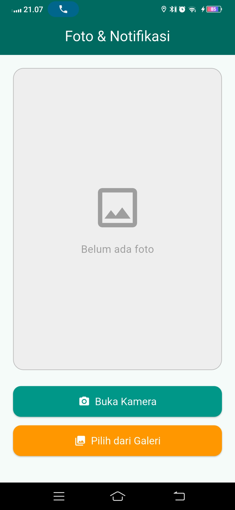
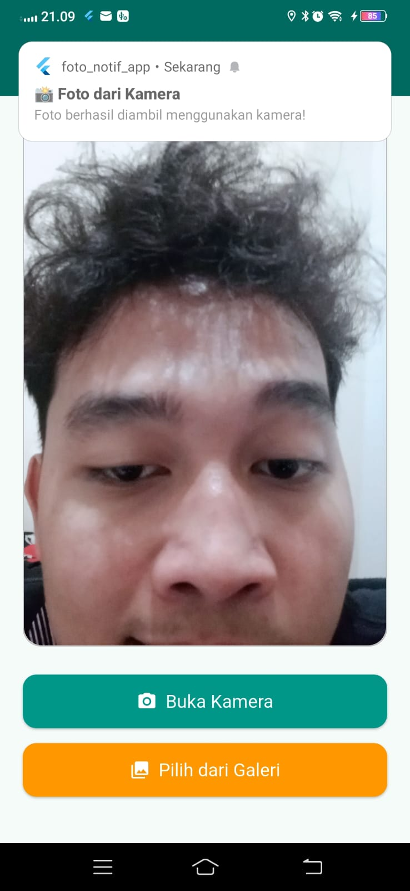
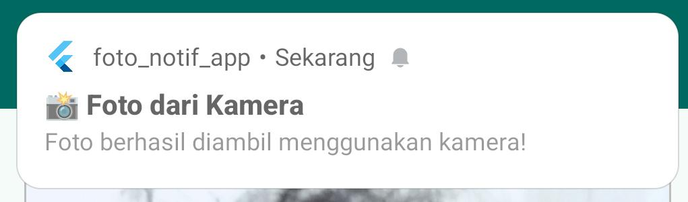

<div align="center">
  <br />
  <h1>LAPORAN PRAKTIKUM <br>APLIKASI BERBASIS PLATFORM</h1>
  <br />
  <h3>TUGAS MODUL 08 & 09 <br> NOTIFIKASI & API PERANGKAT KERAS <br>(Aplikasi Kamera & Notifikasi)</h3>
  <br />
  <br />
   
  <br />
  <br />
  <br />
  <br />
  <h3>Disusun Oleh :</h3>
  <p>
    <strong>M. Faleno Albar Firjatulloh</strong><br>
    <strong>2311102297</strong><br>
    <strong>S1 IF-11-01</strong>
  </p>
  <br />
  <br />
  <h3>Dosen Pengampu :</h3>
  <p>
    <strong>Dimas Fanny Hebrasianto Permadi, S.ST., M.Kom</strong>
  </p>
  <br />
  <br />
    <h4>Asisten Praktikum :</h4>
    <strong> Apri Pandu Wicaksono </strong> <br>
    <strong>Rangga Pradarrell Fathi</strong>
  <br />
  <h3>LABORATORIUM HIGH PERFORMANCE
 <br>FAKULTAS INFORMATIKA <br>UNIVERSITAS TELKOM PURWOKERTO <br>2026</h3>
</div>

---

## Dasar Teori

Flutter merupakan framework multiplatform yang memungkinkan pengembang membangun aplikasi Android, iOS, web, dan desktop hanya dengan satu basis kode. Pada praktikum Modul 8-9 ini, aplikasi yang dibuat adalah **Camera & Notification App**, yaitu aplikasi yang menggabungkan dua fitur utama: pengambilan foto menggunakan kamera atau galeri, serta menampilkan notifikasi lokal setelah foto berhasil dipilih.

### Camera & Image Picker

Flutter tidak memiliki akses kamera secara bawaan, sehingga diperlukan package tambahan yaitu `image_picker`. Package ini memungkinkan aplikasi untuk mengambil foto langsung dari kamera perangkat maupun memilih foto dari galeri. Pengambilan foto dilakukan menggunakan `ImagePicker` dengan memanggil method `pickImage()` yang menerima parameter `source`. Nilai `ImageSource.camera` digunakan untuk membuka kamera, sedangkan `ImageSource.gallery` digunakan untuk membuka galeri. Hasil dari `pickImage()` berupa objek `XFile?` yang kemudian dikonversi menjadi `File` dari package `dart:io` agar dapat ditampilkan menggunakan widget `Image.file`.

### Local Notification

Notifikasi lokal pada Flutter diimplementasikan menggunakan package `flutter_local_notifications`. Package ini memungkinkan aplikasi menampilkan notifikasi sistem di perangkat Android maupun iOS tanpa memerlukan koneksi internet atau server. Sebelum notifikasi dapat digunakan, plugin harus diinisialisasi terlebih dahulu menggunakan `FlutterLocalNotificationsPlugin` dengan pengaturan `AndroidInitializationSettings`. Inisialisasi dilakukan di dalam fungsi `main()` sebelum `runApp()` dipanggil agar plugin siap digunakan sebelum aplikasi berjalan. Notifikasi ditampilkan menggunakan method `show()` yang menerima parameter ID notifikasi, judul, isi pesan, dan detail notifikasi berupa `NotificationDetails`.

### StatefulWidget dan setState

Karena tampilan aplikasi perlu diperbarui ketika foto dipilih (menampilkan foto yang baru diambil), halaman utama menggunakan `StatefulWidget`. Setiap kali foto berhasil dipilih, variabel `imageFile` diperbarui menggunakan `setState()` sehingga widget `Image.file` otomatis merender ulang tampilan dengan foto terbaru.

## Dependencies

```yaml
dependencies:
  flutter:
    sdk: flutter
  image_picker: ^1.0.7
  flutter_local_notifications: ^17.0.0
  permission_handler: ^11.3.0
```

---

## Konfigurasi Android

### `android/app/src/main/AndroidManifest.xml`

```xml
<manifest xmlns:android="http://schemas.android.com/apk/res/android">

    <uses-permission android:name="android.permission.CAMERA"/>
    <uses-permission android:name="android.permission.READ_EXTERNAL_STORAGE"/>
    <uses-permission android:name="android.permission.WRITE_EXTERNAL_STORAGE"/>
    <uses-permission android:name="android.permission.POST_NOTIFICATIONS"/>
    <uses-feature android:name="android.hardware.camera" android:required="false"/>

    <application
        android:label="foto_notif_app"
        android:name="${applicationName}"
        android:icon="@mipmap/ic_launcher">

        <activity
            android:name=".MainActivity"
            android:exported="true"
            android:launchMode="singleTop"
            android:taskAffinity=""
            android:theme="@style/LaunchTheme"
            android:configChanges="orientation|keyboardHidden|keyboard|screenSize|smallestScreenSize|locale|layoutDirection|fontScale|screenLayout|density|uiMode"
            android:hardwareAccelerated="true"
            android:windowSoftInputMode="adjustResize">
            <meta-data
                android:name="io.flutter.embedding.android.NormalTheme"
                android:resource="@style/NormalTheme"/>
            <intent-filter>
                <action android:name="android.intent.action.MAIN"/>
                <category android:name="android.intent.category.LAUNCHER"/>
            </intent-filter>
        </activity>

        <receiver android:exported="false"
            android:name="com.dexterous.flutterlocalnotifications.ScheduledNotificationReceiver"/>
        <receiver android:exported="false"
            android:name="com.dexterous.flutterlocalnotifications.ScheduledNotificationBootReceiver">
            <intent-filter>
                <action android:name="android.intent.action.BOOT_COMPLETED"/>
            </intent-filter>
        </receiver>

        <meta-data
            android:name="flutterEmbedding"
            android:value="2"/>
    </application>

    <queries>
        <intent>
            <action android:name="android.intent.action.PROCESS_TEXT"/>
            <data android:mimeType="text/plain"/>
        </intent>
    </queries>

</manifest>
```

### `android/app/build.gradle.kts`

```gradle
plugins {
    id("com.android.application")
    id("kotlin-android")
    id("dev.flutter.flutter-gradle-plugin")
}

android {
    namespace = "com.example.foto_notif_app"
    compileSdk = flutter.compileSdkVersion
    ndkVersion = flutter.ndkVersion

    compileOptions {
        sourceCompatibility = JavaVersion.VERSION_17
        targetCompatibility = JavaVersion.VERSION_17
        isCoreLibraryDesugaringEnabled = true
    }

    kotlinOptions {
        jvmTarget = JavaVersion.VERSION_17.toString()
    }

    defaultConfig {
        applicationId = "com.example.foto_notif_app"
        minSdk = 21
        targetSdk = flutter.targetSdkVersion
        versionCode = flutter.versionCode
        versionName = flutter.versionName
    }

    buildTypes {
        release {
            signingConfig = signingConfigs.getByName("debug")
        }
    }
}

dependencies {
    coreLibraryDesugaring("com.android.tools:desugar_jdk_libs:2.0.4")
}

flutter {
    source = "../.."
}
```

---

## Source Code (`lib/main.dart`)

```dart
import 'dart:io';
import 'package:flutter/material.dart';
import 'package:image_picker/image_picker.dart';
import 'package:flutter_local_notifications/flutter_local_notifications.dart';
import 'package:permission_handler/permission_handler.dart';

// ─── Inisialisasi plugin notifikasi (global) ───────────────────────────────
final FlutterLocalNotificationsPlugin flutterLocalNotificationsPlugin =
    FlutterLocalNotificationsPlugin();

Future<void> main() async {
  WidgetsFlutterBinding.ensureInitialized();
  await _initNotifications();
  runApp(const MyApp());
}

// ─── Setup notifikasi ──────────────────────────────────────────────────────
Future<void> _initNotifications() async {
  const AndroidInitializationSettings androidSettings =
      AndroidInitializationSettings('@mipmap/ic_launcher');

  const InitializationSettings initSettings =
      InitializationSettings(android: androidSettings);

  await flutterLocalNotificationsPlugin.initialize(initSettings);
}

// ─── Root Widget ───────────────────────────────────────────────────────────
class MyApp extends StatelessWidget {
  const MyApp({super.key});

  @override
  Widget build(BuildContext context) {
    return MaterialApp(
      title: 'Foto & Notifikasi',
      debugShowCheckedModeBanner: false,
      theme: ThemeData(
        colorScheme: ColorScheme.fromSeed(seedColor: Colors.teal),
        useMaterial3: true,
      ),
      home: const HomeScreen(),
    );
  }
}

// ─── Halaman Utama ─────────────────────────────────────────────────────────
class HomeScreen extends StatefulWidget {
  const HomeScreen({super.key});

  @override
  State<HomeScreen> createState() => _HomeScreenState();
}

class _HomeScreenState extends State<HomeScreen> {
  File? _selectedImage;
  final ImagePicker _picker = ImagePicker();

  // ── Ambil foto dari KAMERA ────────────────────────────────────────────
  Future<void> _ambilDariKamera() async {
    final status = await Permission.camera.request();
    if (!status.isGranted) {
      _tampilSnackBar('Izin kamera ditolak');
      return;
    }

    final XFile? foto = await _picker.pickImage(
      source: ImageSource.camera,
      imageQuality: 80,
    );

    if (foto != null) {
      setState(() => _selectedImage = File(foto.path));
      await _kirimNotifikasi('📸 Foto dari Kamera', 'Foto berhasil diambil menggunakan kamera!');
    }
  }

  // ── Pilih foto dari GALERI ────────────────────────────────────────────
  Future<void> _pilihDariGaleri() async {
    final status = await Permission.photos.request();

    final XFile? foto = await _picker.pickImage(
      source: ImageSource.gallery,
      imageQuality: 80,
    );

    if (foto != null) {
      setState(() => _selectedImage = File(foto.path));
      await _kirimNotifikasi('🖼️ Foto dari Galeri', 'Foto berhasil dipilih dari galeri!');
    }
  }

  // ── Kirim notifikasi lokal ────────────────────────────────────────────
  Future<void> _kirimNotifikasi(String judul, String pesan) async {
    await Permission.notification.request();

    const AndroidNotificationDetails androidDetails = AndroidNotificationDetails(
      'foto_channel',
      'Notifikasi Foto',
      channelDescription: 'Notifikasi saat foto diambil atau dipilih',
      importance: Importance.high,
      priority: Priority.high,
      showWhen: true,
    );

    const NotificationDetails details = NotificationDetails(android: androidDetails);

    await flutterLocalNotificationsPlugin.show(
      0,
      judul,
      pesan,
      details,
    );
  }

  // ── Tampilkan SnackBar pesan error ────────────────────────────────────
  void _tampilSnackBar(String pesan) {
    ScaffoldMessenger.of(context).showSnackBar(
      SnackBar(content: Text(pesan), backgroundColor: Colors.red),
    );
  }

  // ── Build UI ──────────────────────────────────────────────────────────
  @override
  Widget build(BuildContext context) {
    return Scaffold(
      appBar: AppBar(
        title: const Text('Foto & Notifikasi'),
        backgroundColor: Theme.of(context).colorScheme.primary,
        foregroundColor: Colors.white,
        centerTitle: true,
      ),
      body: Padding(
        padding: const EdgeInsets.all(20),
        child: Column(
          crossAxisAlignment: CrossAxisAlignment.stretch,
          children: [
            Expanded(
              child: Container(
                decoration: BoxDecoration(
                  color: Colors.grey.shade200,
                  borderRadius: BorderRadius.circular(16),
                  border: Border.all(color: Colors.grey.shade400),
                ),
                child: _selectedImage != null
                    ? ClipRRect(
                        borderRadius: BorderRadius.circular(16),
                        child: Image.file(
                          _selectedImage!,
                          fit: BoxFit.cover,
                        ),
                      )
                    : const Center(
                        child: Column(
                          mainAxisAlignment: MainAxisAlignment.center,
                          children: [
                            Icon(Icons.image_outlined, size: 80, color: Colors.grey),
                            SizedBox(height: 12),
                            Text(
                              'Belum ada foto',
                              style: TextStyle(color: Colors.grey, fontSize: 16),
                            ),
                          ],
                        ),
                      ),
              ),
            ),
            const SizedBox(height: 24),
            ElevatedButton.icon(
              onPressed: _ambilDariKamera,
              icon: const Icon(Icons.camera_alt),
              label: const Text('Buka Kamera'),
              style: ElevatedButton.styleFrom(
                backgroundColor: Colors.teal,
                foregroundColor: Colors.white,
                padding: const EdgeInsets.symmetric(vertical: 14),
                textStyle: const TextStyle(fontSize: 16),
                shape: RoundedRectangleBorder(
                  borderRadius: BorderRadius.circular(12),
                ),
              ),
            ),
            const SizedBox(height: 12),
            ElevatedButton.icon(
              onPressed: _pilihDariGaleri,
              icon: const Icon(Icons.photo_library),
              label: const Text('Pilih dari Galeri'),
              style: ElevatedButton.styleFrom(
                backgroundColor: Colors.orange,
                foregroundColor: Colors.white,
                padding: const EdgeInsets.symmetric(vertical: 14),
                textStyle: const TextStyle(fontSize: 16),
                shape: RoundedRectangleBorder(
                  borderRadius: BorderRadius.circular(12),
                ),
              ),
            ),
            const SizedBox(height: 20),
          ],
        ),
      ),
    );
  }
}
```

---

## Penjelasan Singkat Tiap Widget

### `WidgetsFlutterBinding.ensureInitialized()`
Dipanggil di awal fungsi `main()` sebelum operasi asynchronous apapun. Memastikan binding Flutter sudah siap sebelum plugin `flutter_local_notifications` diinisialisasi. Wajib ada karena `main()` bersifat `async`.

### `FlutterLocalNotificationsPlugin`
Objek global dari package `flutter_local_notifications` yang digunakan untuk mengelola seluruh operasi notifikasi. Dideklarasikan secara global agar bisa diakses dari fungsi `_initNotifications()` maupun `_kirimNotifikasi()`.

### `_initNotifications()`
Fungsi async global yang dipanggil di `main()` untuk menginisialisasi plugin notifikasi sebelum aplikasi berjalan. Di dalamnya membuat `AndroidInitializationSettings` dengan ikon `'@mipmap/ic_launcher'` lalu memanggil `flutterLocalNotificationsPlugin.initialize()`.

### `AndroidInitializationSettings`
Konfigurasi inisialisasi notifikasi khusus platform Android. Menerima nama ikon `'@mipmap/ic_launcher'` sebagai ikon yang ditampilkan pada notifikasi di status bar.

### `InitializationSettings`
Wrapper konfigurasi lintas platform yang membungkus `AndroidInitializationSettings`. Digunakan sebagai parameter saat memanggil `flutterLocalNotificationsPlugin.initialize()`.

### `MaterialApp`
Widget root aplikasi yang mengatur konfigurasi global seperti judul `'Foto & Notifikasi'`, tema, dan halaman awal. Properti `debugShowCheckedModeBanner: false` menghilangkan banner debug. Tema menggunakan `useMaterial3: true` dengan warna seed `Colors.teal`.

### `HomeScreen` (StatefulWidget)
Halaman utama aplikasi yang dideklarasikan sebagai `StatefulWidget` karena tampilannya perlu diperbarui setiap kali foto baru dipilih atau diambil. Memiliki state `_HomeScreenState` yang menyimpan variabel `_selectedImage`.

### `_selectedImage`
Variabel bertipe `File?` (nullable) yang menyimpan file foto yang sudah dipilih atau diambil. Nilai awalnya `null` sehingga halaman menampilkan placeholder. Diperbarui menggunakan `setState()` setiap kali foto baru berhasil didapat.

### `ImagePicker`
Objek dari package `image_picker` untuk mengakses kamera dan galeri perangkat. Method `pickImage()` mengembalikan `XFile?` yang perlu dicek tidak null sebelum diproses lebih lanjut.

### `_ambilDariKamera()`
Fungsi async yang meminta izin kamera menggunakan `Permission.camera.request()`. Jika izin diberikan, membuka kamera dengan `ImageSource.camera` dan `imageQuality: 80`. Jika foto berhasil diambil, memperbarui `_selectedImage` dan memanggil `_kirimNotifikasi()`.

### `_pilihDariGaleri()`
Fungsi async yang meminta izin galeri menggunakan `Permission.photos.request()`. Membuka galeri dengan `ImageSource.gallery` dan `imageQuality: 80`. Jika foto berhasil dipilih, memperbarui `_selectedImage` dan memanggil `_kirimNotifikasi()`.

### `_kirimNotifikasi()`
Fungsi async yang meminta izin notifikasi (`Permission.notification.request()`) lalu menampilkan notifikasi lokal menggunakan `flutterLocalNotificationsPlugin.show()`. Menerima parameter `judul` dan `pesan` yang berbeda tergantung dari mana foto diambil.

### `AndroidNotificationDetails`
Konfigurasi detail notifikasi Android berisi channel ID `'foto_channel'`, nama channel `'Notifikasi Foto'`, `channelDescription`, `Importance.high`, `Priority.high`, dan `showWhen: true` agar waktu notifikasi ditampilkan.

### `NotificationDetails`
Wrapper konfigurasi notifikasi lintas platform yang membungkus `AndroidNotificationDetails`. Digunakan sebagai parameter pada `flutterLocalNotificationsPlugin.show()`.

### `_tampilSnackBar()`
Fungsi yang menampilkan `SnackBar` berwarna merah berisi pesan error ketika izin kamera ditolak oleh pengguna. Dipanggil menggunakan `ScaffoldMessenger.of(context).showSnackBar()`.

### `Scaffold`
Kerangka dasar halaman yang menyediakan struktur layout Material Design. Memiliki `AppBar` sebagai header dan `body` sebagai konten utama halaman.

### `AppBar`
Header halaman yang menampilkan judul `'Foto & Notifikasi'` di tengah (`centerTitle: true`). Warna latar menggunakan `Theme.of(context).colorScheme.primary` (teal) dan teks berwarna putih.

### `Padding`
Widget pembungkus yang memberikan jarak sebesar 20 piksel di seluruh sisi konten body agar tampilan tidak terlalu rapat ke tepi layar.

### `Column`
Widget layout yang menyusun widget-widget anaknya secara vertikal. Properti `crossAxisAlignment: CrossAxisAlignment.stretch` membuat semua anak melebar penuh secara horizontal, termasuk tombol-tombol.

### `Expanded`
Membuat `Container` area foto mengisi seluruh sisa ruang yang tersedia di dalam `Column`, yaitu ruang di antara AppBar dan tombol-tombol di bawah.

### `Container` (Area Foto)
Widget sebagai area tampilan foto dengan dekorasi `BoxDecoration` berisi warna `Colors.grey.shade200`, sudut melengkung `BorderRadius.circular(16)`, dan `Border` berwarna `Colors.grey.shade400`. Menampilkan placeholder jika `_selectedImage` null, atau foto jika sudah ada.

### `BoxDecoration`
Digunakan di dalam `Container` untuk mengatur tampilan dekorasi berupa warna latar, sudut melengkung (`borderRadius`), dan garis tepi (`border`).

### `ClipRRect`
Widget yang memotong tampilan `Image.file` mengikuti bentuk persegi panjang bersudut melengkung `BorderRadius.circular(16)` agar foto tampil dengan sudut membulat sesuai bentuk Container.

### `Image.file`
Widget untuk menampilkan gambar dari file lokal perangkat. Menerima `_selectedImage!` bertipe `File`. Properti `fit: BoxFit.cover` membuat foto mengisi seluruh area Container tanpa distorsi.

### `ElevatedButton.icon` (Kamera)
Tombol berlabel `'Buka Kamera'` dengan ikon `Icons.camera_alt`. Memiliki latar belakang `Colors.teal`, teks putih, padding vertikal 14, dan sudut melengkung `BorderRadius.circular(12)`. Ketika ditekan memanggil `_ambilDariKamera()`.

### `ElevatedButton.icon` (Galeri)
Tombol berlabel `'Pilih dari Galeri'` dengan ikon `Icons.photo_library`. Memiliki latar belakang `Colors.orange`, teks putih, padding vertikal 14, dan sudut melengkung `BorderRadius.circular(12)`. Ketika ditekan memanggil `_pilihDariGaleri()`.

### `SizedBox`
Widget untuk memberi jarak vertikal antar widget di dalam `Column`. Digunakan tiga kali: jarak 24 antara area foto dan tombol kamera, jarak 12 antara dua tombol, dan jarak 20 di bagian bawah.

### `setState()`
Method untuk memperbarui state `_selectedImage` pada `_HomeScreenState`. Dipanggil setelah foto berhasil didapat sehingga widget `Image.file` langsung merender ulang foto terbaru di layar.

### `Permission` (permission_handler)
Digunakan untuk meminta izin akses kamera (`Permission.camera`), galeri (`Permission.photos`), dan notifikasi (`Permission.notification`) sebelum fitur dijalankan. Wajib di Android 6.0 ke atas agar aplikasi tidak crash saat mengakses hardware.

## Tampilan

### 1. Tampilan Awal (Belum Ada Foto)



### 2. Tampilan Setelah Foto Dipilih dari Galeri



### 3. Notifikasi Setelah Foto Berhasil Dipilih



---
## Kesimpulan

Berdasarkan praktikum yang telah dilakukan, dapat disimpulkan bahwa Flutter mampu mengintegrasikan fitur kamera, galeri, dan notifikasi lokal menggunakan package eksternal dengan cara yang terstruktur dan efisien. Package `image_picker` memungkinkan aplikasi mengakses kamera secara langsung maupun memilih foto dari galeri perangkat, sedangkan package `flutter_local_notifications` digunakan untuk menampilkan notifikasi sistem setiap kali foto berhasil diambil atau dipilih.

Pada aplikasi ini, inisialisasi plugin notifikasi dilakukan di dalam fungsi `main()` menggunakan `WidgetsFlutterBinding.ensureInitialized()` sebelum `runApp()` dipanggil, agar plugin siap digunakan sejak aplikasi pertama kali berjalan. Pengelolaan izin akses perangkat keras seperti kamera, galeri, dan notifikasi ditangani menggunakan package `permission_handler` yang meminta izin secara runtime sesuai kebijakan Android 6.0 ke atas.

Halaman utama menggunakan `StatefulWidget` karena tampilan perlu diperbarui setiap kali foto baru dipilih. Variabel `_selectedImage` diperbarui menggunakan `setState()` sehingga widget `Image.file` secara otomatis merender ulang foto terbaru. Saat belum ada foto, halaman menampilkan placeholder berupa ikon dan teks "Belum ada foto" sebagai penanda awal.

Dari praktikum ini dapat dipahami bahwa penggunaan package eksternal seperti `image_picker`, `flutter_local_notifications`, dan `permission_handler` sangat memperluas kemampuan aplikasi Flutter dalam mengakses fitur perangkat keras dan sistem operasi Android yang tidak tersedia secara bawaan di dalam framework Flutter itu sendiri.