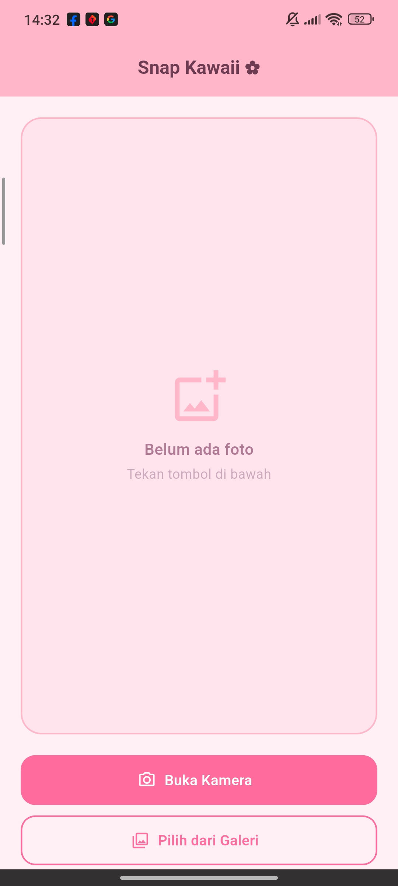
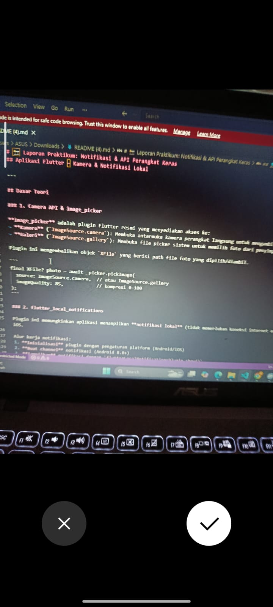
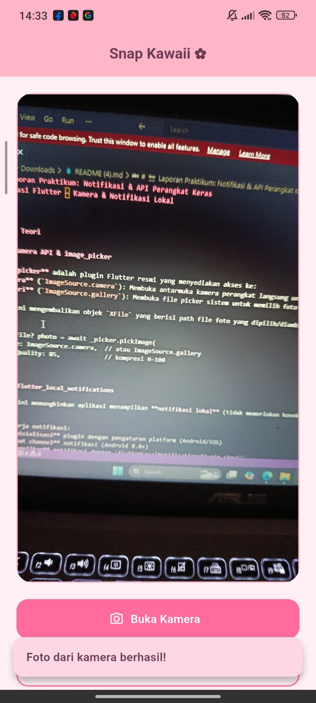
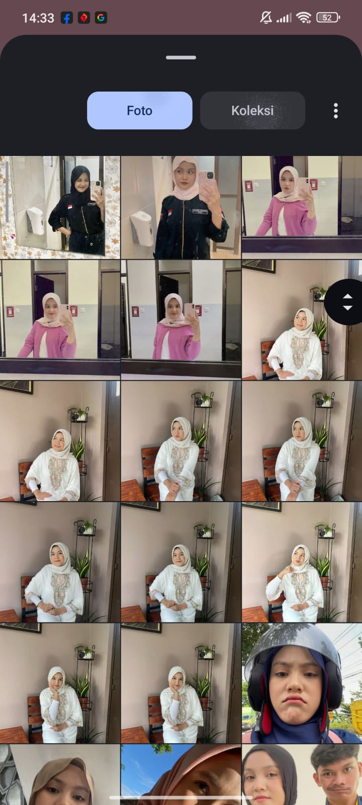
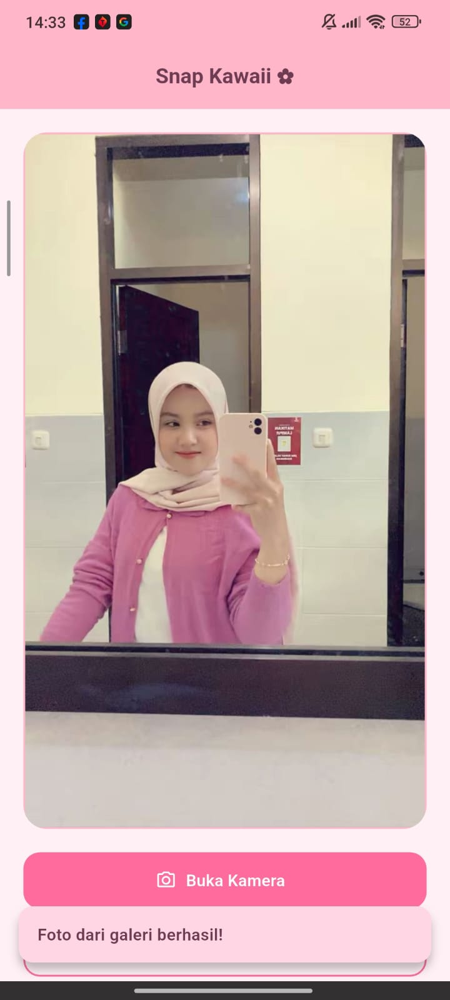

<div align="center">
  <br />

  <h1>LAPORAN PRAKTIKUM <br>
  APLIKASI BERBASIS PLATFORM
  </h1>

  <br />

  <h3>MODUL 8 & 9<br>
  API PERANGKAT KERAS
  </h3>

  <br />

  


  <br />
  <br />
  <br />

  <h3>Disusun Oleh :</h3>

  <p>
    <strong>Boutefhika Nuha Ziyadatul Khair</strong><br>
    <strong>2311102316</strong><br>
    <strong>S1 IF-11-01</strong>
  </p>

  <br />

  <h3>Dosen Pengampu :</h3>

  <p>
    <strong>Dimas Fanny Hebrasianto Permadi, S.ST., M.Kom</strong>
  </p>
  
  <br />
  <br />
    <h4>Asisten Praktikum :</h4>
    <strong>Apri Pandu Wicaksono </strong> <br>
    <strong>Rangga Pradarrell Fathi</strong>
  <br />

  <h3>LABORATORIUM HIGH PERFORMANCE
 <br>FAKULTAS INFORMATIKA <br>UNIVERSITAS TELKOM PURWOKERTO <br>2026</h3>
</div>

<hr>


## Dasar Teori

### 1. Camera API & image_picker

**image_picker** adalah plugin Flutter resmi yang menyediakan akses ke:
- **Kamera** (`ImageSource.camera`): Membuka antarmuka kamera perangkat langsung untuk mengambil foto baru
- **Galeri** (`ImageSource.gallery`): Membuka file picker sistem untuk memilih foto dari penyimpanan

Plugin ini mengembalikan objek `XFile` yang berisi path file foto yang dipilih/diambil.

```
final XFile? photo = await _picker.pickImage(
  source: ImageSource.camera,  // atau ImageSource.gallery
  imageQuality: 85,            // kompresi 0-100
);
```

### 2. flutter_local_notifications

Plugin ini memungkinkan aplikasi menampilkan **notifikasi lokal** (tidak memerlukan koneksi internet atau server) pada perangkat Android dan iOS.

Alur kerja notifikasi:
1. **Inisialisasi** plugin dengan pengaturan platform (Android/iOS)
2. **Buat channel** notifikasi (Android 8.0+)
3. **Tampilkan** notifikasi dengan `flutterLocalNotificationsPlugin.show()`

Komponen utama:
- `AndroidNotificationDetails`: Konfigurasi tampilan notifikasi di Android (channel ID, icon, priority, sound)
- `DarwinNotificationDetails`: Konfigurasi untuk iOS/macOS
- `NotificationDetails`: Wrapper yang menggabungkan konfigurasi semua platform


### 3. Permissions (Izin Aplikasi)

Aplikasi mobile memerlukan izin eksplisit dari pengguna sebelum mengakses hardware atau data sensitif. Izin yang dibutuhkan aplikasi ini:

| Izin | Platform | Kegunaan |
|---|---|---|
| `CAMERA` | Android | Akses kamera untuk foto |
| `READ_MEDIA_IMAGES` | Android 13+ | Baca foto dari galeri |
| `READ_EXTERNAL_STORAGE` | Android ≤12 | Baca file dari penyimpanan |
| `POST_NOTIFICATIONS` | Android 13+ | Tampilkan notifikasi |
| `NSCameraUsageDescription` | iOS | Akses kamera |
| `NSPhotoLibraryUsageDescription` | iOS | Akses galeri |


### 4. Asynchronous Programming

Flutter menggunakan model asynchronous untuk operasi yang membutuhkan waktu (I/O, kamera):

```dart
// async: menandai fungsi sebagai asynchronous
Future<void> _takePhoto() async {
  // await: tunggu sampai operasi selesai sebelum lanjut
  final XFile? photo = await _picker.pickImage(source: ImageSource.camera);
}
```

`Future<T>` merepresentasikan nilai yang akan tersedia di masa depan. `async/await` membuat kode asynchronous terlihat seperti kode sinkronus.

## Penjelasan Singkat Tiap Widget

### Widget Struktural (Kerangka Halaman)

| Widget | Penjelasan |
|---|---|
| **`MaterialApp`** | Widget root aplikasi. Menyediakan tema Material Design, navigasi, dan konfigurasi global seperti judul aplikasi dan `debugShowCheckedModeBanner`. |
| **`Scaffold`** | Kerangka halaman standar Material. Menyediakan slot untuk `AppBar`, `body`, `FloatingActionButton`, `SnackBar`, dan lain-lain. |
| **`AppBar`** | Bar navigasi di bagian atas layar. Menampilkan judul, ikon, dan aksi. Diatur dengan `backgroundColor` dan `foregroundColor`. |

### Widget Layout (Tata Letak)

| Widget | Penjelasan |
|---|---|
| **`Column`** | Menyusun widget secara vertikal (dari atas ke bawah). Properti `crossAxisAlignment` mengatur perataan horizontal child-nya. |
| **`Row`** | Menyusun widget secara horizontal (dari kiri ke kanan). Digunakan untuk menampilkan ikon dan teks berdampingan di AppBar. |
| **`SingleChildScrollView`** | Membungkus konten agar bisa di-scroll ketika konten melebihi ukuran layar. Penting untuk halaman dengan konten panjang. |
| **`Stack`** | Menumpuk widget satu di atas yang lain. Digunakan untuk menempatkan badge "Foto Dipilih" di atas foto. |
| **`Positioned`** | Digunakan di dalam `Stack` untuk menempatkan widget di posisi spesifik (pojok, tepi, dll). |
| **`SizedBox`** | Membuat ruang kosong dengan lebar/tinggi tertentu. Berfungsi sebagai *spacer* antar widget. |
| **`Padding`** | Menambahkan jarak (padding) di sekeliling widget anaknya. |
| **`Expanded`** | Membuat widget mengisi sisa ruang yang tersedia dalam `Row` atau `Column`. |

### Widget Tampilan (Visual)

| Widget | Penjelasan |
|---|---|
| **`Text`** | Menampilkan teks statis. Mendukung kustomisasi via `TextStyle` (ukuran, warna, ketebalan font). |
| **`Icon`** | Menampilkan ikon dari library Material Icons bawaan Flutter. |
| **`Image.file`** | Menampilkan gambar dari file lokal di perangkat. Digunakan untuk menampilkan foto yang telah diambil/dipilih. |
| **`Container`** | Widget serbaguna untuk dekorasi (warna background, border, border radius, shadow) dan pengaturan ukuran. |
| **`CircularProgressIndicator`** | Menampilkan animasi loading lingkaran berputar. Ditampilkan saat proses mengambil foto berlangsung. |

### Widget Interaksi (Input)

| Widget | Penjelasan |
|---|---|
| **`ElevatedButton.icon`** | Tombol dengan latar belakang berwarna dan ikon. Dua tombol utama: "Buka Kamera" (biru) dan "Pilih dari Galeri" (hijau). |
| **`SnackBar`** | Pesan singkat yang muncul di bagian bawah layar sementara. Digunakan untuk konfirmasi sukses atau error. |

### Widget State Management

| Widget | Penjelasan |
|---|---|
| **`StatefulWidget`** | Base class untuk widget yang bisa berubah state-nya. `HomePage` extends ini karena perlu memperbarui tampilan foto. |
| **`StatelessWidget`** | Base class untuk widget tanpa state. `MyApp` extends ini karena hanya mendefinisikan konfigurasi app yang tidak berubah. |
| **`setState()`** | Method untuk memberitahu Flutter bahwa state telah berubah, sehingga widget perlu di-render ulang (*rebuild*). |

### Plugin & Kelas Pendukung

| Kelas/Plugin | Penjelasan |
|---|---|
| **`ImagePicker`** | Kelas dari plugin `image_picker`. Method `pickImage()` membuka kamera atau galeri dan mengembalikan `XFile`. |
| **`XFile`** | Representasi file lintas platform. Menyimpan path file foto yang dipilih. |
| **`File`** (dart:io) | Kelas Dart untuk operasi file sistem. Digunakan mengonversi path `XFile` menjadi objek gambar yang bisa ditampilkan `Image.file`. |
| **`FlutterLocalNotificationsPlugin`** | Kelas utama plugin notifikasi. Method `show()` menampilkan notifikasi dengan ID, judul, pesan, dan detail platform. |
| **`AndroidNotificationDetails`** | Konfigurasi notifikasi spesifik Android: channel ID, nama channel, importance, priority, dan ikon. |
| **`DarwinNotificationDetails`** | Konfigurasi notifikasi spesifik iOS/macOS: izin alert, badge, dan sound. |
| **`NotificationDetails`** | Wrapper yang menggabungkan konfigurasi Android dan iOS menjadi satu objek untuk semua platform. |

## 📦 Dependencies

```
image_picker: ^1.0.7
└── Akses kamera & galeri foto perangkat

flutter_local_notifications: ^17.0.0
└── Notifikasi lokal tanpa server/internet
```

## 💻 Source Code

### `pubspec.yaml`

```
name: foto_notifikasi_app
description: Aplikasi Flutter untuk mengambil foto dan menampilkan notifikasi lokal.

version: 1.0.0+1

environment:
  sdk: '>=3.0.0 <4.0.0'

dependencies:
  flutter:
    sdk: flutter
  image_picker: ^1.0.7            # Plugin kamera & galeri
  flutter_local_notifications: ^17.0.0  # Plugin notifikasi lokal
  cupertino_icons: ^1.0.6

dev_dependencies:
  flutter_test:
    sdk: flutter
  flutter_lints: ^3.0.0

flutter:
  uses-material-design: true
```

### `AndroidManifest.xml` (Izin Android)

```
<?xml version="1.0" encoding="utf-8"?>
<manifest xmlns:android="http://schemas.android.com/apk/res/android">

    <!-- Izin untuk mengakses kamera -->
    <uses-permission android:name="android.permission.CAMERA" />

    <!-- Izin untuk membaca penyimpanan (Android < 13) -->
    <uses-permission android:name="android.permission.READ_EXTERNAL_STORAGE"
        android:maxSdkVersion="32" />

    <!-- Izin untuk membaca media foto (Android 13+) -->
    <uses-permission android:name="android.permission.READ_MEDIA_IMAGES" />

    <!-- Izin untuk menampilkan notifikasi (Android 13+) -->
    <uses-permission android:name="android.permission.POST_NOTIFICATIONS"/>

    <!-- Izin untuk menjaga layar tetap aktif -->
    <uses-permission android:name="android.permission.WAKE_LOCK" />

    <!-- Izin untuk menerima notifikasi saat boot -->
    <uses-permission android:name="android.permission.RECEIVE_BOOT_COMPLETED"/>

    <!-- Izin untuk jadwal alarm tepat waktu (notifikasi terjadwal) -->
    <uses-permission android:name="android.permission.SCHEDULE_EXACT_ALARM" />

    <!-- Fitur kamera sebagai opsional -->
    <uses-feature android:name="android.hardware.camera" android:required="false" />

    <application
        android:label="Foto &amp; Notifikasi"
        android:name="${applicationName}"
        android:icon="@mipmap/ic_launcher"
        android:enableOnBackInvokedCallback="true">

        <activity
            android:name=".MainActivity"
            android:exported="true"
            android:launchMode="singleTop"
            android:theme="@style/LaunchTheme"
            android:configChanges="orientation|keyboardHidden|keyboard|screenSize|smallestScreenSize|locale|layoutDirection|fontScale|screenLayout|density|uiMode"
            android:hardwareAccelerated="true"
            android:windowSoftInputMode="adjustResize">

            <meta-data
              android:name="io.flutter.embedding.android.NormalTheme"
              android:resource="@style/NormalTheme"
              />

            <intent-filter>
                <action android:name="android.intent.action.MAIN"/>
                <category android:name="android.intent.category.LAUNCHER"/>
            </intent-filter>
        </activity>

        <!-- Provider untuk FileProvider (dibutuhkan image_picker) -->
        <provider
            android:name="androidx.core.content.FileProvider"
            android:authorities="${applicationId}.fileprovider"
            android:exported="false"
            android:grantUriPermissions="true">
            <meta-data
                android:name="android.support.FILE_PROVIDER_PATHS"
                android:resource="@xml/file_paths" />
        </provider>

        <!-- Meta data untuk flutter_local_notifications -->
        <meta-data
            android:name="com.google.firebase.messaging.default_notification_channel_id"
            android:value="foto_channel_id" />

        <receiver android:exported="false"
            android:name="com.dexterous.flutterlocalnotifications.ScheduledNotificationReceiver" />
        <receiver android:exported="false"
            android:name="com.dexterous.flutterlocalnotifications.ScheduledNotificationBootReceiver">
            <intent-filter>
                <action android:name="android.intent.action.BOOT_COMPLETED"/>
                <action android:name="android.intent.action.MY_PACKAGE_REPLACED"/>
                <action android:name="android.intent.action.QUICKBOOT_POWERON" />
                <action android:name="com.htc.intent.action.QUICKBOOT_POWERON"/>
            </intent-filter>
        </receiver>

        <meta-data
            android:name="flutterEmbedding"
            android:value="2" />
    </application>

</manifest>
```

### `main.dart` — Kode Lengkap

```
import 'dart:typed_data';
import 'package:flutter/material.dart';
import 'package:image_picker/image_picker.dart';
import 'package:flutter_local_notifications/flutter_local_notifications.dart';

final FlutterLocalNotificationsPlugin flutterLocalNotificationsPlugin =
    FlutterLocalNotificationsPlugin();

void main() async {
  WidgetsFlutterBinding.ensureInitialized();
  const AndroidInitializationSettings android =
      AndroidInitializationSettings('@mipmap/ic_launcher');
  const DarwinInitializationSettings ios = DarwinInitializationSettings(
    requestAlertPermission: true,
    requestBadgePermission: true,
    requestSoundPermission: true,
  );
  await flutterLocalNotificationsPlugin.initialize(
    const InitializationSettings(android: android, iOS: ios),
  );
  runApp(const MyApp());
}

class MyApp extends StatelessWidget {
  const MyApp({super.key});

  @override
  Widget build(BuildContext context) {
    return MaterialApp(
      title: 'Snap Kawaii',
      debugShowCheckedModeBanner: false,
      theme: ThemeData(
        scaffoldBackgroundColor: const Color(0xFFFFF0F5),
        colorScheme: ColorScheme.fromSeed(
          seedColor: const Color(0xFFFF6B9D),
        ),
        useMaterial3: true,
      ),
      home: const HomePage(),
    );
  }
}

class HomePage extends StatefulWidget {
  const HomePage({super.key});
  @override
  State<HomePage> createState() => _HomePageState();
}

class _HomePageState extends State<HomePage> {
  // Simpan sebagai bytes agar support Web & Mobile
  Uint8List? _imageBytes;
  final ImagePicker _picker = ImagePicker();
  bool _isLoading = false;

  // ── Notifikasi ────────────────────────────────────────────────────────────
  Future<void> _showNotification(String source) async {
    const AndroidNotificationDetails android = AndroidNotificationDetails(
      'snap_kawaii_ch',
      'Snap Kawaii',
      channelDescription: 'Notifikasi foto',
      importance: Importance.high,
      priority: Priority.high,
      icon: '@mipmap/ic_launcher',
    );
    const DarwinNotificationDetails ios = DarwinNotificationDetails(
      presentAlert: true,
      presentBadge: true,
      presentSound: true,
    );
    await flutterLocalNotificationsPlugin.show(
      0,
      source == 'camera' ? '📸 Foto tersimpan!' : '🖼️ Foto dipilih!',
      source == 'camera'
          ? 'Foto dari kamera berhasil diambil.'
          : 'Foto dari galeri berhasil dipilih.',
      const NotificationDetails(android: android, iOS: ios),
    );
  }

  // ── Ambil dari Kamera ─────────────────────────────────────────────────────
  Future<void> _takePhotoFromCamera() async {
    setState(() => _isLoading = true);
    try {
      final XFile? photo =
          await _picker.pickImage(source: ImageSource.camera, imageQuality: 85);
      if (photo != null) {
        // readAsBytes() support Web & Mobile
        final bytes = await photo.readAsBytes();
        setState(() => _imageBytes = bytes);
        await _showNotification('camera');
        _snack('Foto dari kamera berhasil!');
      }
    } catch (e) {
      _snack('Gagal membuka kamera.');
    } finally {
      setState(() => _isLoading = false);
    }
  }

  // ── Ambil dari Galeri ─────────────────────────────────────────────────────
  Future<void> _pickPhotoFromGallery() async {
    setState(() => _isLoading = true);
    try {
      final XFile? photo = await _picker.pickImage(
          source: ImageSource.gallery, imageQuality: 85);
      if (photo != null) {
        final bytes = await photo.readAsBytes();
        setState(() => _imageBytes = bytes);
        await _showNotification('gallery');
        _snack('Foto dari galeri berhasil!');
      }
    } catch (e) {
      _snack('Gagal membuka galeri.');
    } finally {
      setState(() => _isLoading = false);
    }
  }

  void _snack(String msg) {
    ScaffoldMessenger.of(context).showSnackBar(
      SnackBar(
        content: Text(msg,
            style: const TextStyle(
                color: Color(0xFF6D3B52), fontWeight: FontWeight.w600)),
        backgroundColor: const Color(0xFFFFD6E4),
        behavior: SnackBarBehavior.floating,
        shape:
            RoundedRectangleBorder(borderRadius: BorderRadius.circular(12)),
        margin: const EdgeInsets.all(16),
        duration: const Duration(seconds: 3),
      ),
    );
  }

  // ── Build ─────────────────────────────────────────────────────────────────
  @override
  Widget build(BuildContext context) {
    return Scaffold(
      appBar: AppBar(
        backgroundColor: const Color(0xFFFFB6C8),
        elevation: 0,
        title: const Text(
          'Snap Kawaii ✿',
          style: TextStyle(
            color: Color(0xFF6D3B52),
            fontWeight: FontWeight.w700,
            fontSize: 18,
          ),
        ),
        centerTitle: true,
      ),
      body: Padding(
        padding: const EdgeInsets.all(20),
        child: Column(
          crossAxisAlignment: CrossAxisAlignment.stretch,
          children: [
            // ── Area foto ──────────────────────────────────────────────────
            Expanded(
              child: Container(
                decoration: BoxDecoration(
                  color: const Color(0xFFFFE4EE),
                  borderRadius: BorderRadius.circular(20),
                  border: Border.all(
                      color: const Color(0xFFFFB6C8), width: 1.5),
                ),
                clipBehavior: Clip.antiAlias,
                child: _buildImageArea(),
              ),
            ),
            const SizedBox(height: 20),
            // ── Tombol Kamera ──────────────────────────────────────────────
            FilledButton.icon(
              onPressed: _isLoading ? null : _takePhotoFromCamera,
              icon: const Icon(Icons.camera_alt_outlined),
              label: const Text('Buka Kamera',
                  style: TextStyle(fontWeight: FontWeight.w600)),
              style: FilledButton.styleFrom(
                backgroundColor: const Color(0xFFFF6B9D),
                foregroundColor: Colors.white,
                minimumSize: const Size.fromHeight(48),
                shape: RoundedRectangleBorder(
                    borderRadius: BorderRadius.circular(14)),
              ),
            ),
            const SizedBox(height: 10),
            // ── Tombol Galeri ──────────────────────────────────────────────
            OutlinedButton.icon(
              onPressed: _isLoading ? null : _pickPhotoFromGallery,
              icon: const Icon(Icons.photo_library_outlined),
              label: const Text('Pilih dari Galeri',
                  style: TextStyle(fontWeight: FontWeight.w600)),
              style: OutlinedButton.styleFrom(
                foregroundColor: const Color(0xFFFF6B9D),
                side: const BorderSide(
                    color: Color(0xFFFF6B9D), width: 1.5),
                minimumSize: const Size.fromHeight(48),
                shape: RoundedRectangleBorder(
                    borderRadius: BorderRadius.circular(14)),
              ),
            ),
          ],
        ),
      ),
    );
  }

  // ── Area tampilan foto ─────────────────────────────────────────────────────
  Widget _buildImageArea() {
    if (_isLoading) {
      return const Center(
        child: CircularProgressIndicator(color: Color(0xFFFF6B9D)),
      );
    }
    if (_imageBytes != null) {
      // Image.memory — support Web & Mobile (pakai bytes, bukan File)
      return Image.memory(_imageBytes!, fit: BoxFit.cover);
    }
    return const Center(
      child: Column(
        mainAxisSize: MainAxisSize.min,
        children: [
          Icon(Icons.add_photo_alternate_outlined,
              size: 56, color: Color(0xFFFFB6C8)),
          SizedBox(height: 12),
          Text(
            'Belum ada foto',
            style: TextStyle(
              color: Color(0xFFB07A95),
              fontSize: 15,
              fontWeight: FontWeight.w600,
            ),
          ),
          SizedBox(height: 4),
          Text(
            'Tekan tombol di bawah',
            style: TextStyle(color: Color(0xFFCBA8BB), fontSize: 13),
          ),
        ],
      ),
    );
  }
}
```

## 📱 Screenshot Hasil

### Tampilan Awal


### Tampilan Foto Ambil dari Kamera


### Hasil & Notifikasi


### Tampilan Foto dari ambil dari Galeri


### Hasil & Notifikasi

