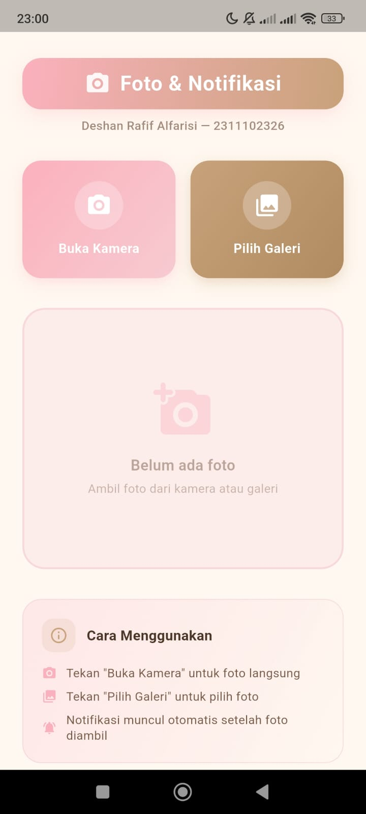
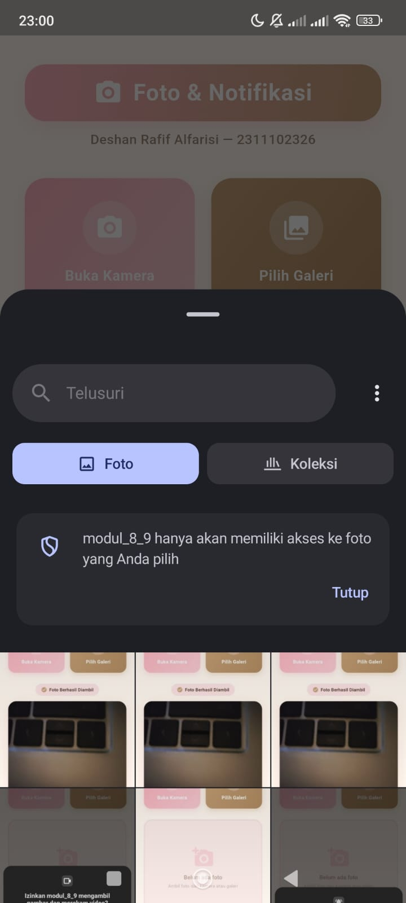
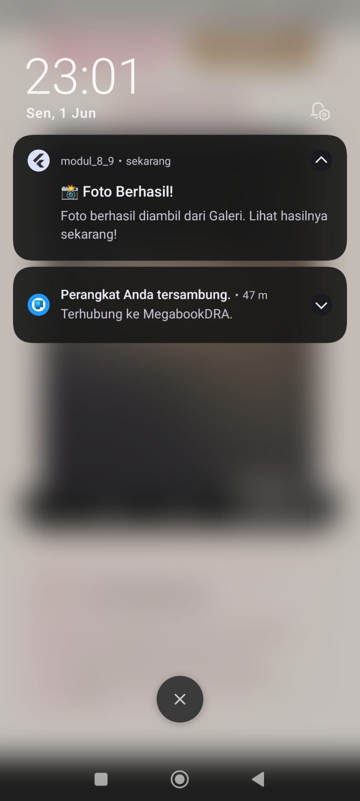

<div align="center">
  <br />
  <h1>LAPORAN PRAKTIKUM <br>APLIKASI BERBASIS PLATFORM</h1>
  <br />
  <h2>MODUL 8 & 9 <br>NOTIFIKASI & API PERANGKAT KERAS</h2>
  <br /><br />

  

  <br /><br /><br />

  <h3>Disusun Oleh :</h3>

  <p>
    <strong>Deshan Rafif Alfarisi</strong><br>
    <strong>2311102326</strong><br>
    <strong>S1 IF-11-REG 01</strong>
  </p>

  <br />

  <h3>Dosen Pengampu :</h3>

  <p>
    <strong>Dimas Fanny Hebrasianto Permadi, S.ST., M.Kom</strong>
  </p>

  <br /><br />

  <h4>Asisten Praktikum :</h4>

  <p>
    <strong>Apri Pandu Wicaksono</strong><br>
    <strong>Rangga Pradarrell Fathi</strong>
  </p>

  <br />

  <h2>
  LABORATORIUM HIGH PERFORMANCE <br>
  FAKULTAS INFORMATIKA <br>
  UNIVERSITAS TELKOM PURWOKERTO <br>
  2026
  </h2>
</div>

---
## 1. Pendahuluan

Flutter merupakan framework multiplatform yang dikembangkan oleh Google untuk membangun antarmuka aplikasi yang indah secara cepat dan efisien menggunakan satu basis kode (*single codebase*). Selain unggul dalam pembuatan elemen visual (widget), aplikasi mobile modern juga sering kali dituntut untuk berinteraksi langsung dengan perangkat keras (*hardware*) perangkat pengguna serta berinteraksi secara aktif di luar aplikasi melalui sistem notifikasi.

Pada praktikum Modul 8 & 9 ini, fokus utama kegiatan adalah mengintegrasikan API perangkat keras berupa **kamera** dan **galeri** menggunakan package `image_picker`, serta mengimplementasikan **notifikasi lokal** (*local notifications*) menggunakan package `flutter_local_notifications`. Dengan integrasi ini, pengguna dapat mengambil gambar secara langsung melalui kamera fisik atau memilih gambar yang sudah ada dari galeri perangkat. Setelah gambar berhasil dimuat, aplikasi akan memicu notifikasi sistem lokal untuk memberi tahu pengguna bahwa gambar telah sukses diambil.

Praktikum ini bertujuan agar mahasiswa dapat memahami mekanisme kerja pengambilan gambar di perangkat mobile, penanganan izin (*permission*) akses perangkat keras, konfigurasi notifikasi sistem, serta menyusun UI interaktif yang memanfaatkan transisi animasi dan widget kustom demi meningkatkan kenyamanan pengguna (*user experience*).

---

## 2. Tujuan Praktikum

Tujuan dari praktikum ini adalah sebagai berikut:

1. Memahami konsep dasar penggunaan API perangkat keras (kamera dan galeri) pada aplikasi Flutter.
2. Memahami mekanisme penanganan izin akses (*permission handling*) perangkat keras di sistem operasi mobile.
3. Mampu mengintegrasikan dan menggunakan package `image_picker` untuk mengambil atau memilih gambar.
4. Memahami alur kerja dan konfigurasi sistem notifikasi lokal pada platform Android dan iOS menggunakan `flutter_local_notifications`.
5. Mampu mengimplementasikan notifikasi lokal dinamis yang dipicu oleh aktivitas pengguna di dalam aplikasi.
6. Mampu membuat antarmuka UI interaktif yang memadukan animasi transisi (*fade* & *scale*) serta widget interaktif kustom berbasis *gesture*.

---

## 3. Dasar Teori

### 3.1 Flutter dan Integrasi Native API

Meskipun Flutter berjalan pada lingkungan *engine* Dart miliknya sendiri, Flutter menyediakan mekanisme komunikasi dengan platform native (Android & iOS) melalui *Platform Channels*. Untuk fungsi-fungsi umum seperti kamera, galeri, dan notifikasi, komunitas Flutter telah menyediakan package siap pakai yang menjembatani kode Dart dengan API native masing-masing sistem operasi secara transparan. Hal ini mempermudah developer karena tidak perlu menulis kode native (Java/Kotlin/Swift) secara manual.

### 3.2 API Perangkat Keras: Kamera & Galeri (`image_picker`)

`image_picker` adalah package Flutter resmi dari tim developer Flutter yang digunakan untuk memilih gambar atau video dari galeri foto perangkat, atau mengambil foto/video baru langsung menggunakan kamera fisik. Package ini mengelola alur kerja pemanggilan aplikasi sistem (kamera/galeri bawaan), menangkap hasilnya, dan mengembalikannya ke aplikasi Flutter dalam bentuk file path objek `XFile` yang kemudian dapat diproses atau ditampilkan.

Sebelum menggunakannya pada perangkat nyata, diperlukan konfigurasi perizinan akses:
- Pada Android: Mulai Android 13+, izin notifikasi harus diminta secara dinamis. Untuk kamera dan galeri, sistem Android mengelola perizinan secara otomatis saat *intent* kamera/galeri dijalankan lewat package ini.
- Pada iOS: Diperlukan penambahan entri deskripsi izin pada file `Info.plist`, seperti `NSCameraUsageDescription` (untuk kamera) dan `NSPhotoLibraryUsageDescription` (untuk galeri).

### 3.3 Sistem Notifikasi Lokal (`flutter_local_notifications`)

Notifikasi lokal adalah notifikasi yang dibuat dan dipicu oleh aplikasi itu sendiri di dalam perangkat pengguna, tanpa memerlukan server eksternal (berbeda dengan *Push Notifications* yang dikirim via layanan cloud seperti FCM atau APNs). Package `flutter_local_notifications` merupakan package lintas platform terpopuler untuk menangani notifikasi lokal di Flutter.

Untuk menampilkan notifikasi di Android, Flutter harus menentukan spesifikasi **Notification Channel** (mulai Android O/8.0 ke atas). Channel ini mencakup konfigurasi tingkat kepentingan (*importance*), suara, pola getar, dan prioritas (*priority*). Pada iOS, perizinan notifikasi (*alert*, *badge*, *sound*) harus diminta secara eksplisit ketika aplikasi pertama kali dijalankan.

### 3.4 StatefulWidget dan Animasi di Flutter

`StatefulWidget` adalah widget yang memiliki status (*state*) dinamis yang dapat berubah selama siklus hidup aplikasi berjalan. Berbeda dengan `StatelessWidget` yang statis, `StatefulWidget` digunakan ketika perubahan data atau interaksi pengguna (seperti gambar yang baru diambil) memerlukan penggambaran ulang (*rebuild*) tampilan melalui fungsi `setState()`.

Dalam memicu animasi visual, Flutter menyediakan kelas `AnimationController` yang bertindak sebagai pengontrol durasi dan status animasi (memutar, membalikkan, atau menghentikan). Penggabungan `AnimationController` dengan widget transisi seperti `FadeTransition` (animasi transparansi) dan `ScaleTransition` (animasi perubahan ukuran) menggunakan kurva transisi tertentu (misalnya `Curves.elasticOut` untuk efek membal) dapat menciptakan antarmuka yang sangat premium dan hidup.

---

## 4. Langkah-Langkah Praktikum

### 4.1 Menulis Struktur Dasar dan Impor Library

Langkah pertama adalah mengimpor package inti Flutter Material, library input-output Dart (`dart:io`), serta package API perangkat keras (`image_picker`) dan sistem notifikasi lokal (`flutter_local_notifications`).

```dart
import 'dart:io';
import 'package:flutter/material.dart';
import 'package:image_picker/image_picker.dart';
import 'package:flutter_local_notifications/flutter_local_notifications.dart';
```

Kode di atas mempersiapkan semua fungsionalitas eksternal yang akan digunakan sepanjang aplikasi.

### 4.2 Inisialisasi Plugin Notifikasi

Untuk memulai sistem notifikasi, instansiasi plugin dibuat secara global agar dapat diakses kapan saja. Kemudian, dibuat fungsi `initNotifications()` untuk mengatur inisialisasi awal pada platform Android dan iOS.

```dart
final FlutterLocalNotificationsPlugin flutterLocalNotificationsPlugin =
    FlutterLocalNotificationsPlugin();

Future<void> initNotifications() async {
  const AndroidInitializationSettings androidSettings =
      AndroidInitializationSettings('@mipmap/ic_launcher');

  const DarwinInitializationSettings iosSettings =
      DarwinInitializationSettings(
        requestAlertPermission: true,
        requestBadgePermission: true,
        requestSoundPermission: true,
      );

  const InitializationSettings initSettings = InitializationSettings(
    android: androidSettings,
    iOS: iosSettings,
  );

  await flutterLocalNotificationsPlugin.initialize(settings: initSettings);

  // Meminta izin notifikasi dinamis pada Android 13+ (API 33+)
  flutterLocalNotificationsPlugin
      .resolvePlatformSpecificImplementation<
          AndroidFlutterLocalNotificationsPlugin>()
      ?.requestNotificationsPermission();
}
```

Fungsi `initNotifications()` mengonfigurasi ikon default notifikasi untuk Android (menggunakan `@mipmap/ic_launcher`) dan meminta izin notifikasi untuk perangkat iOS dan Android 13+.

### 4.3 Membuat Fungsi Pemicu Notifikasi

Dibuat fungsi asinkron `showPhotoNotification()` untuk merancang dan menampilkan notifikasi setelah foto sukses diambil. Fungsi ini menentukan pengaturan khusus platform Android seperti nama channel, deskripsi, tingkat kepentingan (*importance*), dan prioritas.

```dart
Future<void> showPhotoNotification(String source) async {
  const AndroidNotificationDetails androidDetails =
      AndroidNotificationDetails(
        'photo_channel',
        'Photo Notifications',
        channelDescription: 'Notifikasi ketika foto berhasil diambil',
        importance: Importance.high,
        priority: Priority.high,
        icon: '@mipmap/ic_launcher',
      );

  const NotificationDetails details = NotificationDetails(
    android: androidDetails,
    iOS: DarwinNotificationDetails(),
  );

  await flutterLocalNotificationsPlugin.show(
    id: 0,
    title: '📸 Foto Berhasil!',
    body: 'Foto berhasil diambil dari $source. Lihat hasilnya sekarang!',
    notificationDetails: details,
  );
}
```

Sistem notifikasi ini akan menampilkan pop-up di atas layar karena prioritas setinggi `Importance.high` dan pesan *body* disesuaikan dengan sumber pengambilan (`source`), baik dari Kamera maupun Galeri.

### 4.4 Definisi Palette Warna Kustom (Design Aesthetics)

Untuk menghasilkan desain yang modern dan premium, dibuat kelas penampung konstanta warna `AppColors` yang mengadopsi skema warna pastel bernuansa pink, krem, dan emas.

```dart
class AppColors {
  static const Color pinkLight = Color(0xFFF7CAD0);
  static const Color pinkMedium = Color(0xFFFBB1BD);
  static const Color pinkSoft = Color(0xFFFDE2E4);
  static const Color cream = Color(0xFFFFF8F0);
  static const Color gold = Color(0xFFC8A27A);
  static const Color goldDark = Color(0xFFB08A60);
  static const Color textDark = Color(0xFF4A3728);
  static const Color textMedium = Color(0xFF7A5C4A);
}
```

### 4.5 Entry Point Aplikasi & Membuat Class MyApp

Fungsi `main()` dikonfigurasi secara asinkron agar inisialisasi notifikasi wajib diselesaikan terlebih dahulu sebelum widget pohon aplikasi dijalankan. Kelas `MyApp` dikonfigurasi dengan tema Material 3, warna dasar palette, serta tipe font *Segoe UI*.

```dart
void main() async {
  WidgetsFlutterBinding.ensureInitialized();
  await initNotifications();
  runApp(const MyApp());
}

class MyApp extends StatelessWidget {
  const MyApp({super.key});

  @override
  Widget build(BuildContext context) {
    return MaterialApp(
      title: 'Modul 8 & 9 - Foto & Notifikasi',
      debugShowCheckedModeBanner: false,
      theme: ThemeData(
        colorScheme: ColorScheme.light(
          primary: AppColors.gold,
          secondary: AppColors.pinkMedium,
          surface: AppColors.cream,
        ),
        scaffoldBackgroundColor: AppColors.cream,
        fontFamily: 'Segoe UI',
        useMaterial3: true,
      ),
      home: const HomePage(),
    );
  }
}
```

### 4.6 Membuat StatefulWidget HomePage dan Inisialisasi Kontroler Animasi

`HomePage` didefinisikan sebagai `StatefulWidget` karena aplikasi membutuhkan penyimpanan objek file gambar secara dinamis serta kontrol terhadap jalannya siklus animasi.

```dart
class HomePage extends StatefulWidget {
  const HomePage({super.key});

  @override
  State<HomePage> createState() => _HomePageState();
}

class _HomePageState extends State<HomePage> with TickerProviderStateMixin {
  File? _imageFile;
  final ImagePicker _picker = ImagePicker();

  late AnimationController _fadeController;
  late Animation<double> _fadeAnimation;

  late AnimationController _scaleController;
  late Animation<double> _scaleAnimation;

  @override
  void initState() {
    super.initState();
    _fadeController = AnimationController(
      duration: const Duration(milliseconds: 600),
      vsync: this,
    );
    _fadeAnimation = CurvedAnimation(
      parent: _fadeController,
      curve: Curves.easeInOut,
    );

    _scaleController = AnimationController(
      duration: const Duration(milliseconds: 500),
      vsync: this,
    );
    _scaleAnimation = CurvedAnimation(
      parent: _scaleController,
      curve: Curves.elasticOut, // Animasi membal elastis yang premium
    );
  }

  @override
  void dispose() {
    _fadeController.dispose();
    _scaleController.dispose();
    super.dispose();
  }
  
  // Fungsi logika diletakkan di bawah...
}
```

Dalam fungsi `initState()`, objek `AnimationController` untuk efek transparansi (*fade*) dan perbesaran (*scale*) diinisialisasi. Penggunaan `Curves.elasticOut` memberikan transisi munculan gambar yang membal dan modern. Fungsi `dispose()` memastikan controller dibersihkan dari memori guna mencegah *memory leak*.

### 4.7 Implementasi Logika Pengambilan Foto dari Kamera

Fungsi `_takePhoto()` memanggil antarmuka kamera perangkat secara asinkron dengan pembatasan kualitas kompresi agar memori tetap efisien.

```dart
  Future<void> _takePhoto() async {
    final XFile? photo = await _picker.pickImage(
      source: ImageSource.camera,
      imageQuality: 85,
      maxWidth: 1200,
    );
    if (photo != null) {
      setState(() {
        _imageFile = File(photo.path);
      });
      _fadeController.reset();
      _fadeController.forward();
      _scaleController.reset();
      _scaleController.forward();
      await showPhotoNotification('Kamera');
    }
  }
```

Saat foto sukses diambil, state `_imageFile` diperbarui, animasi diputar maju kembali dari awal, dan notifikasi lokal dengan parameter `'Kamera'` langsung dipicu.

### 4.8 Implementasi Logika Memilih Foto dari Galeri

Fungsi `_pickFromGallery()` bekerja dengan logika yang serupa dengan kamera, namun mengarahkan sumber inputnya ke galeri foto internal ponsel.

```dart
  Future<void> _pickFromGallery() async {
    final XFile? photo = await _picker.pickImage(
      source: ImageSource.gallery,
      imageQuality: 85,
      maxWidth: 1200,
    );
    if (photo != null) {
      setState(() {
        _imageFile = File(photo.path);
      });
      _fadeController.reset();
      _fadeController.forward();
      _scaleController.reset();
      _scaleController.forward();
      await showPhotoNotification('Galeri');
    }
  }
```

### 4.9 Menyusun Kerangka Struktur UI

Layout halaman utama dirancang responsif menggunakan kombinasi `SafeArea` agar terbebas dari poni layar ponsel, `SingleChildScrollView` untuk kenyamanan gulir layar, serta `Column` vertikal.

```dart
  @override
  Widget build(BuildContext context) {
    return Scaffold(
      body: SafeArea(
        child: SingleChildScrollView(
          physics: const BouncingScrollPhysics(),
          child: Padding(
            padding: const EdgeInsets.symmetric(horizontal: 24, vertical: 16),
            child: Column(
              children: [
                // 1. Header Grafis
                // 2. Deskripsi Mahasiswa
                // 3. Tombol Aksi (Kamera & Galeri)
                // 4. Area Preview Gambar / Placeholder
                // 5. Panduan Penggunaan
              ],
            ),
          ),
        ),
      ),
    );
  }
```

### 4.10 Membuat Tampilan Header & Identitas Mahasiswa

Header didesain menggunakan gradasi warna horizontal kustom yang halus dengan efek bayangan melayang, dipadukan teks identitas mahasiswa pembuat laporan praktikum.

```dart
                // ── Header ──
                const SizedBox(height: 12),
                Container(
                  padding:
                      const EdgeInsets.symmetric(horizontal: 20, vertical: 12),
                  decoration: BoxDecoration(
                    gradient: const LinearGradient(
                      colors: [AppColors.pinkMedium, AppColors.gold],
                      begin: Alignment.topLeft,
                      end: Alignment.bottomRight,
                    ),
                    borderRadius: BorderRadius.circular(20),
                    boxShadow: [
                      BoxShadow(
                        color: AppColors.pinkMedium.withValues(alpha: 0.3),
                        blurRadius: 15,
                        offset: const Offset(0, 6),
                      ),
                    ],
                  ),
                  child: Row(
                    mainAxisAlignment: MainAxisAlignment.center,
                    children: [
                      Icon(Icons.camera_alt_rounded,
                          color: Colors.white.withValues(alpha: 0.9),
                          size: 28),
                      const SizedBox(width: 10),
                      const Text(
                        'Foto & Notifikasi',
                        style: TextStyle(
                          fontSize: 22,
                          fontWeight: FontWeight.bold,
                          color: Colors.white,
                          letterSpacing: 0.5,
                        ),
                      ),
                    ],
                  ),
                ),

                const SizedBox(height: 8),
                Text(
                  'Deshan Rafif Alfarisi — 2311102326',
                  style: TextStyle(
                    fontSize: 13,
                    color: AppColors.textMedium.withValues(alpha: 0.7),
                    fontWeight: FontWeight.w500,
                  ),
                ),
```

### 4.11 Membuat Tombol Utama (Buka Kamera & Pilih Galeri)

Tombol aksi diletakkan sejajar secara horizontal menggunakan `Row` dan `Expanded`. Tombol ini dibuat dengan menggunakan kelas widget `_ActionButton` kustom agar memiliki visual gradasi dan umpan balik getaran sentuh.

```dart
                // ── Buttons ──
                Row(
                  children: [
                    Expanded(
                      child: _ActionButton(
                        icon: Icons.camera_alt_rounded,
                        label: 'Buka Kamera',
                        gradientColors: const [
                          AppColors.pinkMedium,
                          AppColors.pinkLight,
                        ],
                        onTap: _takePhoto,
                      ),
                    ),
                    const SizedBox(width: 16),
                    Expanded(
                      child: _ActionButton(
                        icon: Icons.photo_library_rounded,
                        label: 'Pilih Galeri',
                        gradientColors: const [
                          AppColors.gold,
                          AppColors.goldDark,
                        ],
                        onTap: _pickFromGallery,
                      ),
                    ),
                  ],
                ),
```

### 4.12 Membuat Image Preview dengan Animasi Transisi & Dekorasi Premium

Ketika foto tersedia (`_imageFile != null`), gambar tersebut akan dirender di dalam `FadeTransition` dan `ScaleTransition`. Gambar dibungkus dengan kartu berbayangan ganda (*double shadow*), ujung melengkung (*clip*), overlay gradasi gelap di bagian bawah, serta teks tanda air (*watermark*) kustom.

```dart
                // ── Image Preview ──
                if (_imageFile != null)
                  FadeTransition(
                    opacity: _fadeAnimation,
                    child: ScaleTransition(
                      scale: _scaleAnimation,
                      child: Column(
                        children: [
                          // Badge Status Sukses
                          Container(
                            padding: const EdgeInsets.symmetric(
                                horizontal: 16, vertical: 8),
                            decoration: BoxDecoration(
                              color: AppColors.pinkSoft,
                              borderRadius: BorderRadius.circular(30),
                            ),
                            child: const Row(
                              mainAxisSize: MainAxisSize.min,
                              children: [
                                Icon(Icons.check_circle_rounded,
                                    color: AppColors.gold, size: 18),
                                SizedBox(width: 6),
                                Text(
                                  'Foto Berhasil Diambil',
                                  style: TextStyle(
                                    fontSize: 13,
                                    fontWeight: FontWeight.w600,
                                    color: AppColors.textDark,
                                  ),
                                ),
                              ],
                            ),
                          ),
                          const SizedBox(height: 16),

                          // Frame Foto Premium
                          Container(
                            decoration: BoxDecoration(
                              borderRadius: BorderRadius.circular(24),
                              boxShadow: [
                                BoxShadow(
                                  color: AppColors.pinkMedium
                                      .withValues(alpha: 0.25),
                                  blurRadius: 20,
                                  offset: const Offset(0, 8),
                                ),
                                BoxShadow(
                                  color:
                                      AppColors.gold.withValues(alpha: 0.15),
                                  blurRadius: 30,
                                  offset: const Offset(0, 12),
                                ),
                              ],
                            ),
                            child: ClipRRect(
                              borderRadius: BorderRadius.circular(24),
                              child: Stack(
                                children: [
                                  Image.file(
                                    _imageFile!,
                                    width: double.infinity,
                                    fit: BoxFit.cover,
                                  ),
                                  // Gradasi Gelap Bawah
                                  Positioned(
                                    bottom: 0,
                                    left: 0,
                                    right: 0,
                                    child: Container(
                                      height: 60,
                                      decoration: BoxDecoration(
                                        gradient: LinearGradient(
                                          begin: Alignment.topCenter,
                                          end: Alignment.bottomCenter,
                                          colors: [
                                            Colors.transparent,
                                            Colors.black
                                                .withValues(alpha: 0.3),
                                          ],
                                        ),
                                      ),
                                    ),
                                  ),
                                  // Tanda Air / Watermark
                                  Positioned(
                                    bottom: 12,
                                    right: 16,
                                    child: Container(
                                      padding: const EdgeInsets.symmetric(
                                          horizontal: 10, vertical: 4),
                                      decoration: BoxDecoration(
                                        color: Colors.white
                                            .withValues(alpha: 0.2),
                                        borderRadius:
                                            BorderRadius.circular(12),
                                      ),
                                      child: Text(
                                        '📸 Modul 8 & 9',
                                        style: TextStyle(
                                          fontSize: 11,
                                          color: Colors.white
                                              .withValues(alpha: 0.9),
                                          fontWeight: FontWeight.w500,
                                        ),
                                      ),
                                    ),
                                  ),
                                ],
                              ),
                            ),
                          ),
                        ],
                      ),
                    ),
                  )
```

### 4.13 Membuat Tampilan Placeholder "Belum Ada Foto"

Jika foto belum diambil (`_imageFile == null`), sistem merender area instruksi awal dengan border putus-putus berwarna lembut agar mengundang minat pengguna untuk menekan tombol aksi.

```dart
                else
                  // Placeholder Default
                  Container(
                    height: 280,
                    decoration: BoxDecoration(
                      color: AppColors.pinkSoft.withValues(alpha: 0.5),
                      borderRadius: BorderRadius.circular(24),
                      border: Border.all(
                        color: AppColors.pinkLight.withValues(alpha: 0.6),
                        width: 2,
                      ),
                    ),
                    child: Center(
                      child: Column(
                        mainAxisAlignment: MainAxisAlignment.center,
                        children: [
                          Icon(
                            Icons.add_a_photo_rounded,
                            size: 64,
                            color:
                                AppColors.pinkMedium.withValues(alpha: 0.4),
                          ),
                          const SizedBox(height: 16),
                          Text(
                            'Belum ada foto',
                            style: TextStyle(
                              fontSize: 16,
                              fontWeight: FontWeight.w600,
                              color:
                                  AppColors.textMedium.withValues(alpha: 0.5),
                            ),
                          ),
                          const SizedBox(height: 4),
                          Text(
                            'Ambil foto dari kamera atau galeri',
                            style: TextStyle(
                              fontSize: 13,
                              color:
                                  AppColors.textMedium.withValues(alpha: 0.4),
                            ),
                          ),
                        ],
                      ),
                    ),
                  ),
```

### 4.14 Membuat Kartu Panduan Penggunaan Aplikasi

Di bagian terbawah, diletakkan sebuah panel card elegan yang berisi petunjuk interaktif mengenai tata cara pengoperasian fitur aplikasi.

```dart
                // ── Info Card ──
                Container(
                  padding: const EdgeInsets.all(20),
                  decoration: BoxDecoration(
                    gradient: LinearGradient(
                      colors: [
                        AppColors.pinkSoft.withValues(alpha: 0.7),
                        AppColors.cream,
                      ],
                      begin: Alignment.topLeft,
                      end: Alignment.bottomRight,
                    ),
                    borderRadius: BorderRadius.circular(20),
                    border: Border.all(
                      color: AppColors.pinkLight.withValues(alpha: 0.5),
                    ),
                  ),
                  child: Column(
                    children: [
                      Row(
                        children: [
                          Container(
                            padding: const EdgeInsets.all(8),
                            decoration: BoxDecoration(
                              color: AppColors.gold.withValues(alpha: 0.15),
                              borderRadius: BorderRadius.circular(12),
                            ),
                            child: const Icon(Icons.info_outline_rounded,
                                color: AppColors.gold, size: 20),
                          ),
                          const SizedBox(width: 12),
                          const Text(
                            'Cara Menggunakan',
                            style: TextStyle(
                              fontSize: 15,
                              fontWeight: FontWeight.bold,
                              color: AppColors.textDark,
                            ),
                          ),
                        ],
                      ),
                      const SizedBox(height: 14),
                      _infoRow(Icons.camera_alt_rounded,
                          'Tekan "Buka Kamera" untuk foto langsung'),
                      const SizedBox(height: 8),
                      _infoRow(Icons.photo_library_rounded,
                          'Tekan "Pilih Galeri" untuk pilih foto'),
                      const SizedBox(height: 8),
                      _infoRow(Icons.notifications_active_rounded,
                          'Notifikasi muncul otomatis setelah foto diambil'),
                    ],
                  ),
                ),
```

Kelas helper `_infoRow` digunakan untuk menghasilkan susunan baris penjelasan berikon secara rapi dan modular.

```dart
  Widget _infoRow(IconData icon, String text) {
    return Row(
      children: [
        Icon(icon, size: 16, color: AppColors.pinkMedium),
        const SizedBox(width: 10),
        Expanded(
          child: Text(
            text,
            style: const TextStyle(
              fontSize: 13,
              color: AppColors.textMedium,
              height: 1.3,
            ),
          ),
        ),
      ],
    );
  }
```

### 4.15 Membuat Kustom Widget _ActionButton (Interaksi Mikro getar-sentuh)

Dibuat kelas kustom `_ActionButton` bertipe `StatefulWidget` untuk melahirkan tombol elastis yang dapat menyusut secara visual (*scale down*) sebesar 5% ketika ditekan dan kembali mengembang saat dilepas. Hal ini dimungkinkan dengan pemanfaatan `GestureDetector` dan `AnimationController` lokal.

```dart
class _ActionButton extends StatefulWidget {
  final IconData icon;
  final String label;
  final List<Color> gradientColors;
  final VoidCallback onTap;

  const _ActionButton({
    required this.icon,
    required this.label,
    required this.gradientColors,
    required this.onTap,
  });

  @override
  State<_ActionButton> createState() => _ActionButtonState();
}

class _ActionButtonState extends State<_ActionButton>
    with SingleTickerProviderStateMixin {
  late AnimationController _controller;
  late Animation<double> _scaleAnim;

  @override
  void initState() {
    super.initState();
    _controller = AnimationController(
      duration: const Duration(milliseconds: 150),
      vsync: this,
    );
    _scaleAnim = Tween<double>(begin: 1.0, end: 0.95).animate(
      CurvedAnimation(parent: _controller, curve: Curves.easeInOut),
    );
  }

  @override
  void dispose() {
    _controller.dispose();
    super.dispose();
  }

  @override
  Widget build(BuildContext context) {
    return GestureDetector(
      onTapDown: (_) => _controller.forward(),
      onTapUp: (_) {
        _controller.reverse();
        widget.onTap();
      },
      onTapCancel: () => _controller.reverse(),
      child: ScaleTransition(
        scale: _scaleAnim,
        child: Container(
          padding: const EdgeInsets.symmetric(vertical: 22),
          decoration: BoxDecoration(
            gradient: LinearGradient(
              colors: widget.gradientColors,
              begin: Alignment.topLeft,
              end: Alignment.bottomRight,
            ),
            borderRadius: BorderRadius.circular(20),
            boxShadow: [
              BoxShadow(
                color: widget.gradientColors[0].withValues(alpha: 0.35),
                blurRadius: 12,
                offset: const Offset(0, 5),
              ),
            ],
          ),
          child: Column(
            children: [
              Container(
                padding: const EdgeInsets.all(12),
                decoration: BoxDecoration(
                  color: Colors.white.withValues(alpha: 0.25),
                  shape: BoxShape.circle,
                ),
                child: Icon(widget.icon, color: Colors.white, size: 28),
              ),
              const SizedBox(height: 10),
              Text(
                widget.label,
                style: const TextStyle(
                  fontSize: 14,
                  fontWeight: FontWeight.w700,
                  color: Colors.white,
                  letterSpacing: 0.3,
                ),
              ),
            ],
          ),
        ),
      ),
    );
  }
}
```

---

## 5. Source Code Lengkap

Berikut adalah kode lengkap pada file `lib/main.dart` dari project `modul_8_9`.

```dart
import 'dart:io';
import 'package:flutter/material.dart';
import 'package:image_picker/image_picker.dart';
import 'package:flutter_local_notifications/flutter_local_notifications.dart';

// ─── Notification Plugin (global) ───────────────────────────────────────────
final FlutterLocalNotificationsPlugin flutterLocalNotificationsPlugin =
    FlutterLocalNotificationsPlugin();

Future<void> initNotifications() async {
  const AndroidInitializationSettings androidSettings =
      AndroidInitializationSettings('@mipmap/ic_launcher');

  const DarwinInitializationSettings iosSettings =
      DarwinInitializationSettings(
    requestAlertPermission: true,
    requestBadgePermission: true,
    requestSoundPermission: true,
  );

  const InitializationSettings initSettings = InitializationSettings(
    android: androidSettings,
    iOS: iosSettings,
  );

  await flutterLocalNotificationsPlugin.initialize(settings: initSettings);

  // Request notification permission on Android 13+
  flutterLocalNotificationsPlugin
      .resolvePlatformSpecificImplementation<
          AndroidFlutterLocalNotificationsPlugin>()
      ?.requestNotificationsPermission();
}

Future<void> showPhotoNotification(String source) async {
  const AndroidNotificationDetails androidDetails =
      AndroidNotificationDetails(
    'photo_channel',
    'Photo Notifications',
    channelDescription: 'Notifikasi ketika foto berhasil diambil',
    importance: Importance.high,
    priority: Priority.high,
    icon: '@mipmap/ic_launcher',
  );

  const NotificationDetails details = NotificationDetails(
    android: androidDetails,
    iOS: DarwinNotificationDetails(),
  );

  await flutterLocalNotificationsPlugin.show(
    id: 0,
    title: '📸 Foto Berhasil!',
    body: 'Foto berhasil diambil dari $source. Lihat hasilnya sekarang!',
    notificationDetails: details,
  );
}

// ─── Color Palette ──────────────────────────────────────────────────────────
class AppColors {
  static const Color pinkLight = Color(0xFFF7CAD0);
  static const Color pinkMedium = Color(0xFFFBB1BD);
  static const Color pinkSoft = Color(0xFFFDE2E4);
  static const Color cream = Color(0xFFFFF8F0);
  static const Color gold = Color(0xFFC8A27A);
  static const Color goldDark = Color(0xFFB08A60);
  static const Color textDark = Color(0xFF4A3728);
  static const Color textMedium = Color(0xFF7A5C4A);
}

// ─── Main ───────────────────────────────────────────────────────────────────
void main() async {
  WidgetsFlutterBinding.ensureInitialized();
  await initNotifications();
  runApp(const MyApp());
}

class MyApp extends StatelessWidget {
  const MyApp({super.key});

  @override
  Widget build(BuildContext context) {
    return MaterialApp(
      title: 'Modul 8 & 9 - Foto & Notifikasi',
      debugShowCheckedModeBanner: false,
      theme: ThemeData(
        colorScheme: ColorScheme.light(
          primary: AppColors.gold,
          secondary: AppColors.pinkMedium,
          surface: AppColors.cream,
        ),
        scaffoldBackgroundColor: AppColors.cream,
        fontFamily: 'Segoe UI',
        useMaterial3: true,
      ),
      home: const HomePage(),
    );
  }
}

// ─── Home Page ──────────────────────────────────────────────────────────────
class HomePage extends StatefulWidget {
  const HomePage({super.key});

  @override
  State<HomePage> createState() => _HomePageState();
}

class _HomePageState extends State<HomePage> with TickerProviderStateMixin {
  File? _imageFile;
  final ImagePicker _picker = ImagePicker();

  late AnimationController _fadeController;
  late Animation<double> _fadeAnimation;

  late AnimationController _scaleController;
  late Animation<double> _scaleAnimation;

  @override
  void initState() {
    super.initState();
    _fadeController = AnimationController(
      duration: const Duration(milliseconds: 600),
      vsync: this,
    );
    _fadeAnimation = CurvedAnimation(
      parent: _fadeController,
      curve: Curves.easeInOut,
    );

    _scaleController = AnimationController(
      duration: const Duration(milliseconds: 500),
      vsync: this,
    );
    _scaleAnimation = CurvedAnimation(
      parent: _scaleController,
      curve: Curves.elasticOut,
    );
  }

  @override
  void dispose() {
    _fadeController.dispose();
    _scaleController.dispose();
    super.dispose();
  }

  Future<void> _takePhoto() async {
    final XFile? photo = await _picker.pickImage(
      source: ImageSource.camera,
      imageQuality: 85,
      maxWidth: 1200,
    );
    if (photo != null) {
      setState(() {
        _imageFile = File(photo.path);
      });
      _fadeController.reset();
      _fadeController.forward();
      _scaleController.reset();
      _scaleController.forward();
      await showPhotoNotification('Kamera');
    }
  }

  Future<void> _pickFromGallery() async {
    final XFile? photo = await _picker.pickImage(
      source: ImageSource.gallery,
      imageQuality: 85,
      maxWidth: 1200,
    );
    if (photo != null) {
      setState(() {
        _imageFile = File(photo.path);
      });
      _fadeController.reset();
      _fadeController.forward();
      _scaleController.reset();
      _scaleController.forward();
      await showPhotoNotification('Galeri');
    }
  }

  @override
  Widget build(BuildContext context) {
    return Scaffold(
      body: SafeArea(
        child: SingleChildScrollView(
          physics: const BouncingScrollPhysics(),
          child: Padding(
            padding: const EdgeInsets.symmetric(horizontal: 24, vertical: 16),
            child: Column(
              children: [
                // ── Header ──
                const SizedBox(height: 12),
                Container(
                  padding:
                      const EdgeInsets.symmetric(horizontal: 20, vertical: 12),
                  decoration: BoxDecoration(
                    gradient: const LinearGradient(
                      colors: [AppColors.pinkMedium, AppColors.gold],
                      begin: Alignment.topLeft,
                      end: Alignment.bottomRight,
                    ),
                    borderRadius: BorderRadius.circular(20),
                    boxShadow: [
                      BoxShadow(
                        color: AppColors.pinkMedium.withValues(alpha: 0.3),
                        blurRadius: 15,
                        offset: const Offset(0, 6),
                      ),
                    ],
                  ),
                  child: Row(
                    mainAxisAlignment: MainAxisAlignment.center,
                    children: [
                      Icon(Icons.camera_alt_rounded,
                          color: Colors.white.withValues(alpha: 0.9),
                          size: 28),
                      const SizedBox(width: 10),
                      const Text(
                        'Foto & Notifikasi',
                        style: TextStyle(
                          fontSize: 22,
                          fontWeight: FontWeight.bold,
                          color: Colors.white,
                          letterSpacing: 0.5,
                        ),
                      ),
                    ],
                  ),
                ),

                const SizedBox(height: 8),
                Text(
                  'Deshan Rafif Alfarisi — 2311102326',
                  style: TextStyle(
                    fontSize: 13,
                    color: AppColors.textMedium.withValues(alpha: 0.7),
                    fontWeight: FontWeight.w500,
                  ),
                ),

                const SizedBox(height: 28),

                // ── Buttons ──
                Row(
                  children: [
                    Expanded(
                      child: _ActionButton(
                        icon: Icons.camera_alt_rounded,
                        label: 'Buka Kamera',
                        gradientColors: const [
                          AppColors.pinkMedium,
                          AppColors.pinkLight,
                        ],
                        onTap: _takePhoto,
                      ),
                    ),
                    const SizedBox(width: 16),
                    Expanded(
                      child: _ActionButton(
                        icon: Icons.photo_library_rounded,
                        label: 'Pilih Galeri',
                        gradientColors: const [
                          AppColors.gold,
                          AppColors.goldDark,
                        ],
                        onTap: _pickFromGallery,
                      ),
                    ),
                  ],
                ),

                const SizedBox(height: 32),

                // ── Image Preview ──
                if (_imageFile != null)
                  FadeTransition(
                    opacity: _fadeAnimation,
                    child: ScaleTransition(
                      scale: _scaleAnimation,
                      child: Column(
                        children: [
                          // Label
                          Container(
                            padding: const EdgeInsets.symmetric(
                                horizontal: 16, vertical: 8),
                            decoration: BoxDecoration(
                              color: AppColors.pinkSoft,
                              borderRadius: BorderRadius.circular(30),
                            ),
                            child: const Row(
                              mainAxisSize: MainAxisSize.min,
                              children: [
                                Icon(Icons.check_circle_rounded,
                                    color: AppColors.gold, size: 18),
                                SizedBox(width: 6),
                                Text(
                                  'Foto Berhasil Diambil',
                                  style: TextStyle(
                                    fontSize: 13,
                                    fontWeight: FontWeight.w600,
                                    color: AppColors.textDark,
                                  ),
                                ),
                              ],
                            ),
                          ),
                          const SizedBox(height: 16),

                          // Image card
                          Container(
                            decoration: BoxDecoration(
                              borderRadius: BorderRadius.circular(24),
                              boxShadow: [
                                BoxShadow(
                                  color: AppColors.pinkMedium
                                      .withValues(alpha: 0.25),
                                  blurRadius: 20,
                                  offset: const Offset(0, 8),
                                ),
                                BoxShadow(
                                  color:
                                      AppColors.gold.withValues(alpha: 0.15),
                                  blurRadius: 30,
                                  offset: const Offset(0, 12),
                                ),
                              ],
                            ),
                            child: ClipRRect(
                              borderRadius: BorderRadius.circular(24),
                              child: Stack(
                                children: [
                                  Image.file(
                                    _imageFile!,
                                    width: double.infinity,
                                    fit: BoxFit.cover,
                                  ),
                                  // Gradient overlay at bottom
                                  Positioned(
                                    bottom: 0,
                                    left: 0,
                                    right: 0,
                                    child: Container(
                                      height: 60,
                                      decoration: BoxDecoration(
                                        gradient: LinearGradient(
                                          begin: Alignment.topCenter,
                                          end: Alignment.bottomCenter,
                                          colors: [
                                            Colors.transparent,
                                            Colors.black
                                                .withValues(alpha: 0.3),
                                          ],
                                        ),
                                      ),
                                    ),
                                  ),
                                  // Small watermark
                                  Positioned(
                                    bottom: 12,
                                    right: 16,
                                    child: Container(
                                      padding: const EdgeInsets.symmetric(
                                          horizontal: 10, vertical: 4),
                                      decoration: BoxDecoration(
                                        color: Colors.white
                                            .withValues(alpha: 0.2),
                                        borderRadius:
                                            BorderRadius.circular(12),
                                      ),
                                      child: Text(
                                        '📸 Modul 8 & 9',
                                        style: TextStyle(
                                          fontSize: 11,
                                          color: Colors.white
                                              .withValues(alpha: 0.9),
                                          fontWeight: FontWeight.w500,
                                        ),
                                      ),
                                    ),
                                  ),
                                ],
                              ),
                            ),
                          ),
                        ],
                      ),
                    ),
                  )
                else
                  // Placeholder
                  Container(
                    height: 280,
                    decoration: BoxDecoration(
                      color: AppColors.pinkSoft.withValues(alpha: 0.5),
                      borderRadius: BorderRadius.circular(24),
                      border: Border.all(
                        color: AppColors.pinkLight.withValues(alpha: 0.6),
                        width: 2,
                      ),
                    ),
                    child: Center(
                      child: Column(
                        mainAxisAlignment: MainAxisAlignment.center,
                        children: [
                          Icon(
                            Icons.add_a_photo_rounded,
                            size: 64,
                            color:
                                AppColors.pinkMedium.withValues(alpha: 0.4),
                          ),
                          const SizedBox(height: 16),
                          Text(
                            'Belum ada foto',
                            style: TextStyle(
                              fontSize: 16,
                              fontWeight: FontWeight.w600,
                              color:
                                  AppColors.textMedium.withValues(alpha: 0.5),
                            ),
                          ),
                          const SizedBox(height: 4),
                          Text(
                            'Ambil foto dari kamera atau galeri',
                            style: TextStyle(
                              fontSize: 13,
                              color:
                                  AppColors.textMedium.withValues(alpha: 0.4),
                            ),
                          ),
                        ],
                      ),
                    ),
                  ),

                const SizedBox(height: 32),

                // ── Info Card ──
                Container(
                  padding: const EdgeInsets.all(20),
                  decoration: BoxDecoration(
                    gradient: LinearGradient(
                      colors: [
                        AppColors.pinkSoft.withValues(alpha: 0.7),
                        AppColors.cream,
                      ],
                      begin: Alignment.topLeft,
                      end: Alignment.bottomRight,
                    ),
                    borderRadius: BorderRadius.circular(20),
                    border: Border.all(
                      color: AppColors.pinkLight.withValues(alpha: 0.5),
                    ),
                  ),
                  child: Column(
                    children: [
                      Row(
                        children: [
                          Container(
                            padding: const EdgeInsets.all(8),
                            decoration: BoxDecoration(
                              color: AppColors.gold.withValues(alpha: 0.15),
                              borderRadius: BorderRadius.circular(12),
                            ),
                            child: const Icon(Icons.info_outline_rounded,
                                color: AppColors.gold, size: 20),
                          ),
                          const SizedBox(width: 12),
                          const Text(
                            'Cara Menggunakan',
                            style: TextStyle(
                              fontSize: 15,
                              fontWeight: FontWeight.bold,
                              color: AppColors.textDark,
                            ),
                          ),
                        ],
                      ),
                      const SizedBox(height: 14),
                      _infoRow(Icons.camera_alt_rounded,
                          'Tekan "Buka Kamera" untuk foto langsung'),
                      const SizedBox(height: 8),
                      _infoRow(Icons.photo_library_rounded,
                          'Tekan "Pilih Galeri" untuk pilih foto'),
                      const SizedBox(height: 8),
                      _infoRow(Icons.notifications_active_rounded,
                          'Notifikasi muncul otomatis setelah foto diambil'),
                    ],
                  ),
                ),

                const SizedBox(height: 24),
              ],
            ),
          ),
        ),
      ),
    );
  }

  Widget _infoRow(IconData icon, String text) {
    return Row(
      children: [
        Icon(icon, size: 16, color: AppColors.pinkMedium),
        const SizedBox(width: 10),
        Expanded(
          child: Text(
            text,
            style: const TextStyle(
              fontSize: 13,
              color: AppColors.textMedium,
              height: 1.3,
            ),
          ),
        ),
      ],
    );
  }
}

// ─── Action Button Widget ───────────────────────────────────────────────────
class _ActionButton extends StatefulWidget {
  final IconData icon;
  final String label;
  final List<Color> gradientColors;
  final VoidCallback onTap;

  const _ActionButton({
    required this.icon,
    required this.label,
    required this.gradientColors,
    required this.onTap,
  });

  @override
  State<_ActionButton> createState() => _ActionButtonState();
}

class _ActionButtonState extends State<_ActionButton>
    with SingleTickerProviderStateMixin {
  late AnimationController _controller;
  late Animation<double> _scaleAnim;

  @override
  void initState() {
    super.initState();
    _controller = AnimationController(
      duration: const Duration(milliseconds: 150),
      vsync: this,
    );
    _scaleAnim = Tween<double>(begin: 1.0, end: 0.95).animate(
      CurvedAnimation(parent: _controller, curve: Curves.easeInOut),
    );
  }

  @override
  void dispose() {
    _controller.dispose();
    super.dispose();
  }

  @override
  Widget build(BuildContext context) {
    return GestureDetector(
      onTapDown: (_) => _controller.forward(),
      onTapUp: (_) {
        _controller.reverse();
        widget.onTap();
      },
      onTapCancel: () => _controller.reverse(),
      child: ScaleTransition(
        scale: _scaleAnim,
        child: Container(
          padding: const EdgeInsets.symmetric(vertical: 22),
          decoration: BoxDecoration(
            gradient: LinearGradient(
              colors: widget.gradientColors,
              begin: Alignment.topLeft,
              end: Alignment.bottomRight,
            ),
            borderRadius: BorderRadius.circular(20),
            boxShadow: [
              BoxShadow(
                color: widget.gradientColors[0].withValues(alpha: 0.35),
                blurRadius: 12,
                offset: const Offset(0, 5),
              ),
            ],
          ),
          child: Column(
            children: [
              Container(
                padding: const EdgeInsets.all(12),
                decoration: BoxDecoration(
                  color: Colors.white.withValues(alpha: 0.25),
                  shape: BoxShape.circle,
                ),
                child: Icon(widget.icon, color: Colors.white, size: 28),
              ),
              const SizedBox(height: 10),
              Text(
                widget.label,
                style: const TextStyle(
                  fontSize: 14,
                  fontWeight: FontWeight.w700,
                  color: Colors.white,
                  letterSpacing: 0.3,
                ),
              ),
            ],
          ),
        ),
      ),
    );
  }
}
```

---

## 6. Hasil Praktikum

Setelah kode program dideploy dan dijalankan pada perangkat emulator/smartphone fisik, didapatkan hasil rekaman pengujian sebagai berikut:

### 6.1 Tampilan Awal Halaman Utama
Saat pertama kali masuk ke aplikasi, antarmuka menyajikan nuansa premium berlatar krem pastel dengan header gradient melengkung yang berisi informasi mahasiswa. Di bagian tengah, terdapat area placeholder melengkung dengan garis tepi putus-putus dan ikon *add_a_photo* yang menandakan belum ada foto yang dipilih.

<div align="center">
  
</div>

### 6.2 Izin Akses Perangkat Keras (Kamera)
Ketika pengguna menyentuh tombol "Buka Kamera", sistem operasi mendeteksi permintaan pemakaian hardware eksternal pertama kali dan otomatis meluncurkan dialog izin akses kamera perangkat untuk memastikan perlindungan privasi.

<div align="center">
  
</div>

### 6.3 Mengambil/Memilih Gambar dari Galeri
Jika memilih tombol "Pilih Galeri", antarmuka akan memicu aplikasi berkas/galeri bawaan smartphone pengguna yang memunculkan folder-folder foto untuk dipilih.

<div align="center">
  
</div>

### 6.4 Sukses Memuat Foto ke Aplikasi
Sesaat setelah objek foto terpilih atau selesai dipotret lewat kamera, status `_imageFile` terisi dan merender ulang UI secara dinamis. Foto didatangkan menggunakan kombinasi transisi getar-membal (*elastic*) dan memudar (*fade*) sehingga visual tampak meluncur lembut dan membal secara estetik. Di atas foto terdapat badge indikator status bertuliskan "Foto Berhasil Diambil".

<div align="center">
  
</div>

### 6.5 Notifikasi Sistem Muncul
Bersamaan dengan pemuatan gambar di atas, fungsi `showPhotoNotification()` dipanggil di balik layar dan sistem operasi langsung menembakkan notifikasi lokal dinamis pada baki status di bagian atas ponsel yang menuliskan deskripsi sumber foto berhasil diambil.

<div align="center">
  
</div>

---

## 7. Pembahasan

Praktikum Modul 8 & 9 ini mendemonstrasikan integrasi tingkat lanjut antara framework lintas platform Flutter dengan API internal berskala native (Kamera, Galeri, dan Sistem Notifikasi) pada perangkat mobile.

### 7.1 Alur Kerja Pengambilan Gambar (`image_picker`)

Proses pengambilan gambar pada program diawali dengan instansiasi kelas `ImagePicker`. Fungsi asinkron `_picker.pickImage()` dijalankan dengan mengirimkan argumen `ImageSource` untuk membedakan asal media, yaitu kamera fisik (`ImageSource.camera`) atau memori lokal (`ImageSource.gallery`).
- Untuk menghemat alokasi memori heap, parameter `imageQuality` disetel pada angka `85` (yang mereduksi ukuran file tanpa menurunkan kualitas gambar secara drastis untuk kebutuhan layar mobile) serta membatasi `maxWidth` maksimum pada `1200` piksel.
- Hasil dari pemanggilan fungsi berupa objek `XFile?` yang menampung rujukan file temporer di dalam storage. Jika objek tidak bernilai null, path tersebut dibungkus menggunakan objek `File` dari pustaka `dart:io` dan disimpan ke dalam variabel state utama `_imageFile`.
- Pemanggilan `setState()` memicu metode `build()` pada `StatefulWidget` untuk merender ulang komponen frame foto yang awalnya menampilkan placeholder "Belum ada foto".

### 7.2 Alur Kerja dan Mekanisme Notifikasi Lokal (`flutter_local_notifications`)

Sistem notifikasi diinisialisasi secara global sejak pertama kali aplikasi dinyalakan melintasi metode `main()` dengan memanggil fungsi `initNotifications()`.
- Hal ini krusial agar plugin dapat mendaftarkan *callback* penanganan klik dan alur komunikasi native sebelum elemen UI dibuat (`WidgetsFlutterBinding.ensureInitialized()`).
- Pada Android, konfigurasi inisialisasi menggunakan ikon launcher bawaan `@mipmap/ic_launcher`. Sejak Android 13 (API 33+), Google mewajibkan konfirmasi izin secara dinamis. Hal ini ditangani oleh plugin dengan meresolusi implementasi platform spesifik `AndroidFlutterLocalNotificationsPlugin` dan memicu dialog permohonan `requestNotificationsPermission()`.
- Metode `showPhotoNotification(String source)` merakit objek `AndroidNotificationDetails` dengan parameter nama channel dan ID channel `'photo_channel'`. Parameter `Importance.high` dan `Priority.high` memastikan notifikasi tidak hanya mengendap di balik menu status bar, melainkan langsung muncul sebagai spanduk melayang (*heads-up notification*) di bagian atas layar perangkat lengkap dengan bunyi notifikasi default ponsel.

### 7.3 Visualisasi Antarmuka & Efek Animasi UI (Micro-Animations)

Nilai tambah estetika dan kematangan interaksi (*high-fidelity UX*) pada proyek modul ini dibangun melalui dua aspek animasi utama:
1. **Animasi Transisi Foto (Fade & Scale Transition)**:
   Objek frame foto dibungkus menggunakan widget animatif bawaan `FadeTransition` dan `ScaleTransition`. Kedua widget ini dipasangkan dengan controller `_fadeController` (600 milidetik dengan kurva `Curves.easeInOut`) dan `_scaleController` (500 milidetik dengan kurva `Curves.elasticOut`).
   Penggunaan kurva *elasticOut* melahirkan efek fisika membal layaknya gelembung yang meletup saat foto sukses dimuat. Metode `.reset()` dan `.forward()` dipanggil di dalam fungsi `_takePhoto()` dan `_pickFromGallery()` agar animasi selalu dimainkan ulang dari awal setiap kali gambar baru berhasil dimuat.
2. **Efek Fisika Sentuh Tombol (_ActionButton)**:
   Tombol aksi kustom memanfaatkan sensor deteksi `GestureDetector` untuk memantau aksi sentuhan jari pengguna. Saat jari menekan layar (`onTapDown`), controller lokal memutar animasi maju (`_controller.forward()`) yang menyusutkan ukuran tombol secara perlahan hingga `0.95` kali ukuran aslinya. Begitu jari diangkat dari tombol (`onTapUp` atau `onTapCancel`), controller dibalikkan kembali (`_controller.reverse()`) ke skala `1.0` dan fungsi pemicu kamera/galeri dieksekusi. Interaksi mikro getaran skala ini membuat tombol terasa kenyal dan interaktif saat ditekan.

---

## 8. Kesimpulan

Berdasarkan keseluruhan aktivitas praktikum Modul 8 & 9 yang telah diimplementasikan, dapat ditarik beberapa kesimpulan penting sebagai berikut:

1. Flutter terbukti sangat tangguh dalam menangani jembatan fungsionalitas native perangkat keras (*native hardware bridge*) melalui ketersediaan ekosistem package komunitas yang matang.
2. Integrasi akses kamera fisik dan pemilihan galeri gambar berhasil diterapkan secara mulus dengan menggunakan package `image_picker` melalui penanganan operasi asinkron (`Future-Async-Await`).
3. Sistem notifikasi lokal sukses dibangun menggunakan package `flutter_local_notifications` dengan mengonfigurasi *notification channel* Android berkategori prioritas tinggi agar menghasilkan respon peringatan instan (*heads-up banner*) di perangkat smartphone pengguna.
4. Penanganan siklus hidup state dinamis menggunakan kelas `StatefulWidget` sangat esensial untuk memanipulasi pembaruan layar seketika saat berkas gambar eksternal didapatkan dari luar aplikasi.
5. Penerapan animasi transisi berbasis kurva elastis (`Curves.elasticOut`) serta tombol interaktif kenyal (`GestureDetector` + `ScaleTransition`) sukses mengubah antarmuka praktikum yang kaku menjadi aplikasi berdaya tarik visual premium dan modern, memberikan kenyamanan berinteraksi yang tinggi bagi pengguna.

---

## Referensi

1. Flutter Documentation. *Access the camera and photos*. https://docs.flutter.dev/cookbook/plugins/picture-using-camera
2. Flutter Package Pub. *image_picker documentation*. https://pub.dev/packages/image_picker
3. Flutter Package Pub. *flutter_local_notifications documentation*. https://pub.dev/packages/flutter_local_notifications
4. Android Developers. *Notifications Overview (Android Channels & Importance)*. https://developer.android.com/develop/ui/views/notifications
5. Flutter API Documentation. *AnimationController class*. https://api.flutter.dev/flutter/animation/AnimationController-class.html
6. Flutter API Documentation. *GestureDetector class*. https://api.flutter.dev/flutter/widgets/GestureDetector-class.html
7. Dart Documentation. *Asynchronous programming: futures, async, await*. https://dart.dev/codelabs/async-await
