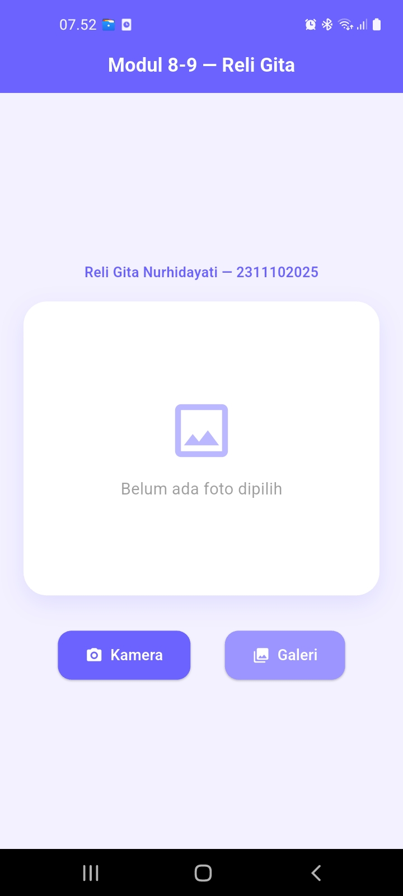
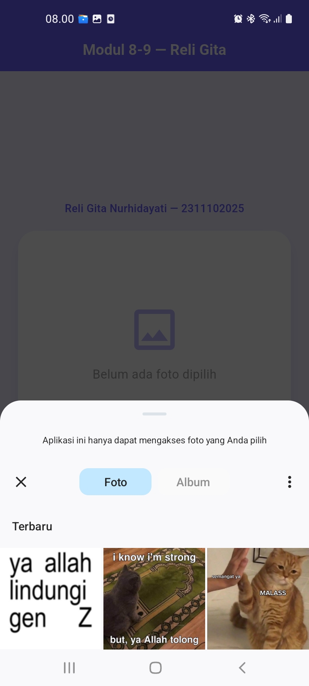
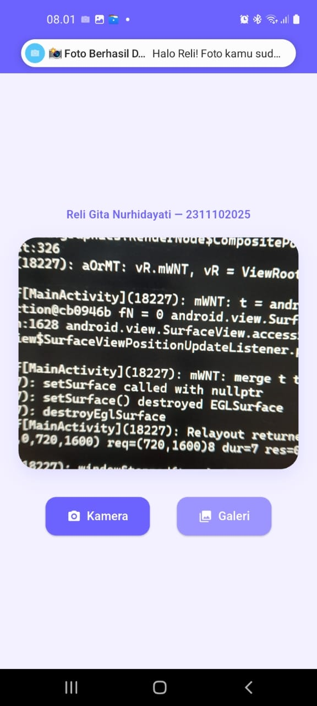
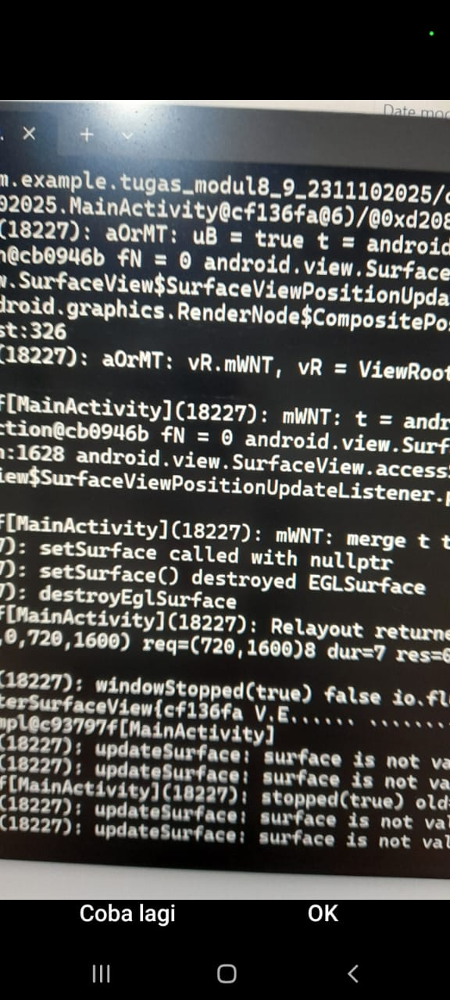

# LAPORAN PRAKTIKUM
## APLIKASI BERBASIS PLATFORM
### Modul 8-9 Mobile — Camera & Notification App

---

**LABORATORIUM HIGH PERFORMANCE**  
**FAKULTAS INFORMATIKA**  
**UNIVERSITAS TELKOM PURWOKERTO**  
**2026**

---

**Disusun Oleh:**  
Reli Gita Nurhidayati  
2311102025  
S1 IF-11-REG01  

**Dosen Pengampu:**  
Dimas Fanny Hebrasianto Permadi, S.ST., M.Kom  

**Asisten Praktikum:**  
Apri Pandu Wicaksono | Rangga Pradarrell Fathi  

---

## Dasar Teori

### 1. Akses Perangkat Keras pada Flutter

Flutter adalah framework open-source dari Google yang digunakan untuk membuat aplikasi mobile lintas platform menggunakan bahasa Dart. Salah satu hal yang perlu diperhatikan saat mengembangkan aplikasi dengan Flutter adalah bagaimana cara mengakses fitur-fitur hardware pada perangkat, seperti kamera, galeri, dan notifikasi.

Karena Flutter berjalan di atas lapisan abstraksi sendiri, akses ke hardware tidak bisa dilakukan secara langsung. Untuk itu, Flutter menyediakan dua cara utama, yaitu melalui plugin pihak ketiga dan Platform Channel. Plugin seperti `image_picker` memudahkan developer tanpa harus menyentuh kode native, sedangkan Platform Channel digunakan saat kita butuh komunikasi langsung ke kode Android (Kotlin/Java) atau iOS (Swift/Objective-C).

### 2. Pengelolaan Media Menggunakan Image Picker

Pada praktikum ini, fitur pengambilan gambar menggunakan package `image_picker`. Package ini cukup populer di ekosistem Flutter karena penggunaannya yang mudah dan mendukung dua sumber gambar sekaligus, yaitu kamera dan galeri.

Ketika tombol kamera ditekan, fungsi akan memanggil `pickImage(source: ImageSource.camera)` yang otomatis membuka aplikasi kamera bawaan perangkat. Sedangkan ketika tombol galeri ditekan, `ImageSource.gallery` akan membuka tampilan galeri foto pada perangkat. Hasil dari pemilihan gambar dikembalikan dalam bentuk objek `XFile`, yang kemudian dikonversi ke tipe `File` agar bisa langsung ditampilkan di layar menggunakan widget `Image.file()`.

### 3. Notifikasi Lokal

Notifikasi adalah cara aplikasi berkomunikasi dengan pengguna meski aplikasi tidak sedang aktif di layar. Ada dua jenis notifikasi yang umum digunakan, yaitu push notification (dikirim dari server) dan local notification (dijalankan langsung dari aplikasi di perangkat).

Pada praktikum ini, notifikasi lokal dibuat menggunakan Platform Channel karena kendala kompatibilitas package `flutter_local_notifications` dengan versi Gradle yang digunakan. Notifikasi dibangun langsung di sisi Android menggunakan `NotificationCompat.Builder` dan dikirim melalui `NotificationManager`. Untuk perangkat Android 8.0 ke atas, pembuatan `NotificationChannel` wajib dilakukan terlebih dahulu sebelum notifikasi bisa ditampilkan.

### 4. Platform Channel

Platform Channel adalah jembatan komunikasi antara kode Dart di Flutter dan kode native di Android maupun iOS. Cara kerjanya cukup sederhana, Flutter mengirimkan nama method beserta argumennya melalui channel tertentu, lalu native code menerimanya dan menjalankan logika yang sesuai.

Pada praktikum ini, channel diberi nama `com.example.notifications`. Saat foto berhasil dipilih, Flutter memanggil method `showNotification` melalui channel tersebut. Di sisi Android, `MainActivity.kt` menangkap panggilan itu dan langsung menjalankan kode untuk menampilkan notifikasi ke pengguna.

---

## Penjelasan Widget

Berikut adalah daftar widget yang digunakan dalam aplikasi beserta penjelasan singkat fungsinya:

| Widget | Fungsi |
|---|---|
| `MaterialApp` | Widget root aplikasi yang mengatur tema, warna, dan halaman awal yang ditampilkan |
| `Scaffold` | Menyediakan struktur dasar halaman seperti AppBar dan area konten utama (body) |
| `AppBar` | Menampilkan judul di bagian atas halaman dengan warna ungu sebagai identitas aplikasi |
| `Center` | Memusatkan widget di tengah layar secara horizontal maupun vertikal |
| `Padding` | Memberikan ruang kosong di sekeliling widget agar tampilan tidak terlalu rapat |
| `Column` | Menyusun widget secara vertikal, digunakan untuk menata konten dari atas ke bawah |
| `Row` | Menyusun widget secara horizontal, digunakan untuk menempatkan dua tombol berdampingan |
| `Container` | Kotak yang digunakan sebagai area penampil foto dengan dekorasi tertentu |
| `BoxDecoration` | Memberikan gaya visual pada Container seperti warna latar, sudut membulat, dan bayangan |
| `ClipRRect` | Memotong tampilan gambar agar sudutnya mengikuti bentuk Container yang membulat |
| `Image.file` | Menampilkan gambar dari file yang tersimpan di penyimpanan lokal perangkat |
| `SizedBox` | Memberikan jarak kosong antar widget secara vertikal maupun horizontal |
| `ElevatedButton.icon` | Tombol dengan ikon dan label teks, digunakan untuk tombol Kamera dan Galeri |
| `Icon` | Menampilkan ikon bawaan Flutter di dalam tombol |
| `Text` | Menampilkan teks seperti nama mahasiswa dan pesan placeholder saat belum ada foto |

---

## Tampilan Aplikasi

### A. Tampilan Dashboard (Kondisi Awal)

### B. Tampilan Setelah Memilih Foto dari Galeri

### C. Tampilan Notifikasi Muncul

### D. Tampilan Kamera

